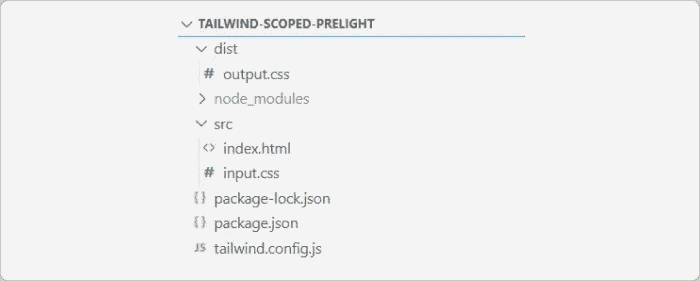
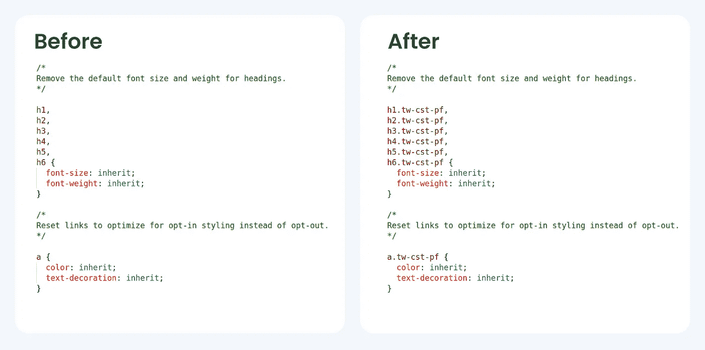

# 使用自定义预检确定顺风 CSS 基本样式的范围

> 原文：<https://levelup.gitconnected.com/scope-tailwind-css-base-styles-using-custom-preflight-34f71952e070>

## 在不破坏现有样式的情况下将顺风 CSS 添加到项目中，并且仍然受益于预检默认设置。


照片由[尼克·费因斯](https://unsplash.com/@jannerboy62?utm_source=medium&utm_medium=referral)在 [Unsplash](https://unsplash.com?utm_source=medium&utm_medium=referral) 上拍摄

# 介绍

Tailwind CSS 是一个实用的 CSS 框架。它允许您足够灵活地实现定制设计，同时确保一致性。

尽管这是一个不可思议的框架，但是由于[预检](https://tailwindcss.com/docs/preflight)的原因，在现有项目中使用它可能会很有挑战性。Tailwind CSS 自带了一套基本样式，为 CSS 提供了“合理的默认值和重置”。根据遗留代码的状态，这些规则的效果可能从无害到完全破坏样式。这些[变化](https://tailwindcss.com/docs/preflight)包括修改行高、边距重置、无样式标题和列表项。

> 与其修改现有代码以使其与 Tailwind CSS preflight 兼容，不如用一个类来限定 Tailwind CSS preflight 本身的范围。


通过附加一个类来限制 CSS 规则的范围

这样，现有的样式不会被破坏，只有在需要的时候，通过添加自定义前缀类，顺风默认值才可用。

# 步骤 1 —项目设置

出于本教程的目的，项目按照顺风 CSS [文档](https://tailwindcss.com/docs/installation)中的概述进行设置。这里使用了 npm，但是您也可以使用任何其他方法。



项目结构

打开 tailwind.config.js 并禁用预检，如下所示:

在第 8–10 行禁用预检

禁用预检将保留项目中的现有样式。另外，请注意第 3 行中添加的[前缀选项](https://tailwindcss.com/docs/configuration#prefix)。虽然不是必须的，但是这个前缀为类添加了尾部，避免了公共类名的名称冲突。

接下来，找到顺风 CSS 的默认预检文件。这将位于顺风 CSS 的源文件夹中。如果您使用的是 npm，您可以在节点模块`node_modules/tailwindcss/lib/css/preflight.css`下找到它，将该文件复制到项目根目录，并将其重命名为`scoped-preflight.stylus`。

# 步骤 2 —使用手写笔生成限定范围的样式

现在，让我们限制这个文件中 CSS 规则的范围。您可以手动将类名添加到这些规则中，但是这很容易出错，并且以后很难更改类名。相反，您可以使用[手写笔](https://stylus-lang.com/) CSS 预处理器来完成这项工作。您可以使用 npm 安装手写笔。

```
npm install stylus -g
```

现在，我们将嵌套所有的 CSS 规则，我们想在自定义前缀类的范围。我使用 tw-cst-pf 作为类名，但是你可以在这里选择任何有效的 CSS 类名。

自定义前缀中的嵌套规则

接下来，为您想要添加定制类的所有规则添加[父引用选择器](https://stylus-lang.com/docs/selectors.html#parent-reference)。注意父选择器&现有规则之间缺少空格。这一点很关键，因为 CSS 规则与[空格](https://stackoverflow.com/questions/1126338/what-does-a-space-mean-in-a-css-selector-i-e-what-is-the-difference-between-c)不同。

在适当的位置添加父选择器

完成所有规则的限定后，运行

```
stylus scoped-preflight.stylus -o scoped-preflight.css
```

这将生成一个 CSS 文件，其中父选择器被替换为自定义前缀类。



附加了自定义类别名称的预检规则

# 步骤 3 —使用限定范围的预检

将 scoped-preflight.css 的内容复制到 input.css 中的[基础](https://tailwindcss.com/docs/preflight#extending-preflight)层下。这将这些样式注入到 Tailwind CSS 中的基础层内。

就是这样。

从项目根目录启动 Tailwind CLI，您就可以开始了:)

```
npx tailwindcss -i ./src/input.css -o ./dist/output.css --watch
```

同一文件中的传统 CSS 和 Tailwind 代码

# 结论

现在你有了一个设置，Tailwind CSS 可以很好地与项目中的遗留 CSS 一起工作。你可以在 [Github](https://github.com/Ashish424/tailwind-scoped-prelight) 上查看完整的项目。如果您决定更新项目的 Tailwind CSS 版本，您必须手动将任何更改同步到预检。有关范围预检的更多信息，请查看 Github 上的讨论。

# 资源

*   [样本项目](https://github.com/Ashish424/tailwind-scoped-prelight)
*   [顺风飞行前讨论](https://github.com/tailwindlabs/tailwindcss/discussions/7050)
*   [手写笔](https://stylus-lang.com/)