# 在 Power BI 中抓取图像 URL

> 原文：<https://levelup.gitconnected.com/scrape-image-urls-in-power-bi-cc24abc5b89>


[封面图片](https://unsplash.com/photos/tI_DEyjWOkY)

在 Power BI 提供的许多强大的连接器中，如果您希望在报表中集成 web 抓取，Web 连接器是一个很好的选择。虽然它有一些限制，比如只能抓取 HTML 表，但它仍然是 Power BI 中 ETL 功能的强大补充。

在本教程中，我将带你从[这里](https://www.countries-ofthe-world.com/flags-of-the-world.html)刮国旗图像。我们将首先连接到网站以提取国家的表格，然后在 Power Query 中编写一些 M 代码来创建每个国家国旗图像的 URL(是的，我们将弄脏自己的手来编写 M)。最后，我们将加载该查询，并用多行卡片可视化来可视化图像。

总之，这些将是涵盖的关键主题:

*   用 Web 连接器抓取 HTML 表格；
*   追加查询；
*   在 Power Query 中创建新列和筛选行；
*   在 Power 查询中对文本数据应用各种变换；和
*   使用多行卡片视觉效果在报表中呈现图像。

说到实际效果，我们将接受国家名称，并为其国旗图像创建 URL。这里有几个例子:

*   阿富汗:【https://www.countries-ofthe-world.com/flags-normal/flag-of-】T4**阿富汗**。png
*   安提瓜和巴布达:[https://www.countries-ofthe-world.com/flags-normal/flag-of-**安提瓜**png](https://www.countries-ofthe-world.com/flags-normal/flag-of-Antigua.png;)
*   北马其顿(原马其顿):[https://www.countries-ofthe-world.com/flags-normal/flag-of-**北马其顿** .png.](https://www.countries-ofthe-world.com/flags-normal/flag-of-North-Macedonia.png.)

在演示结束时，您应该在 Power BI 报告中看到类似的结果:一个下拉切片器和一个显示图像的多行卡片。


作为未来找到这篇文章的读者的注意事项，所描述的屏幕截图和功能将根据 Power BI 2020 年 11 月更新中提供的内容。

请注意，这是一篇对初学者友好的文章，但是如果您已经体验过 Power BI，并且只是想看看解决方案，您可能会很快看完它。

此外，请理解有更好的工具和技术来执行 web 抓取，然后将这些数据提供给 Power BI。本教程的目的是展示 Web 连接器，以及在没有其他选择的情况下，如何将抓取集成到 Power BI 中。

# 第 1 部分:加载 HTML 表格

与任何报表一样，要做的第一件事是连接到数据源。为了获取 HTML 表格，我们将使用 Web 连接器。

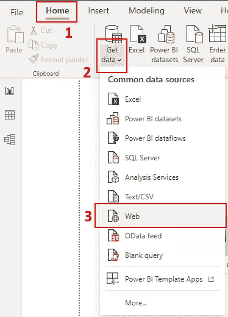

选择 Web 数据源

该连接器将要求您通过几个对话框，您可以按如下方式填写它们:

```
https://www.countries-ofthe-world.com/flags-of-the-world.html
```

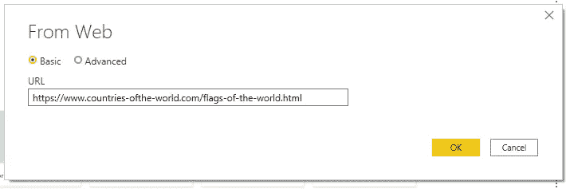

指定源 URL

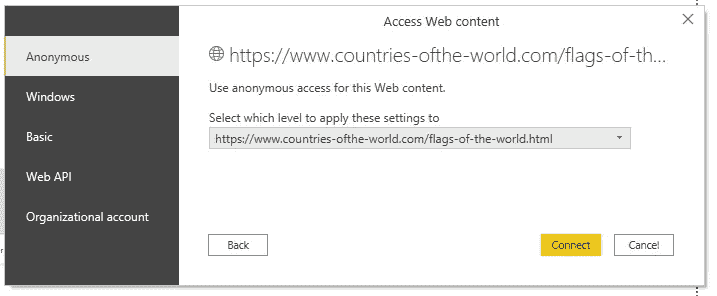

指定访问 web 内容的授权

与其他连接器一样，您需要告诉 Power BI 您将使用哪种身份验证来访问 web 页面。由于这个数据源是公开的，我们可以继续匿名访问。请注意，这些设置将由 Power BI 作为全局数据源设置保存，但可以在 Transform Data 菜单下进行更改。

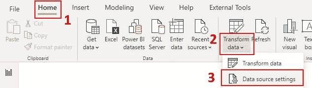

访问数据源设置

Power BI 连接到 web 页面后，我们会看到通常的数据预览对话框。我们可以看到检索到了两个表，这正是我们要找的。第一个表包括从 A 到 L 的国家，第二个表包括从 M 到 z 的国家。我们将选择这两个表并开始转换数据。我们需要执行一些转换来获得最终结果。

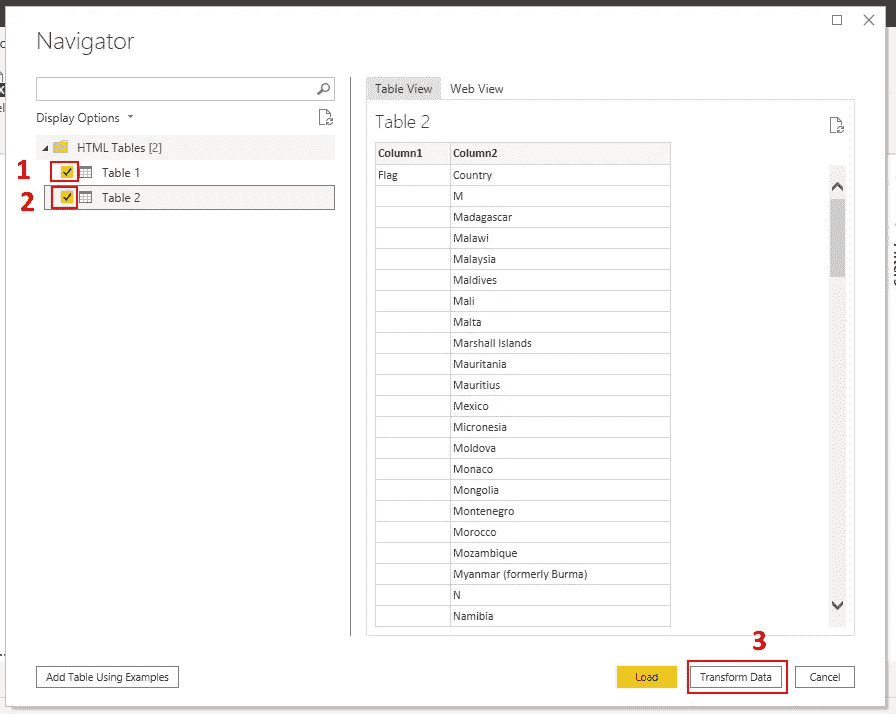

加载 HTML 表以支持查询

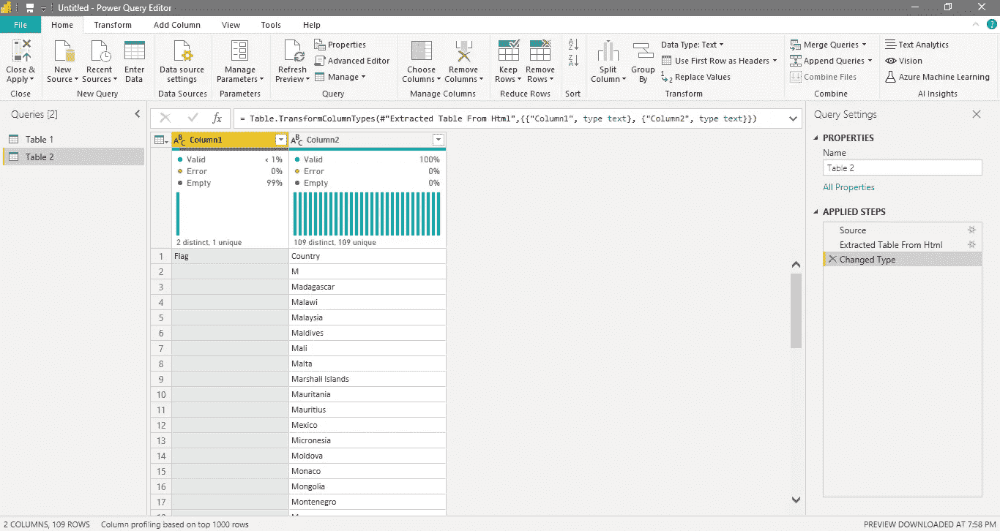

加载的查询

如果上面的截屏显示了与您的计算机相同的东西，那么您已经成功地将这两个表加载到您的 Power 查询中，并且到达了本教程第 1 部分的末尾。

哦，如果您在超级查询窗口中看不到列质量和统计数据或公式栏，您可以在功能区菜单的视图选项卡中轻松自定义这些选项。

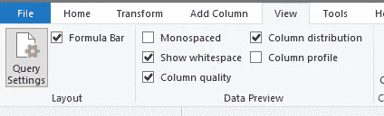

自定义视图选项

# 第 2 部分:追加表格

在这一点上，我们有所有国家的权力查询。但是，我们不需要也不想将它们分开放在两个表中。我们应该*追加*它们，也就是说，将第二个表中的行放在第一个表的末尾，这样我们就有了一个包含所有国家的表。

因为两个表有相同的结构，两列有完全相同的数据，所以这个追加操作很简单。为此，导航到表 1 查询并从主页功能区菜单中选择追加查询选项。

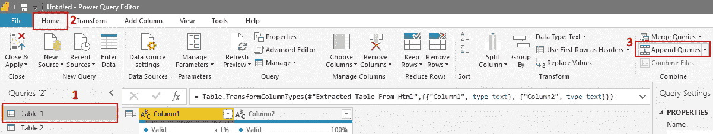

选择附加查询操作

这将打开另一个对话框，在该对话框中，您可以选择操作中涉及多少个表以及哪些表。我们正在做一个涉及两个表的基本追加，因此我们只需要选择哪个表是追加目标。如果您想从 SQL 合并的角度来考虑，那么在单击 Append Queries 之前选择的查询就是源。

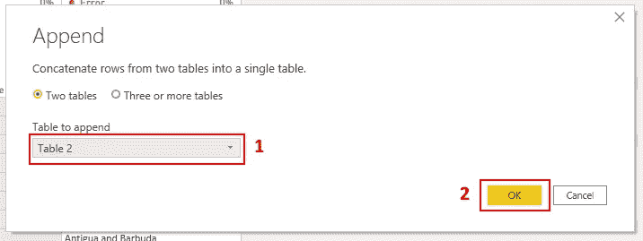

追加查询选项

在此之后，Power Query 窗口的页脚应该显示 Table 1 查询中有 2 列 223 行，除非网站中的 HTML 表发生了变化。

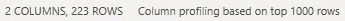

表 1 查询形状

在完成第 2 部分之前，我们应该禁用表 2 查询的加载，重命名查询，并过滤掉一些行。由于表 2 已经达到了它的目的，即加载从 M 到 Z 的国家并将该数据附加到表 1，所以它不需要加载到报告中。此外，重命名查询是一个最佳实践，因为名称 Table 1 和 Table 2 没有多大意义。

要禁止将查询加载到报告中，只需右键单击它并取消选中“启用加载”。

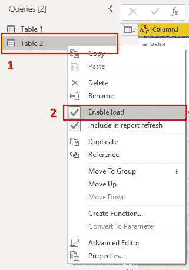

禁用查询加载

重命名查询有多种方法，但由于“rename”选项包含在前面屏幕截图的上下文菜单中，因此只需使用该选项来重命名两个查询。将表 2 重新命名为“M-Z 国家”，将表 1 重新命名为“国家”。

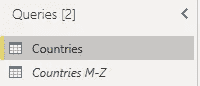

重命名的查询

请注意被禁用的查询的名称是如何以斜体显示的，以表示其加载被禁用。

我们需要为国家 M-Z 做的最后一件事是过滤掉带有单词“Country”的行。在 Countries 查询中需要该行，但在 Countries M-Z 中不需要。我们可以在 append 之前这样做，但这样您可以看到 append 是动态工作的，并且会在运行查询时检测到该更改，即在没有该行的情况下执行 append。在这之后，国家应该有 222 行，而不是我们之前看到的 223 行。

只需导航到国家 M-Z，并从下拉列表中取消选择值为“国家”的行。

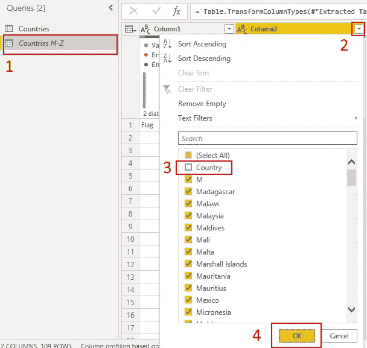

过滤掉“国家”

至此，我们已经到达了第 2 部分的末尾。从数据源的提取已经完成，现在是时候将它转换成合适的格式了。

# 第 3 部分:只保留国家名称

在演示的这个阶段，我们的国家查询有两列:“列 1”和“列 2”。前者有一个单独的行，上面有单词 *Flag* ，而后者有单词 *Country* 在第一行，一些行中的字母表字母通过起始字母和实际的国家名称来分隔国家名称。为了只保留名字，我们必须经历几次不同的转换。

让我们从删除列 1 开始，因为它的内容是不相关的。右键单击列名，然后选择“删除”。

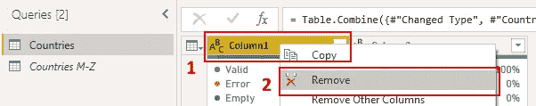

删除列 1

接下来，我们应该使用第一行作为标题。有时，Power BI 在加载时不能正确识别列标题，而是以第一行数据结束。这很容易通过使用首行作为标题选项来纠正。

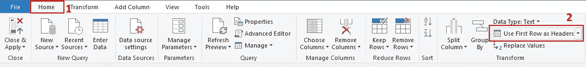

使用第一行作为标题

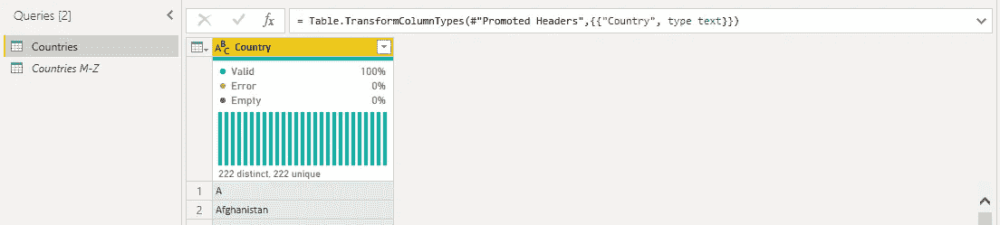

使用第一行作为标题结果

还记得我们从国家 M-Z 查询中过滤出国家为*的行吗？如果我们以前没有这样做，我们现在会这样做，因为我们只需要将那个 *Country* 值用作列标题，而不是列的值。*

下一步是删除有字母表字母而没有国家名称的行。由于这些行包含单个字母/字符，而国家名称包含多个字符，因此我们可以编写一个条件，只保留包含多个字符的行。

到目前为止，我们对所有操作都使用了 GUI，但在这种情况下，我们需要自己编写 M 代码(您在 Country 列上方的公式栏中看到的代码)。

打开高级编辑器窗口

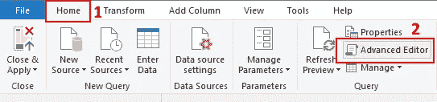

打开高级编辑器窗口

看看通过与 GUI 交互生成的 M 代码。试着通读代码，了解到目前为止的转换是如何转换成 m 的。

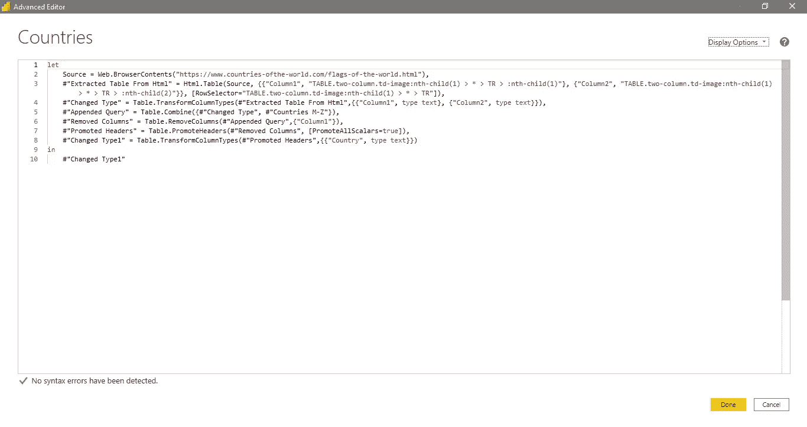

高级编辑器窗口

正如您所看到的，每个单独的操作/步骤都被赋予了一个名称，就像在其他编程语言中声明变量一样，而且这些都是按顺序编写的，因为每个步骤都接收前一个步骤的结果作为输入。最后一步在最后返回，即查询的最后一个状态。我们现在的目标是在“Changed Type1”之后添加一个新步骤，以过滤掉只有一个字母的行。

在第 8 行末尾添加一个逗号(`,`)，并将以下代码粘贴到下一行:

```
#"Kept Country Names Only" = Table.SelectRows(#"Changed Type1", each Text.Length([Country]) > 1)
```

在`in`后的最后一行代码中，将`#”Changed Type1"`改为`#"Kept Country Names Only"`，刚刚添加的新步骤。

在这个新步骤中，我们告诉 Power Query 根据“Country”列中每行的字符数来选择 Countries 查询的行。条件是检查文本的长度是否大于 1，以保留条件为真的行，即带有国家名称的行。完成后，单击“完成”按钮，您的国家/地区查询应该如下所示:

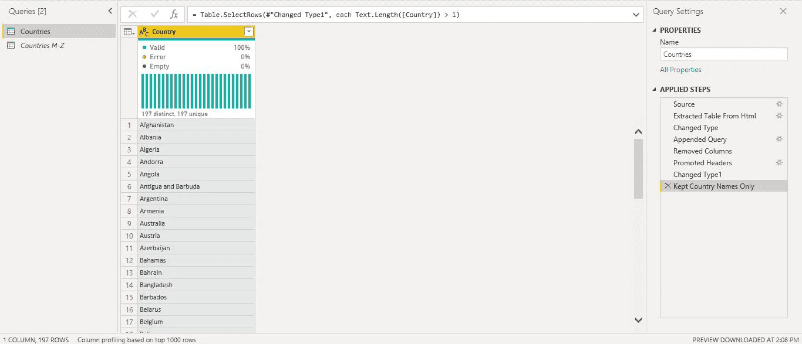

最终“国家”栏

带有单个字母的行消失了，右侧的查询设置窗格显示了“仅保留国家名称”步骤，在页脚中，您可以看到我们只有 1 列和 197 行。现在我们有了一个适当的国家名称列，可以继续下一部分了:格式化图片 URL 中包含的名称。

# 第 4 部分:格式化国家名称

我们已经完成了“Country”列的工作，但是接下来我们需要创建临时列。这些列将保存转换后的国家名称，这些名称将用于创建图像 URL。

我们需要应用的转换以获得最终格式化的国家名称是:

*   根据分隔符提取文本；
*   创建条件列；
*   使用条件和查找来更改值；和
*   替换字符。

我们将逐一介绍每个步骤，以理解为什么每个操作都是必要的。当然，你可能会想到其他方法来达到相同的解决方案，所以非常欢迎你回复你自己的发现！

作为背景，让我们看看几个国家国旗的图片网址。

*   阿富汗:https://www.countries-ofthe-world.com/flags-normal/flag-of-**阿富汗**。png
*   安提瓜和巴布达:https://www.countries-ofthe-world.com/flags-normal/flag-of-**安提瓜**。png
*   刚果民主共和国:https://www.countries-ofthe-world.com/flags-normal/flag-of-**刚果民主共和国**。png
*   刚果共和国:https://www.countries-ofthe-world.com/flags-normal/flag-of-**刚果**。png
*   科特迪瓦:https://www.countries-ofthe-world.com/flags-normal/flag-of-**科特迪瓦**。png
*   北马其顿(原马其顿):https://www.countries-ofthe-world.com/flags-normal/flag-of-**北马其顿** .png

上面的例子显然是精心挑选的，展示了我们在创建格式化的国家名称和相应的 URL 时应该遵循的一些模式和规则:

*   这些 URL 中唯一变化的部分是国家名称(在示例中以粗体显示)；
*   由多个单词组成的国家名称由连字符(-)分隔；
*   包含逗号或括号的国家名称只保留该标点符号的名称；和
*   有些国家不遵循这些规则，而是使用“唯一”格式的名称(如刚果民主共和国)。

希望在这一点上，您已经对在哪里使用每个数据转换有了一些想法。如果没有，请不要担心，我们将一起浏览它们。

前两步是使用分隔符提取文本，即提取逗号或左括号之前的文本。为了实现这一点，我们可以编写 M 代码或使用 GUI。为了简单起见，我们这次使用 GUI。

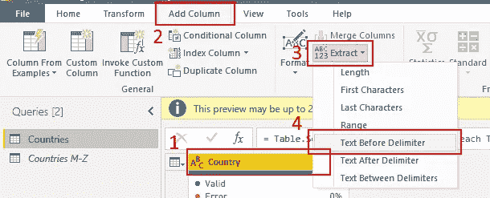

提取分隔符前的文本

并在下面的对话框中输入单个逗号字符(`,`)。

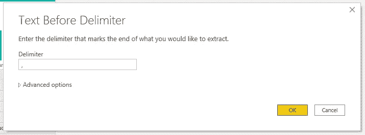

分隔符选项前的第一个文本

对新创建的列重复提取分隔符前的文本步骤，但是这次在对话框中输入一个空格和一个左括号(`(`)。

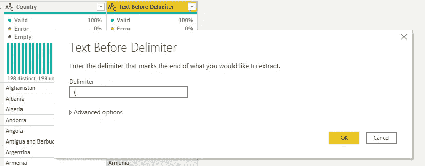

分隔符选项前的第二个文本

为了说明我们到目前为止所取得的成就，您应该在查询中看到类似的结果。

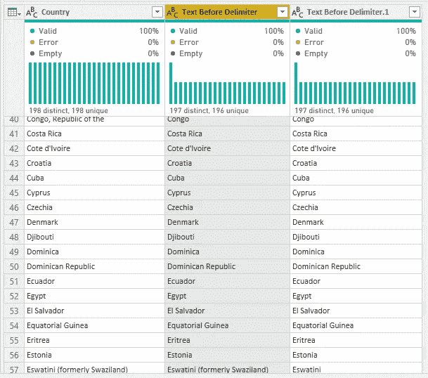

国家查询后提取分隔符前的文本操作

至此，我们已经创建了我们需要的临时列。双击列标题，将“Delimiter.1 前的文本”重命名为“临时国家”。在创建 URL 之前，这将是保存格式化国家的事实上的列。

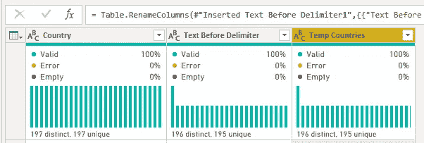

重命名“临时国家”

有几个国家没有遵循之前讨论过的格式规则。我们将使用一个临时查找表作为查询步骤，而不是创建多个规则来转换这些规则。这样，我们可以分别查找这些国家的转变情况。

要创建此查找表，请在高级编辑器中添加以下代码作为下一步:

```
Mapping = #table({"Name", "Formatted Name"}, {{"Antigua and Barbuda", "Antigua"}, {"Bosnia and Herzegovina", "Bosnia Herzegovina"}, {"Congo, Democratic Republic of the", "Congo Democratic Republic of"}, {"Cote d'Ivoire", "Cote d Ivoire"}, {"Czechia","Czech Republic"}, {"North Korea", "Korea North"}, {"Saint Kitts and Nevis", "St Kitts Nevis"}, {"Saint Lucia", "St Lucia"}, {"Saint Vincent and the Grenadines", "St Vincent the Grenadines"}, {"South Korea", "Korea South"}})
```

如果您随后预览该步骤，它将如下所示。

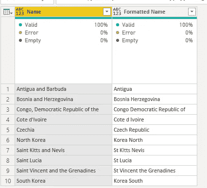

查找表

现在，我们可以告诉 Power Query 将“名称”列中的国家值更改为“格式化名称”列中的值。在高级编辑器中添加另一个步骤。

```
#"Fix Special Countries" = Table.ReplaceValue(#"Renamed Columns", each [Temp Countries], each if Mapping{[Name = [Country]]}[Formatted Name] <> null then Mapping{[Name = [Country]]}[Formatted Name] else [Temp Countries], Replacer.ReplaceText,{"Temp Countries"})
```

注意该步骤如何替换来自`#"Renamed Columns"`步骤的值，而不是`Mapping`步骤的值。第一个选项在我们一直使用的表中执行替换，第二个选项在查找表中执行替换。然而，我们仍然能够在`Mapping`表中引用和查找数据。

这是一个 if/else 条件，如果查找表中存在“Temp Countries”中的国家，则用另一个格式化的名称替换该国家，否则保留名称。不要忘记将`in`后返回的步骤改为这个新步骤；)

在得出最终的国家名称之前，我们需要做的最后两件事是用连字符替换空格。这可以通过 GUI 轻松完成。

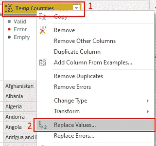

替换值

在要查找的值中输入一个空格，并在替换为中输入一个连字符(`-`)。

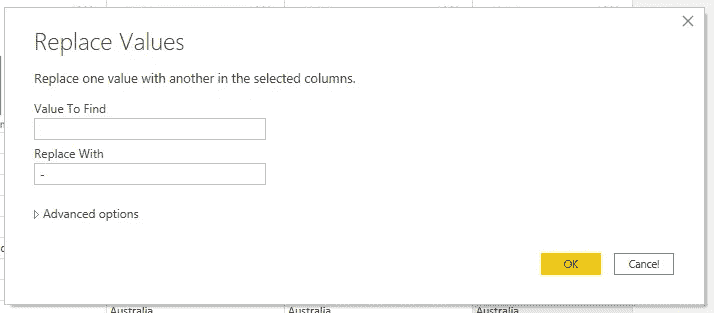

用连字符替换空格

至此，我们已经完成了“临时国家”和本教程的第 4 部分。接下来，我们需要在另一列中创建 URL，并删除临时列！

回顾一下，您查询应该是这样的:

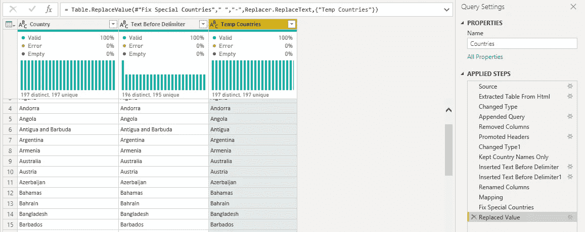

第 4 部分结果

# 第 5 部分:创建图像 URL

至此，我们已经完成了创建图像 URL 所需的所有转换。剩下的唯一事情就是实际创建 URL。这是通过将 URL 的公共部分与我们刚刚创建的格式化国家名称连接起来实现的。

为了创建这个新的 URL 列，我们需要编写 M，但是我们可以通过 GUI 来完成。

```
"[https://www.countries-ofthe-world.com/flags-normal/flag-of-](https://www.countries-ofthe-world.com/flags-normal/flag-of-)" & [Temp Countries] & ".png"
```

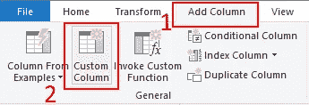

添加自定义列

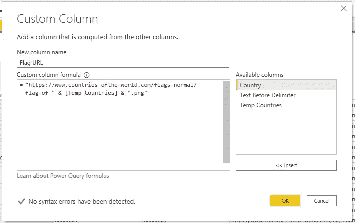

创建“标志 URL”自定义栏

字符串之间的&符号(`&`)是用于连接的运算符。换句话说，对于“Temp Countries”的每一行，Power Query 获取该行的值并将其放在 URL 的中间。您的结果应该是这样的。

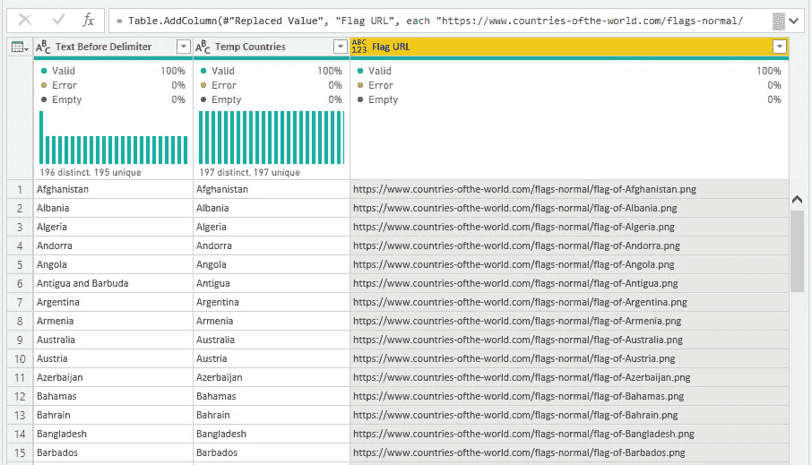

“标记 URL”栏预览

在将表加载到报表中之前，我们在 Power Query 中只需要做两件事:更改“Flag URL”的数据类型并删除临时列。

“标志 URL”包含文本数据，因此它应该是文本类型。我们可以通过单击列名旁边的 ABC123 图标来进行更改。

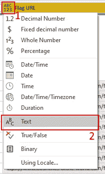

更改“标志 URL”数据类型

要删除临时列“分隔符前的文本”和“临时国家”，只需在按住 Ctrl 键的同时删除这两列。选中它们后，按 Delete 键，国家查询就完成了。

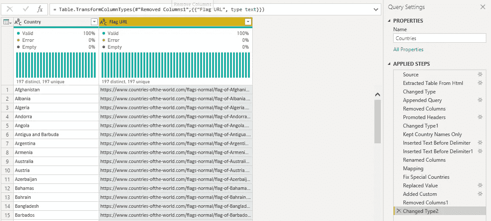

国家查询

按下 Home 选项卡中的 Close & Apply 按钮，将查询加载到报告中，然后我们可以进入本教程的最后一部分:创建显示旗帜图像的报告视觉效果。

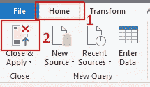

关闭并应用

# 第 6 部分:在报告中显示标志

在这一点上是一帆风顺的。我们只需要告诉 Power BI“Flag URL”列实际上包含图像 URL，并创建两个视觉效果:一个按单个国家过滤的切片器和一个能够加载和呈现图像的多行卡。

要更改“标志 URL”的数据类别，请转到数据视图，选择该列，然后从下拉列表中选择正确的类别，如下图所示。

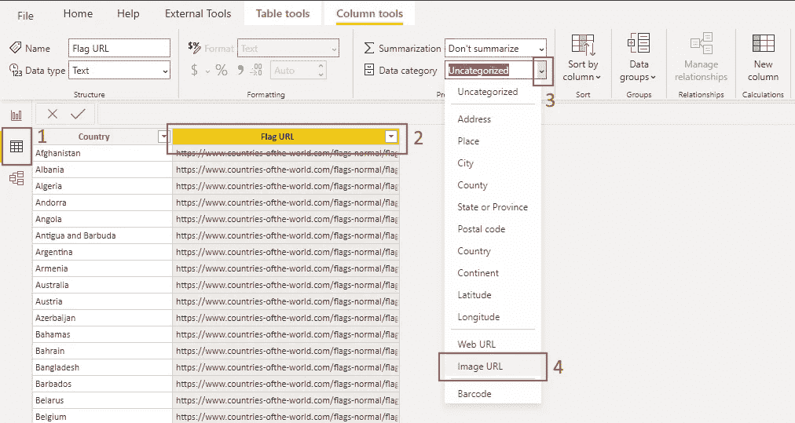

更改“标志 URL”数据类别

视觉上，这并不能改变什么。然而，Power BI 将以稍微不同的方式阅读这个专栏，当我们试图加载图像时，它会理解这些确实是 URL 而不是纯文本。

回到报告视图中，添加一个切片器和一个多行卡片视觉效果。然后，您可以拖放/选择每个视图的列。

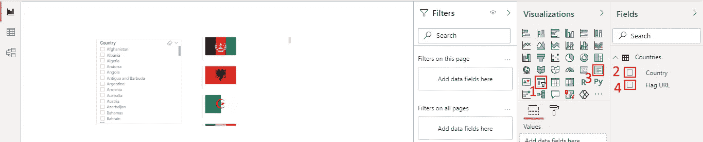

向报告添加视觉效果

我将向您展示的最后一件事是更改切片器类型。点击出现在切片器右上角的小箭头，把它变成一个下拉切片器。请注意，当您将鼠标悬停在画面上时，会出现箭头。

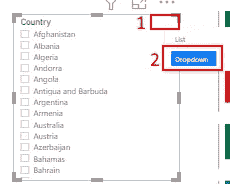

将切片器类型更改为下拉列表


下拉切片器

瞧，我们已经到了教程的结尾！现在，您可以随意调整格式，让这两种视觉效果看起来像您想要的那样。

# 结论

作为回顾，本教程经历了以下几点:

*   用 Web 连接器抓取 HTML 表格；
*   追加查询；
*   在 Power Query 中创建新列和筛选行；
*   在 Power 查询中对文本数据应用各种变换；和
*   使用多行卡片视觉效果在报表中呈现图像。

换句话说，本教程介绍了使用 Web source 执行 ETL 的过程，以创建几个 Power BI 视觉效果，所有这些都在 Power BI 中。

当然，Power BI 的这个抓取特性非常强大，这里展示的只是让您入门的冰山一角。现在疯狂一下，看看你能把 Web 连接器带多远。

我想给你指出我的 GitHub 库的方向。[这个目录](https://github.com/Ze1598/medium-articles/tree/master/Scrape%20image%20URLs%20in%20Power%C2%A0BI)有一个. pbix 文件，是按照本教程的结果，还有另一个。pbix 具有稍微更格式化的视觉效果和更简洁的电源查询步骤。

最后，[在 LinkedIn](https://www.linkedin.com/in/jos%C3%A9-fernando-costa-397137153/) 上与我联系，我经常在那里发布关于数据科学的新闻和资源。