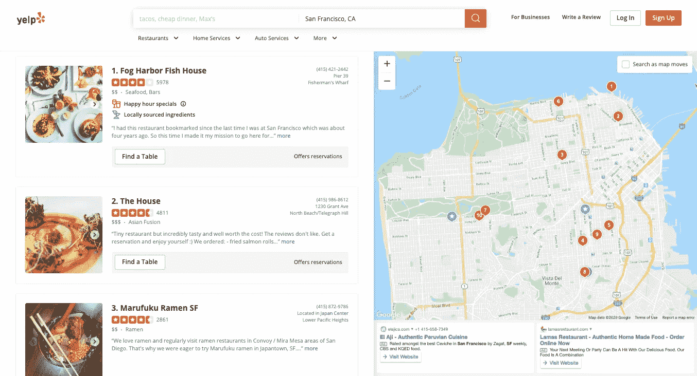
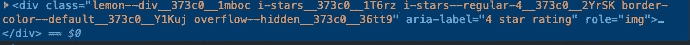

# 用 Python 和美汤刮 Yelp 数据

> 原文：<https://levelup.gitconnected.com/scraping-yelp-data-with-python-and-beautiful-soup-39f9088bf633>

今天我们将看看如何使用 Python 和 BeautifulSoup 来抓取 Yelp 数据，这是一种简单而优雅的方式。

本文的目的是让你开始解决一个现实世界的问题，同时保持它的超级简单，以便你尽快熟悉并得到实际的结果。

所以我们需要做的第一件事是确保我们已经安装了 Python 3。如果没有，您可以在继续之前获得 Python 3 并安装它。

然后你可以安装美丽的汤

```
pip3 install beautifulsoup4
```

我们还需要库 requests、lxml 和 soupsieve 来获取数据，将其分解为 xml，并使用 CSS 选择器。使用安装它们。

```
pip3 install requests soupsieve lxml
```

安装完成后，打开编辑器并输入。

```
# -*- coding: utf-8 -*-
from bs4 import BeautifulSoup
import requests
```

现在让我们转到 Yelp 旧金山餐馆列表页面，检查我们可以获得的数据。

看起来是这样的:



现在回到我们的代码。让我们试着通过假装我们是这样的浏览器来获得这些数据。

```
# -*- coding: utf-8 -*-
from bs4 import BeautifulSoup
import requestsheaders = {'User-Agent':'Mozilla/5.0 (Macintosh; Intel Mac OS X 10_11_2) AppleWebKit/601.3.9 (KHTML, like Gecko) Version/9.0.2 Safari/601.3.9'}
url='https://www.yelp.com/search?cflt=restaurants&find_loc=San Francisco, CA'
response=requests.get(url,headers=headers)print(response)
```

将此另存为 yelp_bs.py。

如果你运行它。

```
python3 yelp_bs.py
```

您将看到整个 HTML 页面

现在，让我们使用 CSS 选择器来获得我们想要的数据。为此，让我们回到 Chrome 并打开 inspect 工具。


我们注意到所有单独的数据行都包含在

类的容器和其他 jibberish 一起放在它的前面和后面。这已经足够让我们刮它了。我们可以让 BeautifulSoup 选择在类定义中包含这个单词的数据，就像这样用*操作符。

```
# -*- coding: utf-8 -*-
from bs4 import BeautifulSoup
import requestsheaders = {'User-Agent':'Mozilla/5.0 (Macintosh; Intel Mac OS X 10_11_2) AppleWebKit/601.3.9 (KHTML, like Gecko) Version/9.0.2 Safari/601.3.9'}
url='https://www.yelp.com/search?cflt=restaurants&find_loc=San Francisco, CA'
response=requests.get(url,headers=headers) soup=BeautifulSoup(response.content,'lxml') for item in soup.select('[class*=container]'):
	try:
		print(item)  except Exception as e:
		raise e
		print('')
```

这将打印保存餐馆数据的每个容器中的所有内容。

我们现在可以在这些行中挑选出包含我们想要的数据的类。我们注意到标题在一个标签里面。我们选择这个，但也在这个保护伞下做所有其他选择。这是因为在上面的选择中，类容器可能被用来包含除了我们想要的数据之外的其他东西。因此，为了确保安全，我们在抓取其他数据片段之前，要确保其中有一个标记。

## `# -*- coding: utf-8 -*- from bs4 import BeautifulSoup import requests headers = {'User-Agent':'Mozilla/5.0 (Macintosh; Intel Mac OS X 10_11_2) AppleWebKit/601.3.9 (KHTML, like Gecko) Version/9.0.2 Safari/601.3.9'} url='https://www.yelp.com/search?cflt=restaurants&find_loc=San Francisco, CA' response=requests.get(url,headers=headers) soup=BeautifulSoup(response.content,'lxml') for item in soup.select('[class*=container]'): try: #print(item) if item.find('h4'): name = item.find('h4').get_text() print(name) print('------------------') except Exception as e: raise e print('')`

如果你运行它，它会打印出所有的名字。


答对了。！我们拿到名字了。

现在，通过同样的过程，我们得到了其他数据，如电话、地址、评论数、评分、价格范围等。

```
# -*- coding: utf-8 -*-
from bs4 import BeautifulSoup
import requestsheaders = {'User-Agent':'Mozilla/5.0 (Macintosh; Intel Mac OS X 10_11_2) AppleWebKit/601.3.9 (KHTML, like Gecko) Version/9.0.2 Safari/601.3.9'}
url='https://www.yelp.com/search?cflt=restaurants&find_loc=San Francisco, CA'
response=requests.get(url,headers=headers) soup=BeautifulSoup(response.content,'lxml') for item in soup.select('[class*=container]'):
	try:
		#print(item)
		if item.find('h4'):
			name = item.find('h4').get_text()
			print(name)
			print(soup.select('[class*=reviewCount]')[0].get_text())
			print(soup.select('[aria-label*=rating]')[0]['aria-label'])
			print(soup.select('[class*=secondaryAttributes]')[0].get_text())
			print(soup.select('[class*=priceRange]')[0].get_text())
			print(soup.select('[class*=priceCategory]')[0].get_text())
			print('------------------')  except Exception as e:
		raise e
		print('')
```

请注意当我们想获得收视率时所使用的诡计。我们知道分级在这个 div 中是作为一个标签隐藏的



所以我们用这条线得到它..它选择具有 aria-label 属性的元素，但只选择其中包含 label 这个词的元素，然后继续询问它的 aria-label 属性值……我喜欢写这个。

## `print(soup.select('[aria-label*=rating]')[0]['aria-label'])`

当我们运行它时，它会像这样打印出我们想要的每一个细节。


我们甚至添加了一个分隔符来显示每个餐馆细节的结束位置。现在，您可以将这些数据传递到一个数组中，或者保存到 CSV 中，然后做您想做的任何事情。

如果你想在生产中使用这一点，并希望扩展到数千个链接，那么你会发现你会很容易被 Yelp 屏蔽 IP。在这种情况下，使用轮换代理服务来轮换 IP 几乎是必须的。

否则，你会被自动定位、使用和僵尸检测算法屏蔽很多 IP。

我们的旋转代理服务器代理 API 提供了一个简单的 API，可以立即解决所有的 IP 阻塞问题。

*   随着数百万高速旋转的代理遍布世界各地，
*   通过我们的自动知识产权轮换
*   通过我们的自动用户代理字符串循环(模拟来自不同的有效 web 浏览器和 web 浏览器版本的请求)
*   有了我们的自动验证码解决技术，

我们的数百个客户已经成功地用一个简单的 API 解决了令人头痛的 IP 地址块问题。

在任何编程语言中，整个事情都可以通过一个简单的 API 来访问，如下所示。

## `curl "http://api.proxiesapi.com/?key=API_KEY&url=https://example.com"`

我们连续提供 1000 个 API 调用，完全免费。在这里注册并获得你的免费 API 密匙。

该博客最初发布在[https://www . proxie SAPI . com/blog/scraping-yelp-data-with-python-and-beautiful-soup . html . PHP](https://www.proxiesapi.com/blog/scraping-yelp-data-with-python-and-beautiful-soup.html.php)