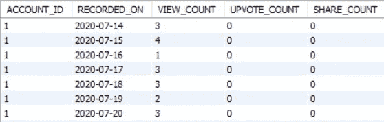

# 如何使用 Python 3 从 Quora 中抓取统计数据

> 原文：<https://levelup.gitconnected.com/scraping-your-statistics-from-quora-using-python-3-74d33413cae6>

图片取自[此处](https://blog.swiftype.com/2017/08/03/top-site-search-questions-on-quora/)

拥有超过 [3 亿月活跃用户](https://expandedramblings.com/index.php/quora-statistics/)，Quora 是一个非常重要的平台。你不能从你的社交媒体策略上忽视它。我是说，你可以，只是这不明智。你可以了解人们在问什么，并思考你或你的品牌。或许，也有你的社交媒体团队在那里代表你。在这个平台上，情感分析和线索挖掘有很大的空间。

作为我正在进行的一个项目的一部分，来自 Quora 和其他社交媒体的统计数据需要被提取出来，以便在一个集成的仪表板上进行分析。而且有点痛苦。与脸书、Instagram 和谷歌 My Business 不同，Quora 不为我们提供任何 API。从网站上抓取数据是唯一的选择。但是我们系紧鞋带，啜饮能量饮料。枪响了，我们出发了，搜集与我们有关的问题和答案。一切都很顺利，直到我们点击 Quora 统计页面。(查看你在 quora.com/stats[的统计数据)](http://quora.com/stats)

Quora 统计页面

你可能会问，这有什么大不了的？将页面拖入 BeautifulSoup，美化它，研究代码，然后回到这里。我会等着的。

如果你在这里，我猜你同意代码是一团乱麻(从刮擦的角度来看)。任何地方都没有直接的值(我们必须处理高度)和出于某种原因的大量重复代码。经过深思熟虑、谷歌搜索和阅读 Quora 答案后，我得出的结论是，除了对图表中的数据进行逆向工程(具有讽刺意味的是，在集成仪表板上构建其他图表)，没有其他办法。

我很惊讶地发现没有人已经这样做了，并与社区分享他们的工作。我不是说没人做过，只是我找不到做过的人。所以决定分享一下，希望对某个人有帮助。

这篇文章将有希望给你如何去做的逻辑，你可以用你自己的方式实现它。如果你需要具体的帮助，我的 GitHub 在最后有链接。所以，让我们一步一步来。

1.  **获取所需时间段**

选择“过去 7 天”选项

默认情况下，下拉列表中选择的选项是“过去 30 天”。对我们来说，抓取脚本将每天运行，因此尽可能缩短持续时间是有意义的。

账户是一个链接到我们数据库的 sqlalchemy 对象。**驱动**是一个 selenium webdriver。 **login_to_account** 是我们定义的一个函数，让我们的**驱动程序**根据其凭证登录到**帐户**。 **LOAD_TIME** 是为我们这些*有*担心网速的人准备的。3 对我来说很好。页面被捕获在**汤**中。

2.**从 X 轴获取日期**

X 轴上的日期

下面的代码只需要运行一次，因为所有 3 个图形在 X 轴上都有相同的日期。

**datetime** 取自 python 中的 datetime 模块。 **strip()** 函数去除字符串前后的空格。

在上面的代码中有两点需要注意。首先，X 轴日期的代码在页面上重复了多次，因此需要检查日期是否重复。遇到重复的日期时，搜索 **last_tick** 类以获得最后的日期，然后退出循环。其次，因为图中只提到了月和日，所以如果年份在一周之间变化，就需要检查。您不希望一周中从 12 月 30 日开始到 1 月 5 日结束的所有日子都是同一年。

3.**获取图形数据**

对于 3 个图表中的每一个，Y 轴上的单位可以不同。此外，X 轴上的条形没有与之关联的固定值，它们使用高度变量进行渲染。因此，我们需要计算 Y 轴上 1 个单位的高度，然后使用每个日期的条形高度，以数学方式计算每个日期的值。

y 轴值

酒吧的高度

下面的代码可以在所有 3 个图形中循环运行

我们通过搜索类别中有 **stats_graph** 但没有**隐藏**的 **g** 标签来搜索未隐藏的图形。 **replace_all(string，dictionary)** 是我们定义的一个函数，它将通过用所提供的字典中的相应值替换键来返回所提供的字符串。

在函数的前半部分，我们得到一个单位在 Y 轴上的高度。一个等级可以代表 1 或 5 或 100 或任何其他数字，这取决于规模。由于该账户在任何一天的最大浏览量是 4，Quora 统计页面选择每一级显示 1 个单位。比较两个水平，用一点数学，我们得到一个单位的高度。然后我们用更多的数学计算每个矩形条代表多少单位。

差不多就是这样！我还没有详细介绍如何循环这些图，以及如何将数据保存在数据存储中，因为这不是本文的目的。希望您能了解如何在自己的项目中执行这一点！

在我的 [GitHub](https://github.com/jas-haria/VOID_0.1) 上找到上面的代码和项目其余部分的代码。您也可以通过我的 [LinkedIn](https://www.linkedin.com/in/jas-haria/) 与我联系。

如果你喜欢这篇文章，请考虑留下掌声。或者二十。

查看我的一些其他文章:

[如何为你的应用实现用户友好的分页](https://link.medium.com/euDXN12Be9)