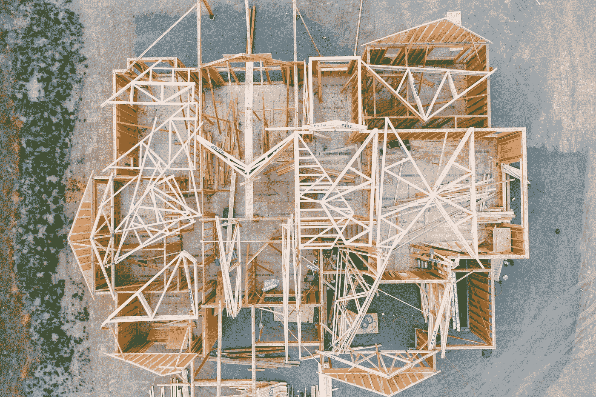

# SwiftUI 中的屏幕方向/布局

> 原文：<https://levelup.gitconnected.com/screen-orientation-layout-in-swiftui-32878cf29a8b>

## 布局的挑战是知道你有多少空间可以利用。



Avel Chuklanov 在 [Unsplash](https://unsplash.com/@chuklanov?utm_source=unsplash&utm_medium=referral&utm_content=creditCopyText) 上拍摄的照片

现在苹果每年至少两次推出新硬件。具有新分辨率、新屏幕和新功能的新硬件。随着他们这样做，计算出你的应用程序必须在多大的屏幕上运行变得越来越困难。

iOS 中多任务处理的引入让你雪上加霜，我们完成了一项不可能完成的任务。值得庆幸的是，这一点没有被试图解决这个问题的苹果公司忽略。有一个视频专门介绍了他们对 2016 年挑战的解决方案，即特质[在这里](https://developer.apple.com/videos/play/wwdc2016/222/)。我想每个人都还在努力解决这个问题，最近一次是在 WWDC 2019 这个视频开始 27 分钟的时候。

关于这个问题的文档，总结得很好，看一看，向下，向下，再向下一点。

 [## 适应性和布局——视觉设计——iOS——人机界面指南——苹果开发者

### 人们通常希望能够在他们的所有设备上和任何环境下使用他们最喜欢的应用程序。在 iOS 应用程序中…

developer.apple.com](https://developer.apple.com/design/human-interface-guidelines/ios/visual-design/adaptivity-and-layout/) 

不过，好吧，理论够了，代码呢？现在你可能在想，但是等等——我已经知道怎么做了。我用旧的 UIKit 代码覆盖了它。

这在 iPhone 上运行得相当好，但在多个窗口运行时会出现问题——当窗口大小相等时，会报告风景。谁知道 iPhones 什么时候会支持多任务处理…错了。

但是好吧，是的，我知道了——解决方法很简单。你是 SwiftUI 中的几何学家，不。如果垂直方向大于水平方向，那么你是纵向的，否则你一定是横向的。我也是这么想的，所以写了这个小程序。

一个有效的方法，但是——只在 iPhones 上有效。更糟糕的是，geometryReader 似乎根本不支持多窗口，甚至从不承认你正在运行它们。是几何读本里的 bug 可能吧。

好吧，为什么我们这么愚蠢，难道苹果的解决方案不起作用。我们可以通过 SwiftUI @环境变量访问 trait 类。这里显示了一个非常基本的实现。

但是不，打住，你不会想同时检查这两项，是吗？这段代码不能正常工作。你需要对其中一个采取行动，但不是两个都要。为了修理它，我加了一把锁。

```
@State var lock = falseif !lock {
  lock = true
  print("hz \(horizontalSizeClass) vt \(verticalSizeClass)")
  DispatchQueue.main.asyncAfter(deadline: .now() + 2) {
    lock = false
  }
}
```

这将确保我们对其中一个消息采取行动，而不是同时对两个消息采取行动。除此之外，您需要检查返回的两个值，在这一点上，您可以决定将返回的值与方向匹配。当然，这种写法不会让你每两秒钟改变一次方向。

所有这些都促使我结束这篇简短但有希望有用的关于这个主题的论文。更多文章请关注我的 medium.com。我在 2019 年发表了近 100 篇，希望在 2020 年做得更多。

[](https://marklucking.medium.com) [## 马克·卢金-中号

### 阅读马克.卢金在媒介上的作品。编码 35 年以上，喜欢使用和学习 Swift/iOS 开发…

marklucking.medium.com](https://marklucking.medium.com) 

保持冷静，继续编码。