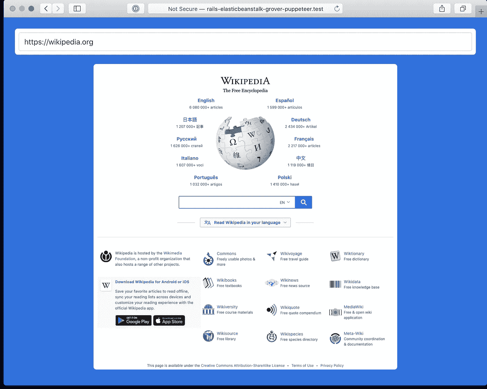

# 使用 Ruby on Rails 和 Google puppet er on AWS Elastic Beanstalk 对网站进行截图

> 原文：<https://levelup.gitconnected.com/screenshot-websites-with-ruby-on-rails-and-google-puppeteer-on-aws-elastic-beanstalk-6ace17487c26>

一个显示 https://wikipedia.org 截图的 Rails 应用

在 macOS 上，从零到一个可以抓取整页网址截图的 Rails 应用程序只花了不到一个小时的时间。为了将它部署到 AWS Elastic Beanstalk EC2 服务器上，又花了几个小时。困难来自于 Amazon Linux 2，它缺少许多依赖项，并且不容易通过`yum`包管理器提供所有的依赖项。大多数在线讨论都是针对基于 Debian 的系统，而 Amazon Linux 与 RHEL/CentOS 兼容。

因此，这是您使用 Grover 和 Puppeteer 部署到 AWS Elastic Beanstalk 的 Rails 应用程序所需的配置。

首先你需要格罗弗宝石:

`bundle add grover`

然后[谷歌木偶师](https://developers.google.com/web/tools/puppeteer):

`yarn add puppeteer`

然后你需要添加几个`yum`包到你的`.ebextensions`配置中:

如你所见，许多必须通过`rpm`安装。呈现 URL 的无头 Chromium 应用程序需要这些包。

应该就是这样了，一个带有 Google Puppeteer 的 Rails 应用程序的工作部署。

如果你想要有用的截屏，我也建议改变木偶师的默认设置。您可以通过`config/initializers/grover.rb`配置 Grover，例如:

你可以在这里看到这个 Rails 应用的源代码；

[https://github . com/paulmwatson/elastic beanstalk-rails-Grover-puppet eer/](https://github.com/paulmwatson/elasticbeanstalk-rails-grover-puppeteer/blob/master/.ebextensions/00_packages.config)