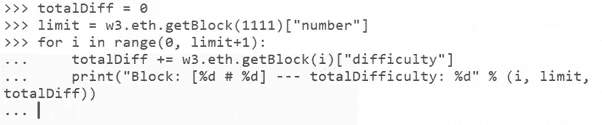

# 计算以太坊难度的脚本

> 原文：<https://levelup.gitconnected.com/script-to-calculate-the-ethereum-difficulty-daeee53fc31>

## 以太坊节点系列四——让我们用 python 来创建一个计算/审计以太坊难度的脚本！

本文将创建并运行一个脚本来审计和计算以太坊区块链的“总难度”。这是超级有用和有趣的，相信我！😇


为了能够跟上，我假设您已经具备以下条件:

*   运行在 Ubuntu 上的以太坊节点。查看这篇文章，我解释了如何在 Ubuntu AWS 上部署以太坊节点
*   您已经知道了一些使用 Etehreum 网络的命令。查看这篇文章，在那里我谈到了一些[命令来探索以太坊块](/exploring-the-ethereum-block-9fa3a68e42d8)
*   你已经安装了 [Python web3 库](/ethereum-playing-with-python-web3-library-and-eth-serialization-ethereum-676efc8b1346)。也检查文章
*   还好有:🦖

这种困难表明，在区块链的工作证明中找到开采区块链新区块所需的散列值有多困难。难度表示矿工猜测散列的可能性/组合的数量。难度越大，挖掘者需要执行的工作就越多，以便猜测散列并创建新的块。这是任何区块链工作证明的一部分，以太坊仍然是区块链工作证明，尽管在 2022 年或 2023 年的某个时候迁移到股份证明。

挖掘难度主要是衡量在区块链中找到新区块的难度，或者换句话说，矿工需要蛮力来找到比目标哈希小的哈希的情况有多罕见。

本文中我们要做的是计算总难度值，这是以太坊区块中的字段之一。该字段还用于计算以太坊矿工是否满足难度条件，以及审核区块链中的难度是否正确。因此，我们在这里要做的是使用 python 脚本审计这个“总难度”值。

## 区块内总难度值是如何计算的？

一个方块的“总难度”是所有前面的方块加上前面的方块的总难度。那么如何才能创建一个循环来计算某个区块的难度呢？



您可以将这段代码复制到 Python3 控制台，但是请注意缩进。Python 对缩进非常敏感。

```
totalDiff = 0
limit = w3**.**eth**.**getBlock(1111)[“number”]
for i in range(0, limit+1):
     totalDiff += w3**.**eth**.**getBlock(i)[“difficulty”]
     print(“Block: [%d # %d] — — totalDifficulty: %d” % (i, limit, totalDiff))
```

并按两次 enter 键

很快，我们得到了块 1111 的总难度(因为我们把 *limit = w3* ***)。*** *eth* ***。****get block(1111)[" number "]*)，但是你可以把 1111 换成 888888 或者任何你想要的东西来尝试得到任何块的难度。😎

这个流程有问题吧？这是一个非常密集的循环，因为它必须多次执行检索、添加和打印输出。以太坊区块链有 12 000 000 多个街区，每 12 秒增加一个新街区。计算方块 1111 的难度很容易，但计算更高的方块，如方块 11 111 111，则需要相当多的时间和资源。就算要计算 987654 块的难度，至少也要 30 分钟。

顺便说一句，如果你计算整个区块链的以太坊“总难度”，我想知道需要多长时间！

能够审计区块链是区块链的关键原则之一。您可以随时回到过去，全面审核区块链的价值观。很棒吧？

让我知道你是否成功运行了脚本，如果你有任何问题！

我们将在下一篇文章中继续讨论以太坊节点，敬请关注！

**🚀跟着我，也请查看我的🧱区块链课程:**

**🐶**[](https://www.udemy.com/course/-dogecoin-course-the-first-complete-dogecoin-course/?referralCode=9416B1408224CE309DD8)**有史以来第一个 Dogecoin 课程**

****👨‍🎓** [**Fintech、云和网络安全课程**](https://www.udemy.com/course/fintech-technologies-cloud-and-cybersecurity/?referralCode=F1D4EA005A2881735A36)**

****📖**[](https://www.amazon.com/dp/B091CYTX37/ref=sr_1_1?dchild=1&keywords=unblockchain&qid=1617186443&s=digital-text&sr=1-1)**[**完整的 NFTs 教程**](https://www.udemy.com/course/the-complete-nft-course-learn-everything-about-nfts/?referralCode=AAEE908D13D0E2276B19)****

******👨‍🎓** [**Unblockchain 课程**](https://www.udemy.com/course/blockchain-deep-dive-from-bitcoin-to-ethereum-to-crypto/?referralCode=B8463EE382E6D313304B) **—脑洞大开的区块链课程******