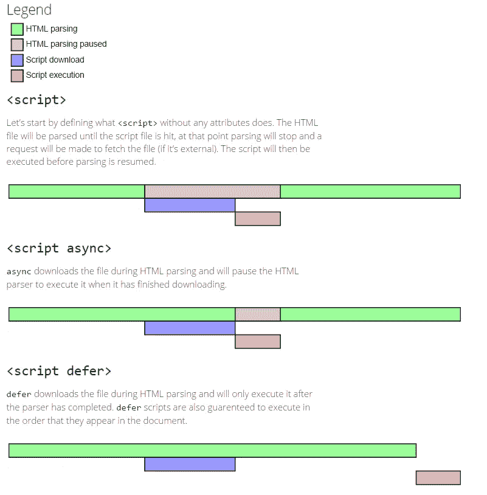

# 关于

在 HTML 中，JavaScript 代码被插入到`<script>`和`</script>`标签之间。

```
<script>
 // Here goes your JS code
</script>
```

您可以在 HTML 文档中放置任意数量的脚本。脚本可以放在 HTML 页面的`<body>`或`<head>`部分，或者两者都放。

## 有区别吗？

我很高兴你问了这个问题，因为这是有区别的，而且非常重要。

最佳实践是将 JavaScript `<script>`标签放在结束 `</body>`标签之前的*处，而不是放在 HTML 的`<head>`部分。*

原因是 HTML 是从上到下加载的。首先是头部，然后是身体，然后是身体内部的一切。如果我们将 JavaScript 放在 head 部分，整个 JavaScript 将在加载任何 HTML 之前加载，这可能会导致一些问题:

1.  如果您的 JavaScript 代码在加载时就改变 HTML，实际上还没有任何 HTML 元素可供它影响，所以看起来好像 JavaScript 代码不起作用，您可能会得到错误。
2.  如果你有大量的 JavaScript 代码，它会明显降低页面的加载速度，因为它会在加载任何 HTML 代码之前加载所有的 JavaScript 代码。

当您将 JavaScript 放在 HTML 主体的底部时，它会在加载任何 JavaScript 之前给 HTML 留出加载时间，这可以防止错误，并加快网站响应时间。

让我们通过一个例子来理解更多(不要担心我使用的语法，你只需要理解我们试图做什么)。

**头中的 JavaScript**

在上面的代码中，我试图通过在`<head>`标签中编写 JavaScript 将段落的颜色改为绿色。结果是:


所以代码没有影响段落的颜色，因为正如我们之前提到的，脚本在段落本身之前加载，所以在那个特定的时刻，没有我们可以改变颜色的段落。

现在让我们试试另一种方法，在身体的底部:

**正文中的 JavaScript**

果然，我们得到了我们想要的，因为现在 JS 代码知道了这个段落。


还有一点:虽然最好将 JavaScript 放在 HTML `<body>`的末尾，但是将 JavaScript 放在 HTML **的`<head>`中并不总是会导致错误。**

# **外部 JavaScript**

JavaScript 也可以在外部文件中使用。JavaScript 文件有文件扩展名。js '。要使用外部脚本，请将脚本文件的名称放在脚本标记的 src 属性中。

```
|<script src="myScript.js"></script>
```

**外部 JavaScript 的优势:**

与内联脚本相比，将 JavaScript 代码放在外部 js 文件中有一些优势:

*   将 HTML 和 JavaScript 代码分开将有助于更容易地管理代码库。
*   设计者可以与编码者并行工作，而没有代码冲突。
*   与现代源代码版本控制系统(如 GIT)配合良好。这意味着这些文件中的每一个都将维护一个历史，它可以被多个程序员签入和签出。
*   代码和 HTML 一样易于阅读。
*   外部 JavaScript 文件由浏览器缓存，可以加快页面加载速度。
*   许多流行的 JavaScript 包都托管在内容交付网络(cdn)上，您可以使用 *src、*中的 URL 指向它们，从而避免将 js 文件复制到本地文件夹。

值得一提的是，还有一些其他的优点，但是因为这篇文章是针对非高级开发人员的，所以我选择不谈论它。

# 异步和延迟

有很多方法可以让你加载你的外部 JavaScript，而不用担心你应该把它放在哪里。这张图片解释了这两个属性是如何工作的，以及有什么不同。



**今天的节目到此结束！我希望你喜欢这篇文章，也希望它能帮助你理解这个主题。**感谢**阅读本文，稍后见，了解更多内容！😄**

## PS:要不要支持我？…您可以使用此[链接](https://oussemamiled.medium.com/membership)成为中级会员🙏

[](https://skilled.dev) [## 编写面试问题

### 一个完整的平台，在这里我会教你找到下一份工作所需的一切，以及…

技术开发](https://skilled.dev)