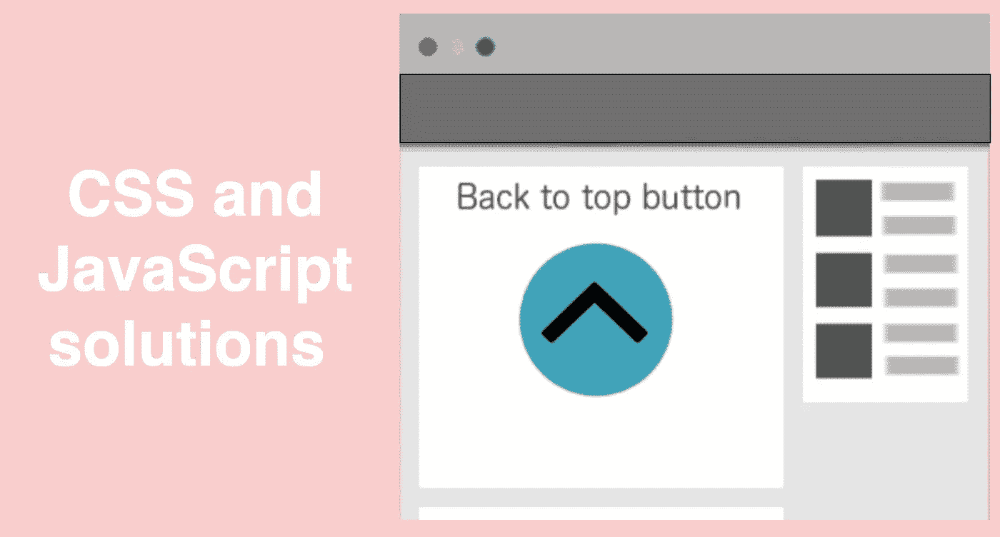
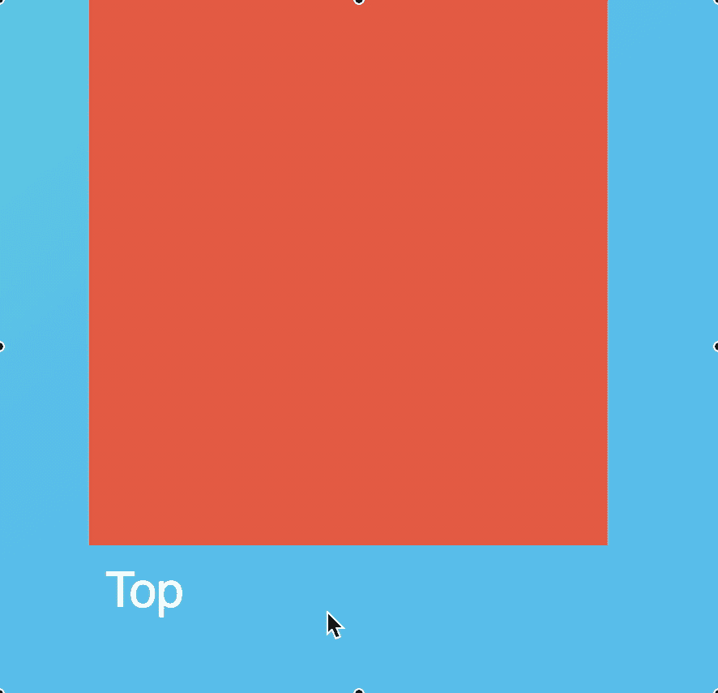
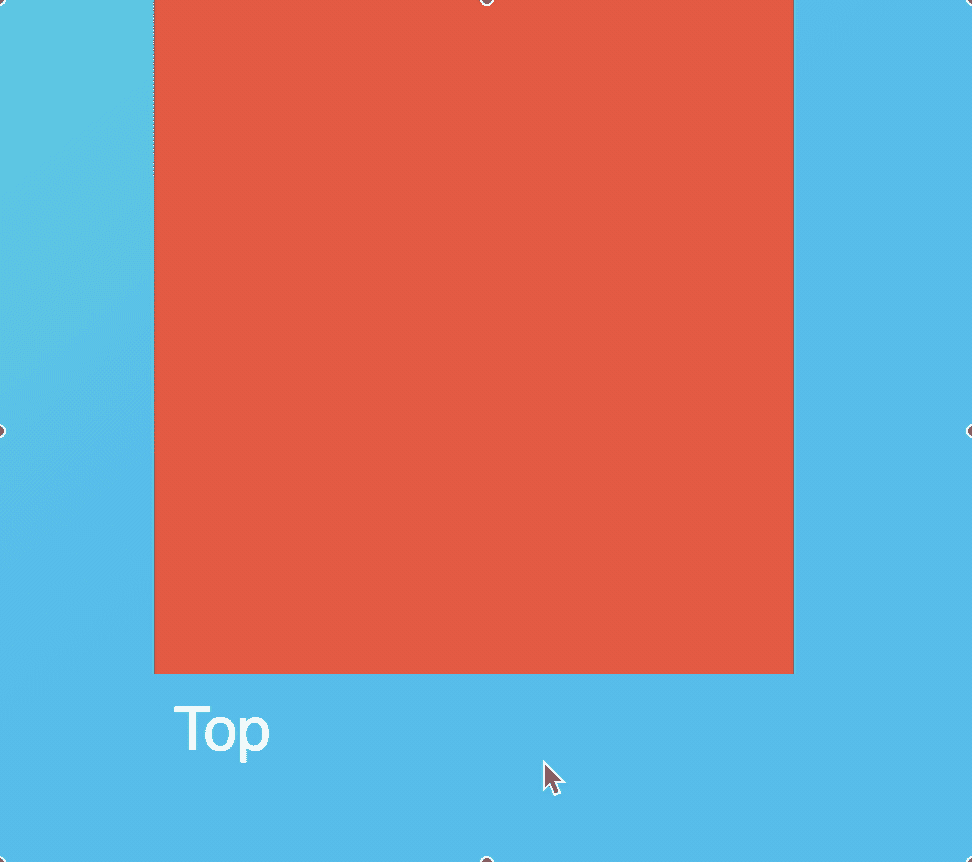
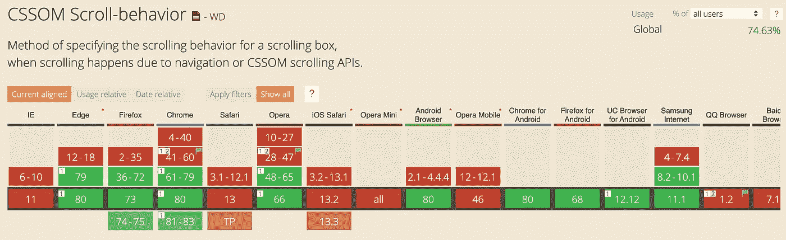
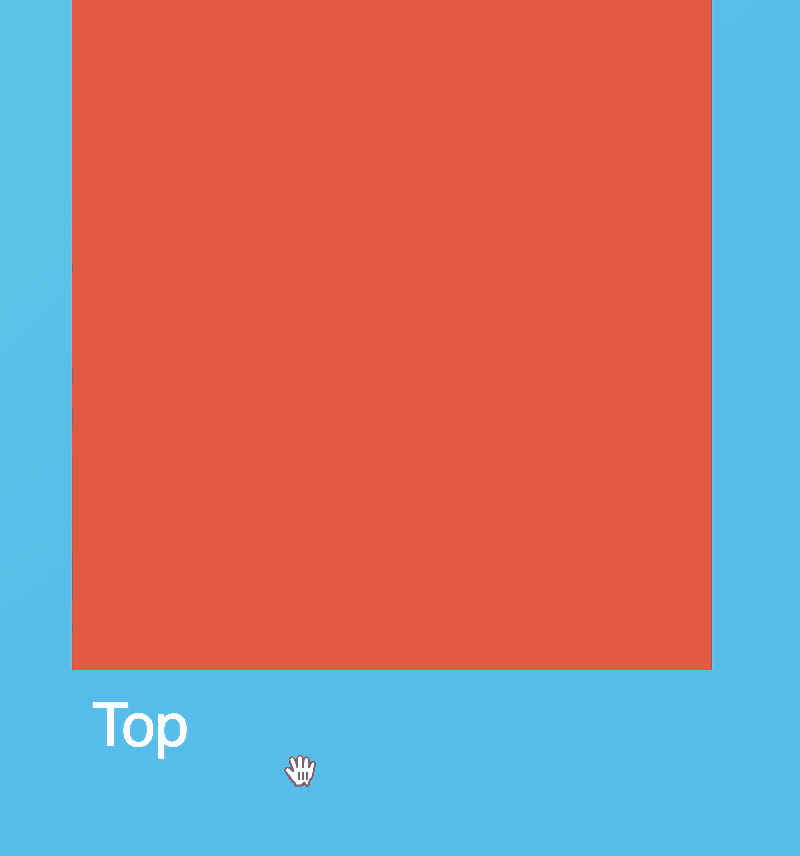
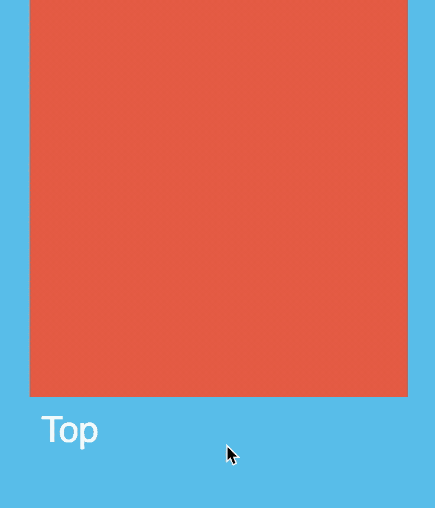
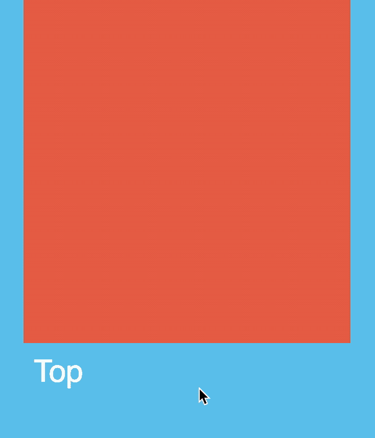
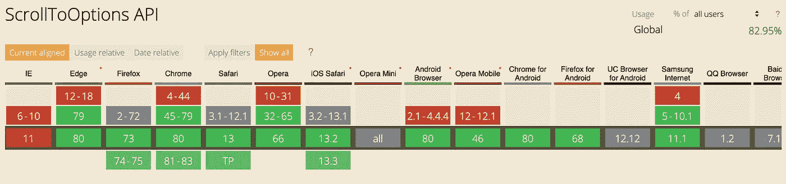
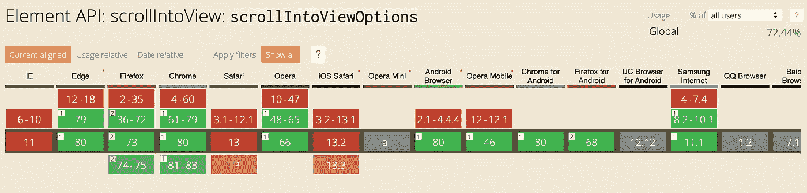
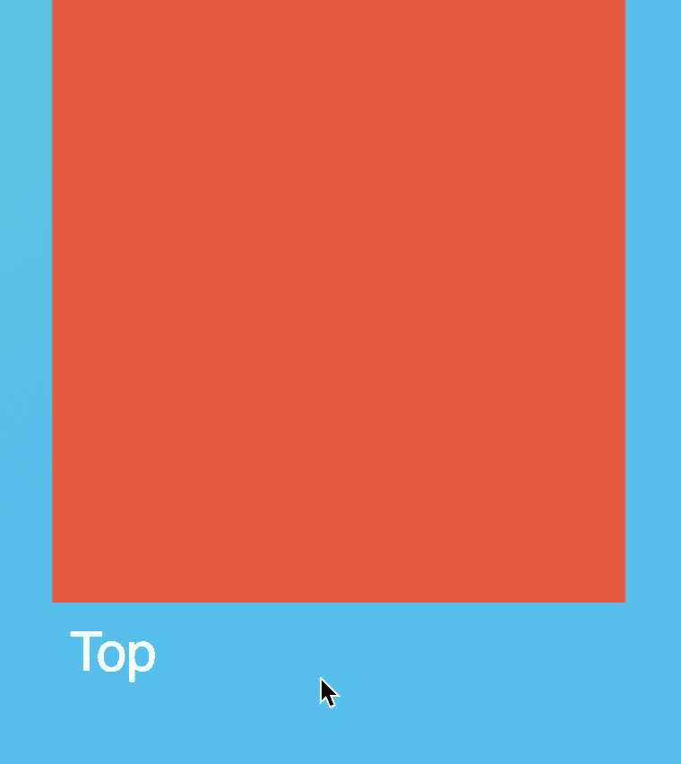

# 滚动到页面顶部

> 原文：<https://levelup.gitconnected.com/scroll-to-the-top-of-page-1cce3446808>

## 滚动到页面顶部的 CSS 和 JavaScript 解决方案



滚动到页面顶部的 CSS 和 JavaScript 解决方案

# CSS 解决方案

## 1.基本 CSS 解决方案

```
<html>
  <body>
     <a id="top"></a>
     <!-- the entire document -->
     <a href="#top">Jump to top of page</a>
  </body>
</html>
```

下面是效果，你可以注意到它直接跳到页面顶部，没有任何平滑效果。



跳转到页面顶部的基本 CSS 解决方案

## 2.平滑滚动的 CSS 解决方案

如果你想让它平滑地滚动到顶部，你可以在 CSS 中这样做:

```
html { scroll-behavior: smooth; }
```

下面是平滑滚动效果的结果。



具有滚动行为的 CSS 解决方案，用于跳转到页面顶部

**但是，**请确保您知道并非所有浏览器都支持`scroll-behavior`



滚动行为浏览器支持

# JavaScript 解决方案

您可能需要用 JavaScript 触发滚动，在这种情况下，有一些选项:

1.  `window.scrollTo()`
2.  `document.documentElement.scrollTop()`
3.  `window.scroll()`
4.  `document.documentElement.scrollIntoView()`

## 1.window.scrollTo()

`window.scrollTo(0, 0)`肯定会将窗口(或任何其他元素)滚动回顶部。的滚动行为也是由 CSS 决定的。

例如没有 CSS 平滑效果:

```
<html>
  <body>
    <a onClick="window.scrollTo(0, 0)">Top</a>
  </body>
</html>
```

结果是:



以 CSS `scroll-behavior`为例:

```
<html>
  **<style>
    html { scroll-behavior: smooth; }
  </style>**
  <body>
    <a onClick="window.scrollTo(0, 0)">Top</a>
  </body>
</html>
```

会给你平滑的滚动效果，但是要注意`scroll-behavior`的浏览器支持问题(如前所示)。



带有 css 平滑滚动的 window.scrollTo

## 2.窗口.滚动

如果你没有使用 CSS 来获得平滑的滚动效果，你可以在 JavaScript `window.scroll()`中强制平滑

```
window.scroll({
   top: 0,
   left: 0,
   behavior: 'smooth'
});
```

例如

```
<html>
  <body>
    <a onClick="window.scroll({ top: 0,left: 0,behavior: 'smooth' });">Top</a>
  </body>
</html>
```

也会给你带来流畅的滚动效果:



平滑滚动的 window.scroll

但是要注意浏览器对`ScrollToOptions`的支持



来源于[https://caniuse.com/#search=ScrollToOptions](https://caniuse.com/#search=ScrollToOptions)

## 3.document . document element . scroll top

属性获取或设置元素内容垂直滚动的像素数。`document.documentElement.scrollTop`正在根元素上使用`scrollTop`(`<html>`元素)。

```
<a onClick="document.documentElement.scrollTop = 0;">Top</a>
```

这是结果，显然没有任何平滑效果。但是几乎所有的浏览器都支持这个属性。


scrollTop 属性滚动到页面顶部

## 4.document . document element . scrollintoview()

`[Element](https://developer.mozilla.org/en-US/docs/Web/API/Element)`接口的`**scrollIntoView()**`方法滚动元素的父容器，这样用户就可以看到调用`scrollIntoView()`的元素。`document.documentElement.scrollIntoView()`是`scrollIntoView`用在根元素(`<html>`元素)上的特例。

一些浏览器支持`scrollIntoViewOptions`，允许[过渡动画](https://developer.mozilla.org/en-US/docs/Web/API/Element/scrollIntoView)。



scrollIntoViewOptions 浏览器支持[https://caniuse.com/#search=scrollIntoViewOptions](https://caniuse.com/#search=scrollIntoViewOptions)

例如:

```
<a onClick="document.documentElement.scrollIntoView({ behavior: 'smooth' });">Top</a>
```

也会给你带来流畅的滚动效果:



带`scrollIntoView`的滚动效果

# 尽情享受吧！

仅此而已。感谢阅读。