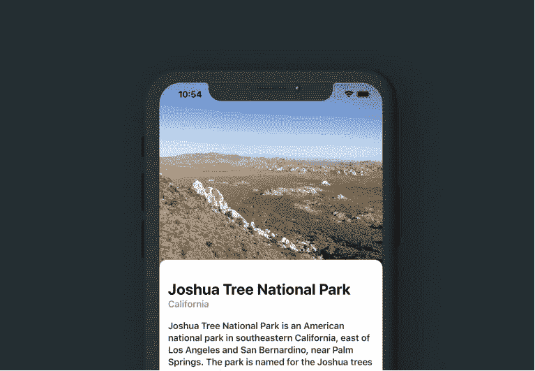

# SwiftUI — ScrollView 粘性标题教程

> 原文：<https://levelup.gitconnected.com/scrollview-sticky-header-462b9300378e>

## 快速 SwiftUI 教程，关于如何在你的 ScrollView 顶部实现一个粘性标题。将其用于图像和其他自定义视图。



SwiftUI 中的粘性标题图像

今天的快速提示。如果你不喜欢用户滚动到你的`ScrollView`顶部时看到的令人讨厌的空白，粘性标题会非常好用！

> 在开始之前，请考虑使用这个[链接](https://trailingclosure.com/signup/?utm_source=medium&utm_medium=blog_post&utm_campaign=sticky_header)订阅，如果你没有在[TrailingClosure.com](https://trailingclosure.com/?utm_source=medium&utm_medium=blog_post&utm_campaign=sticky_header)上阅读这篇文章，请随时来看看我们！

将这个`StickyHeader`组件放在一个`ScrollView`的顶部，当用户滚动到顶部时，你放进去的任何内容都会在尺寸上伸展以填充那个空隙。请看下面的视频示例！

```
struct StickyHeader<Content: View>: View {

    var minHeight: CGFloat
    var content: Content

    init(minHeight: CGFloat = 200, @ViewBuilder content: () -> Content) {
        self.minHeight = minHeight
        self.content = content()
    }

    var body: some View {
        GeometryReader { geo in
            if(geo.frame(in: .global).minY <= 0) {
                content
                    .frame(width: geo.size.width, height: geo.size.height, alignment: .center)
            } else {
                content
                    .offset(y: -geo.frame(in: .global).minY)
                    .frame(width: geo.size.width, height: geo.size.height + geo.frame(in: .global).minY)
            }
        }.frame(minHeight: minHeight)
    }
}
```

## 如何使用

这里有一些快速的例子，告诉你如何在你的下一个项目中使用它。

## 粘性标题/描述

```
var body: some View {
    ScrollView(.vertical, showsIndicators: false) {
        StickyHeader {
            ZStack {
                Color(red: 35/255, green: 45/255, blue: 50/255)
                VStack {
                    Text("Joshua Tree")
                        .font(.title)
                        .fontWeight(.bold)
                        .foregroundColor(.white)
                    Text("California")
                        .font(.title2)
                        .fontWeight(.semibold)
                        .foregroundColor(.white)
                }
            }
        }

        // Scroll View Content Here
        // ...
    }
}
```

## 粘性标题图像

```
var body: some View {
    ScrollView(.vertical, showsIndicators: false) {
        StickyHeader {
            StickyHeader {
                Image("cover")
                    .resizable()
                    .aspectRatio(contentMode: .fill)
            }
        }

        // Scroll View Content Here
        // ...
    }
}
```