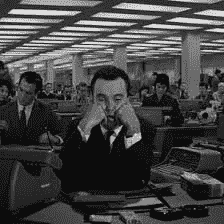
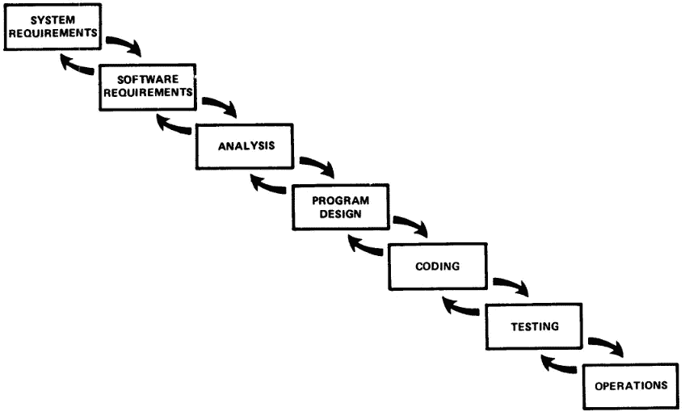

# 对于软件开发者来说，新常态是不正常的

> 原文：<https://levelup.gitconnected.com/scrum-teams-remote-working-new-normal-is-not-normal-fd134c4357e1>

一旦高飞，敏捷团队将何去何从？[图片:[丽塔·莫莱斯](https://unsplash.com/@moraisr?utm_source=medium&utm_medium=referral)

作为一个行业，软件开发通常会拥抱变化。新的编程语言，新的软件库要学习，新的*版本*的软件库要学习，甚至全新的工作方式……作为一个行业，我们经常面临变化，这是我们工作的一部分。

但新型冠状病毒，以及世界对它不可避免和必要的反应，迫使一些根本性的变化，这些变化被证明是大量 it 工作者的绊脚石。

要理解为什么，我们必须先倒退一段距离，看看软件开发是如何到达现在的位置的。

# 我们都按照吩咐做了…

也许没什么不同..？

早在 20 世纪 50 年代，当用起重机吊起一台计算机时，it 专业人员就用软件开发生命周期(SDLC)来说话。当时的 SDLCs 是高度结构化的，严格的，涉及的软件规范通常有数百页的文本和复杂的图表，都是用点阵电传打字机可以处理的最小字体打印出来的。

程序员会收到这些规范，并被告知继续工作。

我们现在称之为“瀑布过程”的这种工作方式，从未被正式命名或描述过，而是从 Winston W. Royce 博士 1970 年的一篇实用论文[中跳出来的。](http://www-scf.usc.edu/~csci201/lectures/Lecture11/royce1970.pdf)

罗伊斯实际上指出了瀑布固有的局限性。他描述了一个改进的过程，有迭代，定期反馈，甚至早期原型。

瀑布——大多数人想象这种情况时没有“迭代反馈”箭头

因此，当时的项目负责人应该得到适当的警告。但是，正如经常发生的情况一样，文化成了障碍。瀑布成了黄金标准。

大多数团队解释瀑布的方式，很少涉及反馈。相反,**需求规格说明**是“法律”,固定的，不可变的，密集的，并且经常过时。接下来是设计规范**，*也被称为*法则，固定的，不可变的等等，通常由在独立办公室工作的高级架构师交给程序员。**

> **“我付钱给你不是让你思考…”**

**团队确实需要*某种*形式的需求，以便他们知道他们应该做什么。但是正是这种不可改变的规范的概念绊倒了许多项目。**

**因此，就像一列忠实地沿着轨道行驶的火车一样，一个接一个的项目驶向一座被拆除的桥梁，而那些参与其中的人相信一种强制的方法，以某种方式使正在逼近的鸿沟*而不是*成为他们的现实。**

**当时的软件大师们很清楚这个问题。他们提出了更多迭代的、反馈驱动的过程，实际上效果相当好；从 50 年代的进化项目管理，到 70 年代的适应性软件开发，以及 80 年代的[螺旋模型](https://en.wikipedia.org/wiki/Spiral_model)——比敏捷运动至少早了十年。**

**[螺旋模型](https://en.wikipedia.org/wiki/Spiral_model)在大型政府项目、军事分包商开发的系统等方面尤其成功。**

**它如此成功的原因是…你猜对了…它是反馈驱动的，密集迭代的，自我修正的。也就是说，如果团队意识到他们错了，他们可以改变方向。**

**但是随着敏捷开发和一些杀手级营销的出现，反馈驱动的概念真正进入了软件主流。在 IT 和其他领域，敏捷是一种文化爆炸。**

# **敏捷热潮**

**大约从 2000 年代早期开始，大量新的敏捷过程被稳步引入:Scrum、XP、Crystal、FDD 等……虽然它们从实用的到有问题的都有，但它们基本上都有相同的目标。**

**这个想法是通过减少预先分析工作的数量，在每个阶段引入反馈，将迭代从几个月或几年缩短到几周，并让程序员直接与业务利益相关者交谈，来解决僵化的瀑布问题。**

**从那些原始的早期开始，敏捷已经发展成为一套普遍接受的实践。重点是团队合作、利益相关者紧密合作、对话、快速迭代或 2 周“冲刺”，以及高水平的仪式，如定期回顾、冲刺规划和积压整理。**

# **回到现在**

**就在最近几年，敏捷已经发展成为一个更加感性的过程。团队喜欢共处一地，围着白板聚在一起，参加*结对项目*——两个开发人员定期在一台笔记本电脑上一起工作。甚至*乌合之众编程*——整个团队聚集在一台电脑周围，共同解决一系列问题——现在也成为了现实。**

**团队每天从每日的混战开始，也就是清晨的站立或拥挤。**

**他们在墙上移动索引卡。他们面对面交谈。他们定期举行分组会议，用白板演示他们解决问题的方法。**

**他们依靠*信息辐射器*——打印出来贴在墙上的图表——偷听谈话来传播房间里的重要细节和变化。**

**一个*构建监视器*赫然出现在墙上的大屏幕上，就像一个严厉的校长警告团队，如果他们最近的变化破坏了构建。**

> **公平地说，构建监视器实际上 ***真的*** 有用…只要团队不习惯“失败的红光”直到他们不再注意到它。**

**这种工作方式现在已经渗透到许多组织中，以至于用其他方式工作几乎是不可想象的。**

**当我们面对一个全球化的疫情时，这里有一个基本的问题。**

# **软件开发现在是一种社会活动**

****

**哎呀。[图片:[埃德温·胡珀](https://unsplash.com/@edwinhooper?utm_source=medium&utm_medium=referral)**

**敏捷实践的发展方式，要求一群人每天都在物理上相互靠近。**

**工具似乎使远程协作变得更加容易。团队可以在 Zoom 上进行群组视频聊天(尽管存在令人震惊的隐私问题)，他们可以在共享的 Miro 白板图上工作，或者在吉拉的看板周围开始虚拟聚集。**

**互联网确实是一个奇妙的东西…**

**但是如果你试图通过一个笔记本电脑屏幕和一副耳机来重现敏捷的“感觉”,那么就缺少了一些基本的东西。**

**对我来说幸运的是，在伦敦，我正与一家金融科技公司合作，这家公司已经采用了“远程优先”技术，当整个开发团队被迫转向在家工作时，这家公司几乎没有停止工作。然而，对于许多其他组织和个人来说，这种转变被证明是困难的。**

**简而言之，社交距离对于敏捷软件开发来说是一种诅咒。它钻入了现代敏捷的精髓，并将它扭曲到了崩溃的边缘。**

# **另一种方式？**

**作为一种全球文化，我们可能太专注于现代的、社会的敏捷实践，而看不到其他可用的东西，就像过去的团队奇怪地无法超越瀑布一样。**

**幸运的是，还有其他的工作方式，这样远程工作人员就可以在相对隔离的环境中处理他们需要的细节。谢天谢地，我们不需要回到 20 世纪 50 年代的瀑布方法。**

****

**一个现代的、远程友好的过程是[并行敏捷](https://medium.com/parallel-agile-blog) (PA)。我参与了 PA 的开发，所以我在这里并不完全公正，但是我可以有把握地说 PA 是迭代的，反馈驱动的，并且鼓励早期的原型开发。**

**简而言之，它是敏捷的……但是它的设计也使得[开发人员可以在孤立的工作流上并行工作。如果曾经有一个开发过程在正确的时间到达，帮助团队适应这个新的现实，我坚信 PA 就是它。](https://medium.com/parallel-agile-blog/learn-the-fundamentals-of-parallel-agile-in-3-minutes-ff53f169ac40)**

**不管怎样，许多参与现代软件开发的人发现，从团队活动到独立工作的突然转变是一种真正的“非文化冲击”。社交距离与围绕社交活动建立的团队文化不太相符。**

# **是时候进行另一次文化变革了？**

**在世纪之交，敏捷开发给软件世界带来了巨大的文化转变。但是另一个这样的转变将是需要的，以便团队可以在物理隔离的同时继续有效地一起工作。**

**即使一旦新冠肺炎不再是唯一的新闻，公众意识的唯一乘客，即使一旦我们有了针对这种特殊菌株的大规模分布的治疗方法，我相信我们会变得更加不愿与他人密切合作。*毕竟，*人们会想，*谁知道下一个致命的疾病或变异会是什么？***

**许多公司将保持“先远离”，即使他们谨慎地开始再次共处，让员工选择保持距离。**

**新冠肺炎造成的变化太深刻，太震撼，这个结果不会有任何不同。我们的软件开发文化将需要快速适应这种修改后的工作方式。**

***顺便说一句，在社交距离和完全孤立的时代，PA 确实可以帮助您的项目更加敏捷。我希望能在 ParallelAgile.com***见到你。****