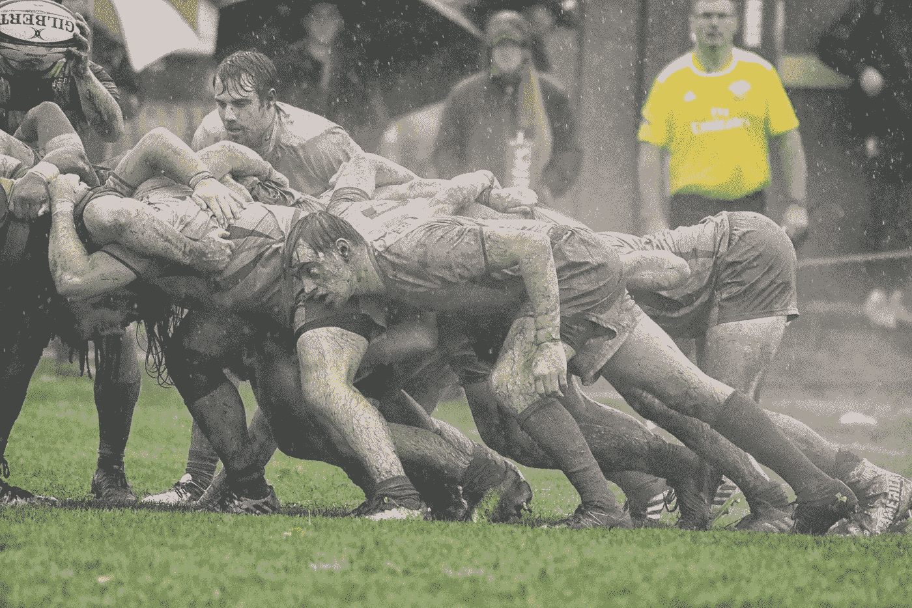
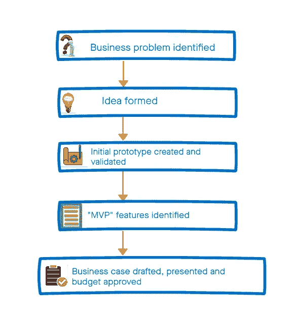
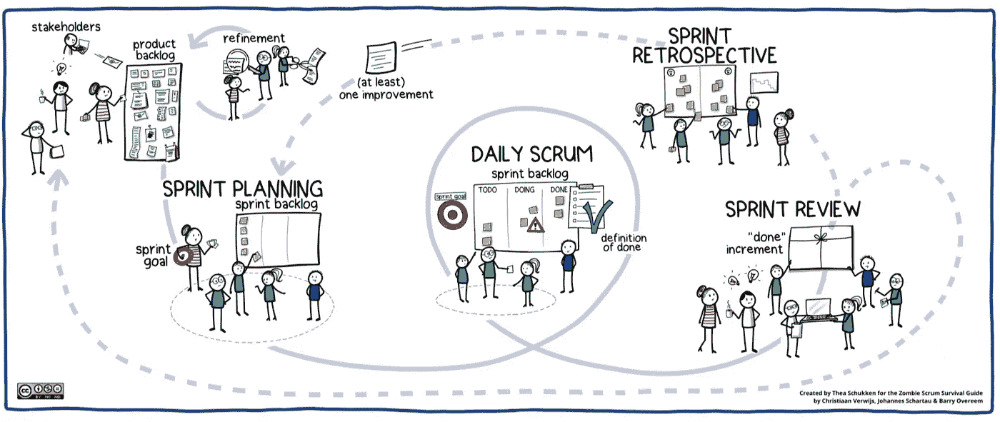

# Scrum:双刃剑

> 原文：<https://levelup.gitconnected.com/scrum-the-double-edged-sword-f34da9079fbd>

## 不要像我过去一样，被过程所蒙蔽。

陈词滥调

好了，伙计们，我敢进入中环了——请温柔点。

# 我的案子交给陪审团

正确有效地遵循 Scrum 框架的产品团队，能够在每个 sprint 结束时部署“完成”的产品增量，仍然可能导致产品/项目失败。事实上，我甚至可以说，教条地关注过程(正如我们中的一些人不可避免地会做的那样)甚至可能增加产品失败的机会。我必须补充一点，这句话对那些创造 B2B 产品的大公司来说尤其适用，因为他们的主要业务不是产品本身。

# Scrum 指南 2020

最新的 Scrum 指南软化了以前版本中使用的一些指令性语言，创建了一个精简的框架。我觉得这一举措应该有助于团队缓解我在这篇文章中讨论的一些问题。

Scrum 指南中一个经常被忽视的关键概念如下:

> 存在各种预测进展的实践，如燃尽、燃尽或累积流量。虽然被证明是有用的，但这些并不能取代经验主义的重要性。在复杂的环境中，会发生什么是未知的。只有已经发生的事情才能用于前瞻性决策。

这里值得指出经验主义的字典定义:“*所有知识都基于从感官获得的经验的理论”。*我现在一直牢记这一点，因为我知道滥用速度和燃尽图等指标来反映生产力是多么容易。在接下来的案例研究中，我将介绍它如何导致我的团队产生一种错误的安全感，认为成功是不可避免的。

# 提议的好处

我在许多项目中使用过 scrum，通常我会把自己归类为 Scrum 倡导者。像我一样，Scrum 的支持者向他们的领导歌唱它有据可查的好处。仅举几个例子:

*   它支持专注于创造商业价值的自主、自组织团队。
*   它允许团队专注于“已完成”工作的离散增量，他们可以不断地检查并适应每个后续的冲刺。
*   它允许团队随着项目的继续重新划分特性的优先级，确保他们致力于最有价值的项目。

还有很多，但那是改天的话题。这些可能是真的，然而在许多情况下，团队似乎最终陷入了“特性工厂反模式”的深渊。也就是说，他们能够以高效的方式在每个冲刺阶段完成特性，团队的速度令人赏心悦目，并且他们在每个冲刺阶段结束时“检查”他们的产品增量。然而，说到底，它们最终仍然是一个平庸、臃肿、短命的产品。充分披露，我的媒体朋友，我已经陷入了这一点。我试着用一个案例研究来说明这一点。

# **案例研究**

几年前，在一个项目中，我的团队的任务是实现一个产品创意。Scrum 是短期交付产品的首选框架。

## 项目“签署”

对于那些在大公司中开发产品的人来说，下面的*可能看起来很熟悉(为了演示而简化)。现在，这个过程中有一些缺陷，但这需要单独讨论:*

## 交货

快乐的日子！开发新产品的预算已经确定，交付团队现在可以开始构建了。当然，要确保以“敏捷”的方式解决这个问题，在这种情况下，使用 Scrum 框架如下:

你不禁会惊奇地看着上面的图表:它的简单和简洁有一种美。我们可以将一个巨大的复杂产品分解成可管理的“大块”工作(用户故事)，这些工作按顺序(根据业务价值)进行处理，并分组为“冲刺”，在短时间内交付(通常为 2-4 周)。每次冲刺，团队都公开讨论改进点，并在后续冲刺中采取行动。

以这种方式合作，并尽最大能力使用框架，仍然会导致产品失败，这似乎有悖常理。

例如，在我们的项目中，我们合作得很好，有效地交付了功能，但是我们忽略了更大的画面:我们不是被雇佣来交付功能的，而是创造一个令人敬畏的产品，客户喜欢**，更重要的是**对公司有商业利益。我只能回顾过去，我敢说我对 Scrum 过于狂热的信任让我产生了一种错误的安全感。

## 那么，哪里出了问题？

*   回过头来看，一个根本问题是对预先约定的“MVP”或产品 backlog 的固定，这是在项目开始时创建的。Sprint 评审进展顺利，因为涉众见证了另一个“大块”积压的实现。反馈是有的，但是通常只是在 sprint 和剩余 backlog 的背景下。
*   随着时间的推移，我们的团队专注于获得更准确的估计，并随着冲刺的进展提高团队的速度。所有这些都考虑到了可感知的可预测性:也就是说，团队可以根据团队的速度预测某些特性何时发布。随着时间的推移，该过程变得更加线性，可预测性成为优先考虑的问题，阻止对待办事项中剩余故事的任何真正的破坏性挑战。
*   Sprint 的承诺被认真对待，团队确保他们尽最大努力在 sprint 中交付项目。随着团队变得更有效率，我们能够将额外的项目拉进 sprint backlog，强化了输出是关键度量的错误观念。随着时间的推移，首要目标自然变成了交付更多的功能，并通过积压工作进行调整。
*   涉众在过程中得到安慰，因为他们经常看到小增量的一致交付。这反过来可能导致团队的冷漠，真正的用户价值只在项目结束时才被考虑。
*   构建的功能，显然没有什么用户价值，很少被删除，这意味着时间浪费和不必要的代码驻留在系统中。
*   该产品仅在“项目结束”时在组织内部和客户之间进行了扩展。在这种情况下，一旦交付了关键的待定项。它受到了热烈的欢迎，只有一小部分特征显示出真正的潜力。

# 我学到了什么？

像 Eric Reis 和 Martin Cagan(以及更多)这样的人写了关于精益产品开发和产品发现重要性的流行(和伟大)书籍。对于一些公司，尤其是那些销售 B2B 软件的公司(买家通常不是最终用户)，现实地说，真正以这种方式运作需要一些时间。在我们到达那里之前，我认为这些组织中的 Scrum 团队可以做一些事情来提高他们成功的机会:

## **拥抱一些混乱**

Scrum 很好地帮助团队更准确地预测他们能交付什么。如果你想创造一个伟大的产品，拥抱一些不可预测性，不要纠结于指标。如果你的速度下降了一个 sprint，并且你交付了更少但是更多**有意义和有价值的**特性，那么谁会在乎呢？如果你的疲惫没有跟随趋势线，不要紧张，它只是帮助你指出哪里**可能**是瓶颈。最重要的是，当需要时，不要回避对待办事项进行更大的变更。

## **不要用速度来衡量生产率**

团队的速度是一个很好的指标，可以用来衡量**在 *n* 冲刺中能够完成什么，但是不要用这个指标来评判团队的表现。速度和产品/用户价值可以是互斥的。**

## **接受不可能计划所有事情的事实**

每天提醒自己，在复杂的环境中，未来是未知的。在你的冲刺计划会议期间，接受预先计划每一个可能发生的事情是困难的。随着您在 sprint 中对特定用户故事了解得更多或更深入地探索解决方案，事情可能会发生变化。保持开放的心态，允许在 sprint 期间对任务进行修改(“全面文档的协作”)。

## **专注于产品目标，而不是 MVP/产品积压的先入为主的想法**

在商业案例和预算已经基于预先定义的 MVP 概念得到批准的组织中，这可能是一个棘手的问题。然而，有一个产品目标更有价值，它可以帮助人们将注意力从一个特定的解决方案(或一组特性)转移到你试图解决的核心业务问题上。

## **不要在项目开始时就用你们 UX 的设计师**

如果你的 Scrum 团队中没有好的 UX 设计师，那就雇佣一个。让他们在整个构建过程中(尤其是在早期的冲刺阶段)与产品负责人和关键利益相关者(包括一些高级工程师)一起工作，为即将到来的故事测试、验证和完成 UX。

## **在游戏中寻找有皮肤的利益相关者**

找到一种方法来确保你的利益相关者在基于真实的用户价值，而不是一个任意的进展度量来验证产品增量时有既得利益。他们可能对 sprint 的评估很满意，但是除非他们放弃他们对“MVP”的先入为主的想法，否则很难按照要求改变方向。如果他们没有在产品上投入大量时间，那么警钟应该敲响了！

## **尽早向客户展示**

确保你的利益相关者和销售人员尽早向客户展示实际的产品(即使它没有完全发挥作用)。客户会很高兴成为旅程的一部分，更重要的是，如果需要，这是另一个改变路线的机会。

## **不要像演示一样运行你的冲刺评审**

这是一个容易陷入的模式。您使用评审仅仅是为了展示您在前一个 sprint 中开发的所有令人惊奇的特性，并讨论下一个 sprint。利用这段时间关注交付的用户价值和整个产品。这是与更广泛的团队一起检查整个产品并阐述更重要的产品目标的绝佳机会。

## **使用破冰船**

一些 Scrum 仪式可能会变得有点生硬，或者可能以同样的人说话而结束。避免这种情况的一个方法是在仪式开始时介绍一个打破僵局的方法:让它变得有竞争力，比如猜国旗或经典电影，每次都给一个获胜者颁奖(是的，这听起来有点俗气，但你会惊讶地发现它是如何让每个人“热身”并准备做出贡献的)。

# 闭幕词

Scrum 可以是一个很好的框架，使团队能够以敏捷的方式交付复杂的产品。然而，我希望这篇文章对那些深陷于 scrum 过程而忽略了核心敏捷原则和大局的人来说是一个警示。总的来说，要思想开放，有保留地使用指标。