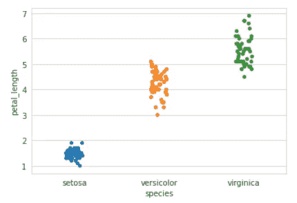
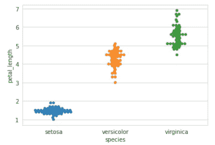
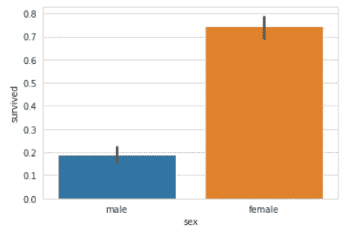
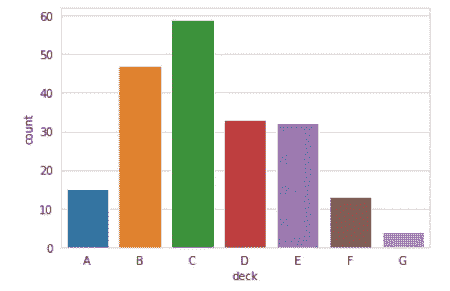
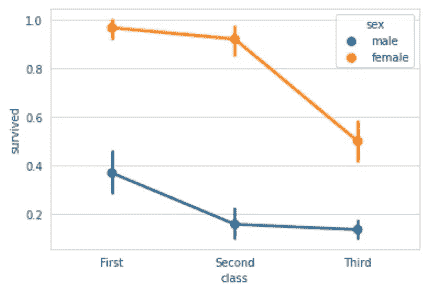
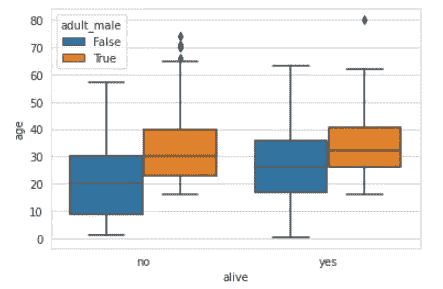
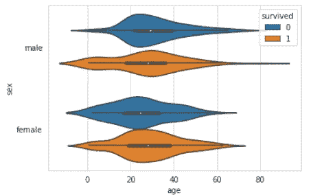
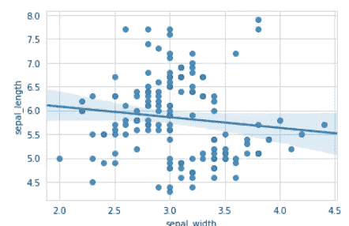
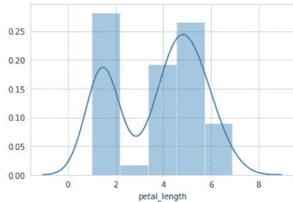
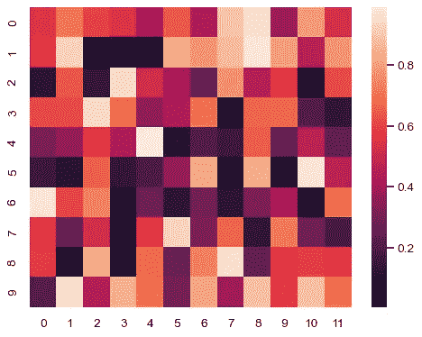

# Seaborn 终极备忘单(2021)

> 原文：<https://levelup.gitconnected.com/seaborn-ultimate-cheat-sheet-2021-58ab2241c97a>

## Seaborn 的完整指南，满足您美丽的绘图需求

Seaborn 是一个用 Python 创建漂亮可视化效果的库。它构建在 matplotlib 之上，提供了一个高级 API 来绘制漂亮的统计图。起初，使用该库似乎令人望而生畏。然而，通过不断的练习，你会找到窍门的。为此，我创建了一个全面的 Seaborn 备忘单，当您熟悉这个库时，可以一直参考它。


尼古拉斯·卡佩罗在 [Unsplash](https://unsplash.com?utm_source=medium&utm_medium=referral) 上的照片

# 目录:

1.  概观
2.  数据准备
3.  图形美学
4.  绘图:分类
5.  绘图:回归
6.  绘图:分布和矩阵
7.  情节定制
8.  显示并保存绘图
9.  奖金

# 概观

这将是用 Seaborn 创建情节的基本步骤。

```
>>> import matplotlib.pyplot as plt
>>> import seaborn as sns# DATA PREPARATION
>>> tips = sns.load_dataset("tips")# FIGURE AESTHETICS
>>> sns.set_style("whitegrid")# PLOTTING
>>> g = sns.lmplot(x="tip", y="total_bill", data=tips, aspect=2)# CUSTOMIZE PLOT
>>> g = (g.set_axis_labels("Tip", "Total bill (USD)"))# SHOW and SAVE PLOT
>>> plt.savefig('foo.png')
>>> plt.show(g)
```

# 数据准备

**内置数据集**

```
>>> titanic = sns.load_dataset("titanic")
>>> iris = sns.load_dataset("iris")
```

**您自己的数据集**

```
# You can build your dataset using Pandas DataFrame or Numpy array objects
```

# 图形美学

**创建人物和支线剧情**

```
# Creating one figure and one subplot
>>> f, ax = plt.subplots() # With a pre-defined figure size
>>> f, ax = plt.subplots(figsize=(6,6))
```

**重置样式**

```
>>> sns.set()
```

**设置样式**

有五个预设的 seaborn 主题:`darkgrid`、`whitegrid`、`dark`、`white`和`ticks`

```
>>> sns.set_style("darkgrid")
>>> sns.set_style("whitegrid")
>>> sns.set_style("dark")
>>> sns.set_style("white")
>>> sns.set_style("ticks")
```

**设置颜色**

[完整列表:调色板](https://seaborn.pydata.org/tutorial/color_palettes.html)

```
>>> sns.set_palette("husl", 3)
```

# 绘图:分类

**散点图:条带图(一个分类变量)**

```
>>> sns.stripplot(x="species", y="petal_length", data=iris)
```



带状图示例

**散点图:群集图(非重叠点)**

```
>>> sns.swarmplot(x="species", y="petal_length", data=iris)
```



群集图示例

**条形图**

```
>>> sns.barplot(x="sex", y="survived", data=titanic)
```



条形图图形示例

**计数图**

```
>>> sns.countplot(x="deck", data=titanic)
```



计数图示例

**点状图**

```
>>> sns.pointplot(x="class", y="survived", hue="sex", data=titanic)
```



点绘图示例

**箱线图**

```
>>> sns.boxplot(x="alive", y="age", hue="adult_male", data=titanic)
```



箱线图示例

**小提琴剧情**

```
>>> sns.violinplot(x="age", y="sex", hue="survived", data=titanic)
```



小提琴曲线图示例

# 绘图:回归

```
>>> sns.regplot(x="sepal_width", y="sepal_length", data=iris)
```



回归图示例

# 绘图:分布和矩阵

**分布图**

```
>>> sns.distplot(iris.petal_length)
```



分布图示例

**热图**

```
>>> sns.heatmap(uniform_data, vmin=0, vmax=1)
```



热图示例

# 情节定制

**设置轴标签**

```
>>> g.set_ylabels("Survived")
>>> g.set_xlabels("Sex")
>>> g.set_axis_labels("Survived", "Sex")
```

**设置刻度标签**

```
>>> g.set(xlim=(0,5))
>>> g.set(ylim=(0,5))>>> g.set(xticks=[0,2.5,5])
>>> g.set(yticks=[0,2.5,5)
```

# 显示并保存绘图

**显示绘图**

```
>>> plt.show()
>>> plt.show(g)
```

**保存绘图**

```
>>> plt.savefig("foo.png")
```

**保存绘图:透明图**

```
>>> plt.savefig("foo.png", transparent=True)
```

# **奖励:关闭并清除**

**清除轴**

```
>>> plt.cla()
```

**清晰的图**

```
>>> plt.clf()
```

**清除窗口**

```
>>> plt.close()
```

# 结论

我希望你能从这份小抄中学到一些东西。一如既往，任何意见或反馈都非常感谢！