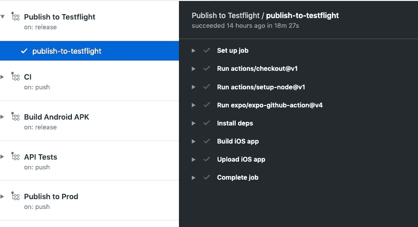

# 利用 Expo 和 Github 操作无缝部署 React 本地应用

> 原文：<https://levelup.gitconnected.com/seamlessly-deploying-react-native-apps-with-expo-and-github-actions-3fd8157132bb>

这比让某人从橱柜里拿出一台旧的 Mac 来开发你的 iOS 应用要容易得多

2019 年 5 月，我开始为我玩的一个游戏向一个社区组织志愿提供时间。该组织已经发布了一些应用程序来帮助玩家群从游戏中获得最大收益，作为一个组织社区活动的人，我经常使用该应用程序来跟踪出席情况和发放奖励。

当我第一次拿起代码库时，我最初的动力是记录和测试代码，因为这将使开发更容易，但我没有意识到应用程序的真正问题——无法经常和快速地发布。

虽然可以对应用程序进行改进，但发布过程并不理想，这意味着向用户发布更新需要两周时间，并且经常让人们感到沮丧，从而降低了这些更新的价值。

发布流程包括:

*   找到最初创建签名证书的人
*   那个人有一些时间来发布
*   那个人必须找到他们用来构建应用程序的 Mac(放在某个橱柜里)
*   这个人最终必须重新镜像 Mac，安装 Xcode，然后用新的设置测试应用程序
*   最后，该应用程序将被建立并发布到试飞

由于 Testflight 上的版本有效期为 90 天，这些版本在应用程序进入应用程序商店之前过期并重新开始整个过程并不罕见。

## 新的希望

2019 年 12 月，该组织要求我为不同的玩家群体开发一款全新的应用。我想改进这个过程，并确保我做的第一件事是确保我们可以自动发布应用程序。

我在以前的应用程序中一直使用 Github 操作来处理 CI，所以我决定移植我的 CI 脚本，并使用 Github 操作来处理 Github 中某个版本的应用程序标签的部署。

此外，在为之前的应用程序构建组件库时，我曾与 Expo 合作过，我非常喜欢它提供的开发体验，所以我决定研究 Expo 提供的发布工具，这给我留下了非常深刻的印象。

Expo 提供免费的构建服务，一旦设置好，一般会在 20 分钟内构建并发布 iOS 版本的应用程序。我发现 Android 需要大约 30 分钟来构建，但是不需要任何代价，只需按一个按钮就可以完成，这比以前的部署设置好得多！

# 在 Expo 中设置部署

在开始之前，请确保您[注册了一个世博会账户](https://expo.io/signup)，因为这将是 CLI 步骤所需要的。

一旦你有了自己的账户，你就需要获取 Expo CLI 工具，你可以通过`npm install -g expo-cli`获取。

为了构建你的应用程序，你需要向 Expo 提供一些文件，以协助应用程序的签名和上传到苹果和谷歌。

[关于你需要做什么的详细演练可以在世博会文档网站上找到](https://docs.expo.io/versions/latest/distribution/uploading-apps/)但是这里有一个你需要 iOS 的不同操作和文件的总结:

*   在 App Store Connect 中为该应用添加一个条目(使用`app.json`中的`bundleIdentifier`)
*   创建一个 iOS 分发证书，并通过钥匙串将私钥导出为一个`.p12`文件
*   如果你使用推送通知，创建一个`.p8`文件([我发现这篇文章对这个](https://fluffy.es/p8-push-notification/)很有用)
*   为应用程序创建预置描述文件

一旦你有了所有的相关文件，你就可以通过`expo build:ios`使用 Expo CLI 构建应用程序，它会提示你将这些文件上传到 Expo。

Expo 安全地存储这些文件，只在构建应用程序时访问它们，完成后从构建运行器中删除它们。

你还可以确保通过`expo upload:ios`将应用发布到 Testflight 上，在我们通过 Github Actions 开始自动化该操作之前，将这视为一次测试运行。

进行一次测试很重要，因为在你第一次上传时，苹果会在 App Store Connect UI 中抛出一堆警告。

我遇到的一个问题是需要签署一个关于曾经发布的出口一致性协议，这对于自动化构建来说并不理想，然而在`app.json`中将`ios.config.usesNonExemptEncryption`设置为 false 解决了这个问题。

# 在 Github 操作中设置自动部署

一旦你对上传应用程序到试飞博览会的能力感到满意，下一步就是实现自动化！

Github Actions 平台的一个好处是，你可以在你的脚本中使用其他人创建的动作来加速开发并跟上任何变化。

Expo 发布了其中一个名为`expo/expo-github-actions@4`的动作，当您通过 Github Secrets store 提供适当的环境变量时，它会让您登录并设置 Expo CLI 以供使用。

您还需要设置`EXPO_APPLE_ID`和`EXPO_APPLE_ID_PASSWORD`环境变量，以便发布到 Testflight，通过这些设置，您可以调用`expo upload:ios`而无需任何其他输入。

下面是一个如何在被标记的版本上运行`expo build:ios`和`expo upload:ios`的例子:

在 Github 上发布到 Testflight

我的工作只失败过一次，那是因为 Expo 决定停用一组与其服务通信时使用的证书，他们进行了更新，但 Expo CLI 没有更新，不过他们在一天内就修复了这个问题。

# 证据就在布丁里

通过自动化应用程序的构建和部署，我消除了不受管理的工具和人工干预的瓶颈，这意味着在削减发布时，试飞测试人员可以在一小时内完成新的构建。

然而，由于 Expo 通过`expo publish`命令提供了 JS 捆绑包的空中(OTA)更新，这使得开发团队可以更快地获得简单的代码更改，该命令在每次推送至`master`分支时运行，为开发团队提供了一个单独的通道。

有计划向用户开放这种 OTA 更新功能，这将看到更快的更新和更快的反馈循环。

对团队也有文化上的影响，现在发布是一个琐碎的练习，他们觉得有权力做出改变，产品负责人不太关心将功能分组到大的“发布”中，因为现在事情可以通过许多小的发布交付，然后通过配置打开。

从事一个几乎可以立即拿到最终产品的项目真的令人耳目一新。