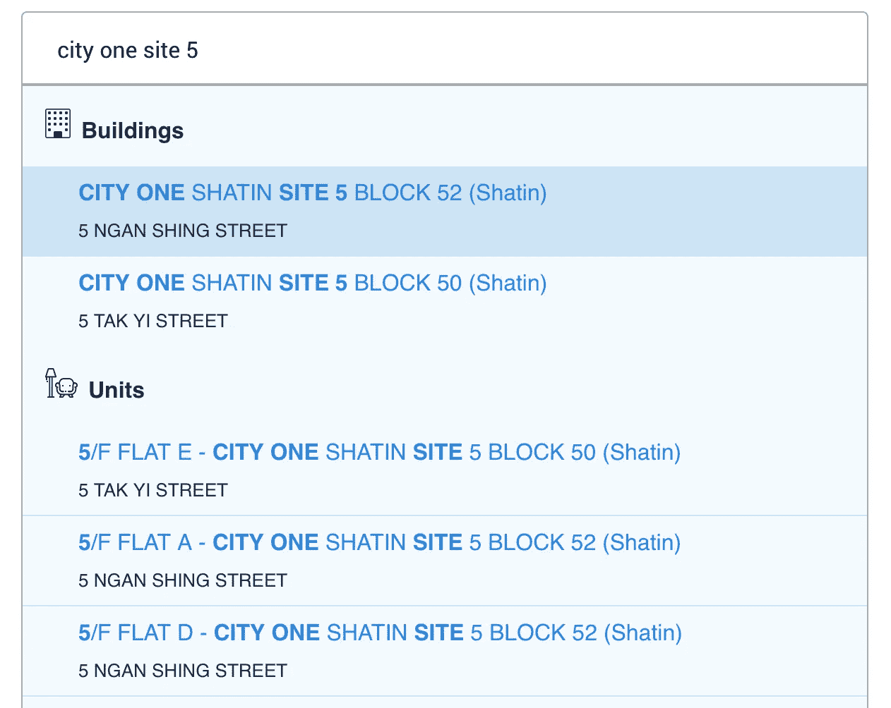
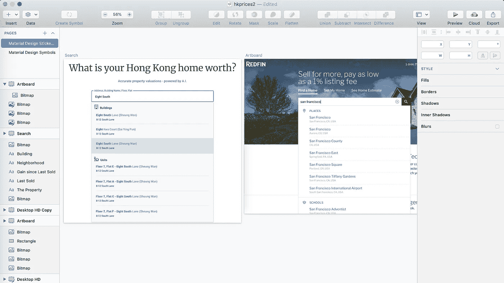
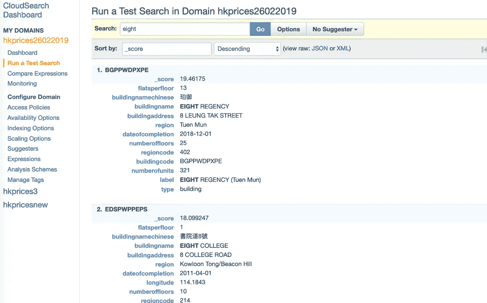
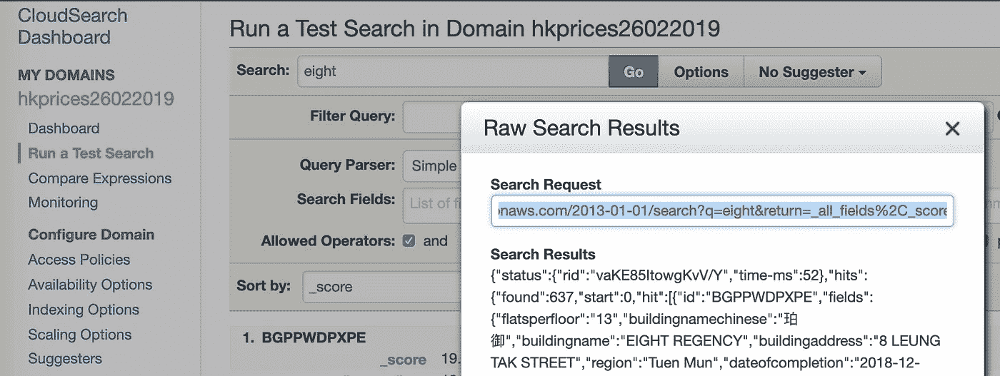
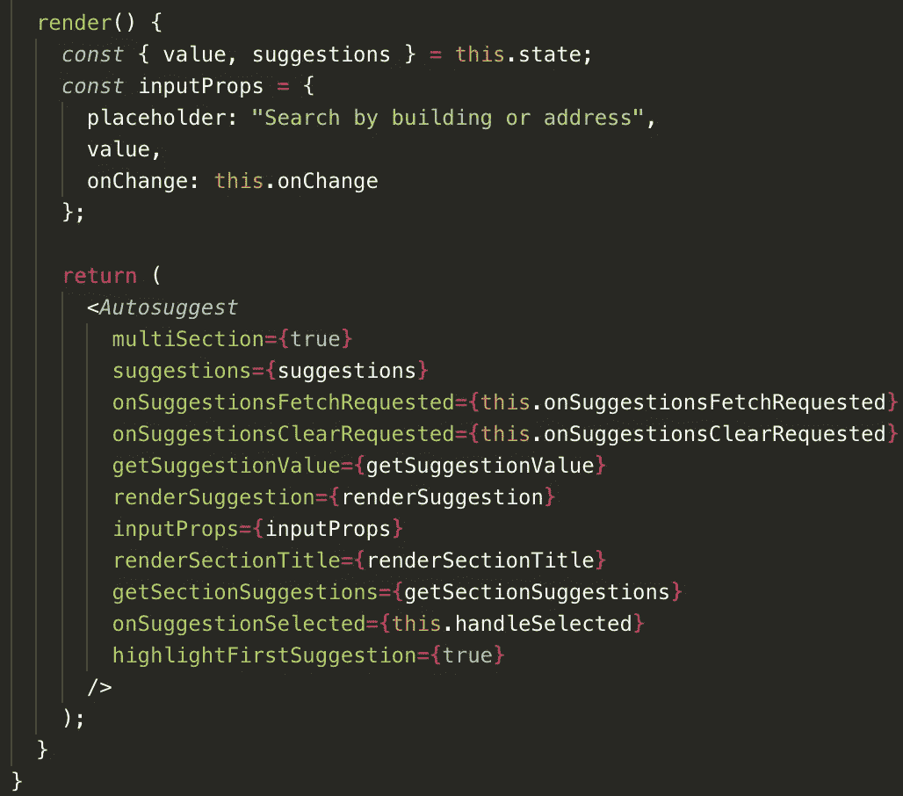

# 使用 React & AWS CloudSearch 自动完成搜索

> 原文：<https://levelup.gitconnected.com/search-autocomplete-for-2-million-records-with-react-aws-cloudsearch-16fc02365bb1>



[True Home](https://truehome.hk) 是一个自举式的网络应用程序，为香港的每处房产提供房屋价值评估——这意味着超过 200 万套房屋。

让用户尽可能高效地查看自己的家成了一个挑战。

为了让用户更容易找到他们的家，我们使用以下堆栈构建了一个搜索自动完成服务:

*   AWS 云搜索
*   反应
*   `react-autosuggest` & `autosuggest-highlight`模块
*   Express.js 服务器

# 最终结果:

# 香港房地产的一些趣闻:

*   大多数人住在有数百个单元的高层公寓里。
*   香港的每座建筑都有一个独特的名字，比如“贝尔彻斯的肯尼迪”。
*   香港人一般不会用诸如“123 Main Street ”这样的地址来称呼他们的居住地。相反，他们使用他们的建筑名称和地区，如“铜锣湾宝翠园 A 座”。


香港人就是这样生活的。中间那栋楼也正好是我现在的家！

# 我们的搜索自动完成要求:

*   无法使用 [Google Places API](https://developers.google.com/maps/documentation/javascript/places-autocomplete) ，因为没有办法将结果连接到我们的数据库记录。
*   我不能使用 Algolia，因为它对我们的自举应用来说太贵了(200 万张唱片每月 700 美元)。
*   用户应该能够通过建筑物的名称进行搜索。
*   用户应该能够通过建筑物名称和单元号来搜索他们的确切单元。

# 在我们建造之前，我们先设计！

为了设计我们搜索功能的外观和感觉，我使用了[草图应用](https://www.sketchapp.com/)，并从我曾经工作过的地方 [Redfin](https://redfin.com) 汲取灵感。



尽早敲定设计很重要，因为它帮助我弄清楚我需要使用什么工具，需要什么数据。

# 现在让我们为 AWS CloudSearch 准备数据

您可以准备 JSON、CSV、xml 或 txt 格式的数据。我们选择 JSON 是因为批量上传只支持 JSON 和 xml 格式。

True Home 有两个搜索类别:`buildings`和`units`。下面是我们的 JSON 文件的一个例子:

# 将数据上传到 AWS CloudSearch

您可以通过两种方式上传数据:通过 AWS GUI 控制台或通过终端通过`aws`命令。

您可以上传到 AWS CloudSearch 的最大文件大小仅为 5mb。这给我们带来了一个问题，因为我们有 200 万条记录，总共 900mb 的数据要上传！

为了解决这个问题，我们必须生成 180 个 JSON 文件，每个文件略低于 5mb，并通过`aws`命令行工具批量上传它们。

下面是我们用来遍历所有 180 个 JSON 文件并上传到端点的 bash 脚本:

```
for VARIABLE in $(ls *.json); do echo $VARIABLE; aws cloudsearchdomain --endpoint-url {ENDPOINT URL here} upload-documents --content-type application/json --documents $VARIABLE; sleep 1s; done
```

# 测试搜索结果

AWS CloudSearch 提供的一个好处是能够在控制台中立即测试搜索您的数据。

在这里，我们可以测试新上传的数据:



# 为 AWS CloudSearch 设置 Express.js 端点

一旦确认可以搜索新上传的数据，让我们在服务器上运行一个 API 来查询数据。真家正好用 Express.js。

数据流是这样工作的:

`User types a search → search query is sent to Express server → Express server gets data from CloudSearch endpoint → Express sends search results back to browser`

等一下！为什么我们需要通过服务器？为什么不直接从浏览器查询 CloudSearch 端点？

不幸的是，CloudSearch 不支持 CORS，这意味着你要么必须通过 Express.js 这样的服务器，要么设置某种代理服务，这两者都会增加每个查询的延迟。

幸运的是，延迟影响并不太大，因为我们的服务器和 CloudSearch 实例托管在同一个 AWS 位置。

以下是如何设置 Express API 的示例:

CloudSearch 有[官方 Javascript 支持](https://docs.aws.amazon.com/AWSJavaScriptSDK/latest/AWS/CloudSearch.html)，但出于某种原因，我很难让它工作。总体而言，缺乏 AWS 文档。

作为一种变通方法，我简单地使用测试工具自动生成的端点作为我的快速获取 URL。



# 构建 React 组件



True Home 的 React 搜索组件是用`[react-autosugge](https://github.com/moroshko/react-autosuggest)st`构建的。我们选择这个模块是因为它有很好的文档和易于理解的例子。

最初，我担心用户输入时难以高亮显示单词，但是`[autosuggest-highlight](https://github.com/moroshko/autosuggest-highlight)`让这变得轻而易举。

总而言之，前端代码大概花了 4 个小时才完成。大部分时间花在格式化来自 CloudSearch 的数据上，其余时间花在样式化组件上。

以下是 True Home 的搜索组件[的全部内容](https://gist.github.com/jlei523/dbe6b37540da793b5ada5cee9b00e58a)以供参考。

# 结论:使用现代工具，搜索自动完成非常容易，但是我不会再使用云搜索了

整个功能花了大约 32 个小时完成——比我最初想象的要快得多，因为我以前没有搜索经验。

相比之下，早在 2014 年，一位经验丰富得多的工程师就花了一个多月的时间来构建 Redfin 的搜索功能。诚然，Redfin 的搜索有更多的需求、更多的数据和更多的平台需要支持。

最耗时的部分是为 CloudSearch 准备数据，以及查找 CloudSearch 糟糕而稀疏的文档。

亚马逊似乎不再改进 CloudSearch 了。上一次重大更新是在 2013 年。我怀疑这是由于[elastic search](https://www.elastic.co/)的受欢迎程度超过了[Solr](http://lucene.apache.org/solr/)(cloud search 的基础)。

如果让我再做一次，我会选择 Elasticsearch 而不是 CloudSearch，因为前者有更好的文档并支持 CORS。

就是这样！

跟我来:https://joelei.substack.com/