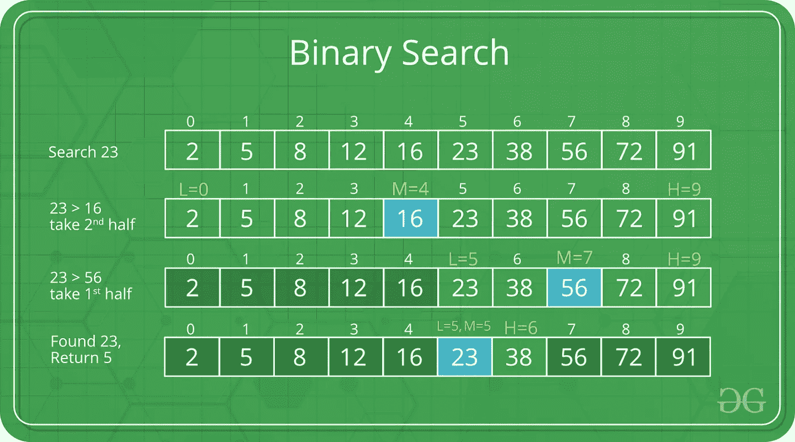

# 搜索算法

> 原文：<https://levelup.gitconnected.com/searching-algorithms-d0bc22283a62>

## 深入了解搜索算法的基础知识


阿诺·弗朗西斯卡在 [Unsplash](https://unsplash.com?utm_source=medium&utm_medium=referral) 上的照片

搜索算法的主要目的是检查一个元素或从任何数据结构中检索它。这些搜索算法通常根据搜索类型分为两个不同的部分。

1.  ***顺序搜索*** :顺序遍历列表或数组，检查每个元素。

例如:线性搜索

2. ***区间搜索*** :设计用于排序数据结构，比顺序搜索算法更有效，因为这些算法反复以数据结构的中心为目标，并将搜索空间一分为二。

二分搜索法

在本文中，我们将讨论这两种不同的搜索算法，分别叫做**线性搜索**和**二分搜索法**。让我们开始讨论🎉

# 线性搜索


礼貌:[www.geeksforgeeks.org](http://www.geeksforgeeks.org/)

这个算法是一个非常简单的算法。在这里，对数据结构中的每个元素逐一进行顺序搜索。如果找到匹配，则返回匹配，否则搜索过程继续，直到数据结构结束。

# 线性搜索是如何工作的？

假设我们想在数组 **A** 中找到值 **x** 。

```
Linear Search ( Array A, Value x)Step 1: Set i to 0
Step 2: if i >= n then go to step 7
Step 3: if A[i] = x then go to step 6
Step 4: Set i to i + 1
Step 5: Go to Step 2
Step 6: Print Element x Found at index i and go to step 8
Step 7: Print element not found
Step 8: Exit
```

# 伪代码

```
procedure linear_search (list, value) for each item in the list
      if match item == value
         return the item's location
      end if
   end forend procedure
```

# Java 代码

# 二进位检索



礼貌:[www.geeksforgeeks.org](http://www.geeksforgeeks.org/)

这是一个运行时间复杂度为 O(log N)的快速搜索算法。

> O(log N)算法被认为是高效的，因为当 N 增加时，运算次数与输入大小的比率减小并趋于零。(N 是表示输入所需的以比特为单位的输入大小)

数据收集应该以排序的形式进行，以便正确地运行该算法。

# 二分搜索法是如何工作的？

二分搜索法通过比较收藏品中最中间的物品来寻找特定的物品。如果出现匹配，则返回该项的索引。如果不匹配，它检查中间项是否大于项，然后在中间项左侧的子数组中搜索该项。否则，将在中间项目右侧的子数组中搜索该项目。在子阵列大小减小到零之前，该过程也在子阵列上继续。

> *为了让二分搜索法工作，应该首先对数组进行排序*

# 算法

假设我们想要在排序数组 **A** 中找到值 **x** 。

```
Binary Search ( Array A, Value x)Step 1: Set R=0 and L=n-1
Step 2: if L > R then go to step 7
Step 3: Set m (the position of the middle element) to the floor of (L+R)/2
Step 4: If A[m] < x, set L to m+1 and go to Step 2
Step 5: If A[m] > x, set R to m-1 and go to Step 2
Step 6: Now A[m]= x, return m, and go to step 8
Step 7: Print element not found
Step 8: Exit
```

# 伪代码

```
Procedure binary_search
   A ← sorted array
   n ← size of array
   x ← value to be searched

   Set lowerBound = 0
   Set upperBound = n-1 

   while x not found
      if upperBound < lowerBound 
         EXIT: x does not exists.

      set midPoint = lowerBound + ( upperBound - lowerBound ) / 2

      if A[midPoint] < x
         set lowerBound = midPoint + 1

      if A[midPoint] > x
         set upperBound = midPoint - 1 

      if A[midPoint] = x 
         EXIT: x found at location midPoint
   end while

end procedure
```

# Java 代码

今天我们讨论了最常用的搜索算法技术。让我们在下一篇文章中讨论排序算法。

**资源** [教程观点](https://www.tutorialspoint.com/)
[极客对于极客](https://www.geeksforgeeks.org/)
[百科](https://www.wikipedia.org/)