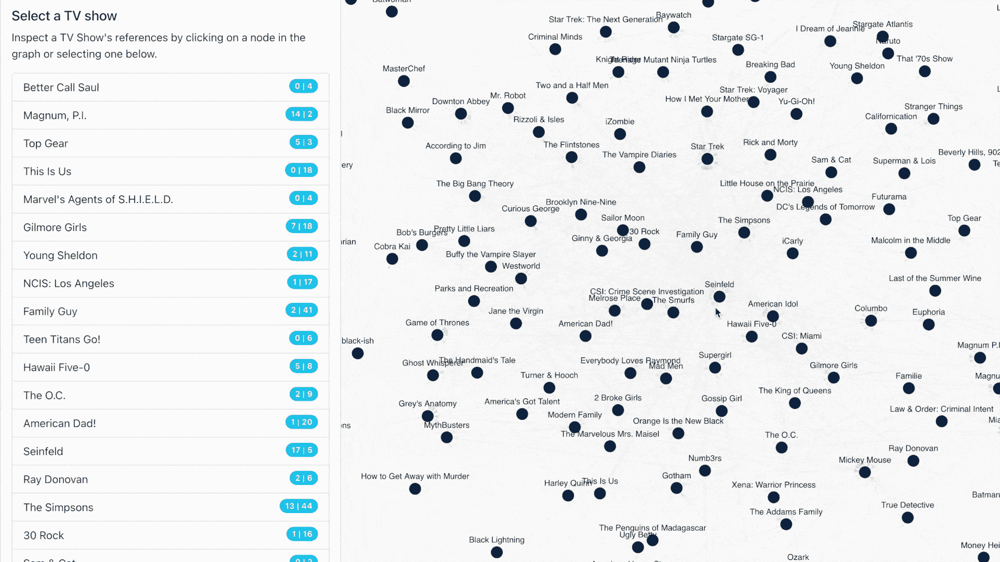
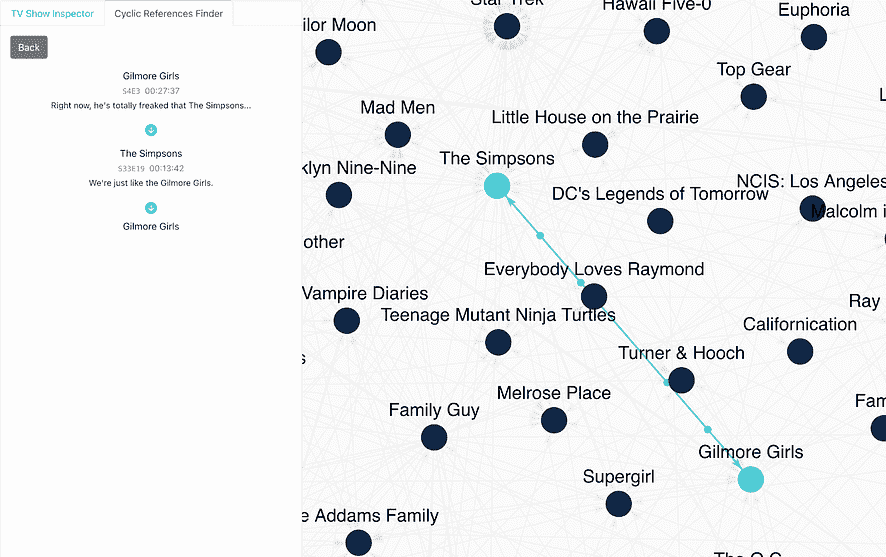
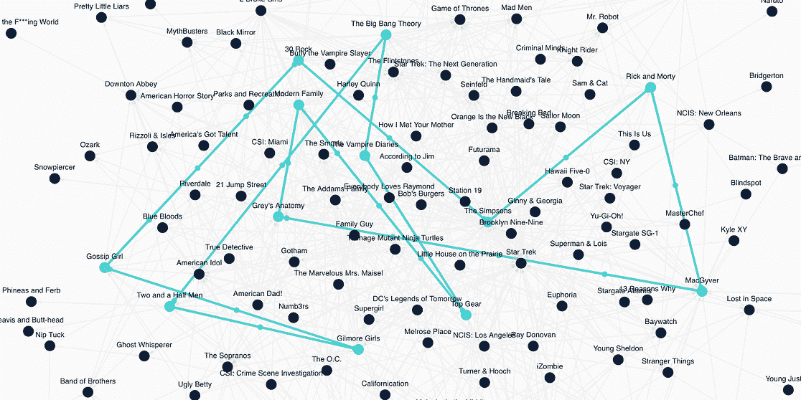
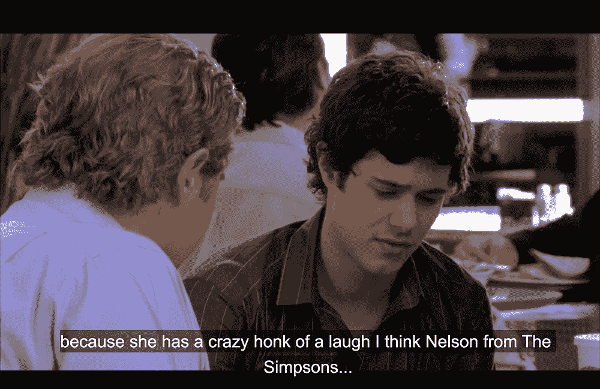
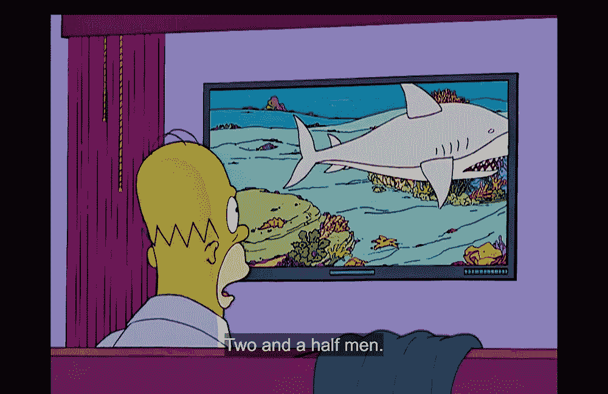
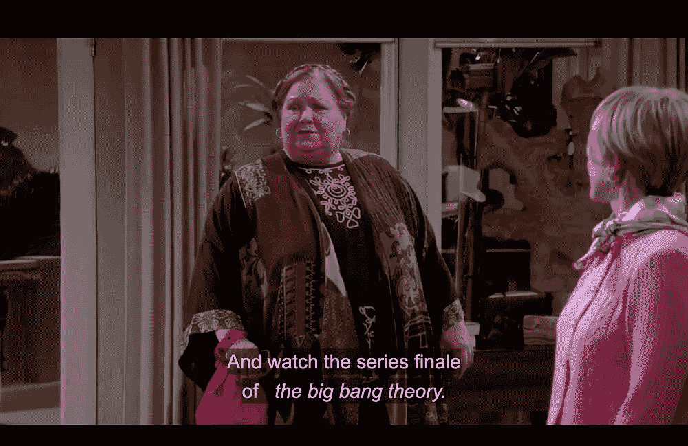
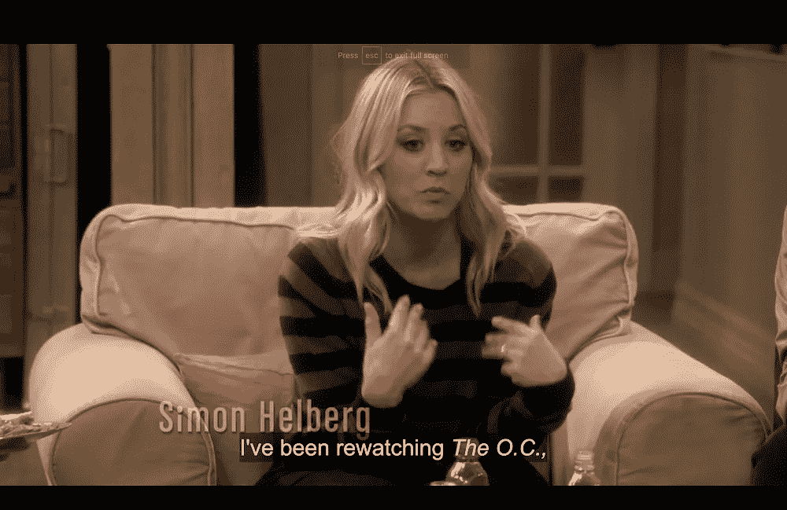
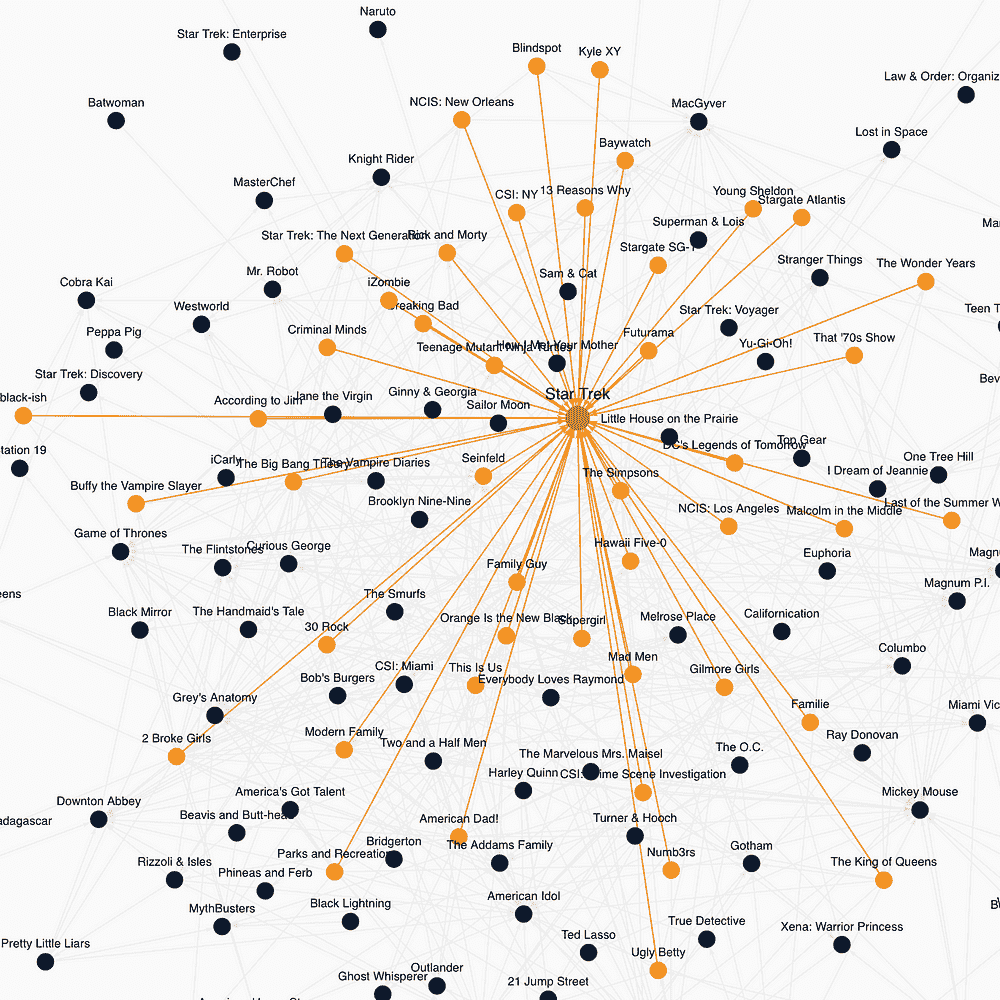
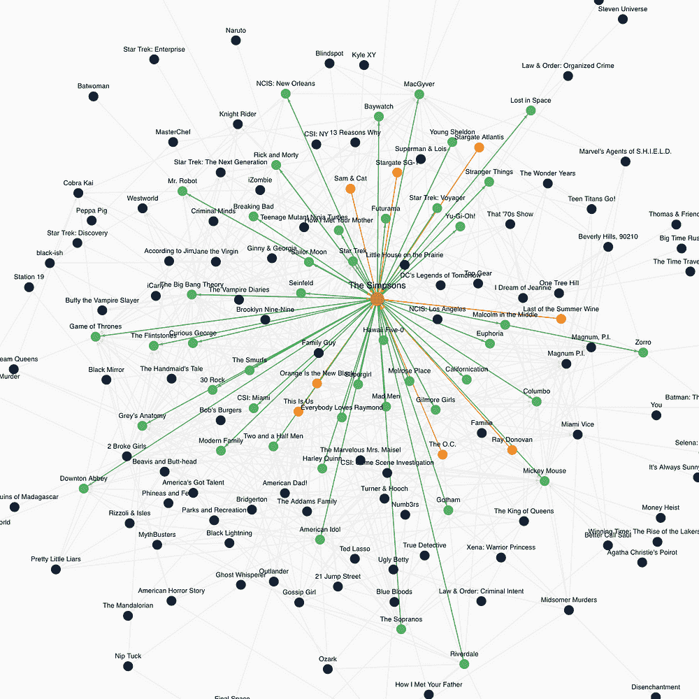

# 寻找循环电视参考悖论

> 原文：<https://levelup.gitconnected.com/searching-for-cyclic-tv-reference-paradoxes-d125ff014279>

不久前，我在看《布鲁克林九九》的时候，看到了这句台词——我看了很多《实习医生格蕾》。乍一看，这并没有什么特别之处。但经过更多的思考，我意识到这句话有更深的含义——在布鲁克林 99 发生的虚构世界中,《实习医生格蕾》是一部电视剧。越来越多，我开始注意到许多不同的电视节目中有这种虚构的参考。最终，这让我想知道如果一堆这样的引用形成一个循环会发生什么？比如《实习医生格蕾》是否也参考了布鲁克林九九。如果发生这种情况，两部剧都将依赖于对方在各自的宇宙中是虚构的，而这两者不可能同时是真实的——这是一个悖论！

有几个证据充分的流行文化悖论，然而，我找不到一个能涵盖这种确切情况的(如果你知道一个，请告诉我！)，所以我决定称它们为 ***循环电视引用悖论*** 。由于没有管理机构规定什么节目可以被其他节目引用，什么节目不可以被其他节目引用，这些悖论一定会出现——对吗？出于无聊和好奇的混合，我决定查明真相。

## 定义搜索范围

马上，我决定将我的搜索范围限制在专门的电视节目上，这些电视节目具有在一段时间内以剧集形式发布的良好特性。这允许他们与其他电视节目在时间上重叠，使他们能够在积极制作的同时相互引用。两部电影不可能做到这一点，因为其中一部会在另一部出现之前制作完成。此外，我决定关注*受欢迎的*电视节目，因为我猜想这些节目最有可能被其他节目引用。

然后，为了找到这些悖论，我意识到我需要大量的电视参考资料。我很快找到了一些粉丝维基，其中包含粉丝维护的外部引用列表(参见[Lost](https://lostpedia.fandom.com/wiki/Outside_references_to_Lost)的外部引用)。不幸的是，这些很少，而且在粉丝中也不一致。我的次佳选择是看电视节目的字幕。通过在对话框中搜索其他电视节目的名称，可以找到直接引用。这会遗漏间接引用(即提到“尤达宝宝”来指代曼达洛人)，但他们并不完全是这个项目所需要的。

## 技术面

第一步是获得所有需要的字幕。说起来容易做起来难。字幕分散在许多不同的服务和平台上。幸运的是，我偶然发现了[Subliminal](https://github.com/Diaoul/subliminal)——一个 python 库，它抽象了这种复杂性，并跨多个字幕提供商获取字幕。结合 [TMDB 的 API](https://developers.themoviedb.org/3/tv/get-popular-tv-shows)——一个关于电视节目元数据(名字、受欢迎程度、剧集/季数)的伟大来源，我设法在几天内下载了 40，000 多个字幕文件。

太好了。然而，这相当于超过 500 万行字幕。要对如此大量的数据做任何有意义的事情，需要以某种方式对其进行索引。我将所有的字幕数据输入到 [Whoosh](https://github.com/mchaput/whoosh) 中——这是一个 python 文本搜索库，允许快速、模糊的搜索来找到字幕。从那里，我可以快速搜索不同电视节目的名称，在其他节目的对话框中找到它们的引用。

## 一些微妙之处

不幸的是，这并没有马上奏效，有几个微妙之处需要考虑:

*   通用名称——像“套装”这样的电视节目返回了大量的假阳性。考虑到这一点，我放弃了所有名字太普通的电视节目，留下了大约 300 个电视节目。
*   宇宙内部的参考——很明显，电视节目经常会参考同一电影宇宙中的其他电视节目，作为一种交叉推广的形式。因为这些参考文献不是虚构的(即参考“箭头”中的“闪光”)，我放弃了同一宇宙中电视节目之间的任何参考。
*   语言环境——在“你看了奇怪的东西吗？”和“更奇怪的事情发生了”。理解对话的语言环境超出了这个项目的范围，所以最后我手工过滤了所有的引用。

考虑到这些细微差别，我总共有 2192 个电视参考文献。那里至少有一个循环！

## 查找周期

我构建了一个 React web 应用程序，它将电视参考数据可视化为一个图形。图中的每个节点代表一个电视节目，边表示一个电视节目引用另一个电视节目(可能多次)。

*循环电视参考悖论探索者—在这里试试***！**

*web 应用程序运行深度优先搜索来查找任何循环，并能够找到总共 72 个循环电视参考悖论！*

*有些很小——只是两个互相引用的电视节目。其他的更大更复杂——由许多电视节目组成(最大的由 12 个组成)。*

****

*小循环(左)，大循环(右)*

*总而言之，发现这些循环并证明这些悖论的存在是非常酷的。这里有一组屏幕截图展示了另一个悖论。*

********

*O.C. ->辛普森一家->好汉两个半->生活大爆炸-> o . c*

## *其他发现*

*这个工具还可以很好地解释其他一些有趣的发现。不出所料，最受欢迎的电视剧是《星际迷航》。它在 45 场演出中被引用了 239 次。有趣的是，由于《星际迷航》是一部比较老的电视剧，所以没有任何外部参考。引用其他节目最多的是《辛普森一家》,共引用了 44 个节目 127 次。《辛普森一家》实际上是每一部电视剧的一部分，考虑到它引用其他电视剧和被引用的频率，这是有道理的。*

****

*通过看更多的节目，形成了一种模式。《生活大爆炸》、《一家人……)会更多地参考其他节目。相反，更严重的显示(即。《实习医生格蕾》、《权力的游戏》…)会被频繁引用，但从不引用其他剧集。它看起来很相关——通过使用外部参考，帮助节目看起来很有趣。*

## *那现在怎么办？*

*通过这个项目，证明了循环电视参考悖论的存在。这有任何现实世界的后果吗？不完全是。我认为这是编剧的一个有趣的神器，包括对一些他们最喜欢的电视节目的小小纪念。就个人而言，它们并不意味着什么，但在大范围内，在数百个电视节目中，它们产生了这些有趣的悖论，可能没有一个作家会给予第二次思考。下一次你看电视节目时，看到其中一个引用，你可以放心，这个引用可能是一个更大的、非故意的悖论的一部分。*

## *资源*

*   *循环电视参考悖论查找器:[https://jamiepinheiro . com/cyclic _ TV _ Reference _ Paradox _ Finder](https://jamiepinheiro.com/cyclic_tv_reference_paradox_finder)*
*   *源代码:[https://github . com/jamiepinheiro/cyclic _ TV _ reference _ paradox _ finder](https://github.com/jamiepinheiro/cyclic_tv_reference_paradox_finder)*