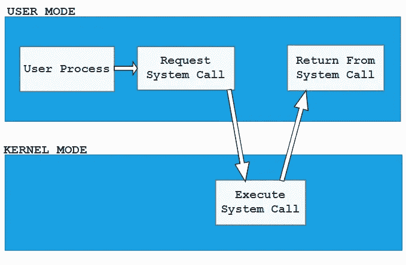

# Seccomp —安全计算模式| Kubernetes | Docker

> 原文：<https://levelup.gitconnected.com/seccomp-secure-computing-mode-kubernetes-docker-97130516662c>

## docker 和 kubernetes 的 Seccomp


斯科特·韦伯在 [Unsplash](https://unsplash.com?utm_source=medium&utm_medium=referral) 上拍摄的照片

在本文中，我们将讨论 Seccomp。 **Seccomp** 代表安全计算模式，从 2.6.12 版本开始就是 Linux 内核的一个特性。它可以用来保护一个进程的特权，限制它从用户空间到内核空间的调用。Kubernetes 允许我们自动将加载到节点上的 seccomp 概要文件应用到 pod 和容器中。在进入 seccomp 之前，让我们讨论一下容器隔离、用户空间、内核空间和系统调用。

## 容器隔离

容器只不过是一个过程。通过使用**名称空间**和 **cgroups** ，容器与主机操作系统和运行在主机上的其他进程相隔离。

**名称空间**限制进程可以看到的内容，比如用户、文件系统和其他进程。例如，哪个流程可以看到哪个流程？

**cgroups** 限制进程的资源使用(CPU、RAM、磁盘)。例如，一个进程可以使用多少 CPU？

## 用户空间和内核空间

Linux 将其内存分为两个不同的空间:

**用户空间**是所有用户应用程序或软件运行的虚拟内存空间。

**内核空间**是虚拟内存空间，操作系统的核心(内核)在这里运行。

因为容器在用户空间中运行。**容器如何与内核空间通信以挂载卷或从文件系统读取文件？**

答案是通过使用**系统调用。**

当运行在 Linux 上的应用程序/进程想要使用由 Linux 内核管理的资源时，例如读取文件、创建进程等。应用程序进程对 Linux 内核进行系统调用，随后 Linux 内核执行必要的操作，然后将控制权交还给调用程序。



容器在它们自己和主机之间共享相同的内核空间。因此，容器有可能使用系统调用来删除文件系统，或者对需要特权的文件进行写操作。这使得容器不如虚拟机安全。因为每个虚拟机都有自己的内核。

所以问题是我们如何限制来自容器的系统调用？为了限制来自容器的系统调用，我们可以使用 Seccomp(安全计算模式)。使用 Seccomp 实用程序，我们可以限制进程/容器对 Linux 内核的系统调用。

检查内核上是否启用了 Seccomp:

```
$ grep -i seccomp /boot/config-$(uname -r)

--------------------------------------------------------------------
CONFIG_SECCOMP=y
CONFIG_HAVE_ARCH_SECCOMP_FILTER=y
CONFIG_SECCOMP_FILTER=y  #'y' Indicates that the Seccomp feature is enabled
```

## Seccomp 配置文件

在创建容器/pod 的过程中，我们可以通过确定容器或 pod 可以进行哪种系统调用来传递一个 **seccomp 概要文件**。

有一个 JSON 格式用于编写定制的 seccomp 概要文件:一个基本的 seccomp 概要文件有三个主要元素:`**defaultAction**` **、** `**architectures**` 和`**syscalls**` **:**

```
{
    "defaultAction": "",
    "architectures": [],
    "syscalls": [
        {
            "names": [],
            "action": ""
        }
    ]
}
```

在`**syscalls**`部分，我们将列出 `**"names"**`数组下的系统调用，根据设置为`**"action"**` 的内容，允许或阻止这些调用。

在`**architectures**`部分，我们必须定义我们的目标架构。这非常重要，因为 seccomp 过滤器将在内核级运行。此外，在过滤期间，将使用系统调用 id，而不是我们在`**syscalls.names**` 部分定义的名称。

`**defaultAction**`定义了如果在`**syscalls**` 列表中没有找到匹配的系统调用将会发生什么。

创建 **seccomp** 轮廓有几种模式。让我们简单讨论一下其中的一些:

## 将系统调用列入白名单:

使用下面的模式，我们可以将那些我们希望允许来自某个进程的系统调用列入白名单。

```
{
    "defaultAction": "SCMP_ACT_ERRNO",
    "architectures": [
        "SCMP_ARCH_X86_64",
        "SCMP_ARCH_X86",
        "SCMP_ARCH_X32"
    ],
    "syscalls": [
        {
            "names": [
                "pselect6",
                "getsockname",
                ..
                ..
                "execve",
                "exit"
            ],
            "action": "SCMP_ACT_ALLOW"
        }
    ]
}
```

在上面的演示中:在`**syscalls.names**` 部分下列出了几个系统调用，后面的`**syscalls.action**`被设置为
`**"SCMP_ACT_ALLOW"**` ，只允许执行列出的系统调用。

但是如果找不到匹配会怎么样呢？—由于`**"defaultAction"**`被设置为`**"SCMP_ACT_ERRNO"**`，这意味着如果在`**syscalls.names**`列表中没有找到匹配的系统调用，那么系统调用的执行将被阻止。

## 将系统调用列入黑名单:

相反，如果我们编写一个类似于以下模式的 seccomp 配置文件，它将帮助我们将我们想要限制的系统调用列入黑名单，而所有其他调用将被允许。

```
{
    "defaultAction": "SCMP_ACT_ALLOW",
    "architectures": [
        "SCMP_ARCH_X86_64",
        "SCMP_ARCH_X86",
        "SCMP_ARCH_X32"
    ],
    "syscalls": [
        {
            "names": [
                "pselect6",
                "getsockname",
                ..
                .. 
                ..
                "execve",
                "exit"
            ],
            "action": "SCMP_ACT_ERRNO" 
        }
    ]
}
```

现在， `**"defaultAction"**`被设置为`**"SCMP_ACT_ALLOW"**`，`**syscalls.action**` 被设置为`**SCMP_ACT_ERRNO**`，这意味着`**syscalls**`内所有列出的系统调用都将被列入黑名单，其他的将被允许。

## 审核系统调用

为了审计系统调用，我们可以使用下面的 seccomp 配置文件:

```
{
    "defaultAction": "SCMP_ACT_LOG"
}
```

如果我们使用上面定义的 seccomp 配置文件，那么 seccomp 过滤器将不会影响 syscall 调用，但是所有的 syscall 都将记录在 hosts `**/var/log/syslog**` 文件中。

但是如果需要的话我们可以把**`**"SCMP_ACT_LOG**"``**"SCMP_ACT_ALLOW"**`**和`**SCMP_ACT_ERRNO**` 都用在一起。下面是允许某些系统调用，根据我们的需要限制某些系统调用，以及记录所有既不包括在允许列表中也不包括在限制列表中的系统调用的示例。****

```
**{
    "defaultAction": "SCMP_ACT_LOG",
    "architectures": [
        "SCMP_ARCH_X86_64",
        "SCMP_ARCH_X86",
        "SCMP_ARCH_X32"
    ],
    "syscalls": [
        {
            "names": [
                "mmap",
                "gettid",
                "tgkill",
                "rt_sigaction"
            ],
            "action": "SCMP_ACT_ALLOW"
        },
        {
            "names": [
                "keyctl",
                "ptrace"
            ],
            "action": "SCMP_ACT_ERRNO"
        }
    ]
}**
```

## ****码头集装箱的 Seccomp 配置文件****

****默认情况下，docker 容器以一个默认的概要文件运行，可以在这里找到。****

****但是如果我们需要，我们可以在创建容器时使用`**--security-opt**`选项通过传递一个自定义概要文件来修改默认概要文件:****

```
**$ docker run --rm \
             -it \
             --security-opt seccomp=/path/to/seccomp/custom.json \
             hello-world**
```

## ****Kubernetes 的 Seccomp****

****为了给一个 pod 分配一个 seccomp 配置文件，我们必须将 seccomp 配置文件 JSON 文件放在节点目录中，以便 kubelet 在将 pod 调度到相应的节点时可以方便地访问它。****

****根据 [**v1.25**](https://kubernetes.io/docs/reference/command-line-tools-reference/kubelet/) 文档版本，kubelet 的默认根目录为:`**/var/lib/kubelet**`****

****假设我们想要将下面名为 **custom.json** 的 seccomp 概要文件附加到即将发布的 pods 中。****

```
**{
    "defaultAction": "SCMP_ACT_ERRNO",
    "architectures": [
        "SCMP_ARCH_X86_64",
        "SCMP_ARCH_X86",
        "SCMP_ARCH_X32"
    ],
    "syscalls": [
        {
            "names": [
                "accept4",
                "epoll_wait",
                "pselect6",
                "futex",
                "madvise",
                "epoll_ctl",
                "getsockname",
                "setsockopt",
                "vfork",
                "mmap",
                "read",
                "write",
                "close",
                "arch_prctl",
                "sched_getaffinity",
                "munmap",
                "brk",
                "rt_sigaction",
                "rt_sigprocmask",
                "sigaltstack",
                "gettid",
                "clone",
                "bind",
                "socket",
                "openat",
                "readlinkat",
                "exit_group",
                "epoll_create1",
                "listen",
                "rt_sigreturn",
                "sched_yield",
                "clock_gettime",
                "connect",
                "dup2",
                "epoll_pwait",
                "execve",
                "exit",
                "fcntl",
                "getpid",
                "getuid",
                "ioctl",
                "mprotect",
                "nanosleep",
                "open",
                "poll",
                "recvfrom",
                "sendto",
                "set_tid_address",
                "setitimer",
                "writev"
            ],
            "action": "SCMP_ACT_ALLOW"
        }
    ]
}**
```

****将 **custom.json** 文件移动到 kubelet 根目录下。以便 kubelet 可以直接访问它。****

```
**# create new directory under kubelet root directory
$ mkdir -p /var/lib/kubelet/seccomp/profiles

# move "custom.json"
$ mv custom.json /var/lib/kubelet/seccomp/profiles/**
```

## ****将 **seccompProfile 连接到 pod******

****要将 Seccomp 配置文件设置为箱/集装箱，包括箱或集装箱清单的****`**securityContext**`**部分的`**seccompProfile**`字段。**********

****`**seccompProfile**` **:** 有很多种****

******Localhost** —在将要调度 pod 的节点上的文件中定义的 seccomp 配置文件。
**RuntimeDefault** —应该使用容器运行时默认配置文件。**无约束** —不应应用任何轮廓。(如果没有定义配置文件，则为默认值)****

## ****Seccomp 配置文件— **本地主机******

```
**# type "localhost"

securityContext:
  seccompProfile:
    type: Localhost
    localhostProfile: my-profiles/profile-allow.json**
```

****`**seccompProfile.type**` 表示将应用哪种 seccomp 配置文件。
`**seccompProfile.localhostProfile**`表示在 pod 将运行的节点上的文件中定义的 seccomp 配置文件。该配置文件必须在节点上预先配置才能工作。该路径必须相对于 kubelet 的根目录。仅当类型为" **Localhost** "时才必须设置。****

## ******Seccomp 配置文件—运行时间默认值******

```
**# type "RuntimeDefault"

securityContext:
  seccompProfile:
    type: RuntimeDefault**
```

****正如我们所讨论的，默认情况下，容器使用默认的 seccomp 配置文件运行。如果我们将`**seccompProfile.type**` 设置为 **RuntimeDefault** ，那么 pod 将使用容器的默认 seccomp 配置文件。****

****现在，通过将 **custom.json** 文件作为 **seccompProfile** 附加到 pod 的 **securityContext** 部分下，创建一个名为 **pod-1** 的新 pod。****

```
**apiVersion: v1
kind: Pod
metadata:
  name: pod-1
  labels:
    app: pod-1
spec:
  securityContext:
    seccompProfile:
      type: Localhost
      localhostProfile: profiles/custom.json
  containers:
  - name: test-container
    image: hashicorp/http-echo:0.2.3
    args:
    - "-text=just made some syscalls!"
    securityContext:
      allowPrivilegeEscalation: false** 
```

****为了确保容器不会获得比 pod 更多的特权，我们必须将容器**allowprivilegescalation**设置为 **false。******

****最后，创建 pod:****

```
**>> kubectl create -f pod-1.yaml

# list the pod-1 
>> kubectl get pods
---------------------------------------------------------------------------
NAME    READY   STATUS    RESTARTS      AGE
pod-1   1/1     Running   5 (90s ago)   3m3s**
```

****我们可以看到 **pod-1** 正在运行，没有任何问题。这表明 **pod-1** 允许的系统调用足以让 pod 运行。****

****如果你觉得这篇文章有帮助，请**不要忘记**点击**跟随**👉和**拍手**👏按钮帮助我写更多这样的文章。
谢谢🖤****

## ****参考****

****[](https://kubernetes.io/docs/tutorials/security/seccomp/) [## 用 seccomp 限制容器的系统调用

### 特性状态:Kubernetes v1.19 [stable] Seccomp 代表安全计算模式，是 Linux 的一个特性…

kubernetes.io](https://kubernetes.io/docs/tutorials/security/seccomp/) [](https://itnext.io/seccomp-in-kubernetes-part-i-7-things-you-should-know-before-you-even-start-97502ad6b6d6) [## Kubernetes 中的 Seccomp 第一部分:开始之前你应该知道的 7 件事！

### 这是一个系列的第一篇，讲述如何在不使用魔法或巫术的情况下以秘密的方式获得伟大的秘密档案…

itnext.io](https://itnext.io/seccomp-in-kubernetes-part-i-7-things-you-should-know-before-you-even-start-97502ad6b6d6)****