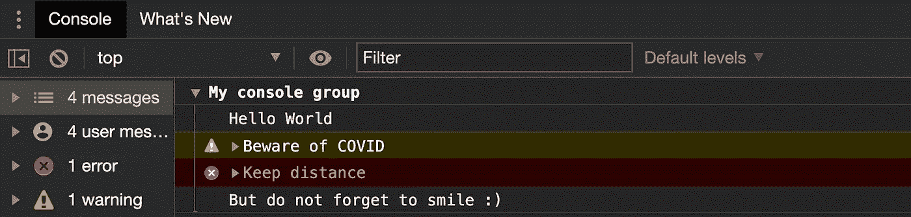

# 秘密的 JavaScript 技巧来与你的同伴超快的高级开发人员的调试速度竞争

> 原文：<https://levelup.gitconnected.com/secret-javascript-tricks-to-compete-with-your-fellow-super-fast-senior-devs-debugging-speed-31460560e628>

来源:[像素](https://www.pexels.com)

当我开始初级开发人员的职业生涯时，我总是在工作中感到有点不安全，因为我的前辈们总是用外星语言交谈，并以光速解决问题。

来源:[码猴](https://codedmonkey.wordpress.com)

我们大多数人都经历过这种感觉，这是完全正常的，随着你获得更多的知识和弄脏你的手，这种感觉就会消失。

但是有几个技巧我希望我在初学的时候就知道。

## 使用调试器而不是每次都记录它

您知道可以记录调试器范围内出现的所有变量吗？您可以将`debugger`放在一个行为异常的代码块中，并在调试的任何一步记录控制台上的所有变量，而不是记录控制台上的所有内容。

## 如果你在记录日志，那就用时尚的方式来做吧！

你知道控制台对象有比`console.log()`更多的属性吗？

尝试用`console.table()`以更漂亮的方式记录对象和数组。你猜怎么着，你也可以通过点击列来排序。耶！

使用控制台表记录对象

使用控制台表记录数组并对值进行排序

除了`table`，还可以试试`console.warn`、`console.info`、`console.error`、`console.group`、`console.groupEnd`等。

试试这个好玩的-

控制台上的分组。图片鸣谢: [https://carbon.now.sh](https://carbon.now.sh)

控制台上的结果|分组

查看[这篇文章](https://developers.google.com/web/tools/chrome-devtools/console/api)以获取完整参考。

## Firefox 非常适合布局检查

你知道你可以通过切换到 CSS 网格来轻松解决布局问题吗？如果是的话，你应该知道 Firefox 的 inspector 让调试 CSS grid 变得非常容易。

查看 MDN 的这篇文章了解更多详情。

另外，如果你想成为一名网格专家，可以去看看这个网站，它非常有趣而且内容丰富。

## Chrome 开发工具检查的历史

尝试检查 Chrome 开发工具中的任何元素。现在在控制台上键入$0。惊讶吗？是的，Chrome dev-tools 保存了您从`$0`到`$4.`检查的最后五个元素的引用

## 在 Firefox 上编辑并重新发送 API

您可能不需要 postman 每次都测试您的 API。打开 Firefox dev-tools 中的网络选项卡，右键单击任何 API，单击*编辑并重新发送*，您将得到类似这样的内容

非常方便和容易！

## 使用 Chrome 审计工具

建立一个网站不仅仅是创造一个整洁的设计和完美的功能。它还需要达到一定的性能，可访问性，搜索引擎优化等指标。谷歌 Chrome 有一个名为 Lighthouse 的工具，可以帮助你了解更多关于你的网站需要解决的各种指标和问题，以改善用户体验和 SEO。

查看这篇[文章](https://developers.google.com/web/tools/lighthouse)了解更多。

## 在 Chrome 的控制台中使用实时表情

想要实时评估您的 JavaScript 表达式，而不是在控制台上重复输入吗？

你可以尝试在 Chrome 开发工具中使用实时表达式。

点击控制台选项卡中的**眼**图标**T9-**

键入您的表达式，然后按下 ***Cmd + Enter*** 或 ***Ctrl + Enter*** 保存您的表达式—

当我们调整视口大小时，可以观察到上面的表达式实时记录不同的值。你可以写任何符合你要求的表达式。

## 当 DOM 元素改变时添加断点

在 Chrome 开发工具中，只要与特定 DOM 节点相关的内容发生变化，就可以触发一个断点。例如:

网站积分— [哈希画布](https://hashcanvas.netlify.app/)

## IDE 扩展的使用—与代码图标

使用 [VS 代码图标](https://marketplace.visualstudio.com/items?itemName=vscode-icons-team.vscode-icons)让你的工作区文件夹和文件看起来更有条理，更有区别。检查我的工作区-

VS 代码图标如何让我的工作空间看起来更酷！

## IDE 扩展的使用——括号对配色器

这个扩展最初使用起来可能有点奇怪，但是一旦你习惯了，它就非常棒！识别代码块的大括号/方括号的开始和结束位置非常容易。检查这段代码，它强调了这个扩展是如何工作的——

## IDE 扩展的使用——简单的 React 片段(仅适用于 React 开发人员)

我的同伴反应如何？

我们都知道 React 就是让事情模块化等等。为了实现这一点，我们每天至少制作 3 个组件，即多个文件(通常)、多个声明以及不同类型的组件(类、功能组件)。

所以我使用[简单的 React 片段](https://marketplace.visualstudio.com/items?itemName=burkeholland.simple-react-snippets)，这是一个出色的扩展，有几个命令可以快速启动任何组件。

看看这个-

来源: [VS 代码市场](https://marketplace.visualstudio.com/items?itemName=burkeholland.simple-react-snippets)

如果你记得的话，还有更多用于功能组件的[命令](https://marketplace.visualstudio.com/items?itemName=burkeholland.simple-react-snippets)！

*这篇博客到此为止！*

我确信我们会学到更多的技巧和窍门。如果您希望添加任何调试技巧，请留下回复。🙃

干杯！

在推特上关注我。