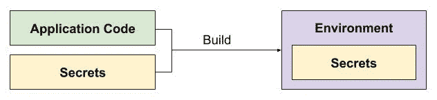
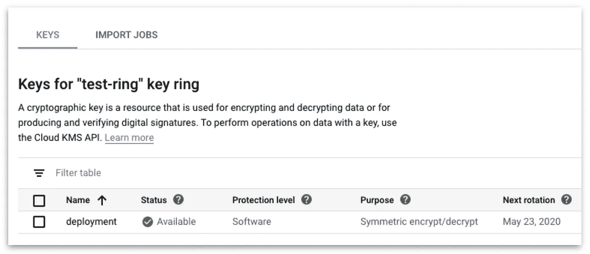

# 秘密和无服务器——使用谷歌云中的 KMS 和秘密管理器管理和部署秘密

> 原文：<https://levelup.gitconnected.com/secrets-and-serverless-managing-and-deploying-secrets-with-kms-and-secret-manager-in-google-cloud-8ec3bad0f800>


秘密？Shhhhhhhh —原图，来源: [pixabay](https://pixabay.com/photos/california-road-highway-hills-210913/) ，作者: [tphilm1310](https://pixabay.com/users/philm1310-752382/)

> 我们使用 Google App Engine 和 Cloud Run 等无服务器工具来加速当今云饱和世界中 web 应用程序的开发。
> 
> 然而，从谷歌云平台(GCP)的“安全”方面来看，如何才能将秘密安全地注入到我们的应用程序中呢？我们能在 GCP 轻松解决这些问题吗？

**“无服务器”**web 服务的托管和维护方式发生了巨大的变化。无需担心底层基础设施(如物理服务器、操作系统、网络)，就可以轻松创建 web 服务。

然而，抽象底层基础设施并非没有成本。

以前，当我们在没有服务器的情况下自己管理基础架构时，我们能够直接访问我们的服务器。这使我们能够执行一些壮举，比如将我们自己的过程应用于将配置和机密直接注入到我们的应用程序中(一个简单的例子是在将机密与应用程序代码捆绑在一起以便从部署机器进行部署之前，编写机密检索的脚本)。

随着“无服务器”的出现，使用相同的工作流向应用程序注入秘密不再有效。首先，您的秘密应该只能从私有机器上访问，并且只能在部署 web 应用程序时应用到它。这在无服务器的情况下是不可能的，在无服务器的情况下，我们无法在无法访问“服务器”的情况下注入秘密。

有了谷歌云平台(GCP)，上述问题可以用许多不同的方式解决。让我们探索这些方法来解决在无服务器环境中注入秘密的问题。

# 迎接“无服务器”


“嗨，我是无服务器”——修改图片，来源: [pixabay](https://pixabay.com/photos/business-card-business-card-man-2056020/) ，作者: [TeroVersalainen](https://pixabay.com/users/TeroVesalainen-809550/)

在我开始与 GCP 讨论访问秘密之前，我想谈一下无服务器工具和其他相关技术。

对于无服务器工具，我同时使用了 [**云运行**](https://cloud.google.com/run) 和 [**带自定义运行时的 Google App Engine Flex**](https://cloud.google.com/appengine/docs/flexible/custom-runtimes/about-custom-runtimes)。

与传统的无服务器工具相比，云运行是一个有趣的工具，在传统的无服务器工具上运行的应用程序可以从 Dockerfile 文件进行配置。这使得它成为开发人员高度灵活的工具，这种配置可以部署到 Cloud Run、Kubernetes 甚至直接部署到虚拟机。

对于谷歌应用引擎来说，它可以在标准的 T2 版本和灵活的 T4 版本之间变化，前者的配置选项与平台紧密相关，后者的选项更宽松，与平台的关联更小。在 Google App Engine Flex 下，有一个使用自定义运行时的选项。与 Go、Python 或 Node 等其他运行时选项相比，自定义运行时提供了 Dockerfile 配置的使用。这允许应用程序开发人员决定与 GCP 耦合度非常低的运行时，提供了与上面看到的云运行类似的灵活性。

正如我在之前的[中所描述的，这两种工具之间存在一定的差异。然而，使用多种无服务器工具的目的是探索我们早期问题的某些解决方案是否可以全面应用。](https://medium.com/@weiyuan.liu/keep-your-hands-off-the-servers-going-serverless-with-google-cloud-platform-gcp-and-g-suite-86f5fac0bbc9)

# 那么，我们如何安全地将秘密注入到我们在 GCP 的无服务器工具中呢

当使用无服务器工具时，需要注意的一件重要事情是我们不能直接访问我们的服务器！这意味着使用 SSH 的传统部署方式是不可能的。事实上，有了 GCP，你会希望使用`gcloud` CLI 而不是直接访问服务器。

例如，我们可以从 CLI 使用以下命令部署应用程序:

```
**# Cloud Run**gcloud builds submit --tag gcr.io/$PROJECT_ID/$APP:$APP_VERgcloud run deploy --image gcr.io/$PROJECT_ID/$APP:$APP_VER --allow-unauthenticated --platform="managed" --region="$REGION" $APP
```

—

```
**# Google App Engine**gcloud app deploy --project $PROJECT_ID
```

但是，这些命令没有任何选项允许机密与部署的应用程序一起传递。让我们研究一下如何解决这个问题。

# 方法一:将秘密“烘焙”到应用程序中

我最初探索的方法之一是将秘密直接“烘焙”到应用程序中。对于 Google App Engine 来说，这是一个简单的方法，在这里，与 [app.yaml](https://cloud.google.com/appengine/docs/flexible/custom-runtimes/configuring-your-app-with-app-yaml) 在同一个目录中的秘密文件与源代码一起部署。部署应用程序后，可以通过读取这些文件来访问秘密。

对于云运行，等同于将秘密文件作为 Docker 文件指令的一部分复制到 Docker 映像中。当从映像部署容器时，文件也将存在于环境中。



然而，我觉得这种方法并不是一个好的选择，原因如下:

首先，应用程序代码应该没有任何秘密的上下文。这对于回滚尤其重要。假设您最近更新了一个应用程序秘密，随后一个不相关的部署导致了故障率的增加。然而，我们不能在这里执行回滚，因为以前的版本中的秘密已经过时了。

这种方法的另一个问题是秘密不再集中在一个位置。如果你使用 Cloud Run，你必须意识到你的 docker 映像注册表在每个版本中都包含这些秘密，并对这些映像应用适当的访问控制。否则，用户仍然可以通过映像访问这些秘密，即使他们无权从您的私人环境中访问这些秘密。

# 使用密钥管理存储增强最后一种方法(KMS)


KMS——原图，来源:[谷歌云平台](https://cloud.google.com/kms)

我们可以在 GCP 使用的一个工具是 [KMS](https://cloud.google.com/kms/docs) ，用来限制对秘密文件的读写操作。KMS 允许在本地环境和远程服务器环境中对文件进行加密和解密。如果我们将其与以前的方法进行比较，这种方法将是一种改进。我们可以选择在将文件传递给应用程序构建之前加密文件，然后仅在应用程序启动时在无服务器环境中解密这些文件，而不是将原始机密文件“烘焙”到应用程序中。

让我们看看如何在我们的 GCP 项目中使用 KMS。


要启用 KMS，你必须从 GCP 的控制台的侧边栏中选择`IAM & Admin > Cryptographic keys`。然后，选择`+ Create Key Ring`按钮。


从上面，选择戒指的名字以及地区。该名称应与要加密的内容的一般用途一致(注意，您还需要选择“密钥”的名称，并且多个密钥可以与密钥环相关联)。对于区域，如果环的区域与您的无服务器环境不同，这并不重要，但是选择相同的区域应该有助于部署期间的性能。


一旦你的戒指被创建，点击进入戒指，然后选择`+ Create Key`选项。设置您的密钥名称，并从上面看到的任何可用选项中进行选择(如果您打算使用 Google 的管理密钥，上面的默认选项应该足够了)。



一旦你完成了这个过程，你应该以上面的视图结束。

我们需要做的下一件事是允许用户和系统使用的服务帐户能够加密和解密秘密文件。

虽然有可能(而且可能更简单！)要通过 IAM 菜单分配项目范围的授权来加密和解密文件，我想使用不同的方法来限制分配的权限。这是为了确保用户或服务帐户不会被滥用于读取或更改超出其原始目的的其他机密。

对于用户帐户，我们希望允许用户能够读写机密。我们可以运行下面的命令(替换下面的所有变量)并分配角色**roles/cloudkms . cryptokeyencrpterdecrypter**，以允许用户加密和解密机密文件。

```
gcloud kms keys add-iam-policy-binding ${KEY} --location=${LOCATION} --keyring=${KEY_RING} --member=user:${USER_ACCOUNT} --role=**roles/cloudkms.cryptoKeyEncrypterDecrypter** --project=${PROJECT}
```

对于系统使用的服务帐户，我们可能希望限制他们只能解密秘密文件，因为他们不应该改变秘密的内容。我们可以通过在启用了**角色/cloud kms . cryptokey decrypter**角色的情况下运行以下命令来实现这一点。

```
gcloud kms keys add-iam-policy-binding ${KEY} --location=${LOCATION} --keyring=${KEY_RING} --member=serviceAccount:${SERVICE_ACCOUNT} --role=**roles/cloudkms.cryptoKeyDecrypter** --project=${PROJECT}
```

如上所述，服务帐户可以在您使用的不同无服务器工具之间有所不同。如果您的项目名称为`fine-project`，id 为`12345678`，则云运行的默认服务帐户为`12345678-compute@developer.gserviceaccount.com`，App Engine 的服务帐户为`fine-project@appspot.gserviceaccount.com`。如果你不确定你的项目名称和 ID，点击查看你的资源经理[。](https://console.cloud.google.com/cloud-resource-manager)

将权限授予适当的帐户后，我们可以使用以下命令加密和解密我们的秘密文件(同样，在更改项目上下文的变量名之后)

```
**# Decrypt from ${ENCRYPTED_FILE_NAME} to ${DECRYPTED_FILE_NAME}**
gcloud kms decrypt --ciphertext-file=${ENCRYPTED_FILE_NAME} --plaintext-file=${DECRYPTED_FILE_NAME} --key=${KEY} --location=${LOCATION} --keyring=${KEY_RING} --project=${PROJECT}**# Encrypt from ${DECRYPTED_FILE_NAME} to ${ENCRYPTED_FILE_NAME}**
gcloud kms encrypt --ciphertext-file=${ENCRYPTED_FILE_NAME} --plaintext-file=${DECRYPTED_FILE_NAME} --key=${KEY} --location=${LOCATION} --keyring=${KEY_RING} --project=${PROJECT}
```

就是这样！我们只需要确保加密我们的秘密文件，然后在启动我们的应用程序之前用上面的命令解密我们的文件，以确保我们的应用程序可以访问秘密。

KMS 是“烘焙”秘密的答案吗？

使用 KMS 的一个直接好处是随之而来的访问控制。只有某些用户和系统帐户被允许读取和写入加密的秘密文件的内容。这降低了秘密通过 docker 图像注册表被泄露的可能性。

然而，我们发现我们无法完全克服与 KMS 的中央机密问题。加密只帮助保护秘密文件的内容，但对同步文件的内容没有什么帮助。

# 使用另一种工具保护机密——Secret Manager


秘密管理—原图，来源:[谷歌云平台](https://cloud.google.com/solutions/secrets-management)

“烘焙”秘密方法的另一种选择是仅在部署时提取秘密。要在 GCP 做到这一点，我们可以求助于它的托管解决方案 [Secret Manager](https://cloud.google.com/secret-manager/docs) 。

顾名思义，我们可以使用秘密管理器来管理秘密。这里的管理是指我们可以创建、读取和销毁不同秘密的不同版本。通过使用 Secret Manager，我们还可以利用 [API](https://cloud.google.com/secret-manager/docs/accessing-the-api) 在构建时、部署时，甚至在应用程序运行时提取秘密。这给了我们当我们想要利用我们的应用程序的秘密时的灵活性，避免了将秘密烘焙到应用程序中的需要。


要开始使用“Secret Manager ”,从侧边栏中选择`Security > Secret Manager`,并启用使用它所需的 API。选择`+ Create Secret`选项创建您的第一个秘密！


为你的秘密选择名字(这很重要！你需要用这个来引用你的秘密。).您也可以直接输入您的秘密值，或上传包含秘密值的文本文件。

一旦我们创建了我们的秘密，我们需要继续授权我们的系统使用的服务帐户来访问和读取秘密。这种情况与之前 KMS 的方法非常相似，我们可以应用项目范围的权限，但如果我们想限制不同服务帐户对不同机密的访问，我们就不应该这样做。

```
gcloud secrets add-iam-policy-binding $SECRET_NAME --member=serviceAccount:${SERVICE_ACCOUNT} --role=roles/secretmanager.secretReader --project=${PROJECT}
```

为了授权服务帐户访问我们创建的秘密，我们需要运行上面的命令(在用实际值替换变量之后)。

请注意，对于服务帐户，它与 KMS 相同。从上面复制—如果您的项目名称为`fine-project`，id 为`12345678`，那么云运行的默认服务帐户将为`12345678-compute@developer.gserviceaccount.com`，App Engine 的服务帐户将为`fine-project@appspot.gserviceaccount.com`。如果你不确定你的项目名称和 ID，在这里检查你的资源管理器[。](https://console.cloud.google.com/cloud-resource-manager)

有了我们的秘密，并且我们的服务帐户能够从无服务器环境中访问我们的秘密，让我们来探索如何检索这些秘密。请注意，我们使用 Node.js 库来实现上述功能，但对于各种语言也可以这样做，如 Go、Ruby 和 Python，如这里的[所示](https://cloud.google.com/secret-manager/docs/creating-and-accessing-secrets)。

从上面的脚本中，我们观察到使用了两个库， [nodejs-secret-manager](https://github.com/googleapis/nodejs-secret-manager) 和 [googleapis](https://github.com/googleapis/googleapis) 。对于其他语言的模块，请点击查看官方的 Github 维护者[。](https://github.com/googleapis)

这两个库在获取秘密方面有不同的目的。 **nodejs-secret-manager** 用于检索带有秘密名称的秘密。

```
const client = new SecretManagerServiceClient();
const name = await getSecretName('MY SECRET NAME');
```

请注意，这里的“秘密名称”不仅包括您之前选择的名称，还包括保存您的秘密的**项目 id** ，以及秘密的**版本号**。完整的机密名称应该显示为以下格式:

```
projects/**${project-id}**/secrets/**${secret-name}**/versions/**${version}**
```

我们可以在应用程序代码中硬编码 **secret-name** 值，以显示应用程序中使用的秘密的关系。如果我们想将使用的秘密与应用程序构建结合起来，版本**也可以硬编码，但更好的方法是将其设置为字符串值 **latest** 而不是任何版本号，以便尽可能使用最新的秘密版本。**

对于**项目 id** ，我们也可以在我们的应用程序代码中硬编码这个值，但是这是不可取的，因为应用程序不应该与 GCP 项目耦合(通过扩展，我们应该能够在任何 GCP 项目中部署相同的应用程序，而不需要更新代码中的任何配置)。我们可以通过以下代码行使用 **googleapis** 库来避免项目 id 的硬编码。

```
const auth = new google.auth.GoogleAuth({});
const projectId = await auth.getProjectId();
```

这就是我们使用 Secret Manager 检索机密所需做的全部工作。通过调用之前的脚本，我们可以在应用程序运行时获得我们需要的秘密。我们还可以独立于应用程序来调用这个脚本，这显示了它的用途是多么广泛。

否则，为了在应用程序代码之外使用，我们也可以求助于 gcloud CLI

```
gcloud beta secrets versions access **${version}** --secret **${secret-key}**
```

请注意，截至本文发布之日(2020 年 3 月 2 日),该托管工具仍处于测试阶段。

# 结论

最后，我们看了两种不同的方式来管理和部署我们的无服务器工具的秘密(云运行和谷歌应用引擎)。

**第一种方法包括将加密的秘密“烘焙”到应用程序中，并在部署时用 KMS** 解密这些秘密。我们还研究了向用户和服务帐户分配适当的权限。这样做是为了限制不同加密密钥和环之间的访问控制，充分利用使用 KMS 的好处——GCP 的 IAM controls 带来了访问控制的便利性，而不必从头开始实施访问控制。

然后我们继续探索一种不同的方法，使用 Secret Manager。**我们使用 Secret Manager 的方法允许我们在需要时随时检索秘密，而不是将秘密烘焙到应用程序中并在部署时解密**。这提供了一个额外的好处，即没有将秘密“烘焙”到应用程序中，允许秘密和配置在更新时“向后兼容”。

我发现这两种方法对于在无服务器工具中部署我的秘密非常有用——Cloud Run 和 Customruntime 中的 Google App Engine Flex。我希望你喜欢读这篇文章，并让我知道你是否有其他方法来实现同样的目标。

Ciao~