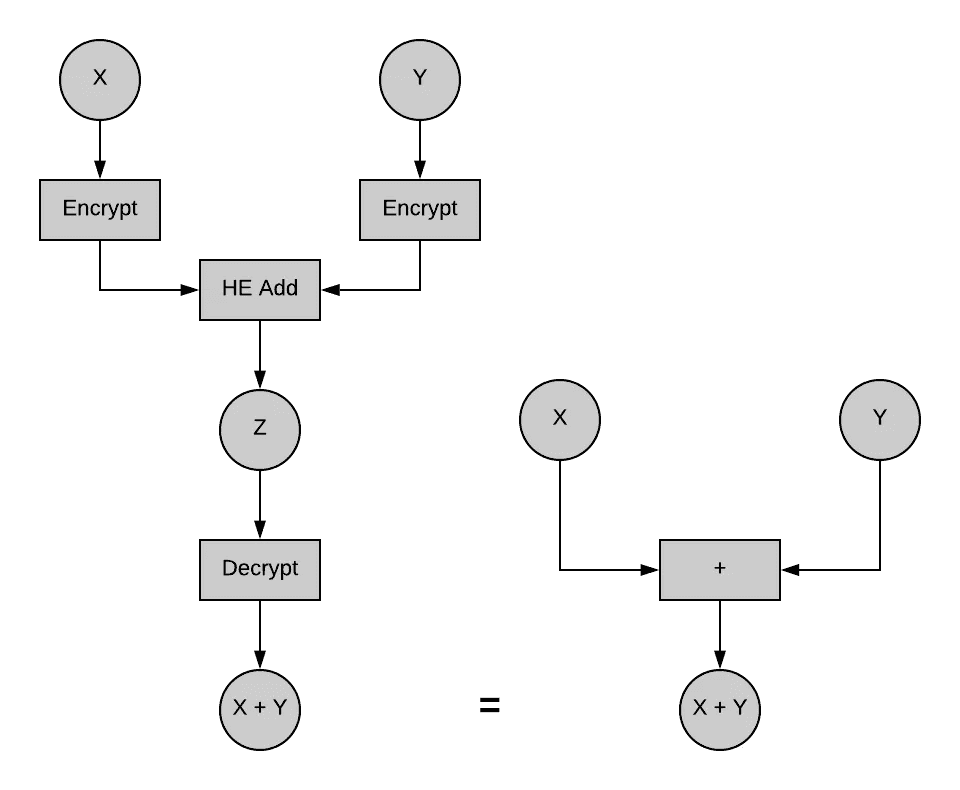
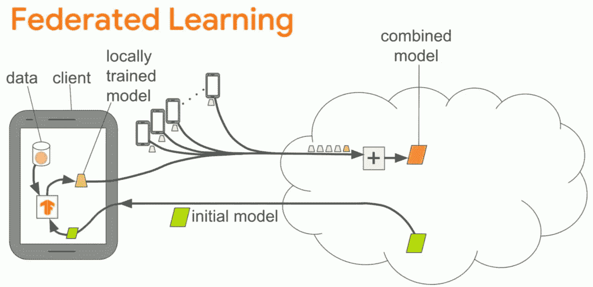

# 安全和私有的机器学习

> 原文：<https://levelup.gitconnected.com/secure-and-private-machine-learning-5c9e1115e4af>

## 反思

## 为什么它是相关的，以及为什么您应该关心联合学习、差分隐私和同态加密

Djuradj Vujcic 不得擅自闯入

基于机器学习的技术在历史上并不是在考虑安全和隐私的情况下发展起来的。他们一直都很奢侈，也很让步，因为他们认为看数据而看不到数据是一种挑战。然而，随着技术在决策系统、核心操作和更微妙的应用中的发展，这种情况需要改变。

您可以从两个维度来看待机器学习中的安全性，这两个维度也发生在不同的时间:

*   如何**保护您的机器学习模型在**上训练的数据:这发生在训练的时候。
*   如何**保护您的机器学习模型从数据中学习到的知识**:这发生在推理的时候。

# **保护您的机器学习模型在**上训练过的数据

即使您的数据安全地存储在加密的数据存储中(静态加密),并且您使用安全协议(传输时加密)将数据从一个地方移动到另一个地方，也总会有这样的时刻:比如说，训练一个模型。使用数据进行操作有以下两个含义:

1.  任何计算都必须在计算进行之前移除这些加密层。
2.  任何计算都将发生在您的计算资源所在的任何地方。

## 1-解密您的数据

机器学习模型不能对加密数据进行操作(继续阅读以了解此规则是否有例外情况)。因此，在进行计算之前，需要移除这些加密层。即使您运行在像[保密计算](https://venturebeat.com/2019/08/21/intel-google-microsoft-and-others-launch-confidential-computing-consortium-for-data-security/)这样的专用硬件上，情况也是如此，该软件也被称为飞地，在那里数据受到保护，不会受到外界的攻击，但不会受到您自己的攻击。当这些数据恰好是合理的时，通常会对其进行屏蔽，以删除任何受保护的信息或 PII 信息。[市场上有多种类似的技术](https://www.gartner.com/reviews/market/data-masking)。其中一些协议甚至允许敏感数据一旦离开数据存储就被屏蔽掉。屏蔽可以隐藏部分信息，将其更改为其他内容，也可以使其模糊。[这种掩蔽必须是确定性的](https://chrisunwin.home.blog/tag/deterministic-masking/)(或接近)并保留原始数据分布，这样机器学习模型即使不知道实际值是什么，仍然可以从中学习。

然而，有了足够多的数据，仍然存在泄漏一些信息的风险。接下来的问题是:**我们能在完全不解密数据的情况下训练一个 ML 模型吗？**答案是**是的:**

## 同态加密

[同态加密并不新鲜](https://researcher.watson.ibm.com/researcher/view_group.php?id=1820)，但直到现在[它才变得实用](https://homomorphicencryption.org/)这要归功于计算速度和算法效率的进步。它基本上是一种加密技术，允许你对加密数据进行计算。通常，如果你想对 A + B 求和，而 A 和 B 恰好被加密，那么你必须对 A 解密，对 B 解密，对 A 和 B 求和以生成 C，最后对 C 加密。另一方面，同态加密允许你对 A 加密，B 加密，然后对它们求和以直接生成加密的 C。由于机器学习模型建立在数学运算的基础上，这是一个很有前途的想法。

图片由阿尤布·贝奈萨提供——推特:[@ yo uben 11](https://twitter.com/y0uben11)

通过使用这种技术，机器学习算法可以在或**上进行**训练，应用于**加密数据([这种特定技术被称为 cryptones](https://www.microsoft.com/en-us/research/publication/cryptonets-applying-neural-networks-to-encrypted-data-with-high-throughput-and-accuracy/))，执行计算以最终将加密结果返回给请求者，然后请求者可以使用原始加密密钥(从未公开共享)来解密返回的数据并获得结果。强大吧？是的，但是不要太兴奋。**

同态加密不是一种通用技术:只有一些计算可以用这种方式执行。[这也是以性能价格为代价的](https://www.microsoft.com/en-us/research/wp-content/uploads/2016/04/CryptonetsTechReport.pdf)，因此对未加密数据执行已经非常昂贵的计算现在几乎是不可行的。最重要的是，它的密码模式产生的加密数据比其他加密机制大得多。考虑到这一点，在大型数据存储上广泛采用这种技术可能没有意义。相反，它受制于有意义的用例，在这些用例中，严格的隐私要求禁止未加密的计算，但是计算本身足够简单。

因此，考虑到真实世界模型的复杂计算，在加密数据上训练 ML 模型对于真实世界模型来说仍然不太实际。然而，[将您的模型转换为密码网络，并在加密数据的基础上运行这些模型](https://www.microsoft.com/en-us/research/publication/cryptonets-applying-neural-networks-to-encrypted-data-with-high-throughput-and-accuracy/)是您可以考虑的事情，尤其是如果您能够负担得起大约 5-10 秒的时间来取回您的预测。

**图书馆？**

你会发现同态加密现在已经在几个项目中实现了。[微软海豹突击队](https://github.com/Microsoft/SEAL)是一个低级加密库，提供了一个用于加密和计算加密数据的 API。 [tf-encrypted](https://tf-encrypted.io/) 是 TensorFlow 中加密深度学习的框架。 [PySyft 是另一个运行在 PyTorch](https://arxiv.org/abs/1811.04017) 之上的库，它实现了几种用于私有深度学习的技术，其中通过使用[时态](https://github.com/OpenMined/TenSEAL)支持同态加密。英特尔的 [HE-Transformer](https://github.com/IntelAI/he-transformer) 是用于 [nGraph](https://github.com/IntelAI/ngraph) (英特尔的神经网络编译器)的加密数据计算后端，它与 TensorFlow 等各种框架集成在一起，但他们声称可以提高性能。此外，像加速加密库 [cuHE](https://eprint.iacr.org/2015/818.pdf) 这样的项目，声称在各种加密任务上的速度比以前的实现提高了 12 到 50 倍。

## 2 —将您的数据移动到您的计算位置

大多数时候，机器学习算法需要从一个集中的位置一次性查看所有数据。您的数据集将位于数据湖或数据库中的文件上，但它们通常都在一起。但是，如果不允许您从原始位置移动数据，该怎么办呢？这可能是手机应用程序的情况，其中数据的所有者不希望您将他们的数据上传到云中，或者当多个不同的数据所有者希望参与协作计算时**。我们能否在不要求实际数据离开数据所有者的前提下训练一个集中的模型？答案是**是**:**

## 联合学习

联合学习是一种技术，其寻求在持有数据样本的客户端的分散网络上训练集中的 ML 模型，而不要求它们交换这样的数据。有几个选项可以实现这一点，但通常会使用随机梯度下降(SGD)在本地数据样本上训练本地模型，然后以一定的频率在模型之间交换学习到的权重，以生成全局模型。如何将这些权重合并到模型中取决于实现和特定的用例。

【TensorFlow Dev Summit 2019 演讲

[TensorFlow Federated](https://www.tensorflow.org/federated) 是一个开源框架，用于机器学习和其他对分散数据的计算。 [tf 加密的](https://tf-encrypted.io/) (TensorFlow 和 Keras)和 [PySyf](https://github.com/OpenMined/PySyft) (PyTorch)也有利用这种技术的联邦学习特性。

然而，天下没有免费的午餐。联合学习有其自身的局限性，包括它可能在用 SGD 训练的模型中引入偏差，因为它们可能违反随机批次的要求。

# **保护你的机器学习模型学到的知识**

如果数据上有任何价值(而且你做得很好)，那个价值已经被你的机器学习模型提取出来了。那么，你应该保护它。

## 隶属推断

到目前为止，机器学习逆向工程最常见的形式被称为成员推理攻击，攻击者使用单个数据点或几个数据点来确定它是否属于模型训练的数据集。这可能看起来无害，但攻击者可以利用这一点来提取你的模型用来预测结果的特征，甚至重新生成你的一些训练数据。这种情况在大型模型中更为常见，因为它们的容量很大，它们的学习表示可能会对至少一些训练数据的细节进行编码。

## 模型反演

更复杂的数据提取攻击采用生成式对抗网络(GANs)来学习模型的数据分布。它们经过训练，通过与模型交互来生成与原始训练数据集中的样本非常相似的样本，从而重建原始数据集。

虽然这些攻击只需要“黑盒子”访问一个经过训练的模型(即，通过输入和输出与模型进行交互)，但实际上您将需要大量的交互，直到它们成功完成任务。然而，完全了解训练机制并能访问模型参数[的攻击者尤其危险](https://www.cs.cmu.edu/~mfredrik/papers/fjr2015ccs.pdf)，因为他们有更大的变化来击败你。你可能认为这样的设置对你来说很难发生，但在移动应用中这很常见，你通常在手机中本地打包和部署你的模型以改善延迟。

**我们如何缓解这类问题？**

## 差异隐私

直观地说，如果观察者看到算法的输出时不能判断计算中是否使用了特定个人的信息，那么算法可以被认为是差分私有的。有不同的方法来实现这一特性，但大多数都是基于 SGD 的修改版本，称为[差分私有随机梯度下降](https://ieeexplore.ieee.org/document/6736861/) (DP-SGD)。这个版本在训练过程中注入了少量的噪声，使得恶意参与者很难从训练的模型中提取原始样本。DP-SGD 将由训练数据示例引起的多个更新平均在一起，剪辑这些更新中的每一个以限制它们对训练过程的影响程度，并向最终平均值添加噪声。通过这样做，它防止了罕见细节的记忆，并在一定程度上确保了训练数据的隐私保护。例如，开源的 TensorFlow Privacy 库基于差分隐私的原则运行。

另一种方法是使用称为 [*的算法家族，教师集合的私有聚集*](https://arxiv.org/abs/1610.05755) (PATE)。这些算法使用由不相交的数据子集训练的多个模型，这些数据子集然后被用作“学生”模型的“教师”。学生学习预测所有教师通过嘈杂投票选择的输出。由于学生不能直接访问教师模型的底层数据或参数，他们不能依赖数据本身，因此不能提供抽象和保护层。

当然，差别隐私也不是完美的。注入到底层数据、输入、输出或参数中的任何噪声都会影响整个模型的性能[，在某些情况下可能会特别高](http://www.tdp.cat/issues16/tdp.a289a17.pdf)。

## 合奏

像 PATE 一样，集成学习是一种已经被证明可以抵御敌对攻击的技术。由于它们结合了多种学习方法，提高了系统的鲁棒性，因为攻击者不能依赖于任何特定的方法。例如，大多数垃圾邮件检测器都是以这种方式实现的，即在分类发生之前组合多个检测系统。

# 结论？关心它

和往常一样，技术不是中性的，它的存在创造了新的机遇和挑战。我试图在这里提高你的意识，为什么你应该关心，哪些是风险，你有什么办法来处理它。因为，如果你不这样做，就会有人利用它并从中获利。

然而(我保证有一天我会停止使用这个词)，**这里还有更多的安全方面没有被涵盖**，像**当攻击者试图愚弄你而不是偷你的东西**。这一领域的技术，如数据中毒、对抗性例子、反馈武器化和模型窃取攻击，寻求让您的模型按照攻击者想要的方式运行。通常，从你的模型选择中获利。在我的下一篇文章中，我将会介绍这种攻击是由什么组成的，以及如何消除它们。敬请关注。