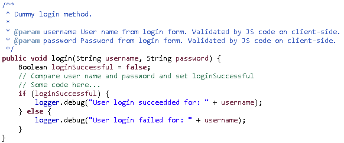
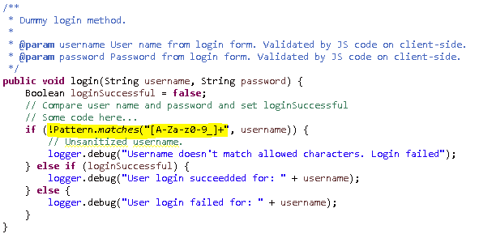
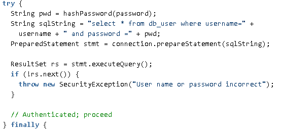
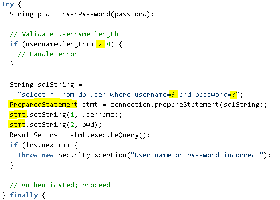
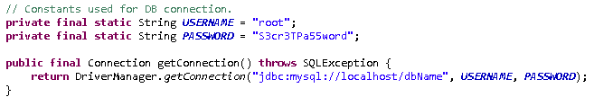
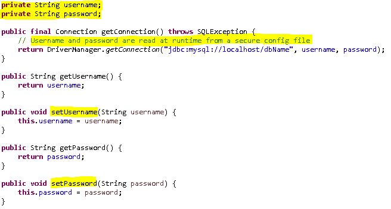

# 安全编码标准

> 原文：<https://levelup.gitconnected.com/secure-coding-standards-114be27e1253>

## 通过学习安全编码标准，让您的软件开发技能更上一层楼。

网络安全，许可: [*知识共享零*](https://en.wikipedia.org/wiki/Creative_Commons_license#Zero_/_public_domain)

# 介绍

**安全编码**是一种开发计算机软件的实践，它可以防止安全漏洞的意外引入。

缺陷、错误和逻辑缺陷一直是常见的被利用的软件漏洞的主要原因。

通过识别导致这些错误的不安全编码实践，并对开发人员进行安全替代培训，组织可以采取主动措施，在部署之前帮助显著减少或消除软件中的漏洞。

# 编码标准与安全编码标准

**编码标准**指的是如何格式化源代码、如何命名变量、函数(方法)等通用的语言特定规则。

因此，编码标准包括可以通过使用 IDE (VS Code，Eclipse)或插件(linters，code formatters)自动执行的编码风格，它们将格式化源代码。

编码标准(样式)定义了命名约定，例如:大小写、大写字母等。缩进、括号、空白以及项目结构(文件和文件夹)。

**安全编码标准**是一套关于如何编写安全代码的指南。通过遵循这些标准，我们可以减少最常见的软件漏洞。

在 [OWASP 安全编码实践-快速参考指南](https://owasp.org/www-project-secure-coding-practices-quick-reference-guide/migrated_content)中记录了一组流行且非常好的实践。其中包括:

*   输入验证
*   输出编码
*   认证和密码管理
*   会话管理
*   访问控制
*   加密实践
*   错误处理和记录
*   数据保护
*   通信安全
*   系统配置
*   数据库安全
*   文件管理
*   内存管理
*   一般编码实践

另一个很棒的资源是[SEI CERT Oracle Coding Standard for Java](https://wiki.sei.cmu.edu/confluence/display/java/SEI+CERT+Oracle+Coding+Standard+for+Java)。

以下标准*不能*保证解决*所有*软件漏洞，但是它能够实现可接受的良好结果。

# 例子

## 输入验证示例

这个代码有什么问题？

示例，不安全的登录方法

基于 [IDS03-J 的示例。不要记录未经确认的用户输入](https://wiki.sei.cmu.edu/confluence/display/java/IDS03-J.+Do+not+log+unsanitized+user+input)

我们可以看到，在这种情况下，攻击者可以尝试插入不需要的字符(甚至是代码),我们会创建原始的(未组织的)输入日志。攻击者可以轻易地在客户端禁用 JS 代码验证！

## 解决办法

*   不要记录未经整理的用户输入
*   在客户端和**服务器端**进行验证。永远不要相信客户！

具有净化输入的部分解决方案

这段代码还可以改进——在入口点清理用户名和密码！

模式允许任意数量的字符(模式末尾的加号)——这应该更严格！

为了说明将所有内容都写入日志的意义以及这会如何损害应用程序，对示例进行了简化。考虑注入控制字符——新行等。或者向日志中写入无限的数据并耗尽存储空间等等。

## 数据库示例

这个代码有什么问题？我们使用了`PreparedStatment`来减轻 SQL 的影响，对吗？

PreparedStatement 示例

## 解决办法

*   SQL 注入—正确使用 PreparedStatement】仍以不安全的方式构建！
*   用户名长度的附加检查

使用带参数的预准备语句(参数化查询)。额外检查用户名长度—也可以使用模式。参见前面的登录方法示例！

## 用户名和密码示例

这个代码有什么问题？

用户名和密码示例

## 解决办法

*   不要对敏感信息进行硬编码

用户名和密码解决方案

# 参考

以下是一些很好的安全编码标准资源:

## [OWASP 安全编码实践-快速参考指南](https://owasp.org/www-project-secure-coding-practices-quick-reference-guide/migrated_content)

*   不特定于语言
*   一组分类的**清单**

## [Java 编码指南](https://wiki.sei.cmu.edu/confluence/display/java/Java+Coding+Guidelines)

*   惊喜，惊喜… *Java* 具体指南
*   **代码示例**
*   规则和建议集

## [Java SE 的安全编码指南](https://www.oracle.com/java/technologies/javase/seccodeguide.html)

*   带有**代码示例**的指南集