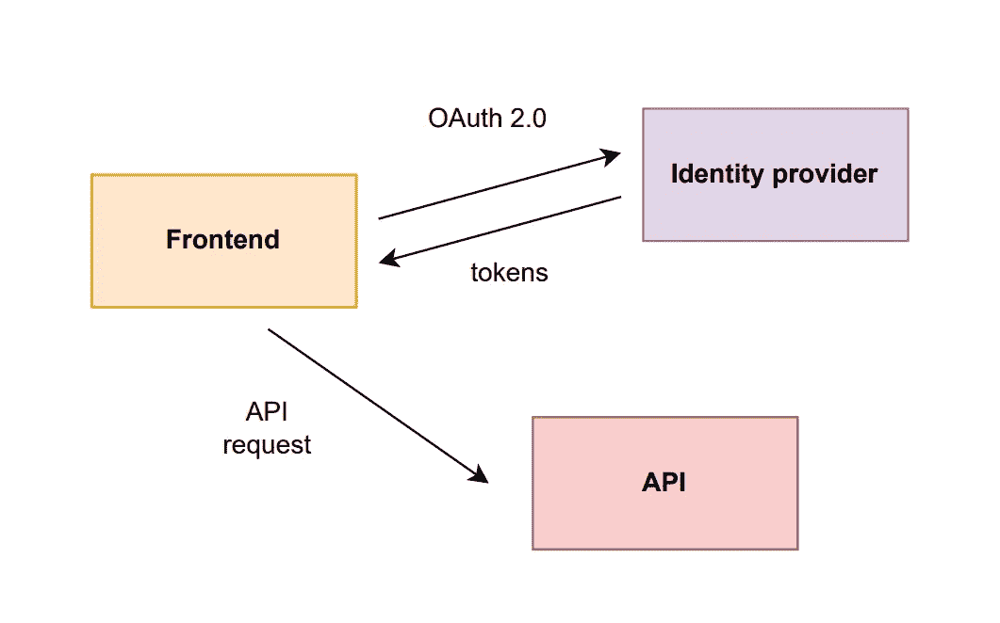
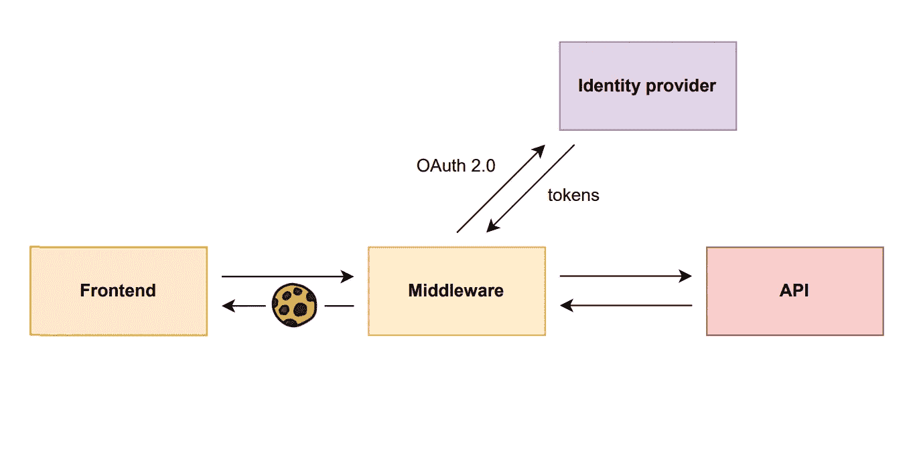
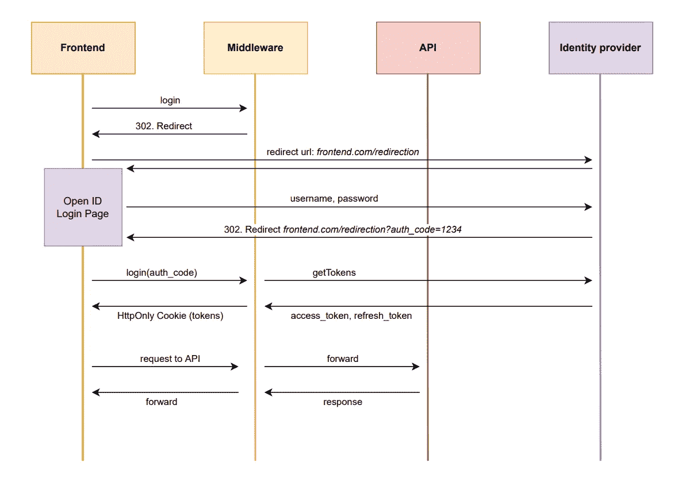
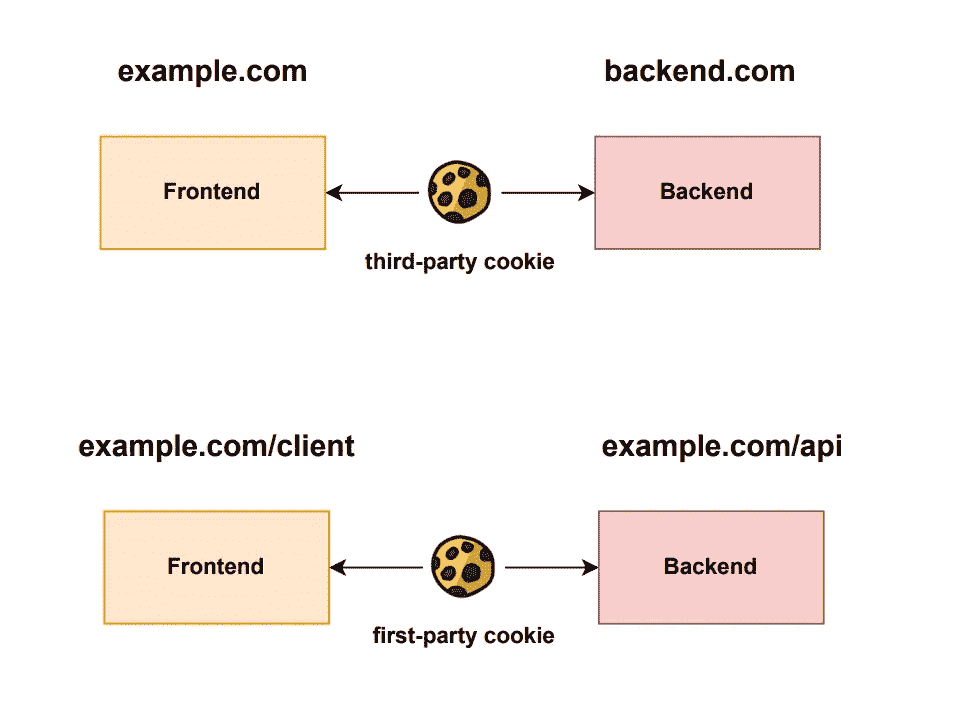
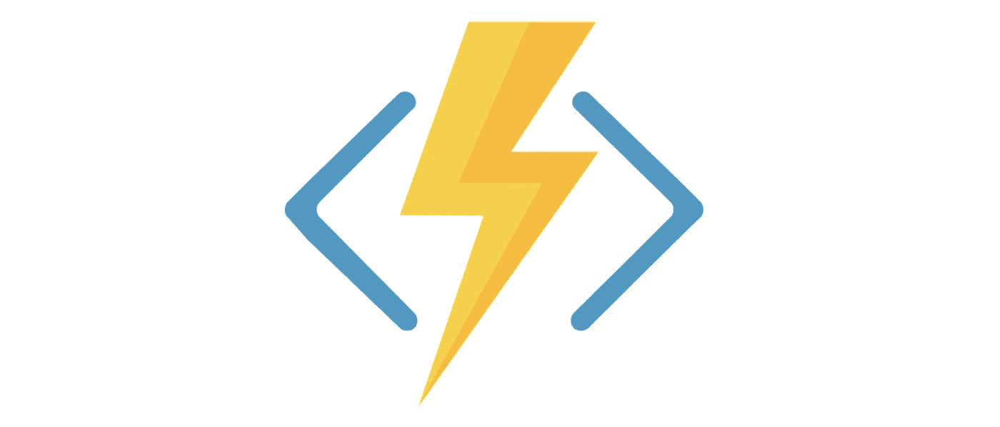

# 停止在前端进行令牌认证

> 原文：<https://levelup.gitconnected.com/secure-frontend-authorization-67ae11953723>

## 为单页应用程序构建安全认证过程的现代方法。

照片由[阿德南·汗](https://unsplash.com/@adnan10?utm_source=medium&utm_medium=referral)在 [Unsplash](https://unsplash.com?utm_source=medium&utm_medium=referral) 上拍摄

在这篇与框架无关的文章中，我将向您介绍一种为 SPA 构建安全认证过程的现代方法。如果您已经熟悉 JWT 令牌和 OAuth 2.0，那么您很可能会从阅读本文中受益，因为本文解释了为什么不应该在浏览器中存储令牌，并将向您展示一种结合 cookies 和 JWT 令牌来创建更安全的应用程序的现代方法。

# OAuth 2.0

有很多很好的文章完美地解释了 OAuth 2.0 的细节，所以我将重点向您提供 OAuth 2.0 的一个非常简单的概述。因此，原则上 OAuth 2.0 是为任何类型的应用程序创建安全认证流的事实上的行业标准。基本上，客户端向身份验证提供者发送一个登录请求，然后身份验证提供者发送一个 302 重定向，这将触发浏览器重定向到身份验证提供者提供的登录页面。登录后，认证提供者重定向回客户端触发登录过程的原始路由，此外还发送一个**访问令牌**和一个**刷新令牌**，它们在使用**承载认证**(事实标准)时用于认证。

强简化过程

**访问令牌**作为授权参数被附加在每个 HTTP 请求头中，以便 API 可以向认证提供者验证令牌是否有效。通常，访问令牌具有较短的到期时间，有时甚至只有几分钟，因为这允许更好的安全性，使得如果恶意方不能使用访问令牌足够长的时间来进行许多恶意请求。

**当当前访问令牌过期时，客户端使用刷新令牌**从身份验证提供者处获取新的访问令牌。

这两个令牌都被认为是一个 JWT (JSON Web 令牌),它基本上是一个 JSON 对象，包含标准数据，但也包含特定于应用程序的数据。

OAuth 2.0 非常方便，允许轻松集成第三方身份提供商，如谷歌身份、脸书、微软、Azure Active Directory 等。因此，我们触发登录过程，只需在本地存储中存储访问令牌和刷新令牌，然后将令牌附加到 HTTP 头。就这么简单。**但是……**

# 跨站点脚本

但愿没有这个叫跨站脚本的烦人东西，简称: **XSS** 。如果我们关心安全和防御 XSS，我们就不能简单地将令牌存储在本地存储中。

XSS 是一种黑客技术，用于在运行时将自定义 JavaScript 注入 DOM。例如，黑客可以在输入字段中注入 JavaScript 代码，方法是用“-”符号对输入进行转义，然后执行定制的 JavaScript 代码，而恶意攻击者可以访问每个 JavaScript API。因此，攻击者可以很容易地从本地存储器中读取条目，并获得手中的令牌。从这一点上，你只能希望最好的，同时希望你已经把更多的努力放在第一位的应用程序。那么解决办法是什么呢？

# 令牌处理程序模式

让我们回到过去，讨论一下前端和后端应用程序之间的一种更老的认证方法。在过去，我们没有那些花哨的令牌，但是我们使用简单的 cookies 来验证用户是否登录。当时，前端向后端发送用户名和密码，后端创建一个类似授权状态的 cookie，并将其设置在 HTTP 头中，前端将总是在每个请求的 HTTP 头中发送 cookie。

让我们回到我们的例子，这里的问题是我们在客户端存储令牌。遗憾的是，我们无法将令牌安全地存储在客户机中，因为我们不希望 JavaScript 访问它们。绕过这个问题的唯一方法是创建一个专用的后端来处理登录。

简化过程

前端只与一个**中间件**通信，该中间件处理认证/授权并充当 API 和前端之间的代理。中间件触发一个 **HTTP 302 重定向**，这将自动迫使浏览器重定向到身份提供者提供的登录页面。登录后，身份提供者重定向到一个 **redirect_url** ，它必须在原始重定向请求中指定。redirect_url 指向前端的专用路由，而身份提供者将向查询参数添加一个**认证代码**。然后，前端将验证码发送到后端，后端使用验证码生成令牌。这些令牌将被存储在一个 HTTP-only cookie 中，该 cookie 在对前端的响应的 HTTP 头中设置。然后，前端将这个 cookie 存储在浏览器中，并通过将参数**credentials:“include”**添加到初始请求中。

详细的登录工作流程

但是 **HttpOnly** 到底是什么意思，为什么这比在客户端存储令牌更安全？

# 仅限 HTTP 的 Cookies

为什么将令牌存储在 cookie 中比存储在本地存储中更安全？默认情况下不是，因为 JavaScript API 也可以通过访问 **document.cookie** 轻松读取所有 cookie。因此，现在 XSS 又成了一个问题。

但幸运的是，我们可以使用所谓的 **HTTP 专用 cookie**，JavaScript API 无法访问它们。尽管它们在浏览器中的存储方式与普通 cookie 完全相同，但它们只能附加到 HTTP 请求中。例如，您可以从 fetch API 中设置选项 **credentials:'include'** ,以便在请求头中包含所有 cookie，包括只包含 HTTP 的 cookie。这样，XSS 攻击者就不可能获得 HTTP-only cookie，因此也就无法获得令牌。

# 第一方与第三方 Cookies

我们还需要讨论一件事——第三方和第一方 cookies 之间的区别。在另一个域上创建的 cookie 始终被视为第三方 cookie，而在托管前端的域上创建的 cookie 则被视为第一方 cookie。

后端托管在不同的域上并不罕见，尤其是当前端是单页面应用程序(SPA)时。在这种情况下，另一个 XSS 攻击仍然是可能的，因为攻击者可以将执行 HTTP 请求的代码注入到他自己的 API 中，并包括 cookie，这样他的 API 将读取 HTTP-only cookie。

幸运的是，还有一种方法可以防止这种情况，通过制作第一方 cookie 并设置头参数 **SameSite='strict'** ，这样 cookie 就只发送给目标相同域的请求。我们只需要在同一个域上部署中间件。

# 无服务器令牌处理程序

虽然这不是必需的，但这是使用**无服务器计算**的完美场景，而不是为中间件创建专用的 API。

无服务器计算是一种云服务，允许开发和部署简单的无状态功能，而不必考虑基础设施和服务器。虽然这个名字可能会引起误解，但是这些功能仍然会在云计算提供商托管的服务器上运行，但是我们不必考虑服务器。它们可以根据需要扩展，也可以缩小，这样您只需为实际使用付费。

Azure Functions 徽标

我们可以创建两个简单的函数，使得整个 Web API 只用于不必要的中间件。第一个函数是登录函数，第二个函数是代理函数，它总是将请求重定向到 API，并在头中附加访问令牌。

# 结论

坦率地说，没有一个系统是绝对安全的。但是这个假设不应该阻止我们创建更加安全的应用程序。这种方法可能阻止 XSS 攻击能够检索 JWT 令牌，但引入了 CSRF 的风险，这基本上是一种攻击者直接使用其 cookie 从客户端发送请求的攻击。没有一个解决方案是完美的，有它的优点和缺点，但是作为软件工程师，我们的工作就是为我们的商业案例制定正确的解决方案。

**如果你喜欢这篇文章，并且想在 Medium 上无限阅读，你可以通过我的推荐链接加入 Medium:**

 [## 通过我的推荐链接-斯特凡·哈斯加入媒体

### 作为一个媒体会员，你的会员费的一部分会给你阅读的作家，你可以完全接触到每一个故事…

medium.com](https://medium.com/@stefan.haas.privat/membership) 

# **参考文献**

*   **OAuth 2.0。维基百科。**[https://en.wikipedia.org/wiki/OAuth#OAuth_2.0](https://en.wikipedia.org/wiki/OAuth#OAuth_2.0)
*   **XSS。维基百科。**[https://en.wikipedia.org/wiki/Cross-site_scripting](https://en.wikipedia.org/wiki/Cross-site_scripting)
*   **JWT。维基百科。**[https://en.wikipedia.org/wiki/JSON_Web_Token](https://en.wikipedia.org/wiki/JSON_Web_Token)
*   **令牌处理程序模式。好奇。**[https://curity . io/resources/learn/token-handler-spa-example/](https://curity.io/resources/learn/token-handler-spa-example/)
*   **HttpOnly Cookie。Owasp.org**[https://owasp.org/www-community/HttpOnly](https://owasp.org/www-community/HttpOnly)
*   **无服务器计算。维基百科。**[https://en.wikipedia.org/wiki/Serverless_computing](https://en.wikipedia.org/wiki/Serverless_computing)
*   CSRF。维基百科。[https://en.wikipedia.org/wiki/Cross-site_request_forgery](https://en.wikipedia.org/wiki/Cross-site_request_forgery)