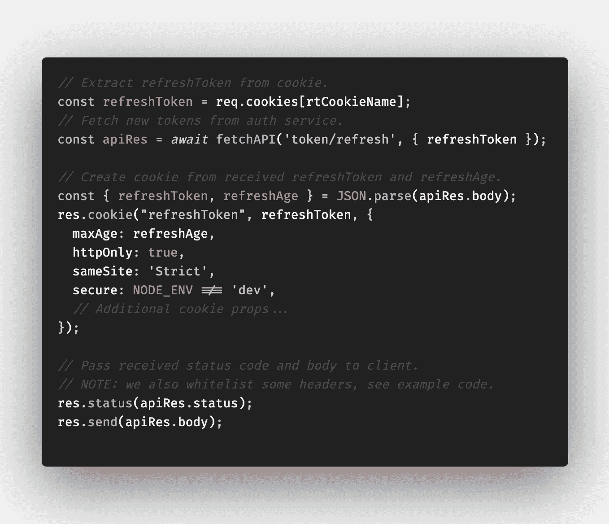

# 现代应用的 JWT 架构

> 原文：<https://levelup.gitconnected.com/secure-jwts-with-backend-for-frontend-9b7611ad2afb>

## 用后端保护前端的 jwt

身份验证服务、GraphQL API 和 Web 客户端之间前端的后端概述。

我和我的团队开始在 IBM Watson Media 开发基于 React 的 web 应用程序。我们选择了 [Next.js](https://nextjs.org/) 作为一个中端框架，为开箱即用的生产应用程序提供了一个出色的构建管道。我们最近面临两个难以解决的问题:

1.  以安全的方式使用 jwt 进行身份验证。
2.  构建我们的 Next.js 应用程序一次，并通过运行时配置在不同的环境( *dev/staging/beta/prod* )中重用它。建议为特定环境构建(在构建时传递配置)，但是我们希望避免为每个应用程序版本构建四个映像。

幸运的是，有一篇关于 JWT 最佳实践的精彩文章。它建议在 HTTP 主体中接收访问令牌，在一个`HttpOnly`，`secure` cookie 中刷新令牌，酷！Cookie 处理可以在认证服务中实现，但是 cookie 只在浏览器中可用。非基于浏览器的客户机不想摆弄 cookies，在 HTTP 主体中接收和发送这两个令牌对它们来说要简单得多。此外，我们希望避免处理`CORS`策略和`CSRF tokens`来减轻认证服务的`CSRF`攻击面(在 HTTP 主体中发送令牌而不是 cookies =没有`CSRF`攻击面)。

因此，我们为我们的前端*(从现在开始的 BFF)*引入了一个处理 cookies 的后端。Next.js 支持自定义服务器，所以非常简单！这是同一个域上的同一个服务，服务于我们的静态 React web 应用程序，因此我们不需要允许`CORS` ( `SOP`就足够了)，我们可以为我们的 cookie 启用`SameSite=strict`属性。如果用户的浏览器不支持`SameSite` cookie 属性，恶意站点仍然可以发送请求(因此旋转或清除`refreshToken`，但是无法从 HTTP 响应中读取返回的`accessToken`和`refreshToken`(因为没有定义`CORS`头)。

带有 API 处理程序和 NEXT 的 Express server。JS 作为后备。

我们创建一个`express`服务器，附加 API 处理程序和 Next.js 作为后备处理程序。这实际上解决了我们正在努力解决的两个问题。

1.  我们有安全的 JWT 处理。认证服务不需要处理 cookies，我们的 BFF 需要！
2.  所有 API 调用都在我们站点的域中代理。React 可以调用相对 API URLs，运行时可配置的 BFF 会将其代理给适当的服务(这些实际上是 Kubernetes 集群中的微服务，因此开销非常小)。

# 注册

节点上的代理/API/v1/登录。JS BFF。

让我解释一下认证流程:

1.  我们的 **web 客户端**通过相对`/api/v1/login`路径将 HTTP 主体中的凭证发送给我们的 **BFF** 。
2.  BFF 将该请求转发给**授权服务**而不做修改。
3.  **Auth service** 在 HTTP 正文中用`accessToken`、`refreshToken`和`refreshAge`响应。
4.  **BFF** 从年龄为`refreshAge`的`refreshToken`创建一个`HttpOnly` cookie。然后它响应 **web 客户端**设置这个 cookie 并在 HTTP 主体中返回`accessToken`。

将这种想法转化为代码，我们在登录处理程序中得到类似的东西:

BFF 的/API/v1/登录处理程序实现概要。

# GraphQL API

节点上的代理/api/v1/graphql。JS BFF。

代理一个 GraphQL 请求非常简单，我们不加修改就把它转发给适当的 API。不直接进入 GraphqlQL API 的唯一原因是我上面提到的 Next.js 的运行时配置问题(我们不能在运行时传递 API 的 URL，只能在构建时传递)。

相应代码的摘要:

BFF 的/api/v1/graphql 处理程序实现概要。

# 令牌刷新

节点上的代理/API/v1/刷新。JS BFF。

刷新令牌流类似于身份验证流:

1.  我们的 **web 客户端**通过相对`/api/v1/token/refresh`路径将`refreshToken`通过`HttpOnly` cookie 发送到我们的 **BFF** 。
2.  **BFF** 从 cookie 中提取`refreshToken`并转发给 HTTP 主体中的 **Auth 服务**。
3.  **认证服务**在 HTTP 主体中用新的`accessToken`、`refreshToken`和`refreshAge`进行响应。
4.  **BFF** 从年龄为`refreshAge`的`refreshToken`创建一个`HttpOnly` cookie。然后它响应 **web 客户端**设置这个 cookie 并在 HTTP 主体中返回`accessToken`。

相应代码的摘要:

BFF 的/api/v1/token/refresh 处理程序实现概要。

# 令牌失效

节点上的代理/api/v1/invalidate。JS BFF。

auth 服务将`refreshToken`保存在存储中，供一次性使用和可能的失效。因此，我们必须从 Auth service 的`refreshToken`存储中删除它，并从浏览器 cookie 中清除它(无论如何，它都是无效的，但我们最好完全删除它)。

1.  我们的 **web 客户端**通过`HttpOnly` cookie 发送`refreshToken`到我们的 **BFF** 通过相对`/api/v1/invalidate`路径。
2.  **BFF** 从 cookie 中提取`refreshToken`并转发给 HTTP 主体中的 **Auth service** 。
3.  **授权服务**从商店中清除`refreshToken`。
4.  **BFF** 从浏览器 cookie 中清除`refreshToken`。

相应代码的摘要:

BFF 的/api/v1/token/invalidate 处理程序实现概要。

# 结论

前端的专用后端给了你客户端很大的灵活性。到目前为止，我很喜欢这个设置，请在评论中告诉我你对它的看法！

另外，如果你喜欢这篇文章，请考虑分享它。

你可以在这里找到 BFF 的例子来源。