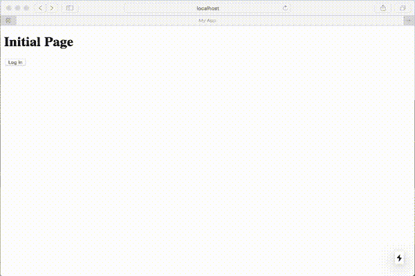

# 使用 Auth0 和 TypeScript 验证和保护 Next.js 应用程序用户

> 原文：<https://levelup.gitconnected.com/secure-nextjs-app-users-with-auth0-and-typescript-3b0a6ac3a163>

*本文是一系列文章中的第一篇，这些文章旨在帮助前端开发人员使用我日常使用的工具构建应用程序，并取得了相当大的成功。*


来自[https://www.pexels.com/](https://www.pexels.com/)

作为构建 web 应用程序的前端工程师，您的应用程序可能需要通过对一些用户资源的认证访问来提供安全性。这通常以任何人都可以访问的登录页面和其他用户资源页面的形式出现，这些页面应该是安全的，只有经过身份验证的用户才能访问。

auth 0([https://auth0.com/](https://auth0.com/))是领先的认证和授权服务之一。它支持 B2C，B2B 和 B2E 认证模式，所以你可以认证你的用户，无论他们来自哪里。

next . js([https://nextjs.org/](https://nextjs.org/))是一个零配置、完全可扩展、生产就绪的 React 框架。它无缝处理 SSR(服务器端渲染)应用程序，但也支持 SSG(静态站点生成器)，这是我们在这一系列帖子中感兴趣的。

Auth0 在 Next 网站上的例子主要集中在 SSR 应用上。所以我们将使用其中的一些，并为静态站点添加我们自己的自定义代码。

# 第一步。带有类型脚本的基本 Next.js 应用程序

让我们从一个简单的下一个应用开始。我们需要:

*   创建文件夹
*   初始化我们的项目
*   安装依赖项
*   创建一个`src/pages`文件夹
*   初始化 TypeScript 配置

```
$ mkdir my-app
$ cd my-app
$ yarn init -y
$ yarn add next react react-dom
$ mkdir -p src/pages
$ touch tsconfig.json
```

向`package.json`文件添加几个脚本:

```
{
  "name": "my-app",
  "version": "1.0.0",
  "main": "index.js",
  "license": "MIT",
  **"scripts": {
    "dev": "next",
    "build": "next build",
    "export": "next export"
  },**
  "dependencies": {
    "next": "^9.1.7",
    "react": "^16.12.0",
    "react-dom": "^16.12.0"
  }
}
```

…和一个默认名称为`index.tsx`的初始默认页面(使用 TypeScript)

src/pages/index.tsx

一旦这些部分就绪，我们就可以安装 TypeScript 依赖项了:

```
$ yarn add --dev **typescript @types/react @types/node**
```

并运行我们的应用程序:

```
$ yarn dev
yarn run v1.21.1
$ next
[ wait ]  starting the development server ...
[ info ]  waiting on [http://localhost:3000](http://localhost:3000) ...
```

打开浏览器到 [http://localhost:3000](http://localhost:3000) 会给我们:


初始页面

现在让我们添加第二页，这一页将被保护(最终)。

src/pages/dashboard.tsx

我们可以在[http://localhost:3000/dashboard](http://localhost:3000/dashboard)访问我们新创建的页面


仪表板(即将安装)

# 第二步。Auth0 设置

去[https://auth0.com](https://auth0.com)用邮箱和密码注册一个新账号，然后通过邮箱验证你的账号。

创建一个应用并选择**单页 Web 应用**。


创建 SPA

创建后，更改以下设置:

**允许的回调 URL**:[http://localhost:3000/Callback](http://localhost:3000/callback)auth 0 进程将在成功和失败事件时重定向到此页面。

**允许的 Web 来源**:[http://localhost:3000](http://localhost:3000)允许 Auth0 只接受来自你的应用程序域的请求。

**允许的注销 URL**:[http://localhost:3000](http://localhost:3000)一旦用户注销，Auth0 会将他们重定向到此 URL。

我们还需要来自 Auth0 应用仪表板的以下信息:

*   **域**
*   **客户 ID**

## Auth0 依赖关系

通过以下方式安装 Auth0 NPM 依赖项:

```
$ yarn add **@auth0/auth0-spa-js**
```

*   是 Auth0 的用于单页面应用的 JavaScript SDK

作为 Auth0 文档的一部分，他们推荐 React Hooks 来更好地封装 Auth0 SPA 的功能，如:登录、注销、获取用户、检查是否通过身份验证等。

我复制了相同的代码，并将其转换为 TypeScript，支持 Next.js 页面类型和高阶函数(HOC ),以保护需要经过身份验证的用户的页面。

src/lib/auth0-spa.tsx

# 第三步。与 Next 集成

在 Next.js 应用程序中集成 Auth0 助手钩子的一个好方法是在`_app.tsx`文件中添加`Auth0Provider`。

这个`_app.tsx`文件是使用 React 上下文 API 的应用程序包装器。一个单独的组件，每次我们的应用程序被加载到浏览器中，它就被加载一次，并且包装所有的页面。有了这个，我们就可以在所有的应用程序页面和组件中使用`useAuth0`钩子了。

src/pages/_app.tsx

如您所见，所有页面组件现在都用`Auth0Provider`包装，它在内部创建了一个 Auth0 React 上下文，其中包含大量有用的认证信息和函数。

我们还需要一个`/callback`页面。这是一个我们在每次登录或注销尝试后都会被重定向到的页面。我们实际上不需要在其中放入任何内容。因为`_app.tsx`上的 App 组件包装了所有页面，并且我们在该页面上包含了认证逻辑。

src/pages/callback.tsx

# 第四步。登录和注销

第一件事是使用 Auth0 登录和注销。

在我们的索引页面上，我们将使用 Auth0 钩子并基于属性/函数来显示一个登录按钮或当前登录用户的名称和一个注销按钮。

src/pages/index.tsx

这种行为当然可以封装在一个单独的组件中，比如导航条。

src/components/navigation bar . tsx

这样我们可以在任何页面上重用它。因此，让我们修改索引页面，使其具有一个`NavigationBar`

src/pages/index.tsx(使用导航栏)

让我们看看到目前为止身份验证是如何工作的:

```
$ yarn dev
```

并打开: [http://localhost:3000](http://localhost:3000)


登录和注销

# 第五步。保护页面

到目前为止，我们支持登录和退出。现在，我们需要支持其他用例，如获取用户信息和保护页面，以便未经身份验证的用户无法访问，迫使他们首先登录。

让我们创建一个从索引页面到仪表板页面的链接。一旦用户通过身份验证，他/她就可以转到控制面板。

src/pages/index.tsx(对仪表板的链接进行了身份验证)

仪表板页面通常用于管理用户的资源。因此，在大多数应用程序中，保护对它的访问是强制性的。

现在，我们的仪表板页面将显示用户的照片。(我们还没有任何要管理的资源……)

src/page/dashboard . tsx

有了这个仪表板页面和来自索引页面的链接，我们的应用程序身份验证开始有意义了。



登录、仪表板和退出。

我们还需要解决一个问题。如果我们有一个未经认证的用户进入我们的`/dashboard`页面，他/她会看到这个。


未经身份验证的用户可以访问/仪表板页面

为了限制这种访问，我们创建了一个名为`requireUser`的高阶组件。为了保护一个页面，我们只需要用它来包装主要组件。

src/pages/dashboard.tsx(带有 requireUser 包装)

如果用户试图访问用`requireUser`保护的页面，它将被重定向到 Auth0 上的登录页面，如果注册成功，则被重定向回同一页面。


仪表板是安全的！

# 结论

*   Auth0 是一个有效、简单、功能全面的身份验证/授权提供程序。
*   Next 拥有对 TypeScript 的一流支持，并改进了 Auth0 库和钩子集成。
*   任何页面上的任何组件都可以通过`useAuth0`钩子访问认证信息。
*   使用`requireUser` HOC 来保护所有需要认证用户的页面。
*   在这篇文章中，我们没有涉及授权。还有很多 Auth0 认证 API 你可能想检查:[https://auth0.com/docs/api/authentication](https://auth0.com/docs/api/authentication)
*   使用这篇文章的代码作为从[https://github.com/outsrc/my-app](https://github.com/outsrc/my-app)开始的模板
*   该代码还包括几个脚本`build`和`export`，允许您将该应用程序呈现为 SSG(静态站点生成)。