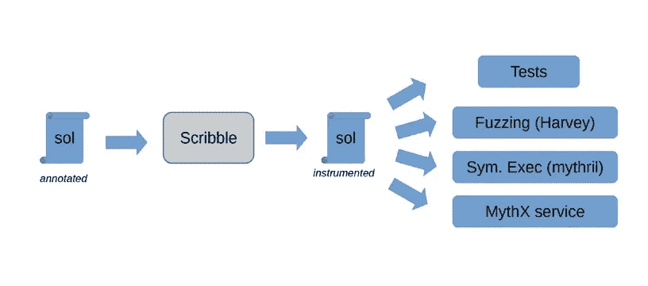
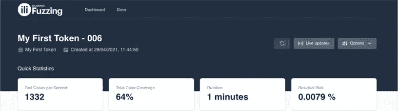

# 安全智能合约工具—端到端开发人员指南

> 原文：<https://levelup.gitconnected.com/secure-smart-contract-tools-an-end-to-end-developers-guide-243290c1012e>

毫无疑问——编写安全的智能合同很难。即使是高级开发人员编写的智能合同也可能被黑客攻击。由于这些智能合约通常具有很高的货币价值，黑客攻击它们的动机也很强。再加上 web3 的不变性，获得正确的安全性变得更加重要。作为智能合约开发人员，智能合约安全性应该是您的首要任务。

在本文中，我将浏览 ConsenSys Diligence 最近发布的指南,[智能合约安全工具指南](https://consensys.net/diligence/resources/security-tooling-guide/)。它详细介绍了在智能合约开发的每个阶段都可用的来自 web3 的 22 个安全工具。我将重点介绍几个重要工具，帮助您的下一个智能合同更加安全。

因此，让我们一次一个发展阶段地浏览指南。

# 准备发展

当您开始开发智能合同时，安全性应该是首要考虑的问题。本指南中我最喜欢的部分是那些即使在你准备编码时也能提供帮助的工具。这包括文档、林挺和编写可重用代码。

首先，**文档**是任何开发项目的关键，智能合同开发也不例外。 [**以太坊自然规范格式**](https://docs.soliditylang.org/en/develop/natspec-format.html) (NatSpec)是记录智能合同的一种很好的方式。

NatSpec 是一种特殊形式的注释，用于为契约、接口、库、函数和事件提供丰富的文档。考虑下面的*树契约*的可靠性代码片段:

```
// SPDX-License-Identifier: GPL-3.0
  pragma solidity >=0.8.2 < 0.9.0;
/// @title A simulator for trees
  /// @author Larry A. Gardner
  /// @notice You can use this contract for only the most basic simulation
  contract Tree {
      /// @notice Calculate tree age in years, rounded up, for live trees
      /// @dev The Alexandr N. Tetearing algorithm could increase precision
     /// @param rings The number of rings from dendrochronological sample
     /// @return Age in years, rounded up for partial years
     function age(uint256 rings) external virtual pure returns (uint256) {
         return rings + 1;
     }
  }
```

*NatSpec 评论的可靠性合同*

通过使用 NatSpec 注释，代码可以很容易地向其他开发人员、审计人员或只想与合同交互的人解释。简单地说，它是干净的，可读的，容易理解的。

接下来，**重用久经考验的代码**是另一种减少智能合约中漏洞风险的行之有效的方法。有许多广泛使用的开源智能合同库可用，如 [**OpenZeppelin**](https://www.openzeppelin.com/contracts) 具有预写逻辑，用于实现访问控制、暂停功能、升级等，以及[**Solmate Contracts**](https://github.com/transmissions11/solmate)用于优化气体使用。

最后，**林挺**是发现智能合约代码中潜在问题的一个有价值的工具。它可以发现代码中的风格错误、违反编程约定和不安全的构造。有很多很棒的棉绒，比如 [ETHLint](https://github.com/duaraghav8/Ethlint) (以前叫 Solium)。林挺可以帮助发现潜在的问题——甚至是诸如重入漏洞之类的安全问题——以免它们变成代价高昂的错误。

通过在智能合约开发期间考虑文档、林挺和可重用代码，您可以帮助确保更安全的合约。从长远来看，无论是在安全性还是效率方面，花时间正确地设置这些都是值得的。

# 发展

现在让我们来看两类可以在你编码时帮助你的工具——单元测试和基于属性的测试。

**单元测试**显然是创建安全可靠代码的重要部分。通过测试单个的代码单元，我们可以确保我们的契约如预期的那样运行，并且有希望在它们导致生产中的问题之前捕捉到任何潜在的问题。

有几种不同的工具可用于编写智能合约的单元测试。 **Foundry** 、 **Truffle** 、 **Brownie** 都是支持各种编程语言的流行框架选择。

[**Foundry**](https://github.com/foundry-rs/foundry) (用 Rust 编写)是一个用于编写智能合约的框架，包括测试框架 [Forge](https://github.com/foundry-rs/foundry/tree/master/forge) 。Forge 单元测试可以直接在 Solidity 中编写，并包含许多 *cheatcodes* 给你断言、改变 EVM 状态的能力、模拟数据等等。Foundry 还带有内置的模糊功能(我们将在后面的文章中详细讨论)。

```
// SPDX-License-Identifier: Unlicense
  pragma solidity 0.8.10;
  import "ds-test/test.sol";
  import "../StakeContract.sol";
  import "./mocks/MockERC20.sol";

  contract StakeContractTest is DSTest {
     StakeContract public stakeContract;
     MockERC20 public mockToken;
     function setUp() public {
         stakeContract = new StakeContract();
         mockToken = new MockERC20();
     }
    /// @notice Test token staking with different amount
     function test_staking_tokens() public {
         uint256 amount = 10e18;
         mockToken.approve(address(stakeContract), amount);
         bool stakePassed = stakeContract.stake(amount, address(mockToken));
         assertTrue(stakePassed);
     }
 }
```

*铸造车间的样品凝固单元测试*

[**松露**](https://trufflesuite.com/) 也是构建智能合约的框架。Truffle 中的单元测试可以用 Solidity 或 JavaScript 编写。开发人员通常使用基于 JavaScript 的测试来测试与合同的外部交互，使用可靠性测试来评估合同在实际区块链上的行为。Truffle 使用 Mocha 进行异步测试，使用 Chai 进行断言。

[**Brownie**](https://github.com/eth-brownie/brownie) 是一个基于 Python 的框架，用于开发和测试智能合约。Brownie 集成了 pytest 进行单元测试，并有一个堆栈跟踪分析工具来测量代码覆盖率。

当编写单元测试时，通过测试尽可能多的代码的不同部分，以高测试覆盖率为目标，以确保所有的功能都按预期工作。Foundry 不需要额外的插件来测量测试覆盖率；对于其他框架，可能至少有一个插件可以用来测量这一点。

虽然单元测试是确保智能合约正确性的可靠方法，但是**基于属性的测试**允许对智能合约进行更深入的验证。这是一个相对较新的概念，它提供了一系列优于传统单元测试的优势。基于属性的测试侧重于测试智能契约的属性，而不是它的单个组件。

根据该指南，“属性描述了智能合约的预期行为，并陈述了关于其执行的逻辑断言。”属性必须始终为真。“基于属性的测试工具将智能合约的代码和用户定义的属性集合作为输入，并在任何时间点检查执行是否违反了它们。”

基于属性的测试基于**模糊化**的概念，这是一种通过引入随机输入来测试系统的技术。这意味着基于属性的测试可以在更广泛的层面上检查智能合约，因为它不依赖于开发人员提供的特定输入。正因为如此，它正成为测试智能合约的一种越来越流行的方法。

以我们之前的契约为例，让我们使用基于属性的方法来测试一个简单的 **staking** 函数。为此，我们将使用 [Scribble](https://consensys.net/diligence/scribble/) ，这是一种规范语言和运行时工具，使这一切变得更加容易。

```
// SPDX-License-Identifier: MIT
pragma solidity ^0.8.10;
import "@openzeppelin/contracts/token/ERC20/IERC20.sol";
error TransferFailed();
contract StakeContract {
    mapping(address => uint256) public s_balances;
    /// #if_succeeds {:msg "Stake created successfully"} $result == true;
    function stake(uint256 amount, address token) external returns (bool){
        s_balances[msg.sender] += amount;
        bool success = IERC20(token).transferFrom(msg.sender, address(this), amount);
        if (!success) revert TransferFailed();
        return success;
    }
}
```

*用涂鸦符号进行的样品坚固性测试*



*不同的工具可以使用 Scribble 规范进行属性测试*

为了评估我们的 staking 函数，我们必须检查它是否在成功执行的情况下返回 *true* 。这可以通过向 stake 函数代码添加注释来完成，如上所述，而不需要单独的测试文件。然后可以运行 Scribble CLI 工具，将 Scribble 注释转换为断言。接下来，这些断言必须通过诸如[尽职调查](https://consensys.net/diligence/fuzzing/)或[流言](https://mythril-classic.readthedocs.io/en/master/about.html)之类的模糊器来确定是否有任何财产侵犯。



*来自勤奋模糊活动示例的报告*

有几个其他工具可用于基于属性的测试，比如 Foundry。Scribble(如上所述)、勤奋 Fuzzing 和 Mythril 是最值得推荐的几个。Scribble 和 Diligence Fuzzing 是由 ConsenSys Diligence 构建的免费开源工具。Mythril 是一个旨在检测以太坊智能合约中潜在漏洞的工具。

我特别喜欢 Scribble，因为将这些测试放在一起就像添加函数注释一样简单。

# 后期发展

最后，让我们看看最后一组工具——后期开发。具体来说，监控。

因为大多数区块链上的智能合约代码是不可变的，所以一旦代码被推送到 mainnet 上，您就几乎无法控制代码。**监控**可以帮助您了解代码中的任何问题或变化，以便您可以快速解决它们。这不仅有助于您提高合同的安全性，还有助于您优化和改进其功能。

像 OpenZepplin 的 [Defender Sentinels](https://docs.openzeppelin.com/defender/sentinel) 和[sontly 的实时警报](https://tenderly.co/)这样的工具对于监控链上的合同和钱包非常有用。

**温馨提示**提供了一组自定义触发器供您选择，允许您快速设置各种活动的提示，例如部署新合同时、发送或接收交易时以及针对某个地址时。

**Defender Sentinel** 通过您定义的一系列自定义参数提供实时安全监控和警报，例如取款是否超过特定阈值，某人是否执行了调用 transferOwnership 等关键操作，或者黑名单中的地址是否试图与您的合同进行交互。

# 还有什么？

这些是智能合约安全性的一些基本部分，但是还有许多其他的考虑事项我没有涉及。例如，安全的访问控制和管理、漏洞奖金和漏洞报告，以及应对安全事故的策略和应急措施。完整指南中详细介绍了这些注意事项以及更多内容。

# 结论

智能合约安全工具非常重要。希望这篇概述有助于您了解可用的正确工具，以便编写更安全的智能合同。欲了解更多详细信息，请点击此处查看[完整的 ConsenSys 尽职调查指南](https://consensys.net/diligence/resources/security-tooling-guide/)。