# 保护您的医疗保健解决方案，以免为时过晚—安全必须具备

> 原文：<https://levelup.gitconnected.com/secure-your-healthcare-solutions-before-its-late-security-must-haves-8c1f6c1728cd>

照片由来自 Pexels 的 George Becker 拍摄

医疗保健数据泄露在 2020 年增加了 25%。自 2014 年以来，医疗保健数据泄露增加了一倍(来源:[www.hipaajournal.com](/www.hipaajournal.com))。来自 Javelin Strategy & Research 的一份报告称，在美国，儿童身份盗窃造成了 26 亿美元的损失。由于欺诈，家庭支付了大约 5 . 4 亿美元的现金费用(来源:【www.businessinsider.com[)。](/www.businessinsider.com)此外，如果发生数据泄露，民权办公室(OCR)可能会对组织处以超过 150 万美元的罚款。

这种威胁是真实的，而且比我们想象的更加持久。这种影响既有社会方面的，也有金融方面的。作为一个技术社区，我们必须专注于保护医疗保健解决方案。我们必须提供尽可能好的保障。

# 受保护的健康信息

HIPPA 安全规则要求组织保护“电子受保护健康信息”或 e-PHI。PHI 的主要目标是保护个人隐私。以避免未经授权的访问和滥用这些信息。

让我们从什么信息被认为是 PHI 这个基本问题开始。

受保护的信息包括:

生物计量信息，如指纹、正面照片等。

身份信息，如姓名、社会保险号、驾驶执照号、病历号、保险号等。

联系信息，如地址(地址的任何部分，如州/邮政编码)、电话号码、电子邮件地址、社交媒体资料等。

出生日期、入院日期、出院日期等日期。

可追踪信息，如牌照号码、设备标识符、IP 地址等。

任何其他可能泄露个人隐私的信息。可能导致误用的信息。

# 保护 PHI

有效保护 PHI 需要几个层次的安全措施。HIPPA 建议采取以下级别的保护措施。

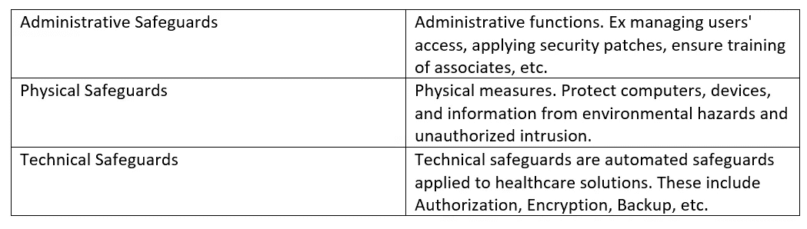

我们的目标是保护医疗保健领域的解决方案/应用。我们将主要关注技术安全的架构最佳实践。

# 典型医疗保健解决方案

为了进一步讨论，让我们考虑一个典型的医疗保健解决方案架构。

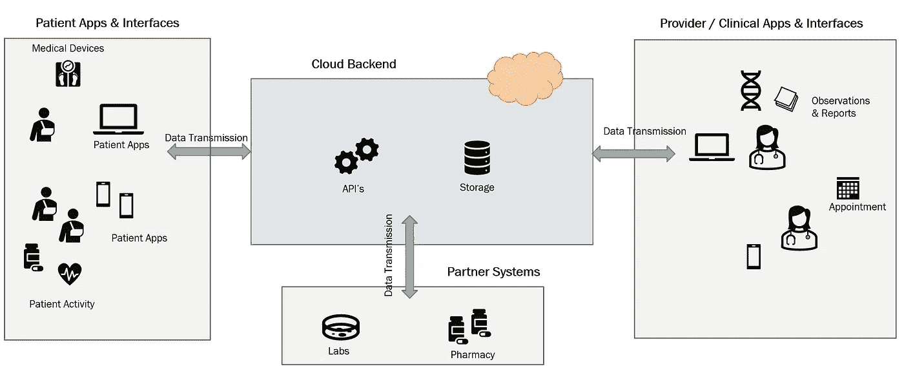

典型医疗保健解决方案概述

在现实世界中，许多变化和扩展都是可能的。我们在这里的目的是以此为背景来研究适用于医疗保健解决方案的安全方面。

# 访问控制

我们需要应用的第一个安全措施是访问控制。

HIPPA 安全规则(164.312(a)(1))要求所涵盖实体的医疗保健解决方案*“为维护电子受保护健康信息的电子信息系统实施技术政策和程序，以仅允许那些被授予访问权限的人员或软件程序访问”*。

让我们从三个方面来看这个需求，

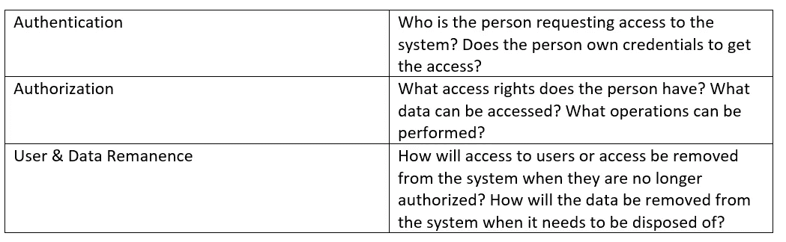

# 证明

## 集中式身份管理

使用集中式身份管理系统。系统中的所有应用程序都使用单一的身份管理解决方案。通常，身份被建立，并且令牌由身份服务器发布。后续事务使用该令牌进行身份验证。

这种方法的优点是，

每个应用程序不会单独实现其身份验证机制。

用户和访问是集中管理的，这允许更好的管理。

可以在一个位置管理身份生命周期，从而减少管理开销和错误。

仅交换令牌，限制了传输凭证的需要。

用户可以使用相同的凭据访问系统中的所有应用程序。这带来了更好的用户体验。

云提供可靠的身份管理服务器作为托管服务(Amazon Cognito、Azure Active Directory 等)。).可以使用几个开源框架来开发定制的身份管理服务器(Apache census、中央认证服务(CAS)等)。).OAuth 2.0 是用于认证和授权的最流行和最可靠的协议之一。

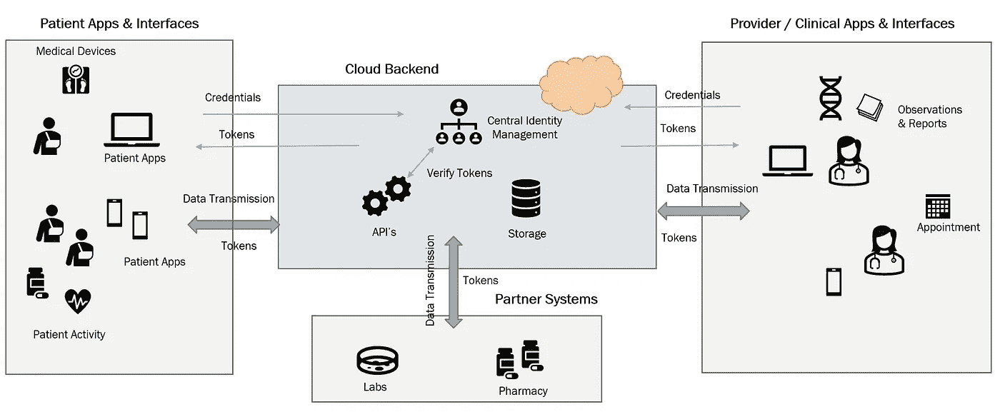

集中式身份管理

## 单点登录

使用集中式身份管理的一个扩展是使用单点登录。用户可以使用一次登录，并使用多个应用程序或界面。在某些情况下，这个概念还扩展到对设备(如计算机)或网络的访问。

一些用户(如患者)位于企业网络之外。在设计单点登录时，有必要记住这一点。该解决方案必须能够为各种用户无缝工作。

## 多因素身份认证(MFA)

多因素身份认证(MFA)是确保额外安全层的一种方式。

多因素有 3 个主要类别:

您知道的信息(密码、PIN、日期等。)

您拥有的东西(手机、加密狗、数字证书等设备。)

你是什么(指纹，脸，等等。)

使用以上类别中的一个以上将算作多因素。使用来自同一类别的两个 id 不会被视为多因素。

现代身份管理系统提供了轻松配置多因素身份认证的能力。

## 自动注销

当用户登录系统时，他们必须在一段时间不活动后自动注销。这是在基于令牌的系统中通过为令牌设置到期周期来实现的。每当令牌服务器接收到到期周期时，它就重置到期周期。这样，活动令牌不会过期。

# 批准

## 基于角色的访问控制

一旦确定了用户的身份，下一步就是授权用户访问系统。并非所有用户都需要相同的访问级别。系统必须启用基于角色的访问控制。必须能够定义用户角色、用户组以及对这些角色和组的链接访问。

## 许可和政策

系统必须支持权限和策略的定义和实施。策略定义了哪些组和角色的用户获得哪些权限的规则。

权限必须在以下 3 个级别的粒度上定义，

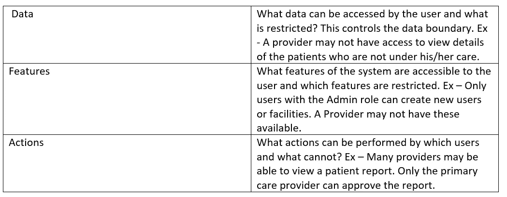

## 最小特权原则

系统必须应用最小特权原则。只有策略明确应用的权限才提供给用户。系统不会提供任何默认的权限集。权限将被限制为策略中定义的最小权限集。

## 需要知道

适用“需要知道”的政策。该策略规定，即使用户拥有访问数据的必要权限，也只能在必要时才允许他们这样做。例如，一名医生试图接触一名在该组织内但不在他治疗范围内的病人。在提供访问之前，系统可能会弹出一个对话框询问原因。

## 用户剩磁

用户的访问权限可能会改变(比如当用户离开组织时)。这些更改需要应用到系统中。系统必须支持提供和撤销权限的实现。设计必须确保权限更改的应用是即时的。没有延迟。这些变化也必须适用于备用身份管理系统。

## 数据剩余

组织需要患者同意才能存储 PHI。在某些情况下，患者可能希望他们的信息被删除。在中，组织有义务从其系统中完全删除这些数据。设计必须提供完全移除 PHI 的管理功能。这应该包括备份。但是，审计日志必须被存储，不能被删除。审计日志必须确保没有 PHI 写入其中。

# 审计日志

HIPPA 安全规则(164.312(b))要求所涵盖实体的医疗保健解决方案*“实施硬件、软件和/或程序机制，记录和检查包含或使用电子保护健康信息的信息系统中的活动。”*。

为了支持这一要求，医疗保健解决方案必须记录所有活动(读、写、修改等。).

图片由来自 Pixabay 的 Gerd Altmann 提供

## 审计活动

必须记录系统中发生的所有活动。审核日志必须捕获以下信息，

1.进行了什么活动

2.谁执行了这项活动？

3.活动是什么时候进行的(留意不同的时区)？

4.活动是在哪里执行的(应用程序、设备、Ip 地址)？

5.活动成功吗

## 审核数据访问

审计数据访问(PHI)是审计日志记录的主要目标之一。必须记录以下有关数据访问的信息，

1.访问了哪些数据(哪个患者，哪个 PHI)

2.谁访问了数据？

3.它是什么时候被访问的(注意时区)

4.数据是在哪里访问的？

5.PHI 被修改了吗

出于监管目的，审计日志需要保留长达 6 年。设计必须确保审计日志被捕获并归档到可靠的存储中。默认情况下，云存储通常有几个月/几天的保留期。必须确保日志不会因配置不当而丢失。

## 捕获审计日志

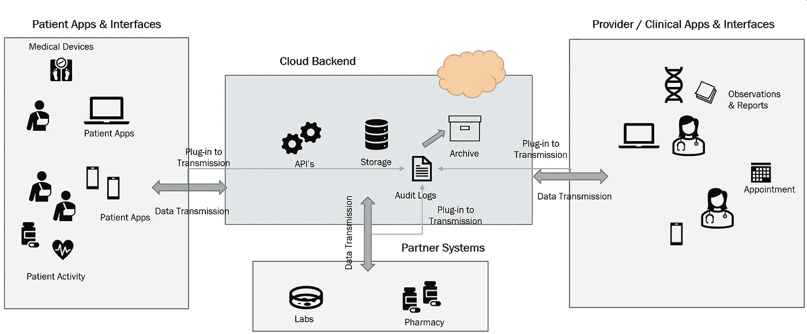

捕获审计日志

捕获审计日志的最佳方式是查看传输管道。靠事件可能不靠谱。通常，活动和数据审计可以一起捕获。这里需要注意的是，PHI 必须作为审计的一部分来获取。只能捕获系统标识符。

# 加密

受保护的健康信息必须在传输和存储过程中受到保护。

HIPPA 安全规则 164.312(e)(1)提出了“实施技术安全措施，防止未经授权访问通过电子通信网络传输的电子保护健康信息”的要求

## 传输层安全性

TLS 或传输安全被广泛使用。TLS 是基于 web 的 API 的一种可靠的安全措施。像 MLLP(最小低层协议)这样的协议可以使用带隧道的 VPN(虚拟专用网络)。

## 消息级安全性

为了增加安全性，消息本身可以被加密。RSA(Rivest–sha mir–ad leman)等非对称加密方法可用于加密邮件。

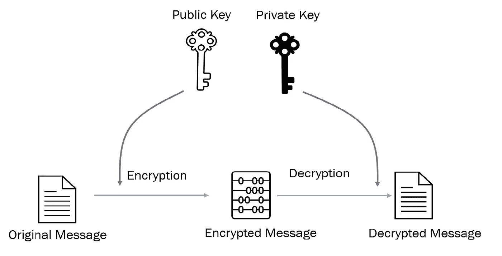

不对称加密

## 静态数据安全性

HIPPA 安全规则 164.312(e)(2)(ii)要求“实施一种机制，在认为适当的时候加密电子受保护健康信息。”

云或设备上的存储中的数据也必须受到保护，以防未经授权的访问。如果未经授权的行动者获得对数据存储的访问权。这将绕过身份验证和授权机制。因此，PHI 也必须加密存储在数据存储器中。在存储和检索 PHI 时，应用程序必须对它们进行加密和解密。AES 256 等对称加密方法是加密静态数据的好选择。

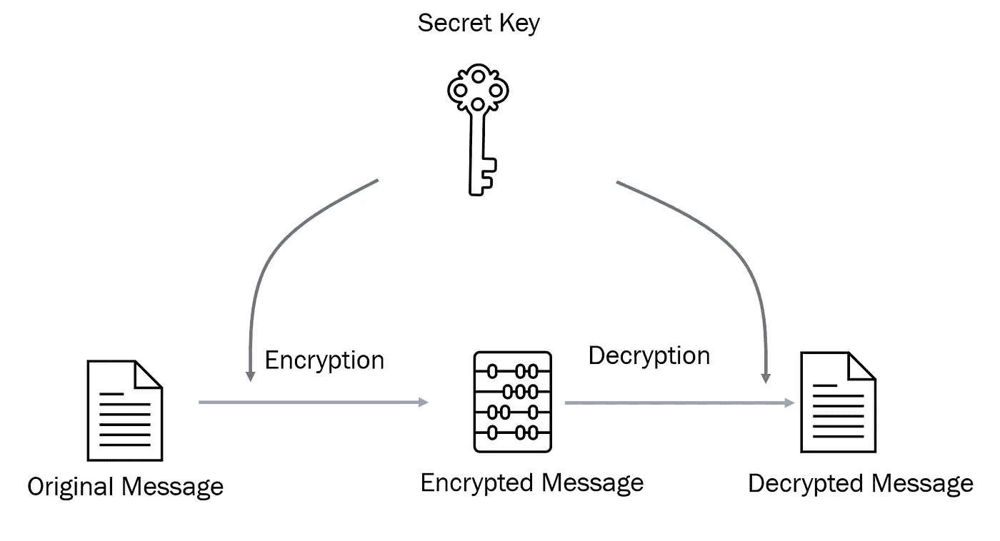

对称加密

# 完整

完整性是为了确保 PHI 不会以未经授权的方式被更改或破坏。

HIPPA 安全规则 164.312(c)(1)要求“实施安全措施，以确保以电子方式传输的电子受保护健康信息在被处置之前不会被不正当地修改而不被发现。”

## 自动数据检查机制

系统必须实现一种设计，以确保数据不会以未经授权的方式被更改。这里没有放之四海而皆准的解决方案。

以下是可以采用的一些常见机制，

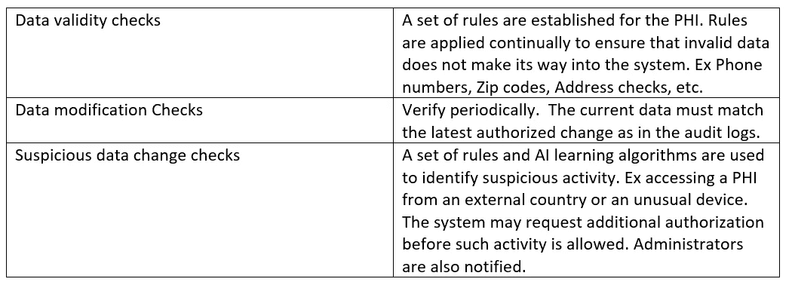

## 数据版本化

在某些情况下，可能有必要恢复数据更改。能够跟踪 PHI 的变化并保留旧版本的数据也很有帮助。

我们使用的 3 个常用策略，

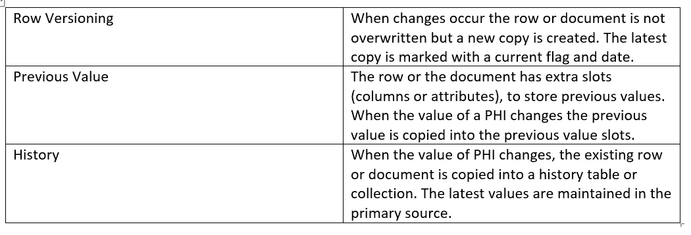

## 数据备份

这是这里值得一提的另一点。数据必须在安全的位置定期备份。如果数据损坏，这是一个备用方案。云提供商提供了几种易于配置的数据备份选项。

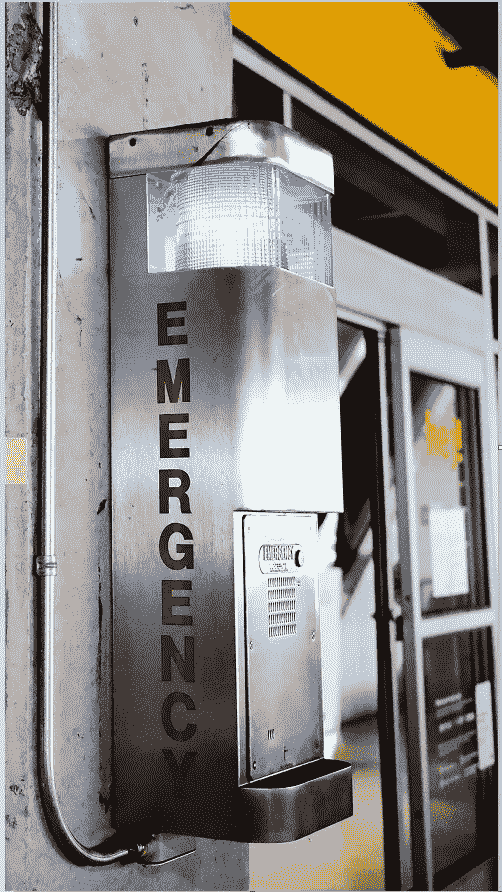

照片由来自 Unsplash.com 的崔妮蒂·阮拍摄

# 紧急进入程序

HIPPA 安全规则 164.312(a)(2)(ii)要求医疗保健解决方案“建立(并根据需要实施)在紧急情况下获取必要的电子保护健康信息的程序。”

系统能够在紧急情况下可用，比如停电或网络攻击。

## 灾难恢复和可用性设计

可用性设计允许系统运行，即使在数据中心中断或部分故障的情况下。换句话说，使系统能够恢复并继续运行。

云提供商允许将数据和服务的备用或副本配置到辅助站点。当主站点停机时，辅助系统会接管。

如果是内部解决方案，我们必须设计一个备用站点。需要定期复制。

这里有 3 个重要的考虑因素，

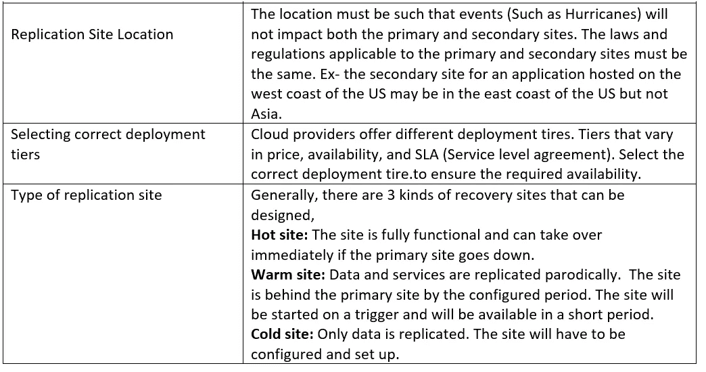

## 紧急接入

停电或互联网故障等事件可能导致数据无法访问。有几种策略可以用来缓解这种情况，

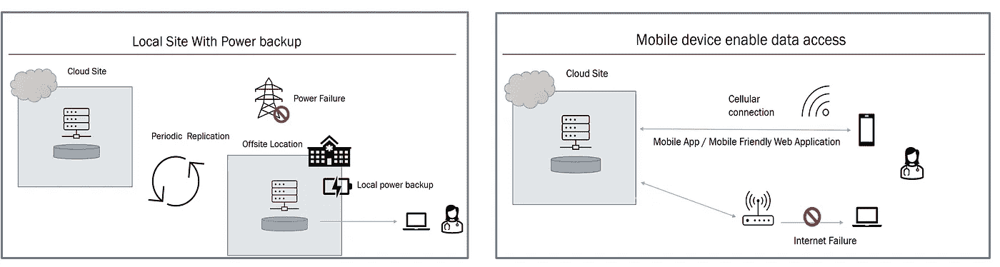

紧急接入

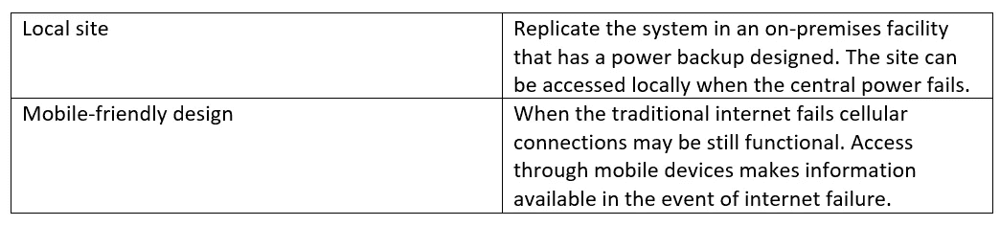

# 结论

数据泄露只会越来越多。连通性为真正的用户和攻击者都带来了巨大的可能性。

安全性通常是事后才想到的。安全第一的架构不再是概念性的。架构师需要将安全第一的方法引入到实际的解决方案实现和交付中。提供更安全、更有弹性的解决方案。

现代医疗保健解决方案将安全性视为核心功能，而不是附加功能。