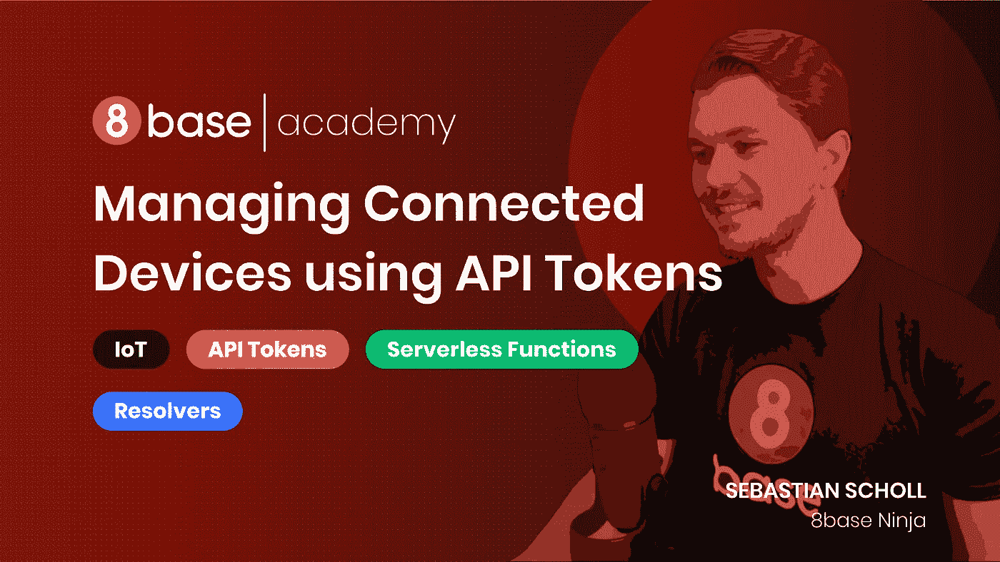

# 使用 API 令牌安全授权连接的设备

> 原文：<https://levelup.gitconnected.com/securely-authorizing-connected-devices-using-api-tokens-6e35248baf4e>

## 使用 GraphQL、Javascript 和无服务器功能为连接的设备设置注册和授权系统。



当我们在应用程序开发中考虑授权时，通常是从拥有特定角色和权限的用户的角度出发。例如，一个跟踪用户锻炼的健身应用程序可能允许一个*运动员*(用户角色)创建日志条目，并且只从 API 中读取他们自己的日志条目。大多数以用户为中心和数据驱动的应用程序最终会考虑和定义这些类型的场景；*谁*能做*什么*？

也就是说，并不是所有的应用程序都以单独登录的用户为中心。给定应用程序的授权需要在设备环境中处理，这种情况并不少见。想想物联网(IoT)设备、虚拟现实耳机、登记亭以及其他设备本身(或安装的应用程序)是经过身份验证的实体。

有时，这种类型的授权纯粹用于安全的机器对机器应用，例如工厂监控设备，其中传感器将设备数据发送到中央监控系统。其他时候，单个设备被授权，以便多个用户可以在给定时间访问它，就像事件注册亭一样。不管具体的用例是什么，我们都需要一个可靠的系统来认证设备，生成 API 令牌，为这些令牌分配必要的授权，并将凭证返回给设备。

# 辅导的

在本教程中，我们将制定一个注册设备的策略。这个系统可以为许多不同的用例工作，所以如果您需要帮助来使它更适合您自己的应用程序，请大胆地提出问题。此外，下面的视频是教程的一步一步走。

在 8base 中使用 API 令牌和授权管理连接的设备

**技术:**

1.  *8 基本工作空间* —使用 GraphQL API 的后端即服务
2.  *Node.js* —在 web 浏览器外执行 JavaScript 代码的 JavaScript 运行时环境

# 步骤 1 —设置“设备”

我们将编写几个可以从命令行手动执行的简单脚本。一个将允许我们注册设备并接收一个令牌，另一个将发出向 API 发送数据和从 API 读取数据的认证请求。在这个场景中，把*设备*想象成你的电脑。

克隆这个项目，这样当我们引用正在发生的事情时，您可以浏览每个脚本。

```
# Clone the repo
git clone [https://github.com/8base/managing-devices-using-api-tokens.git](https://github.com/8base/managing-devices-using-api-tokens.git) eighbase-device-tokens-tutorial# Move into the directory
cd eighbase-device-tokens-tutorial
```

为了对我们正在处理的事情有一个大致的了解，下面是*设备*回购结构。可以使用命令`***npm run exec [FUNCTION_NAME] [ARG]***`运行设备/src/功能目录中的每个功能。同时，`***device/src/utils/api.js***`是我们执行 GraphQL 请求的 API 模块，`***device/src/storage/index.js***`只是将 JSON 数据写入本地文件。

```
device/
 ├── package-lock.json
 ├── package.json
 └── src
 ├── functions
 │ ├── readActivity.js
 │ ├── registerDevice.js
 │ └── sendActivity.js
 ├── index.js
 ├── storage
 │ ├── data.json
 │ └── index.js
 └── utils
 └── api.js
```

这三个函数非常简单。`***registerDevice.js***`脚本是我们用来发送注册码和接收 API 令牌的脚本，而`***readActivity.js***`运行查询，`***sendActivity.js***`运行变异。使用这些，我们将能够测试我们的设备正在工作。

如果你花点时间浏览这些文件，你会发现它们都有非常相似的结构。每一个都定义一个 GraphQL 调用，运行它，然后处理响应或错误。如果你想要更多的上下文，所有的代码文件都有行内注释。

代码中只有一处需要更新值。在`***device/src/utils/api.js***`的第 12 行，用您的工作区端点更新占位符。

# 步骤 2 —设置后端

这里有一些非常有用的功能，我们可以从 8base 中加以利用。它们是 API 令牌、角色和权限以及无服务器功能。如果你想花些时间学习如何构建数据模型，这个视频和这个文档是一个很好的起点。然而，对于本教程，我们可以使用 8base CLI 将所需的模式导入到我们的工作空间中。

如果您还没有，请继续安装 8base CLI 工具。我们将使用它来导入我们的模式文件，并向您的 8base 工作区部署一个无服务器功能，该功能将处理设备的注册。

```
# Install the 8base CLI
npm install — global 8base-cli# Move into the server directory
cd ../server# Authenticate the 8base CLI
8base login# Configure the project to your workspace (Select your workspace)
8base configure# Import the schema to your workspace
8base import -f schema.json
```

一旦导入完成，进入[8 base 工作区控制台](https://app.8base.com/)。在*数据构建器*中，您应该看到已经创建的 3 个表格。下面是他们的列表以及他们的关系。‍

***注册码*** —设备将用于注册的代码。

*   *有一个*装置

***设备*** —为单个注册设备创建的记录。

*   *有一个*注册码 *‍*
*   *有 _many 个*数据条目

***数据条目*** —我们将用来保存设备数据并回读的记录。 *‍*

*   *有 _ 个*装置

8base 控制台中的‍Data 生成器，用于设置 api 令牌教程表

# 步骤 2.1 —定义角色和权限

我们需要采取的下一步是定义设备将拥有的*角色*及其相关权限。

导航到 [*应用服务>角色*](https://app.8base.com/app-services/roles) ，点击“+”按钮添加角色。将它命名为“设备”,如果你喜欢的话，可以随意添加一段描述。创建后，单击角色进入权限视图。

对于任何给定的项目/实现，角色和权限都是极其特定的。也就是说，为了成功运行它的脚本，我们的设备需要一些权限。首先，请确保所有权限都已关闭。

为了确保任何已注册的设备只能访问与其自身相关的记录，我们将使用自定义过滤器，这些过滤器使用 API 令牌来授权请求以确定记录的范围。

**数据条目**

*   *创建*(勾选)
*   *改为*(自定义过滤器)`***{ “device”: { “apiToken”: { “token”: { “equals”: “__requestingApiToken” } } } }***`

**装置**

*   *阅读*(自定义滤镜)`***{ “apiToken”: { “token”: { “equals”: “__requestingApiToken” } } }***`
*   *更新*(自定义滤镜)`***{ “apiToken”: { “token”: { “equals”: “__requestingApiToken” } } }***`

当一个经过身份验证的 API 请求进来时，8base 会用 API 令牌替换掉`__requestingApiToken`变量。这允许您在权限的自定义筛选器中使用 API 令牌作为动态变量，根据给定的角色来确定数据的范围。

在 8base 控制台中为设备角色设置角色和权限

# 2.2 部署我们的无服务器功能

虽然 8base 提供了完全托管的应用后端，但我们能够扩展 API，并使用无服务器功能部署/执行服务器端逻辑。在这种情况下，我们将添加一个名为`*registerDevice*`的函数，它将处理 API 令牌和注册码的验证、创建、分配和发布。

返回到您克隆的项目的服务器目录。下面是在`***server/src/resolvers/registerDevice/****` *找到的带有内联注释的代码。*在将它部署到工作区之前，让我们浏览一下注释。

‍

**schema.graphql**

```
# Returns device ID and apiToken
type RegisterDeviceResult {
 id: String!
 apiToken: String!
}# Mutation accepts registration code as argument
extend type Mutation {
 registerDevice(code: String!): RegisterDeviceResult
}‍
```

**handler.js**

```
import gql from "graphql-tag";/* Disable permissions when making server-side API calls */
const NoCheck = {
  checkPermissions: false,
};/**
 * Query for the registration code.
 */
const REGISTRATION_CODE_QUERY = gql`
  query($code: String!) {
    registrationCode(code: $code) {
      id
      code
      device {
        id
      }
    }
  }
`;/**
 * Create the API Token Mutation. When creating the api token
 * we also go ahead and connect our Device role to it.
 */
const CREATE_API_TOKEN_MUTATION = gql`
  mutation($name: String!) {
    apiTokenCreate(
      data: { name: $name, roles: { connect: { name: "Device" } } }
    ) {
      id
      token
    }
  }
`;/**
 * Create the device Device and connect it with the
 * token and registration code.
 */
const CREATE_DEVICE_MUTATION = gql`
  mutation($tokenId: ID!, $codeId: ID!, $name: String!) {
    deviceCreate(
      data: {
        name: $name
        apiToken: { connect: { id: $tokenId } }
        registrationCode: { connect: { id: $codeId } }
      }
    ) {
      id
      createdAt
    }
  }
`;export default async (event, ctx) => {
  /* Get registration code from mutation args */
  const { code } = event.data; /* Query the code to see if it actually exists */
  const { registrationCode } = await ctx.api.gqlRequest(
    REGISTRATION_CODE_QUERY,
    { code },
    NoCheck
  ); /* Variables */
  let tokenId = "";
  let apiToken = ""; /* If no code is found, return not found error */
  if (!registrationCode) {
    return {
      data: {
        apiToken,
      },
      errors: [
        {
          message: "The submitted registration code was not found.",
          code: "code_not_found",
        },
      ],
    };
    /* If code is already assigned to device, return code assigned error */
  } else if (registrationCode.device) {
    return {
      data: {
        apiToken,
      },
      errors: [
        {
          message: "The submitted registration code was already used.",
          code: "code_assigned",
        },
      ],
    };
    /* If the code is valid, create a new API Token */
  } else {
    ({
      apiTokenCreate: { id: tokenId, token: apiToken },
    } = await ctx.api.gqlRequest(
      CREATE_API_TOKEN_MUTATION,
      {
        name: `DEVICE_${code}_TOKEN`,
      },
      NoCheck
    ));
  } /**
   * Create a new device and connect it to
   * the API Token and Registration code.
   */
  const {
    deviceCreate: { createdAt, id },
  } = await ctx.api.gqlRequest(
    CREATE_DEVICE_MUTATION,
    {
      codeId: registrationCode.id,
      name: `DEVICE_${code}`,
      tokenId,
    },
    NoCheck
  ); /* eslint-disable-next-line no-console */
  console.log(`Token added to device with ID ${id} at ${createdAt}`); /**
   * Return device id and apiToken in response
   */
  return {
    data: {
      id,
      apiToken,
    },
    errors: [],
  };
};
```

熟悉了解析器函数之后，让我们来部署它。继续从服务器目录中运行 8base deploy。部署完成后，您需要更新角色和权限中的最后一项内容。

实际上， *Guest* 角色定义了未经身份验证的请求可以访问哪些资源和权限。由于设备在收到 API 令牌之前需要注册，我们需要确保对我们的 *registerDevice* 操作有公共访问。‍

在 [*应用服务>角色*](https://app.8base.com/app-services/roles) 中，点击*访客*角色，进入*应用*选项卡。部署该功能后，“注册设备”应该出现在 *Api* 部分下。确保它已启用！

正在更新 8base console‍中来宾角色的角色和权限

# 测试设备

让我们继续尝试我们的设备吧！使用命令行返回到设备目录，并安装所有必需的依赖项。

```
# Change into devices directory
cd ../devices# Install dependencies
npm install
```

首先，让我们确保我们的 API 拒绝未经验证的请求。

```
npm run exec readActivity
=> [
  {
    message: "You don't have permission to perform this operation",
    locations: [[Object]],
    path: ["dataEntriesList"],
    code: "NotAuthorizedError",
    details: {
      permissions: "You don't have permission to perform this operation",
    },
  },
];
```

接下来，让我们注册我们的设备。在您的 8base 工作区中，添加一个新的*注册码*，代码设置为“1234567890”。

在数据库 viewer‍中创建注册码

添加后，返回终端并运行以下命令。

```
npm run exec registerDevice 1234567890=> Adding to storage: {
 id: ‘ckd8ykgbu002n08mo4ea59wby’,
 apiToken: ‘415029c8-ecac-44bd-bfa4–97fc18388afa’
}Device registered
```

厉害！设备已注册。如果您想查看服务器端发生了什么变化，请跳回 8base 控制台的*数据查看器*，您将看到所有的关系和设备记录都已创建。此外，将生成一个 API 令牌，可在 [*设置> API 令牌*](https://app.8base.com/settings/api-tokens) 中找到。

现在让我们添加一些活动。

```
npm run exec sendActivity 100=> Entry 100 saved to device ckd8ykgbu002n08mo4ea59wby
```

最后，阅读活动。

```
npm run exec readActivity=> [
  {
    createdAt: "2020–07–30T15:35:47.565Z",
    value: 100,
    __typename: "DataEntry",
  },
];
```

一切似乎都在工作！

# 结论

在本教程中，我们实现了一个使用 API 令牌、GraphQL API、角色和权限以及无服务器功能来认证连接设备的策略。可以对它进行许多增强和改进，比如注册码的截止日期。也就是说，这个总体结构提供了一个很好的起点，你可以从这里继续前进。

如果您有任何问题，请随时联系我们。这个项目中使用的所有代码都可以在 GitHub 上的[教程的 repo](https://github.com/8base/managing-devices-using-api-tokens) 中获得。

*最初发表于*[T5【https://www.8base.com】](https://www.8base.com/blog/securely-authorizing-connected-devices-using-api-tokens)*。*