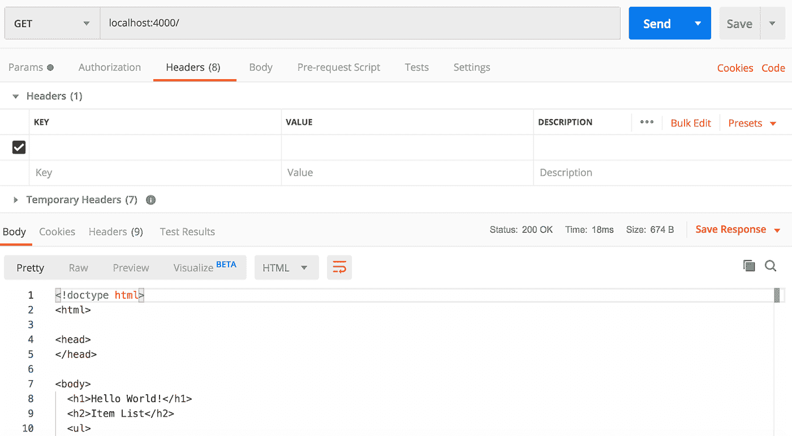

# 保护用 Node.js 构建的 RESTful API

> 原文：<https://levelup.gitconnected.com/securing-a-restful-api-built-with-node-js-f7feefc1efe1>

## 使用 JSON Web 令牌和 bcrypt 密码散列添加身份验证和访问管理


在这篇博客中，我将详细介绍如何为 Node.js 应用程序添加安全性，更具体地说，如何为使用 Node.js 构建的 RESTful API 构建身份验证和访问管理端点。这些端点将允许最终用户为我们的应用程序创建一个新的用户帐户，使用该帐户的凭据登录，并获得对应用程序中其他路由的访问权限。这篇博客对我在之前的博客中所做的开发进行了扩展，在之前的博客中，我详细介绍了如何使用 Node.js、Express.js 和 MongoDB 构建 RESTful API。要跟进，您可以在我的 GitHub 上找到[源代码](https://github.com/ckraczkowsky91/rest-api-node-secure)。

> **注意:**当我们在这篇博客中使用 Node.js 和 Express web framework 时，我有另一篇博客关注 Python 中 Flask web framework 的安全性，并解释了[如何使用 Flask-Admin 构建一个管理界面，该界面使用 Flask-Security 进行保护](https://medium.com/@ckraczkowsky/building-a-secure-admin-interface-with-flask-admin-and-flask-security-13ae81faa05)。

## **定义用户的特征**

我们要做的第一件事是创建一个新文件，在这个文件中，我们将把用户的特征定义为一个新的模式。

```
$ touch userModel.js
```

在`userModel.js`文件中，我们定义一个用户有三个属性:`name`、`email`和`password`。

```
const mongoose = require(‘mongoose’);
const userSchema = new mongoose.Schema({
  name: {
    type: String,
    required: true
  },
  email: {
    type: String,
    required: true
  },
password: {
  type: String,
  required: true
  }
});module.exports = userSchema;
```

然后，我们导出新的`userSchema`,在一个新文件中使用，我们称之为`authController.js`,我们将把应用程序的所有授权和访问管理逻辑放在这个文件中。在接下来的几节中，我们将构建包含该逻辑的控制器函数，并深入研究每个函数的功能。让我们首先构建一个函数来处理大多数授权过程中的第一个任务，即注册新用户。

## **注册新用户**

打开一个私人浏览器窗口，进入你最喜欢的网站。你会注意到，这个网站可能会向你提供一部分内容，但你不可避免地会在你的经历中需要一个该网站的帐户，以便进一步发展。这就是注册新用户的常见授权机制，所以我们添加到`authController.js`文件的第一个控制器函数是`registerUser`函数。

```
$ touch authController.js
```

`registerUser`控制器函数将使我们能够向 API 添加一个端点，用于创建新用户并将他们保存到我们的 MongoDB 数据库中。

```
const userSchema = require(‘./userModel’);
const bcrypt = require(‘bcryptjs’);
const jwt = require(‘jsonwebtoken’);
const config = require(‘./config’);
...
const User = mongoose.model(‘User’, userSchema);
...
const registerUser = (req, res) => {
  let hashedPassword = bcrypt.hashSync(req.body.password, 8);
  let newUser = new User({
    name: req.body.name,
    email: req.body.email,
    password: hashedPassword
  });
  newUser.save((error, User) => {
    var token = jwt.sign({ id: User._id }, config.secretKey, 
      {expiresIn: 86400});
    if (error) {
      res.status(500).send(error);
    } else {
      res.status(200).send({auth: true, token: token});
    };
  });
};
...
```

由于我们的`registerUser`控制器函数将创建用户，我们需要给它访问我们在上面的**定义用户特征**部分中定义的`userSchema`的权限。我们使用我们的`userSchema`来创建用户模型，它提供对 Mongoose 的内置方法的访问，以查询 MongoDB。

深入到`registerUser`函数，我们的第一行代码将`req`和`res`对象传递给该函数。您会记得我以前的博客[中的这些对象，用 Node.js](/building-a-restful-api-with-node-js-831bff629e3b) 构建一个 RESTful API。我们在`req`对象中期望的是一个名为`body`的属性，它包含 JSON 格式的数据，表示在`userSchema`中定义的用户特征。

```
body: {
  name: ‘Colin’,
  email: ‘colin_codes@gmail.com’,
  password: ‘password’
}
```

我们将收到如上所示的请求，但是您可以看到我们有一个问题:密码是明文！这不是我们想要的存储用户个人信息的方式，所以第二行代码创建了一个新变量，我们将纯文本密码存储为散列密码。我们使用`bcryptjs`库进行哈希运算，我们需要使用节点包管理器来安装这个库，也就是 Node.js 运行时环境的默认包管理器。

```
$ npm install bcryptjs
```

`hashSync`函数有两个参数:`data`和`salt`。`data`参数代表要加密的数据，即密码。为了理解`salt`参数，我们需要了解一些关于密码学的基础知识。在密码学中，加盐散列指的是将随机数据添加到散列函数的输入中，以保证唯一的输出，即散列。这确保了即使输入相同，输出的散列也会不同。在我们的例子中，即使两个用户输入相同的纯文本密码，我们存储在数据库中的散列密码也是唯一的。通过为`salt`参数指定一个数字，我们告诉`bcryptjs`通过该轮数来生成一个 salt。在确定这个数字时，我们必须考虑选择一个高或低的数字的成本。较高的数字意味着要进行更多的哈希循环，因此需要更长的时间，而较低的数字会更快，但会产生更容易被破解的哈希密码。默认情况下，`bcryptjs`将这个参数设置为 10，但是为了这个练习的目的，我将它降低到了 8。

在我们散列密码之后，我们使用从请求中获得的名称和电子邮件创建一个新的`User`模型实例，并将它们与我们刚刚创建的散列密码相结合。然后，我们将该实例作为新文档保存到 MongoDB。在保存实例的过程中，我们使用需要安装的`jsonwebtoken`库为新用户生成一个 JSON Web 令牌。

```
$ npm install jsonwebtoken
```

`jsonwebtoken`库是 JSON Web Tokens (JWT)的一个实现，它是一个开放标准，定义了一种紧凑的方式，以 JSON 对象的形式在各方之间安全地传输数据。我们在应用程序中使用 jwt，以便在用户登录后，每个后续请求都将包含令牌，允许他们访问我们用该令牌允许的路由、服务和资源。

JSON Web 令牌由三部分组成:头部、有效负载和签名:

*   报头通常由两部分组成:令牌的类型，即 JWT，以及所使用的签名算法。默认情况下，`jsonwebtoken`库支持使用代码中表示为`HS256`的 SHA-256 哈希算法的 HMAC，但它也支持其他算法，如使用 SHA-256 哈希算法的 RS assa-PKCS1-v1 _ 5(`RS256`)和使用 P-256 曲线和 SHA-256 哈希算法的 ECDSA】)。报头是 Base64Url 编码的，构成了令牌的第一部分。
*   有效载荷包含所谓的“声明”。术语“声明”指的是主体对自身的陈述，它定义了主体是什么或不是什么。然后，这些声明被打包在令牌中，并由令牌服务发布，以便接收方(即我们的 Node.js 应用程序)知道这些声明来自可信来源，就像我们的年龄和驾驶机动车辆的许可被打包在由可信政府机构发布的驾照中一样。在我们的例子中，声明是登录用户的唯一 ID、令牌发布的时间以及令牌到期的时间。然后对有效负载进行 Base64Url 编码，形成令牌的第二部分。
*   签名是 Base64Url 编码的标头、Base64Url 编码的有效负载和一个秘密的组合，该秘密通过标头中指定的算法传递，然后进行签名。

`jsonwebtoken`库通过提供`sign`函数简化了签名过程。该函数接受几个参数，包括`payload`、`secretOrPrivateKey`，以及一个包含任何附加选项的对象。我们将`User._id`作为`payload`传递，因为它提供了用户的唯一表示。`secretOrPrivateKey`可以是一个字符串、缓冲区或对象，包含 HMAC 算法的秘密或 RSA 和 ECDSA 的 PEM 编码私钥，因此得名。由于我们使用默认的散列算法 HMAC，我们将提供一个秘密。我决定把这个秘密放在一个单独的文件中，因为我们会经常用到它，所以最好把它放在一个地方，以便于维护。让我们现在创建该文件。

```
$ touch config.js
```

在`config.js`文件中，我们定义了秘密的密钥和秘密的值。

```
module.exports = {
  ‘secretKey’: ‘secretKeyValue’
}
```

> **注意:**这是不言而喻的，但是我选择的秘密只是为了这个练习的目的，并不是生产环境中应用程序的秘密的准确表示。

至于其他选项，`sign`函数接受一个对象，该对象的属性包括我们首选的散列算法、生存时间以及声明的任何配置。我们使用`expiresIn`属性将令牌的生存时间指定为 86，400 秒或 24 小时。该属性展示了 JSON Web 令牌提供的访问控制粒度。我们可以撤销 jwt，并在 jwt 上设置过期时间，以限制特定用户访问特定的路由。

`registerUser`函数的最后一部分指示 Node.js 应用程序将新用户的数据作为新文档保存到 MongoDB 集合中。如果操作失败，res 对象应该包含一个符合 RFC 规范的状态代码`500 Internal Server Error`，以及一个错误描述。如果操作成功，res 对象应该包含一个状态代码`200 OK`和一个包含新注册用户的 JSON Web 令牌的对象。

## **创建并测试我们的 API 的注册端点**

既然我们已经有了`registerUser`控制器函数，我们需要通过一个路由将它作为 API 提供。我们将函数加载到`routes.js`文件中。

> **注意:**在其他博客中，我将文件`routes.js`称为`itemRoutes.js`文件。

```
const itemControllers = require(‘./itemControllers’);
const authController = require(‘./authController’);
const addItem = itemControllers.addItem;
const getItems = itemControllers.getItems;
const registerUser = authController.registerUser;
const path = require(‘path’);
const routes = (app) => {
  app.route(‘/’)
  .get((req, res) => {
    res.sendFile(path.join(__dirname + ‘/index.html’));
});
**app.route(‘/auth/register’)
  .post(registerUser);** app.route(‘/auth/login’)
  .post(loginUser);
app.route(‘/items’)
  .post(addItem)
  .get(getItems);
};module.exports = routes;
```

如您所见，我们已经在“/auth/register”端点提供了注册新用户的功能。我们现在可以测试这个功能了！我们首先启动 Node.js 应用程序。

```
$ node ./index.js
```

此外，我们需要通过在新的命令行窗口中输入`mongod`命令来启动 MongoDB 的本地实例。

```
$ mongod
```

现在让我们向位于[http://localhost:4000/auth/register](http://localhost:4000/auth/register)的端点发出请求。我们可以用 Postman 工具模拟这种情况，它提供了一个 HTTP 客户端来发出 HTTP 请求。


太好了，这是工作！当我们在`itemSchema`中提供我们需要的数据时，我们看到一个包含 JSON Web 令牌的响应。

我们还应该测试数据是否成功地添加到了我们的 MongoDB 数据库中，所以让我们启动 MongoDB 的内置接口 mongo shell。

```
$ mongo
```

在 mongo shell 中，我们可以查看我们的数据库。

```
> use itemDB
switched to db itemDB
> show collections
items
users
> db.users.find()
{ “_id” : ObjectId(“5e8bad41c85d7e0fed4f939e”), “name” : “Colin Kraczkowsky”, “email” : “colin_codes@gmail.com”, “password” : “$2a$08$iIR7HAGtdeN9V4/AwPg1veSnQJxK8IRRewTkqfsP43hZ3hPpmXnm2”, “__v” : 0 }
```

看起来这也很有效！一个名为 Mongoose 的新集合被自动命名为`users`，一个包含新用户数据的新文档被成功添加。

## **更好地理解 JSON Web 令牌**

测试我们的 API 的注册端点产生了一个 JSON Web 令牌，我们可以对其进行研究，以更好地理解幕后发生的事情。下面是被归还的 JWT。

```
eyJhbGciOiJIUzI1NiIsInR5cCI6IkpXVCJ9.
eyJpZCI6IjVlOGJhZDQxYzg1ZDdlMGZlZDRmOTM5ZSIsImlhdCI6MTU4NjIxMjE2MSwiZXhwIjoxNTg2Mjk4NTYxfQ.
Zg7HsBj7PdgicKCJOQPPE9V4RLR374WfNgN35v5ss2o
```

回想一下上面的**注册新用户**部分，JSON Web 令牌有三个部分:头部、有效载荷和签名。我们可以在上面的示例令牌中看到由“.”分隔的各个部分点符号。让我们在我们的`registerUser`函数中再添加一行代码，这使我们能够看到令牌所代表的 JSON 对象被分解成三个部分。

```
...
const registerUser = (req, res) => {
  let hashedPassword = bcrypt.hashSync(req.body.password, 8);
  let newUser = new User({
    name: req.body.name,
    email: req.body.email,
    password: hashedPassword
  });
  newUser.save((error, User) => {
    var token = jwt.sign({ id: User._id }, config.secretKey, 
      {expiresIn: 86400});
    if (error) {
      res.status(500).send(error);
    } else {
      **console.log(jwt.decode(token, {complete: true}));** res.status(200).send({auth: true, token: token});
    };
  });
};
...
```

这将把以下信息记录到控制台。

```
{
  header: { alg: ‘HS256’, typ: ‘JWT’ },
  payload: { id: ‘5e8bad41c85d7e0fed4f939e’, iat: 1586212161, exp: 1586298561 },
  signature: ‘Zg7HsBj7PdgicKCJOQPPE9V4RLR374WfNgN35v5ss2o’
}
```

您会将`payload`中的`id`识别为新创建用户的 ID。此外，`iat`的值，即创建时间和`exp`，即到期时间，与我们配置的相差 86，400 个单位。最后，`signature`的值与上面示例令牌的第三部分的值相同。我们应该预料到`payload`和`signature`会随着新用户的增加而改变，而`header`应该保持不变，如果我们不改变我们的散列算法或令牌类型的话。

我们的测试即将完成！目前，我们的注册函数获取用户数据，生成一个 JSON Web 令牌，并将令牌返回给我们。为了结束这个循环，我们应该能够使用一个函数对这个流进行逆向工程，这个函数接受一个 JWT，并把它发给用户。我们必须快速构建这个新函数，因为我们在本节中创建的令牌只能存在 24 小时！

## **从 JSON Web 令牌获取注册用户**

回到`authController.js`文件，我们添加了一个新的控制器函数`getRegisteredUser`，它接受一个 JSON Web 令牌并返回相关的用户。

```
...
const getRegisteredUser = (req, res) => {
  var token = req.headers[‘x-json-web-token’];
  if (!token) {
    res.status(401).send({auth: false, message: ‘Token not provided.’});
  } else {
    jwt.verify(token, config.secretKey, (error, decoded) => {
      if (error) {
        res.status(500).send({auth: false, message: ‘Token can not be verified.’});
      } else {
        User.findById(decoded.id, {password: 0}, (error, User) => {
          if (error) {
            res.status(500).send(‘There was an error finding that user.’);
          } else if (!User) {
            res.status(404).send(‘Could not locate that user.’);
          } else {
            res.status(200).send(User);
          };
        });
      };
    });
  };
};
...
```

在我们的`getRegisteredUser`函数中执行的第一个任务是检索和存储 JSON Web 令牌。我们创建一个新的变量`token`，并使用它来引用我们期望在请求的 HTTP 头的`x-json-web-token`头中找到的 JWT。出于本练习的目的，我发明了`x-json-web-token`作为自定义头，但是我们可以随意命名它，只要函数中使用的头的名称与请求中的头的名称一致。实际上，客户端发送 JWT 的方式是使用带有`Bearer`认证方案的`Authorization`报头，如 [RFC 6750](https://tools.ietf.org/html/rfc6750) 中所述。然而，这超出了本博客的范围。此外，我们使用括号符号而不是点符号来访问`x-json-web-token`头，因为如果您还记得早期的 JavaScript，点符号只能访问字母数字属性，除了下划线和美元符号。

现在我们有了对令牌的引用，我们可以定义适当的响应了。马上，如果`x-json-web-token`自定义 HTTP 头丢失，因此没有提供令牌，响应的`res`对象应该包含一个`401 Unauthorized`状态代码。现在我们需要处理提供令牌时的情况。仅仅因为提供了令牌，并不意味着应该立即授予访问权限。我们应该首先验证所提供的令牌是否有效。`jsonwebtoken`库通过提供`verify`函数简化了验证过程。这个函数有几个参数，包括`token`、`secretOrPrivateKey`和一个回调函数。因此，我们将我们对令牌的引用作为第一个参数，将我们在上面的**注册新用户**部分创建的`config.js`文件中的秘密作为第二个参数。然后，我们使用回调函数作为第三个参数来处理响应。如果`verify`函数失败，令牌无效，并且`res`对象应该包含一个`500 Internal Server Error`状态代码。如果令牌有效，那么我们尝试定位与令牌相关联的用户。我们用在上面的**注册新用户**小节中用 Mongoose 实例化的`User`模型来做这件事。Mongoose 中的所有模型对象都有一套查询方法，包括`findById`方法。顾名思义，我们需要与令牌相关联的用户的 id。我们可以从回调函数中得到这个。在幕后，给`verify`函数提供一个回调会触发它异步操作，这意味着在调用回调之前将首先验证令牌。根据令牌是否有效，回调要么用`error`调用，要么用`decoded`调用，后者是从 Base64Url 形式解码的 JSON Web 令牌的有效负载。然后，我们通过适当地响应令牌是否无效来处理这个问题，或者通过用包含`200 OK`状态代码的`res`对象和包含相关用户数据的对象来响应。

> **注意:**在许多情况下，在响应中包含用户的密码是不合适的，即使是散列版本。我们可以通过向包含投影的`findById`方法传递一个可选对象来从响应中删除密码。在 MongoDB 中，一个投影，也称为“查询投影”，指定在返回的文档中包含或排除哪些字段。在我们的例子中，投影`{password: 0}`告诉 MongoDB 通过在投影中将`password`字段设置为 0 来将其从结果中移除，并且当与传递给`findById`方法的所有参数结合时，在语法上与下面的查询相同。

```
SELECT _id, name, email, __v
FROM users
WHERE _id = “[decoded.id]”;
```

接下来，我们像处理`registerUser`控制器函数一样，将`getRegisteredUser`控制器函数加载到`routes.js`文件中。

```
const authController = require(‘./authController’);
...
const getRegisteredUser = authController.getRegisteredUser;
...
const routes = (app) => {
  app.route(‘/auth/register’)
  .post(registerUser)
  .get(getRegisteredUser);
...
```

现在，当客户机使用有效的 JSON Web 令牌向我们的注册端点提交 GET 请求时，我们的 Node.js 应用程序将返回关联的用户。让我们用 Postman 工具来模拟这一点，方法是将上面的 API 部分的**创建和测试注册端点中的令牌插入到对我们的[http://localhost:4000/auth/register](http://localhost:4000/auth/register)端点的 GET 请求的`x-json-web-token`头中。**


太棒了，我们已经完成了注册端点的测试！我们的端点通过创建一个新用户并在提供用户数据时向该用户发出一个 JSON Web 令牌来响应 POST 请求，当提供 JSON Web 令牌时，它用用户数据来响应 GET 请求。

## **登录用户账户**

在上面的小节中，我们构建并测试了一个用新用户帐户注册用户的函数。接下来，让我们处理大多数授权过程中的第二个任务，即允许用户登录到他们的用户帐户。为此，我们添加到`authController.js`文件的下一个控制器函数是`loginUser`函数。

```
...
const loginUser = (req, res) => {
  User.findOne({email: req.body.email}, (error, User) => {
    if (error) {
      res.status(500).send(‘There was an error with login.’);
    } else if (!User) {
      res.status(404).send(‘Sorry, that user does not appear to exist.’);
    } else {
      var passwordIsValid = bcrypt.compareSync(req.body.password, User.password);
      if (!passwordIsValid) {
        res.status(401).send({auth: false, token: null});
      } else {
        var token = jwt.sign({id: User._id}, config.secretKey, 
        {expiresIn: 86400});
        res.status(200).send({auth: true, token: token});
      };
    };
  });
};
...
```

我们使用 Mongoose 的`findOne`查询方法，该方法将一个对象作为第一个参数，将一个回调函数作为可选的附加参数。一般来说，这个方法从我们的 MongoDB 数据库的集合中返回一个文档，该文档与第一个参数中的对象相匹配。这个方法的应用程序获取在`req`对象中传递的电子邮件，并在用户集合中找到一个在`email`键中有匹配值的文档。我们使用回调函数来处理响应。如果我们在数据库中找不到匹配的电子邮件，我们会用一个`404 Not Found`状态代码进行响应。如果我们找到了匹配的用户，我们将验证所提供的密码是否与匹配用户的密码相匹配。因为我们已经散列了密码，所以我们不能简单地比较在`req`对象中提供的密码和保存在我们数据库中的密码。幸运的是，`bcryptjs`提供了`compareSync`函数，该函数根据散列测试一个字符串，并返回一个布尔值来判断它们是否匹配。如果`compareSync`返回 false，那么提供的密码与保存的密码不匹配，我们的 Node.js 应用程序用一个`401 Unauthorized`状态代码进行响应。如果`compareSync`返回 true，则密码匹配，我们认为该用户“已登录”,并为其帐户签发令牌。

在下一节中，我们通过将对特定路由的访问限制为只有具有有效令牌的用户，为我们的应用程序添加了一个新的安全层。

## **保护我们的路线**

在上面的小节中，我们构建了一些机制，允许用户注册一个用户帐户并登录到他们的帐户。这两种机制都会为特定用户生成一个 JSON Web 令牌。现在，让我们构建一个机制，通过使用令牌授权用户访问某些路由，使用 JWT 来保护我们的应用程序。让我们创建一个名为`verifyToken.js`的新文件来保存这个机制。

```
$ touch verifyToken.js
```

在`verifyToken.js`文件中，我们构建了一个“中间件函数”。中间件功能是在应用程序的请求-响应周期中可以访问`req`对象、`res`对象和下一个中间件功能的功能。从技术上讲，我们构建的所有控制器功能都可以被视为中间件功能。

```
...
const verifyToken = (req, res, next) => {
  var token = req.headers[‘x-access-token’];
  if (!token) {
    res.status(403).sendFile(path.join(__dirname + ‘/unverified.html’));
    console.log(‘No token was provided.’);
  } else {
    jwt.verify(token, config.secretKey, (error, decoded) => {
      if (error) {
        res.status(500).sendFile(path.join(__dirname + ‘/unverified.html’));
        console.log(‘Failure to verify the token.’);
      } else {
        next();
      };
    });
  };
};
...
```

我们创建了一个名为`verifyToken`的函数，并向它传递了我们从其他控制器函数中熟悉的`res`和`req`对象，但是您会注意到我们还传递了第三个参数`next`，这个参数我们还没有使用过。回想一下上面的内容，中间件功能可以访问它前面的中间件功能，而这正是下一个变量所指的。

> **注意:** `next`不是 JavaScript 中的保留字。事实上，我们可以用我们选择的任何词来指代这个变量。然而，通常的做法是，前面的中间件函数通常由前面的中间件函数中的一个名为`next`的变量来表示，这样会使您的代码更容易阅读和理解。

我们的`verifyToken`中间件函数的第一行从 HTTP 头中获取 JSON Web 令牌，就像我们在上面的**从 JSON Web 令牌**中获取注册用户的`getRegisteredUser`函数中所做的那样。然后我们处理返回的内容。如果头没有返回 JWT，我们用一个`403 Forbidden`状态码响应请求，并将用户重定向到`unverified.html`文件，这是一个基本的 HTML 文档。让我们现在创建该文件。

```
$ touch unverified.html
```

该文件的目的是为没有足够权限访问所请求路线的用户提供一个简单的登录页面。

```
<!doctype html>
<html>
  <head>
  </head>
  <body>
    <h1>You <u>DO NOT</u> have access to this page!</h1>
  </body>
</html>
```

如果提供了一个 JSON Web 令牌，那么我们使用与上面的**登录现有用户**一节中相同的`verify`函数来验证它。我们通过用一个`500 Internal Server Error`状态码响应并发送上面定义的`unverified.html`文件来处理验证中的任何错误。如果验证成功，我们用一个`200 OK`状态代码进行响应，然后调用`next`变量，该变量将调用队列中的下一个中间件。

所以你可能想知道为什么这很酷？这很酷，因为作为中间件，我们可以将我们的`verifyToken`函数插入到我们的任何路径中来保护它们——非常符合软件开发的 DRY 原则！

例如，让我们返回到`routes.js`文件。

```
const verifyToken = require(‘./verifyToken’);
...
const routes = (app) => {
  app.route(‘/’)
  .get((req, res) => {
    res.sendFile(path.join(__dirname + ‘/index.html’));
    });
  app.route(‘/content’)
  .get(verifyToken, (req, res) => {
    res.sendFile(path.join(__dirname + ‘/verified.html’))
    });
...
```

如果您阅读了我的上一篇博客[用 Node.js 构建 RESTful API](https://medium.com/@ckraczkowsky/building-a-secure-admin-interface-with-flask-admin-and-flask-security-13ae81faa05)，您会记得我们将 Node.js 应用程序前端的根路径设置为`index.html`文件中的 HTML 文档。在该文档中，让我们添加一个将调用我们新定义的'/content '路由的链接。

```
<a href=”/content”>Click here for content!</a>
```

这将模拟上面**注册新用户**一节中讨论的体验，即一个网站向任何个人提供其部分内容，并限制拥有用户帐户的个人访问其其余内容。我们可以使用 Postman 工具来观察这一点，所以让我们再次启动我们的应用程序。

```
$ node ./index.js
```

首先，我们向前端的根节点发送一个 GET 请求。



正如所料，响应是`index.html`文件。接下来，我们向'/content '路由发送一个 GET 请求，在这里我们插入了我们的`verifyToken`中间件函数。


不出所料，如果请求中没有 JSON Web 令牌，我们的 Node.js 应用程序将使用`unverified.html`文件进行响应，表明我们无权访问该内容。接下来，我们提交一个新的 GET 请求，但是这次我们在 HTTP 头中传递一个 JWT。


现在我们的 Node.js 应用程序用`verified.html`文件响应，表明我们被授权访问这个内容。太好了，所以我们的中间件功能正在保护我们的路由免受没有有效 JSON Web 令牌的请求的影响！

## **使用中间件简化我们的控制器功能**

除了调用队列中的下一个函数，我们还可以使用中间件函数在请求-响应周期中沿着函数传递数据。这使我们能够将一项工作写入控制器功能之间共享的单个中间件功能，而不是将该工作写入每个控制器功能。例如，我们可以简化我们的`getRegisteredUser`控制器函数，以重用我们的`verifyToken`中间件函数中完成的工作。

```
const verifyToken = (req, res, next) => {
  var token = req.headers[‘x-json-web-token’];
  if (!token) {
    res.status(403).sendFile(path.join(__dirname + ‘/unverified.html’));
    console.log(‘No token was provided.’);
  } else {
    jwt.verify(token, config.secretKey, (error, decoded) => {
      if (error) {
        res.status(500).sendFile(path.join(__dirname + ‘/unverified.html’));
        console.log(‘Failure to verify the token.’);
      } else {
        **req.token = token;
        req.decoded = decoded;** next();
      };
    });
  };
};
```

在`verifyToken`中，我们向`req`对象添加了两个新属性`token`和`decoded`，并将它们设置为我们从 HTTP 头中提取的 JSON Web 令牌和我们从 JWT 获得的解码数据。然后这些值通过`req`对象提供给下一个函数。

```
const getRegisteredUser = (req, res) => {
  **var token = req.token;
  var decoded = req.decoded;** if (!token) {
    res.status(401).send({auth: false, message: ‘Token not provided.’});
  } else {
    User.findById(decoded.id, {password: 0}, (error, User) => {
      if (error) {
        res.status(500).send(‘There was an error finding that user.’);
      } else if (!User) {
        res.status(404).send(‘Could not locate that user.’);
      } else {
        res.status(200).send(User);
      };
    });
  };
};
```

现在，在我们的`getRegisteredUser`函数中，我们使用从`verifyToken`函数传递下来的 JSON Web 令牌，而不是再次从头文件中提取它。我们还删除了验证 JWT 的代码，因为我们的`verifyToken`函数会替我们完成这项工作。我们剩下的是一个简单得多的`getRegisteredUser`函数，它只执行显式的工作，即查找并返回注册用户。

所以回顾一下我们在这篇博客中所做的工作，我们从我以前的博客[中的一个基本 REST API 开始，用 Node.js](https://medium.com/@ckraczkowsky/building-a-secure-admin-interface-with-flask-admin-and-flask-security-13ae81faa05) 构建一个 RESTful API。然后，我们通过向我们的 API 添加两个新的端点来包含一些身份验证，以便个人可以为我们的应用程序注册一个用户帐户并登录到该帐户。我们确保这些终端使用`bcryptjs`库安全负责地存储它们处理的敏感数据，例如密码。然后，我们添加了授权，在用户成功登录后授予用户一个 JSON Web 令牌，创建一个中间件函数来验证 JWT 是否有效，并将该中间件嵌入到我们希望对访问进行更严格控制的路由中。最终，我们得到了一个更加安全的 REST API 和 Node.js 应用程序！将来，我们可以通过添加基于角色的授权并为单个用户分配特定的角色，或者将用户分配给一个组并为该组分配一个角色，来实现更细粒度的访问控制。

要获得使用 Nodes.js、MongoDB、JSON Web Tokens 和 bcrypt 构建安全 REST API 的一些实践经验，请从我的 GitHub 中克隆我们在这篇博客中构建的应用程序的[源代码](https://github.com/ckraczkowsky91/rest-api-node-secure)，并在您的本地机器上运行它。

## **关于作者**

Colin Kraczkowsky 在探索了产品管理的技巧之后，最近回到了 web 开发领域。Colin 的职业经历包括在企业和初创企业环境中工作，编写 web 和移动应用程序代码，推出新产品，构建模型和原型，分析指标，以及不断创新。

闲暇时，科林会去大苏尔看看最新的阿利特露营装备，计划下一次去柯克伍德·丹尼尔山，或者在网飞的恐怖区冲浪。科林目前居住在加利福尼亚州的旧金山。

联系科林—[https://www.linkedin.com/in/colinkraczkowsky](https://www.linkedin.com/in/colinkraczkowsky)