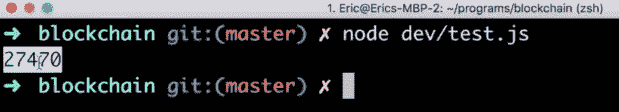

# 使用工作证明保护区块链

> 原文：<https://levelup.gitconnected.com/securing-blockchain-with-proof-of-work-be162f0bec67>

Eric Traub 是纽约的一名软件工程师，他有着丰富的教师和教授各种不同科目的经验。

# 什么是工作证明？

对于区块链技术来说,`proofOfWork`方法非常重要且必不可少，因为它让比特币和许多其他区块链变得安全。

现在，你一定很好奇**工作证明** ( **PoW** )到底是什么。看看任何一个区块链——每个区块链基本上都是一系列街区。必须创建每个单独的块并将其添加到链中。然而，我们不仅仅希望创建任何块并将其添加到链中。我们希望确保添加到链中的每个数据块都是合法的，具有正确的事务，并且其中包含正确的数据。这是因为如果它没有正确的交易或正确的数据，那么人们可以伪造他们有多少比特币，并从本质上导致欺诈和窃取他人的钱。每当创建一个新块时，我们首先必须通过 PoW 挖掘它来确保它是一个合法的块。

一个`proofOfWork`方法将接受`currentBlockData`和`previousBlockHash`。从这些数据中，`proofOfWork`方法将尝试生成一个特定的散列。在我们的例子中，这个特定的散列将是一个以四个零开始的散列。因此，有了给定的`currentBlockData`和`previousBlockHash`，该方法将以某种方式生成一个以四个零开始的结果散列。

现在，让我们试着理解我们如何做到这一点。假设散列是随机的。因此，如果产生的散列实际上是随机的，那么我们如何从当前块生成一个以四个零开始的散列呢？做到这一点的唯一方法是通过反复试验，或者通过猜测和检查。所以，我们要做的是多次运行我们的`hashBlock`方法，直到我们幸运地生成一个开头有四个零的散列。

您可能想知道我们的`hashBlock`方法的输入是什么——它们是`previousBlockHash`、`currentBlockData`和`nonce`参数。当我们总是传递完全相同的数据时，这三个已经传入一次并可能生成多个不同散列的参数将会如何？

我们如何在不改变我们的`currentBlockData`或`previousBlockHash`的情况下改变这个数据，但是我们仍然得到一个开头有四个零的结果散列？这个问题的答案是，我们将不断改变`nonce`值。这可能现在看起来有点混乱，所以让我们通过了解`proofOfWork`中实际发生的事情来澄清一下。

在我们的`proofOfWork`中发生的是，我们将重复散列我们的块，直到我们找到正确的散列，它将是以四个零开始的任何散列。我们将通过不断增加`nonce`值来改变`hashBlock`方法的输入。我们第一次运行我们的`hashBlock`方法时；我们将从 nonce 值 0 开始。

然后，如果结果散列的开头没有四个零，我们将再次运行我们的`hashBlock`方法，只是这次我们将把我们的`nonce`值增加 1。如果我们没有再次获得正确的哈希值，我们将增加 nonce 值并重试。如果这不起作用，我们将再次增加 nonce 值并重试。然后我们将继续运行这个`hashBlock`方法，直到我们找到一个以四个零开始的散列。这就是我们的`proofOfWork`方法的工作方式。

您可能想知道这个`proofOfWork`方法实际上是如何保护区块链的。这样做的原因是，为了生成正确的散列，我们将不得不多次运行我们的`hashBlock`方法，这将消耗大量的能量和计算能力。

因此，如果有人想回到区块链，试图改变一个块或该块中的数据——也许是为了给自己更多的比特币——他们将不得不进行大量的计算，并花费大量的精力来创建正确的哈希。在大多数情况下，回过头来试图重新创建一个已经存在的块，或者试图用自己的假数据重新挖掘一个已经存在的块是不可行的。我们的`hashBlock`方法不仅接受`currentBlockData`，还接受之前的 BlockHash。这意味着区块链中的所有区块都通过它们的数据链接在一起。

如果有人试图返回并重新挖掘或重新创建一个已经存在的块，他们还必须重新挖掘和重新创建他们重新创建的第一个块之后的每个块。这将需要大量的计算和精力，对于一个发展良好的区块链来说是不可行的。一个人必须进去，使用工作证明重新创建一个块，然后通过对每个块进行新的工作证明来重新创建每个块。这对于任何生产精良的区块链都是不可行的，这也是区块链技术如此安全的原因。

现在这一切看起来似乎令人不知所措，有点混乱，但是不要担心——我们将在下一节构建`proofOfWork`方法，然后我们将使用许多不同类型的数据来测试它。

# 创建 proofOfWork 方法

让我们构建出`proofOfWork`方法:

1.  在`hashBlock`方法之后，定义`proofOfWork`方法如下:

2.该方法接受两个参数:`previousBlockHash`和`currentBlockData`:

3.我们想在方法内部做的第一件事是定义一个 nonce:

4.接下来，我们要第一次散列我们的所有数据，所以键入下面突出显示的代码行:

在前面的代码中，您可能会注意到我们使用了 let 这个术语，因为我们的`nonce`和`hash`都会随着方法的执行而改变。

5.我们想要做的下一步是不断地反复运行`hashBlock`方法，直到我们得到一个以四个零开始的散列。我们将在 while 循环的帮助下重复这个操作:

6.如果我们创建的散列不是以四个零开始，我们将再次运行我们的散列，除了这次使用不同的 nonce 值。因此，在 while 循环中，添加以下突出显示的代码行:

在 while 循环中，我们使用所有相同的数据再次运行我们的`hashBlock`方法，除了这次我们的`nonce`增加并等于 1 而不是 0。这将是 while 循环的第一次迭代。

现在，在第一次迭代之后，生成的新散列的前四个字符不等于 0000。在这种情况下，我们需要生成一个新的散列。因此，我们的 while 循环将再次运行，nonce 值将增加到 2，并将创建一个新的散列。如果散列也不是以四个零开始，那么 while 循环将再次运行，nonce 值将再次递增，并且散列将再次生成。

我们的循环将继续这样做，直到得到一个以四个零开始的散列。这可能需要多次迭代。这种情况可能会发生 10 次、1 万次或 10 万次。

这个循环是所有计算发生的地方，这就是为什么`proofOfWork`方法使用这么多能量的原因——有很多计算正在进行。

我们将继续遍历 while 循环，直到生成一个以四个零开始的合适的散列。当我们最终得到正确的散列时，我们的 while 循环将停止运行，在我们的`proofOfWork`结束时，它将简单地返回给我们有效散列的`nonce`值:

所以，这就是我们的`proofOfWork`方法如何工作并验证散列。在下一节中，我们将测试我们的`proofOfWork`方法，以确保它正常工作。我们还将研究为什么我们返回一个`nonce`值而不是返回散列值。

# 测试 proofOfWork 方法

让我们测试一下我们的`proofOfWork`方法，确保它能正常工作。我们将在我们的`test.js`文件中测试这个方法。你可以在[https://github . com/packt publishing/Learn-block chain-Programming-with-JavaScript/tree/master/dev](https://github.com/PacktPublishing/Learn-Blockchain-Programming-with-JavaScript/tree/master/dev)找到本文的代码文件。那么，让我们开始吧:

1.  打开 test.js 文件。

2.如果 test.js 文件中没有任何数据，将它添加到 test.js 文件中，如前面的屏幕截图所示，然后就可以开始测试数据了。

3.为了测试我们的`proofOfWork`方法，我们需要`previousBlockHash`和`currentBlockData`。因此，在我们的测试案例中，去掉 nonce 值，并将以下代码行添加到我们的文件中:

现在，我们应该从这个`proofOfWork`方法得到一个`nonce`值。我们的`proofOfWork`方法所做的是测试正确的`nonce`值是否与我们的块数据和我们的`previousBlockHash`进行散列，以生成以四个零开始的结果块散列。在这里，`proofOfWork`为我们找到了正确的`nonce`。

4.保存这个文件，并通过在我们的终端窗口中键入`node dev/test.js`命令来运行我们的测试。运行测试后，您会发现屏幕上弹出一个数字作为输出:

这个数字意味着我们的`proofOfWork`方法花了 27，470 次迭代才找到一个以四个零开始的散列。

5.为了深入理解整个过程，我们可以做的是，在我们的 while 循环中，注销我们尝试的每个散列。我们必须对 while 循环做一些小的修改:

当我们现在运行我们的测试文件时，将会发生的是，我们实际上会看到 27，000 个不同的散列在我们的终端中注销。除了最后一个，这些哈希都不会以四个零开头。只有被注销的最后一个散列应该以四个零开始，因为在我们的方法之后，它将终止并返回获得有效散列的 nonce 值。

再次保存我们的 test.js 文件。现在，您可以在屏幕上看到，我们有一大堆不同的散列被登录到终端:

注意，对于已经记录的每一个散列，在我们获得最终值之前，开头永远不会是一行中的四个零。

这里发生的事情是，我们从值为 0 的`currentBlockData`、`previousBlockHash`和`nonce`生成散列。然后，对于下一个散列，我们将 nonce 递增 1。因此，都是相同的输入数据，但是 nonce 值会递增，直到获得有效的散列。最后，在 27，470，利用随机数的值，获得有效散列。

现在让我们尝试使用我们的`hashBlock`方法。在我们的`dev/test.js file`中，删除`proofOfWork`方法并添加以下代码行:

在前面的代码中，对于 nonce，我们输入值 27，470。这个值是我们从`proofOfWork`方法中获得的。

我们将观察到的输出是使用正确的 nonce 值运行单个 hash，该值是通过运行`proofOfWork`方法获得的。通过这样做，我们应该在第一次尝试时生成一个以四个零开始的散列。让我们保存它并运行它。一旦测试运行，您将观察到以四个零开始的单个散列，如下面的屏幕截图所示:

`proofOfWork`是区块链技术非常重要的一部分。这很难计算，正如您从测试结果中观察到的那样——我们花了 27，000 多次迭代来生成正确的哈希。因此，一个`proofOfWork`需要大量的能量和计算，并且很难生产。

一旦我们有了正确的证据或生成所需散列的`nonce`值，我们应该很容易验证我们有正确的 nonce 值。我们可以通过简单地将它传递给我们的`hashBlock`方法来验证这一点——我们将获得以四个零开始的散列。

生成一个工作证明需要大量的工作，但是验证它是正确的是非常容易的。因此，如果我们想要返回到我们的区块链并检查以确保一个块是有效的，您所要做的就是使用前一个块的散列和当该块被挖掘时从`proofOfWork`生成的随机数来散列该块的数据。如果它返回给我们一个以四个零开始的有效散列，那么我们已经知道这个块是有效的。

因此，从我们的测试中，我们可以得出结论，`proofOfWork`方法如预期的那样工作。

*如果你觉得这篇文章有意思，可以看看* [*用 JavaScript 学习区块链编程*](https://amzn.to/2CicZ9r) *探索用 JavaScript 开发高度安全的类比特币应用的区块链技术要领。* [*用 JavaScript 学习区块链编程*](https://www.packtpub.com/web-development/learn-blockchain-programming-javascript) *可以帮助你理解去中心化的区块链网络是如何运作的，以及为什么去中心化对于获得区块链是如此重要的特征。*

 [## 学习坚固性-最佳坚固性教程(2019) | gitconnected

### 14 大坚实度教程。课程由开发者提交并投票，让你找到最好的稳定性…

gitconnected.com](https://gitconnected.com/learn/solidity)