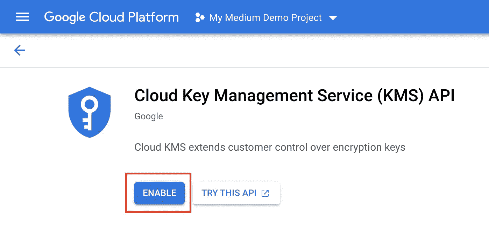
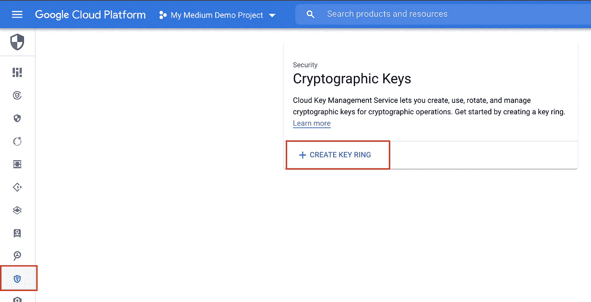
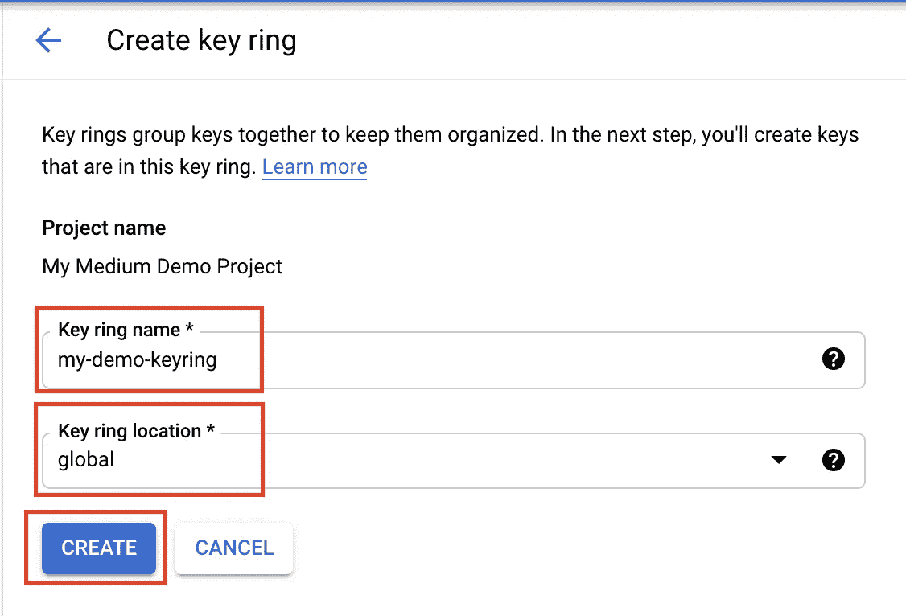
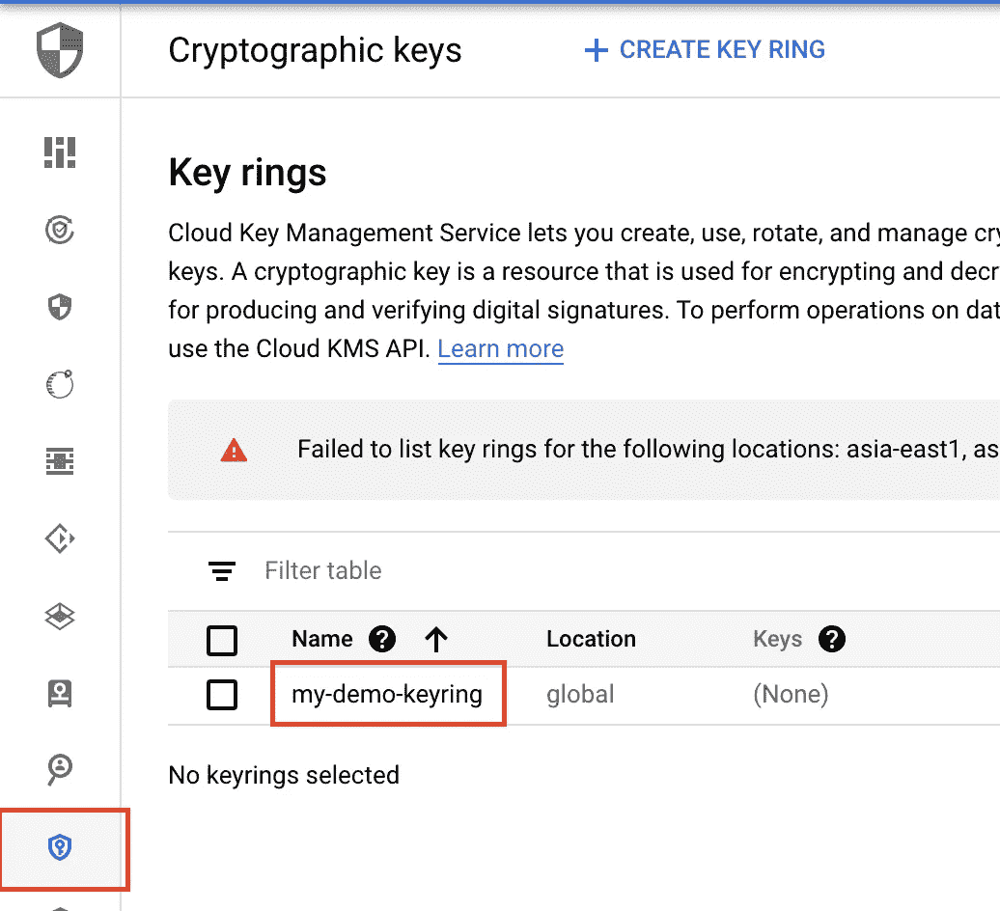
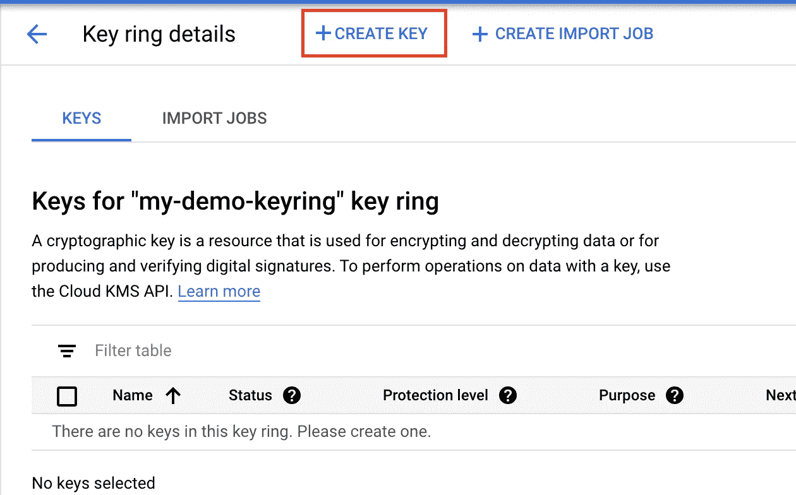
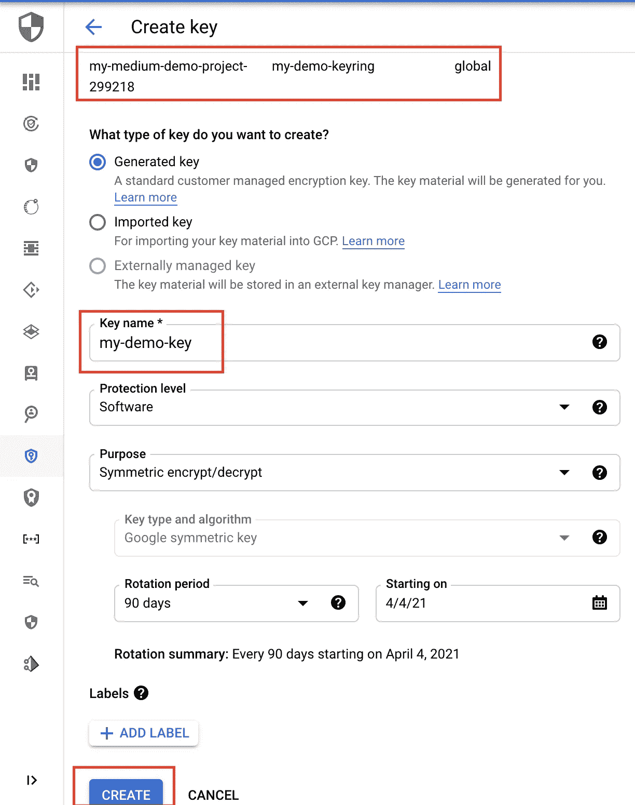
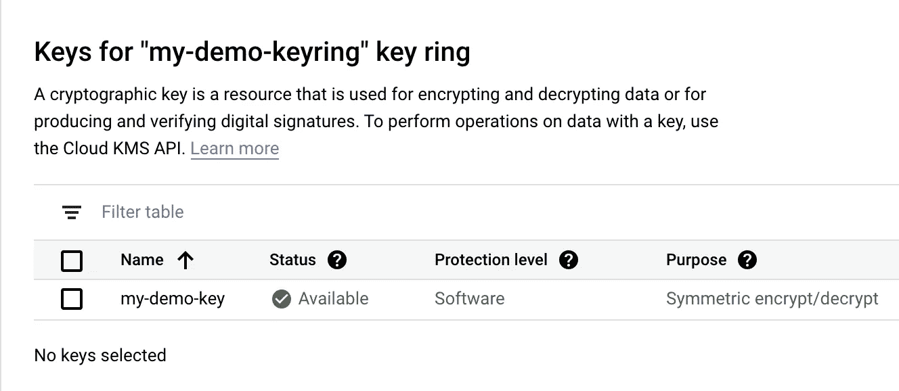
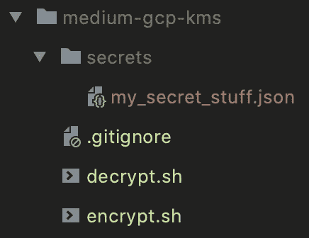
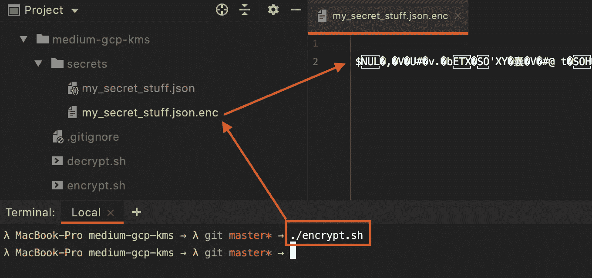
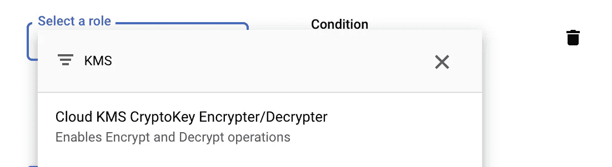

# 保护你的秘密在 Git，安全的方式使用 GCP KMS

> 原文：<https://levelup.gitconnected.com/securing-your-secrets-in-git-the-safe-way-using-gcp-kms-ada49e8386af>

将秘密和凭证提交到 git 中，而不会产生安全问题。


托姆·米尔科维奇在 [Unsplash](https://unsplash.com/) 上拍摄的照片

许多人都有这样的问题，他们希望将一些凭证文件或其他机密提交给 git，因为项目内部需要这些文件。这些可能只是机密的环境变量、服务帐户凭证、私钥或数据库登录凭证。**这些文件都不应该以纯文本的形式提交到您的 git 存储库中！**现在您可能会问*“如果我不能将它们提交给我的 git，我如何确保每个开发人员都有正确的凭证，并且我的 CI/CD 管道在构建/测试/部署我的软件时能够提供正确的环境值？”*。说得好，但是有一个非常简单的解决方案:

不要以纯文本的形式提交你的秘密，而是使用加密版本。当你已经在使用 GCP 时，这相当容易，因为谷歌提供了云密钥管理服务(KMS)。使用他们的密钥管理服务，您可以轻松地加密和解密您想要安全存储在 git 中的所有文件。本文将向您展示如何实现这一点。

## 在 GCP 上设置云密钥管理服务

首先，我们需要一个启用计费的 GCP 项目。我希望你已经有一个了。

接下来，我们必须转到 GCP 控制台中的“云密钥管理服务(KMS) API ”,并为您的特定项目启用该 API。



为 GCP 项目启用“云密钥管理服务(KMS) API”

启用 KMS API 后，我们需要创建一个新的密匙环。



对于新的密钥环，我们必须提供名称和位置。在大多数情况下，位置并不是非常重要，但是根据位置的不同，某些功能可能不可用。查看谷歌官方文档[云 KMS 位置](https://cloud.google.com/kms/docs/locations)获得详细概述。在我的例子中，我简单地选择“global ”,因为它是预先选择的，我不需要任何特殊功能。



当密匙环创建完成后，我们可以在列表视图中看到我们的新密匙环。现在我们必须创建一个新的密钥来添加到密钥环中。为此，只需点击我们的新钥匙圈。



我们新创建的钥匙圈列表视图

在密钥环详细信息页面上，我们现在可以点击“+创建密钥”按钮来创建我们的新密钥。



在“创建密钥”页面上，我们可以保留所有预定义的值。我们需要指定的唯一值是“键名”。此外，请务必记下项目 ID、密匙环名称、位置以及您将在下一个屏幕截图中使用的密匙名称，因为我们稍后会在脚本中用到这四个值。

在你填写密钥名称后点击“创建”按钮。



创建新密钥

创建完成后，我们可以在钥匙圈上的钥匙列表视图中看到我们的新钥匙。



键的列表视图

现在我们已经在 GCP 上设置了密钥，是时候在我们的代码中设置实际的加密/解密过程/脚本了。

## 通过“gcloud kms”解密/加密文件

回到我们的代码库，我们不能设置下面的文件结构。



文件夹包含了我们所有的秘密。在我们的例子中，它是一个简单的 JSON 文件，包含一些数据库登录凭证。实际内容在这里并不重要。

`.gitignore`文件定义了除了以`.enc`结尾的文件外，`secrets`文件夹中的所有文件都应该被 git 忽略。我选择了`.enc`后缀来声明`encrypted`文件，因为我希望这些文件被提交给 git。

```
### .gitignore# Ignore all files in secrets folder
secrets/**# Except the files that end with '.enc'
!secrets/**.enc
```

除此之外，我们有一个 shell 脚本来加密(`encrypt.sh`)和一个来解密(`decrypt.sh`)我们的秘密。当您创建了这两个文件时，不要忘记对这两个文件使用`chmod +x xxx.sh`命令，使它们可以从 CLI ( Mac/Linux)执行。

在我们继续之前，请确保您已经安装了 [GCloud SDK](https://cloud.google.com/sdk/docs/install) 并且是最新的。此外，在继续之前，请确保您已使用 CLI 命令`gcloud auth login`登录。

现在让我们先来看看我们的`encrypt.sh`。

```
### encrypt.sh*gcloud* kms encrypt \
    --project my-medium-demo-project-299218 \
    --location global \
    --keyring my-demo-keyring \
    --key my-demo-key \
    --ciphertext-file ./secrets/my_secret_stuff.json.enc \
    --plaintext-file ./secrets/my_secret_stuff.json
```

如你所见，这非常简单。我们使用的是暴露了`encrypt`功能的`gcloud kms` CLI 命令。CLI 参数也很容易理解。还记得我告诉过你记下你的项目 ID、钥匙圈、钥匙圈的位置和键名吗？这是您必须将这些值插入到 shell 脚本中的地方。

参数`ciphertext-file`和`plaintext-file`定义了你的加密和纯文本文件的位置，同时注意`ciphertext-file`处的`.enc`后缀。

当我们现在通过 CLI 中的`./encrypt.sh`运行脚本时，我们注意到在`ciphertext-file`中定义的位置创建了一个新文件。当检查它时，我们可以看到一些神秘的文字。



运行“encrypt.sh”并注意新的加密文件。

由于我们的加密文件看起来不错，现在我们准备将它提交给我们的 git 存储库。

但是当然，其他人必须再次解密才能使用。这里`decrypt.sh`开始发挥作用。事实上，这非常简单。

```
*### decrypt.sh**gcloud* kms decrypt \
    --project my-medium-demo-project-299218 \
    --location global \
    --keyring my-demo-keyring \
    --key my-demo-key \
    --ciphertext-file ./secrets/my_secret_stuff.json.enc \
    --plaintext-file ./secrets/my_secret_stuff.json
```

注意到我们的加密和解密脚本之间的区别了吗？实际上只有一个词，那就是`gcloud kms`命令。所有参数保持不变，您只需将命令从`encrypt`切换到`decrypt`。很简单，对吧？

为了验证一切正常，我们现在应该删除我们的纯文本文件`./secrets/my_secret_stuff.json`，确保在某个地方保留一个副本，并运行`./decrypt.sh`脚本。我们现在应该看到我们的脚本解密了我们的加密文件，并重新创建了我们最近删除的纯文本文件。

如果你开始有几个秘密文件，只需将它们添加到脚本中，就可以了。

真的没什么了。从现在开始，你可以随时加密你的机密信息，并把它放入你的 git 中，只要你的 KMS 密钥是安全的，就没有什么好害怕的。

## 权限被拒绝错误疑难解答

如果您在运行上述脚本时碰巧收到来自 GCP 的任何`permission denied`错误，请确保您的帐户拥有`Cloud KMS CryptoKey Encrypter/Decrypter`角色或包含此角色的上级角色，如`Owner`或`Editor`。



向用户添加“云 KMS 密钥加密器/解密器”角色

## 结论

尽管您必须在您的 GCP 环境中做一些初始设置工作，但使用云 KMS 通过您的 CLI 解密和加密您的文件并使它们防弹以提交到您的 git 存储库是非常容易的。

感谢您花时间阅读我的文章。

## 你想联系吗？

如果你想联系我，请在 LinkedIn 上给我打电话。

另外，请随意查看我的书籍推荐📚。

[](https://mr-pascal.medium.com/my-book-recommendations-4b9f73bf961b) [## 我的书籍推荐

### 在接下来的章节中，你可以找到我对所有日常生活话题的书籍推荐，它们对我帮助很大。

mr-pascal.medium.com](https://mr-pascal.medium.com/my-book-recommendations-4b9f73bf961b) [](https://mr-pascal.medium.com/membership) [## 通过我的推荐链接加入 Medium—Pascal Zwikirsch

### 作为一个媒体会员，你的会员费的一部分会给你阅读的作家，你可以完全接触到每一个故事…

mr-pascal.medium.com](https://mr-pascal.medium.com/membership)