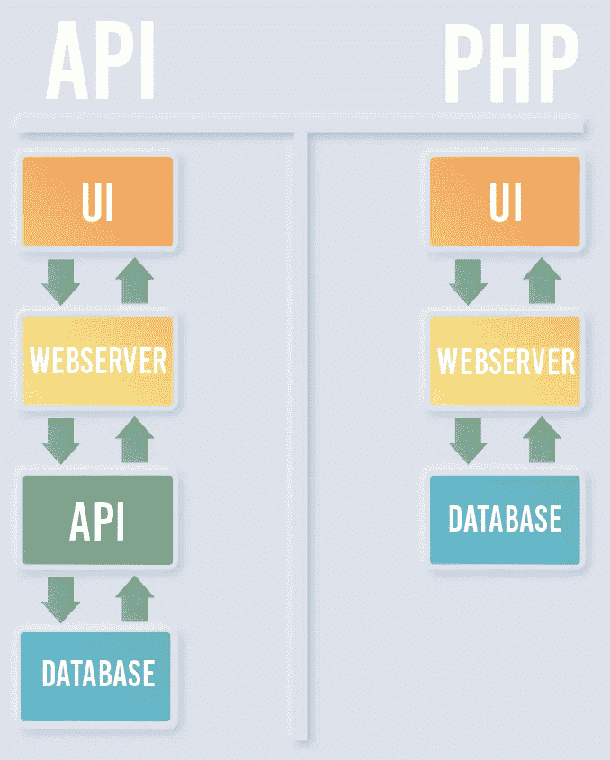
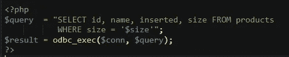

# 安全基础:SQL 注入

> 原文：<https://levelup.gitconnected.com/security-basics-sql-injection-7a1f75ab3a5d>

作为历史上最突出的漏洞之一，SQL 注入在过去 20 年中可能给数千家公司造成了数百万(如果不是数十亿)美元的损失。Phrack contributer 和安全研究员 Jeff Forristal 在 1998 年首次记录了该漏洞。互联网从此一蹶不振。

# 那是什么呢？

为了理解什么是 SQL 注入攻击，我们需要简单了解一下用户界面通常如何与后端或数据库通信:

当用户提交一个表单，或者采取一些其他需要后端反馈的动作时，数据要么在 API 的帮助下进行通信，要么使用 PHP 之类的语言在服务器级进行通信，但在浏览器中触发。

在 API 的情况下，浏览器向端点发送请求，该请求包含完成请求所需的所有数据。然后 API 发送响应，网页中的代码处理接收到的数据。使用 PHP，与服务器对话的代码由 web 服务器本身加载，并通过从浏览器调用文件名来触发。例如，要提交表单，可以在表单的 HTML 中将名为“submit.php”的文件声明为“action”。当用户单击按钮提交时，就会调用该文件，并通过 POST 数据或 GET 请求中的 URL 参数发送参数。

在服务器上，假设数据被用来查询数据库。这样做的不安全方法是简单地将提供的数据插入数据库查询(最常见的是 SQL 查询)，这种方法会使应用程序面临注入攻击。

# 简单的例子

下面是一些可能处理请求的服务器端代码的示例:

您可以看到来自请求的$size 变量实际上被放入查询中，而没有转换包含的任何数据。这意味着攻击者可以将他们想要的任何数据放入查询中。注意$size 变量在查询中用单引号括起来。该查询需要一个用引号括起来的字符串，并且将接受任何提供的内容，只要它是正确的语法。您可能还注意到，SQL 查询没有用分号显式结束，这也是一种不好的做法。

# 让我们好好利用它！

有了这段代码，就没有什么可以阻止攻击者发送这样的请求:

> size= '或 1 = 1；—

这将把查询转换成这样:

> SELECT id，name，inserted，size FROM products，其中 size = ' '或 1=1。—

这将预期的查询转换为非预期的查询；查询现在返回每条记录，因为 OR 语句说“如果大小是这样，or 1=1”。1 确实等于 1，所以所有记录都匹配那个查询。双连字符注释掉后面的所有内容，实质上阻止它成为查询的一部分。

一些更恶意的东西可能采取这种请求的形式:

> size = '；滴表产品；

它将在执行第一个查询后执行一个查询来删除 products 表。

可能性是无限的。攻击者可以查询 information_schema.tables 之类的表，查看数据库中有哪些表，然后开始枚举这些表，而无需事先了解数据库是如何设置的。这就是用户数据被窃取和数据被操纵的方式。

# 预防

那么，如何才能阻止这种事情发生呢？净化用户输入，不要将数据直接插入 SQL 查询。净化只是意味着删除或“转义”可能干扰查询的字符(如引号、连字符和分号)。通过在代码中使用 ORM 库或对象关系映射，可以避免将数据直接插入到查询中，ORM 库或对象关系映射提供了原始查询的抽象层，并且通常带有针对注入攻击和其他漏洞的内置保护。

# 结论

基本就是这样。在野外，由于漏洞的年龄和暴露程度，这些注入点通常很难到达，并且需要大量的反复试验和特殊工具来发现。但是，他们仍然在那里，准备被那些有时间和知识的人利用。