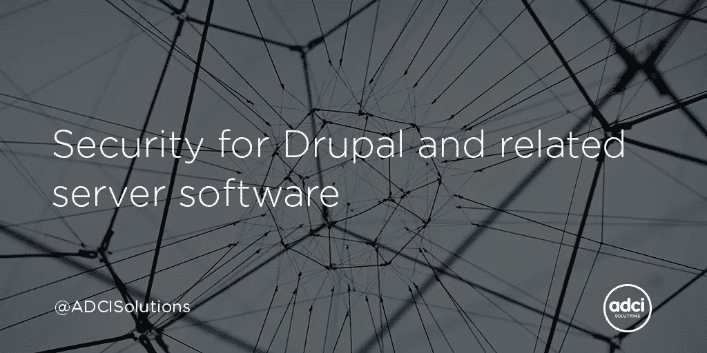
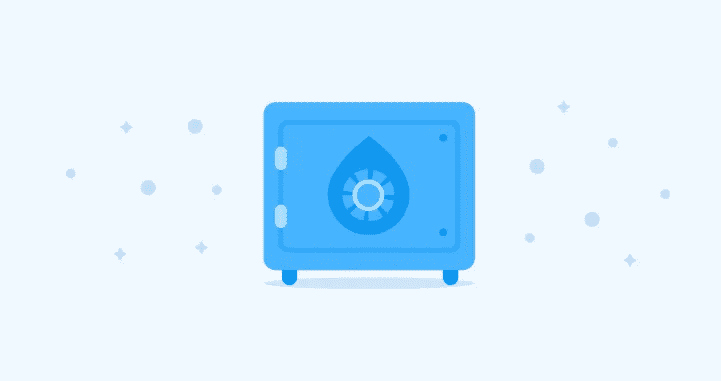

# Drupal 和相关服务器软件的安全性

> 原文：<https://levelup.gitconnected.com/security-for-drupal-and-related-server-software-f7008211f80b>



[由 ADCI 解决](https://www.adcisolutions.com/?utm_source=medium&utm_medium=referral&utm_campaign=medium-story-drupal-security-gitconnected-websiteadci&utm_content=medium-story-drupal-security-gitconnected)

Drupal 是一个开放源码的内容管理系统，具有相当复杂的架构。它还有一个强大的安全模型。多亏了庞大的开发者社区，有很多关于正确配置 **Drupal 网站安全**并保持配置最新的信息文档和有用的例子。

应该记住，Drupal 是运行一个网站所需要的软件的唯一一部分。为了保护整个系统免受黑客攻击，我们需要保护一整套软件。它包括一些常见的服务器设置、web 服务器的配置、PHP 和数据库。此外，服务器上的任何附加软件都需要正确的配置。

本文着重讨论上述关键点。它提供了一些线索，应该有助于服务器和网站管理员审计整个系统的安全性。我们应该明白，创建一个绝对安全的系统是不可能的，但是如果你坚持一些共同的原则，它将有助于在足够的水平上支持你的系统的安全指标。



# 安全原则

让我们从**通用安全规则**开始。其中大部分不仅适用于 Drupal 开发和支持 Drupal 网站运行基础设施的相关安全性，还适用于许多其他情况:

*   使用由大量用户开发的广泛的解决方案。它可以是维护良好的开源库、流行的 Linux 发行版等等。总是检查下载代码的完整性。
*   限制任何附加软件的使用。如果你真的需要安装新的软件，并且没有能力使用已经安装的软件包中的类似功能。卸载所有你不需要的软件。
*   避免编写自定义代码。在你开始做之前，仔细想想你是否能避免这种情况。与 Drupal 开发相关的一个真实情况是，在编写定制模块之前，在 drupal.org 上寻找现成的解决方案。
*   默认情况下拒绝访问。您应该仅在必要时授予对系统中对象的访问权限。
*   添加具有所需权限的角色。每个角色都必须有详细的记录。这样，支持和扩展整个角色/权限系统应该很容易。
*   不要使用超级用户权限。在基于 Linux 的操作系统上，仅在需要时使用 root 访问权限，并通过 sudo 来实现。换句话说，您不应该以 root 用户身份登录。
*   记录一切。首先，它是关于你的系统的任何定制。很容易忘记一些重要的细节，它们可能会在系统更新时丢失。
*   定期对你的系统进行安全检查。你应该仔细分析所有的可疑案例并做出反应。
*   注意备份。您必须始终能够将系统恢复到之前的任何状态。此外，您需要确保系统进行了可行的备份。
*   在服务器得到适当保护之前，不要从互联网打开对服务器的访问。

这些原则可以应用于任何系统，不管它使用一套软件和硬件。然而，还有更具体的关键点我们将进一步讨论。

# 关键安全对象

除了 Drupal 来运行一个网站，还需要配置 PHP、web 服务器和数据库服务器。您可能还想安装一些软件来扩展搜索功能，使用缓存等等。

正如你所看到的，有很多东西需要适当的配置和定期维护。基于以上所述，我们可以区分以下需要在一定程度上确保安全性的对象:

*   服务器(通用设置)
*   网络服务器
*   服务器端编程语言（Professional Hypertext Preprocessor 的缩写）
*   数据库ˌ资料库
*   Drupal

# 服务器(通用设置)

互联网上任何可用服务的安全性都始于服务器的基本配置。对于基于 Linux 的服务器，它可以包括以下步骤:

*   更改服务器的登录过程
*   使用 iptables 设置防火墙

# 更改服务器的登录过程

通过改变登录到服务器的过程，我指的是对默认服务器设置的某种修改。主要目标是使这个过程不同于标准过程。

例如，任何基于 Linux 的系统都有一个名为 *root* 的超级用户。攻击者可以尝试获取该用户的密码。但是，如果服务器管理员关闭了超级用户登录，这种尝试将会失败。我们可以创建一个新用户，然后授予他必要的权限，而不是根用户。

大多数讨论的变化都与 ssh 设置有关。它们通常位于 */etc/ssh/sshd_config* 文件中。看一下这个配置:

```
Port 2345
Protocol 2
PermitRootLogin no
PasswordAuthentication no
UseDNS no
AllowUsers user
```

它允许用户名为 user 的用户使用 2345 端口(非标准)通过 ssh 连接到服务器。它还禁用 root 登录和密码验证。

禁用密码认证是提高整个系统安全性的重要一步。无密码认证更安全。要登录到服务器，您需要在本地机器上生成一个 ssh 密钥对，然后将一个公钥复制到服务器。

# 使用 iptables 设置防火墙

iptables 实用程序是 Linux 系统的默认防火墙。它可用于管理到您指定的端口的连接。如果我们想把网站保留在服务器上，除了 ssh 端口之外，还需要打开 http 和/或 https 端口。

默认情况下，干净的操作系统上没有规则。键入 *sudo iptables -L* 命令(Ubuntu)会返回以下条目:

```
Chain INPUT (policy ACCEPT)
target     prot opt source               destinationChain FORWARD (policy ACCEPT)
target     prot opt source               destinationChain OUTPUT (policy ACCEPT)
target     prot opt source               destination
```

这意味着服务器在任何端口接受来自任何人的任何内容(策略接受)。让我们尝试打开必要的端口，并拒绝连接到输入链的其他端口。

```
sudo iptables -A INPUT -p tcp --dport 2345 -j ACCEPT
sudo iptables -A INPUT -p tcp --dport 80 -j ACCEPT
sudo iptables -A INPUT -p tcp --dport 443 -j ACCEPT
```

这些命令接受到 2345、80 和 443 端口的连接。尽管如此，我们对其他港口仍然没有其他限制。因此，您需要在输入链的末端添加一条规则，以拒绝所有不合适的数据包。

```
sudo iptables -A INPUT -j DROP
```

仅此而已。请记住，根据所选的操作系统，上述设置可能会有很大差异。这里的主要目的只是解释基本原理。更改网络设置时要小心。有时它会使远程服务器无法进行任何连接。

# 网络服务器

设置 web 服务器的一些通用准则。应用这些规则对于网站的运行非常重要。通过利用服务器漏洞，攻击者可以操纵网站文件，上传恶意脚本并以某种方式运行这些脚本。

# 访问网站文件

有一个主要的规则——网站文件应该由非根用户编辑，而不应该由 web 服务器用户写入。在某些情况下，web 服务器的用户可以写 Drupal *文件/* 目录。关于保护文件权限和所有权的详细信息可以在本文末尾的有用链接块中找到。

# 在 web 服务器级别限制对某些页面的访问

有时，在 web 服务器级别限制对网站的几个页面的访问可能是有用的。例如，在您有一个演示网站或网站没有注册功能的情况下。因此，您可以保护*/用户*和*/管理员/** 路线。对于 Apache web 服务器，可以通过使用 mod_authz_host 和 mod_rewrite 模块来完成。请记住，使用 http 身份验证不是一种安全的方法。因此，所描述的方法在给定的情况下更适用。

# 删除未使用的 web 服务器扩展

服务器上的所有附加软件都有潜在的安全风险。所以，你应该尽量减少一套必要的工具。如果你不需要什么东西，就把它移走。

这同样适用于 web 服务器。Apache 和 Nginx web 服务器有许多额外的扩展，可以用于某些目的。仔细检查已启用的扩展列表，并删除所有未使用的扩展。

# 使用 HTTPS

使用 HTTPS 协议使网站和访问私人用户的数据更加安全。如今，当一些在线商店不使用加密进行支付交易时，这是绝对不可能的情况。此外，谷歌将 HTTPS 设定为排名指标。这意味着网站不使用 HTTPS 协议，但同时处理一些重要信息(信用卡详情，支付交易等)。)对搜索排名产生负面影响。

理想的情况是对所有与用户有交互的网站进行加密。这种交互的一个明显例子是登录和注册表单。用户在这些表单中键入他们的密码。即使这些密码在所有浏览器中看不到(就像字段中的黑色圆圈)，它们也是以不加密的形式通过网络传递的。因此，如果攻击者能够访问网络，他们可以很容易地拦截输入的数据。通常情况下，不同服务的用户使用相同的密码。这意味着对其他服务的访问也可能受到影响。

# HTTP 认证

应该清楚在什么情况下可以使用 HTTP 认证。大多数情况下，您需要它来保护对一个临时网站的访问，并禁止搜索机器人对该网站进行索引。然而，HTTP 认证本质上是不安全的。它不使用任何加密算法。因此，您的浏览器和网站之间的流量没有加密，攻击者可以通过复制“授权”HTTP 头并将其发送到 web 服务器来访问网站。

另外，强烈建议将 *htpasswd* 文件保存在文档根目录之外。为此文件设置只读权限(440)。

# 服务器端编程语言（Professional Hypertext Preprocessor 的缩写）

像服务器基础设施的其他部分一样，PHP 也可能包含漏洞。这里很大程度上取决于 PHP 本身的设置和当前使用的 PHP 版本。当然，你总是需要检查所有可用的更新并保持 PHP 更新。然而，在某些情况下，这可能相当困难，甚至是不可能的。

一般来说，所有优化服务器上 PHP 运行的**安全性的工作可以分为三个部分:**

*   PHP 版本的定期更新
*   避免使用不安全的代码、函数等。
*   优化 PHP 设置

# PHP 版本的定期更新

这是显而易见的事情，但正如我提到的，在某些情况下，更新可能非常困难，甚至是不可能的。当您的应用程序中有大量遗留代码(在新的 PHP 版本中不工作)并且当前的业务策略不允许您花时间更新这些代码，因为这是一项耗时的操作时，就会发生这种情况。在这种情况下，您可以尝试应用下面描述的一些建议。

# 避免使用不安全的代码

编写安全的代码是整个应用程序安全的重要一步。您应该定期花一些时间来审查您拥有的所有定制代码。此外，没有人能够保证第三方库不包含任何漏洞。正如我提到的，甚至 PHP 本身也可能存在安全问题(使用不安全的函数、缓冲区溢出等)。).

为了解决这些问题，有一个很好的解决方案叫做 Suhosin，它可以帮助你摆脱许多安全问题。Suhosin 旨在保护服务器和用户免受 PHP 应用程序和 PHP 核心中已知和未知缺陷的影响。它由两部分组成。第一部分是 PHP 核心的补丁，它提供了一些针对缓冲区溢出或格式字符串漏洞的低级保护。第二部分是 PHP 扩展，实现了一些额外的保护。

Suhosin 是一个非常强大的工具，可以保护你的服务器免受很多漏洞的攻击。不幸的是，它不适用于 PHP 7。事实上，Suhosin7 的工作正在进行，但尚未完成。作者不建议在生产服务器上使用 Suhosin7。

# 优化 PHP 设置

为了优化 PHP 安全配置，我们可以采取的两个最简单的步骤是禁用未使用的模块，并最小化用户可以获得的关于当前 PHP 安装的信息量。

要查看所有编译的 PHP 模块，运行以下命令:

```
$ php -m
```

建议只使用最必要的模块来提高安全性。仔细检查整个列表，决定哪些模块你不需要。

保护 PHP 免受黑客攻击不仅是一个准确的编程，而且还隐藏了有关系统的信息。看看 *php.ini* 文件中的这个字符串:

```
expose_php = Off
```

确保该参数已关闭。否则，PHP 将发送已安装的版本来响应 X-Powered-By 头中的所有请求。

同样的事情也适用于网站上的 PHP 错误。他们可以提供一些关于你的服务器的附加信息(网络服务器的类型和版本，目录的结构，等等。).因此，强烈建议在生产服务器上禁用该功能。

```
display_errors = Off
log_errors = On
error_log = /var/log/httpd/php_scripts_error.log
```

上面的设置允许您关闭显示整个网站发生的错误。此外，它们还激活将错误记录到指定文件中。

这些都是初步的步骤，将帮助您提高在服务器上使用 PHP 的安全性，即使没有对系统进行任何重大修改。现在让我们讨论一些可以添加到 PHP 配置(php.ini 文件)中的特定限制:

1.  禁用文件上传
    file_uploads = Off

> 但是，如果这样的功能是必要的，最好限制一个文件的大小。
> 文件上传=开
> 上传最大文件大小= 1M

2.控制系统资源
max _ execution _ time = 30
max _ input _ time = 30
memory _ limit = 50M

> 您可以指定每个脚本的最大执行时间、最大内存量和最大数据读取时间。

3.禁用允许脚本引用其他 url 的 PHP 函数
allow _ URL _ include = Off
allow _ URL _ fopen = Off

> 如果 *allow_url_fopen* 开启，PHP 可以使用 *file_get_contents* 等文件函数。通过它，脚本可以从远程服务器下载文件。

4.禁用危险函数
disable_functions=exec，passthru，shell_exec，system，proc_open，popen，curl_exec，curl_multi_exec，parse_ini_file，show_source

> 在停用之前，请确定您的网站不需要它们中的任何一个。

5.限制对文件系统的访问
open_basedir = "/var/www "

> t*open _ basedir*指令允许你设置一个目录，在这个目录中 PHP 可以使用 *fopen、file_get_contents* 等函数访问文件。如果文件在这个目录之外，PHP 将拒绝打开它。

6.检查会话路径
session.save_path = "/tmp "

> 请确保会话路径在网站根目录之外。此外，它不能被其他系统用户读取或写入。

# 数据库ˌ资料库

您将采取什么措施来确保数据库安全主要取决于您的应用程序的基础结构。例如，Drupal 的数据库抽象层为您提供了在不同数据库之间进行选择的能力。开箱即用，可以是 MySQL、SQLite 或 PostgreSQL。此外，Drupal 支持流行的 MySQL 分支，如 MariaDB 和 Percona。您应该理解，每个系统在安全性方面可能有不同的规范。

这在很大程度上也取决于你把数据库放在哪里。最简单的方法(就安全性而言)是将数据库安装在您拥有网站的同一台服务器上。但是，这种方法会对整个系统的性能产生影响，因此服务器管理员可能会决定将数据库转移到单独的服务器上。对于高负载的应用程序来说尤其如此。

完成服务器环境的配置后，您应该做的第一件事是检查您的基础设施是否足够健壮，它是否不容易被 DoS 攻击破坏。事实上，即使在工作负载的高峰期，服务器也应该有一些资源储备。

正如我前面提到的，数据库安全设置可能非常具体，这取决于所选择的数据库服务器。在本文中，我们来看看一些通用的方法:

*   数据库访问
    如果数据库安装在本地，您可以禁止从网络访问它。如果您的数据库在单独的服务器上，应该可以设置它将监听的 IP 地址。如果在 web 服务器和数据库服务器之间共享局域网，只需设置一个局域网 IP 地址(不能通过互联网访问)。可以通过编辑 my.conf 文件来完成。下面是数据库和网站使用相同服务器时的配置示例。
    绑定地址=127.0.0.1
*   数据库、用户和权限
    检查您的数据库、用户和权限，以便找到任何安全瓶颈。不要给用户比他们实际需要更多的权利。
*   PHPMyAdmin 和类似的工具
    确保在使用图形工具后，禁用它们来处理数据库。如果您打算继续使用这些工具，请尽可能使访问它们变得困难。例如，您可以通过以下方式限制对 PHPMyAdmin 的访问。并允许来自某些可信 IP 地址的访问。此外，除了使用服务器应用程序，您还可以尝试一些本地工具，如 MySQL Workbench。

# Drupal

Drupal 有一个非常复杂的架构。为了确保这个复杂系统的安全，最好将所有相关工作分成小部分。在这个操作过程中，你会遇到一组只需要做一次的任务(设置文件权限，配置 settings.php 文件*等。).会有一些任务需要定期关注(更新 Drupal 和模块)。也许其他人会要求您与 Drupal 社区密切合作。*

以下是你应该记住的两个关键时刻:

*   确保 Drupal 的安全性不是一件容易的事情，但是对于任何网站来说都是非常重要的。所以，你一定要在这方面下功夫。
*   安全需要你的持续关注。

# 文件

确保 web 服务器对 Drupal 文件没有写权限。只有缓存文件、上传、会话和临时目录可能需要写权限。以下命令授予对公共文件目录(Ubuntu/Debian)的写访问权限:

```
$ chown -R www-data:www-data sites/default/files
```

如果您的网站允许上传文件，请注意如何保护处理这些文件的过程。只允许上传某些类型的文件。相对安全的是文本文件和图片。但是，这并不能改变用户可以上传恶意代码的事实，比如带有. jpg 或。txt 扩展名。为了避免这个问题，您可以尝试安装 ClamAV 模块，该模块可以扫描上传的文件中的病毒和其他恶意代码。

# settings.php 档案

初始安装后，确保*settings.php*文件没有写权限。关于这个的信息可以在状态报告页面上找到(Drupal 8 中的 admin/reports/status)。

在*settings.php*文件中你可以设置一个重要的选项，这个选项[可以防止你的网站认为这是别人的](https://www.drupal.org/node/1992030)。这种类型的攻击称为 HTTP POST 头攻击。要保护 Drupal 7 网站免受它们的攻击，请在设置中添加基本 URL 参数:

```
$base_url = 'http://www.example.com';
```

Drupal 8 中类似的东西是可信主机数组:

```
$settings['trusted_host_patterns'] = [
 '^www\.example\.com$',
];
```

为了生成额外的随机数据，Drupal 使用了 salt。盐在 settings.php 文件中也有具体说明。为了增强安全性，您可以将该值放在位于网站根目录之外的某个文件中。在 Drupal 7 中:

```
$drupal_hash_salt = file_get_contents('/home/example/salt.txt');
```

在 Drupal 8 中:

```
$settings['hash_salt'] = file_get_contents('/home/example/salt.txt');
```

# 错误日志

Drupal 提供了一种监控网站状态的机制。这里我指的是最近的日志消息和状态报告页面。尝试定期检查这些页面，并解决发现的问题。状态报告页面非常有用，尤其是在网站安装之后。例如，如果您忘记添加可信主机设置，或者对 settings.php 文件有写权限，它会通知您。通过查看最近的日志消息页面，可以简单地跟踪某些类型的可疑活动。例如，想象一下当您注意到新用户注册激增时的情况。

不要忘记禁用 PHP 错误的显示。普通用户不应该看到它们。尽管您可能会在最近的日志消息页面上看到这些错误，但是请记住，它并没有捕获所有的 PHP 错误。所以，有时要检查你的服务器日志文件。

# Drupal 核心和贡献模块的变化

这一部分是关于 Drupal 核心和贡献模块的可能攻击。事实上，众所周知，新开发人员可能会偷工减料，将他们的代码或一些更改直接放入 Drupal core 或已安装的贡献模块中。这可能会导致 Drupal 本身不可预测的行为，以及漏洞的出现。

为了避开这些问题，我推荐使用黑客！模块。这个模块扫描当前安装的 Drupal，贡献的模块和主题，并与 drupal.org 的相应版本进行比较。如果你安装了 Diff 模块，被黑了！会告诉您具体更改了哪些行。这一切都让黑客们瞠目结舌！模块对任何网站来说都是一个有价值的分析工具。

# 用户和权限

Drupal 有一个直观的、可定制的权限模型。许可是这种系统中最简单的元素。一组权限可以按角色分组。那么这个角色可以被分配给特定的用户。在 Drupal 核心和贡献模块的更新过程中，可能会出现新的权限和角色。您应该定期检查(例如，在更新后)在您的网站上为每个用户分配了哪些角色，以及这些角色包含哪些权限。尽量减少每个角色中包含的权限集。不要给用户比他们真正需要的更多的权限。

一个好的安全实践是对*用户/1* 使用非标准用户名(例如，不是*管理员*或*根用户*，因为攻击者会首先检查标准变体。为了更安全，甚至可以[完全禁用 user/1 帐户。](https://www.drupal.org/node/947312)

另一件好事是检查用户在你的网站上的活动，并锁定不活跃的账户。用户过期模块提供了定义特定用户帐户锁定日期的功能。此外，它还可以锁定一段时间内不活动的帐户。

# 有用的模块

根据你的需要，你可以在 drupal.org 上找到很多有用的安全模块。以下是其中一些的简要列表:

*   [被黑！](https://www.drupal.org/project/hacked)
*   [安全套件](https://www.drupal.org/project/seckit)
*   [安全审查](https://www.drupal.org/project/security_review)
*   [妄想症](https://www.drupal.org/project/paranoia)
*   [ClamAV](https://www.drupal.org/project/clamav)
*   [安全权限](https://www.drupal.org/project/secure_permissions)
*   [密码政策](https://www.drupal.org/project/password_policy)
*   [安全登录](https://www.drupal.org/project/securelogin)
*   [http:BL](https://www.drupal.org/project/httpbl)
*   [双因素认证(TFA)](https://www.drupal.org/project/tfa)
*   [盾牌](https://www.drupal.org/project/shield)
*   [会话限制](https://www.drupal.org/project/session_limit)

# 结论

在本文中，我们回顾了一些旨在保护网站安全的实践。审查还涵盖了必要基础设施的所有部分——从公共服务器设置到一些 Drupal 模块的特定用例。

许多人忽略了监控他们的站点和服务器基础设施的安全性，直到出现明显的问题。虽然即使遵守一些简单的规则也会有助于避免它们的出现。因此，请保持耐心，并时刻关注您系统的安全性。祝你好运！

*原帖* [*于 ADCI 解决方案网站*](https://www.adcisolutions.com/knowledge/security-drupal-and-related-server-software?utm_source=medium&utm_medium=referral&utm_campaign=medium-story-drupal-security-gitconnected-articles&utm_content=medium-story-drupal-security-gitconnected) *。*

**作者是 ADCI 解决方案团队负责人叶夫根尼·列昂诺夫**

展示项目中不同角色的同等熟练程度:从开发人员到团队领导。尽管 Evgeny 是一个丰富技术堆栈的专家，但他设法在弹吉他、学日语和健身之间保持平衡。


**在社交网络上关注我们:** [Twitter](https://twitter.com/ADCISolutions) | [脸书](https://www.facebook.com/adcisolutions/) | [LinkedIn](https://www.linkedin.com/company/adci-solutions/)

[](/drupal-8-core-and-symfony-components-e5272561d304) [## Drupal 8 核心和 Symfony 组件

### 距离 Drupal 8 发布已经过去了很多时间。而不是仅仅使用面向钩子的范例和…

levelup.gitconnected.com](/drupal-8-core-and-symfony-components-e5272561d304)