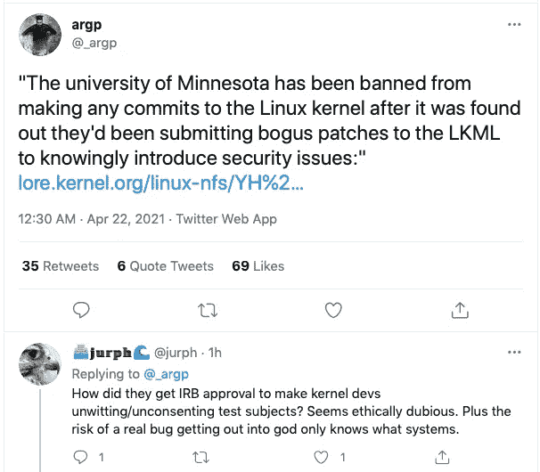
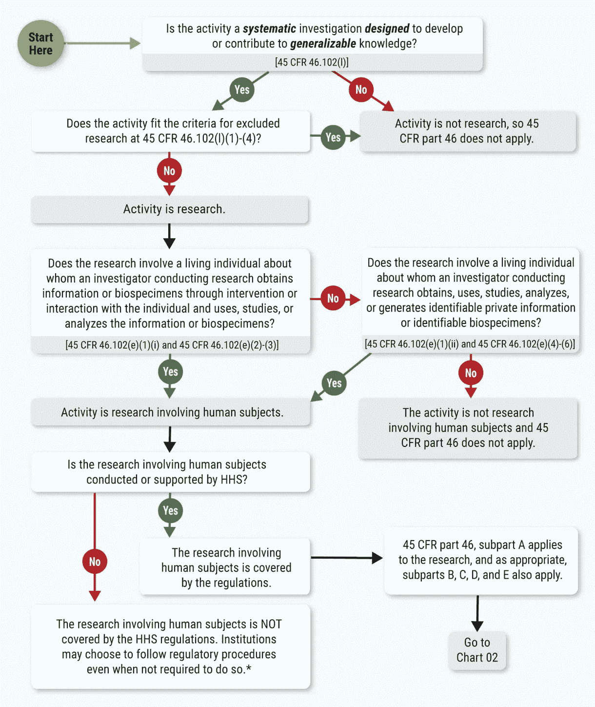

# 安全研究伦理评论

> 原文：<https://levelup.gitconnected.com/security-research-ethics-review-cdcabf1bbabf>

## 主题是什么，肯尼斯？

乐队 R.E.M .在他们 1994 年的专辑 *Monster* 中发布了一首歌曲，灵感来自一天晚上两个穿着得体的人在电视新闻主播丹·拉瑟回家的路上对他进行人身攻击，同时要求他回答一个问题:

> [“肯尼斯，频率是多少？](https://en.wikipedia.org/wiki/What%27s_the_Frequency,_Kenneth%3F)

幸运的是，拉瑟在袭击中没有受到严重伤害。

这个问题让*完全*没有道理。

(尽管这张专辑赚了很多钱！)

当涉及到对涉及计算机安全的研究进行伦理审查时，有些情况似乎同样没有意义。

[https://twitter.com/_argp/status/1385133843452243969](https://twitter.com/_argp/status/1385133843452243969)

## 学术研究中的伦理

以下[声明](https://cse.umn.edu/cs/statement-cse-linux-kernel-research-april-21-2021)发布于 2021 年 4 月 21 日:

> 明尼苏达大学计算机科学与工程系的领导今天了解到该系一名教师和研究生对 Linux 内核安全性进行研究的详细情况。所使用的研究方法引起了 Linux 内核社区的严重关注，到今天为止，这已经导致该大学被禁止为 Linux 内核做贡献。
> 
> 我们非常重视这种情况。我们已经立即中止了这项研究。我们将调查研究方法和批准该研究方法的流程，确定适当的补救措施，并在必要时防范未来问题。我们将尽快向社区报告我们的发现。
> 
> 真诚地
> 
> Mats Heimdahl，部门主管
> Loren Terveen，部门副主管

该声明是对 Linux 内核开发人员社区针对一系列补丁提交的行动的回应*故意将漏洞*引入广泛使用的源代码，以观察社区将如何回应。

 [## 回复:[补丁] SUNRPC:加一张 gss_release_msg - Greg KH 的支票

### 发件人:Greg KH 收件人:Aditya Pakki 抄送:Leon Romanovsky，“J. Bruce Fields”，Chuck Lever，Trond Myklebust，Anna Schumaker…

lore.kernel.org](https://lore.kernel.org/linux-nfs/YH%2FfM%2FTsbmcZzwnX@kroah.com/) 

邮件线程中提到的纸张被镜像到[回程机](http://web.archive.org/web/20210421133705/https://raw.githubusercontent.com/QiushiWu/qiushiwu.github.io/main/papers/OpenSourceInsecurity.pdf)上。在这篇文章中，研究人员描述了他们确保他们提交的易受攻击补丁不会造成伤害的方法:

> 在实验中，我们的目的是证明通过伪君子行为秘密引入漏洞的可行性。我们的目标是不引入伤害操作系统的漏洞。因此，我们安全地进行实验，以确保引入的 UAF 错误不会合并到实际的 Linux 代码中。除了引入 UAF 条件的小补丁，我们还准备了修正小问题的正确补丁。我们通过电子邮件向 Linux 社区发送小补丁，以寻求他们的反馈。幸运的是，在补丁的确认和合并之间有一个时间窗口。一旦维护者确认了我们的补丁，例如，一封表明“看起来不错”的电子邮件回复，我们立即通知维护者引入了 UAF，并要求他们不要继续应用补丁。同时指出了 bug 的正确修复，并提供了我们正确的补丁。在这三种情况下，维护者明确承认并确认不会继续使用不正确的补丁。所有引入 UAF 的补丁都只停留在电子邮件交换中，甚至没有成为 Linux 分支中的 Git commit。因此，我们确保我们引入的 UAF 错误不会被合并到 Linux 内核的任何分支中，任何 Linux 用户都不会受到影响。

主要的争议出现在下一段讨论研究伦理的地方。它是这样开始的:

> 本实验研究修补流程的问题，而不是个人行为，我们不会收集任何个人信息。我们向 Linux 社区发送电子邮件，寻求他们的反馈。这个实验不是责备任何维护者，而是揭示过程中的问题。明尼苏达大学的 IRB 审查了实验的程序，并确定这不是人体研究。我们获得了一份正式的 IRB 豁免函。

对于许多人来说，这就是事情开始变得没有意义的地方，就像上面的推文一样。

最后一句话暗示明尼苏达大学机构审查委员会(IRB)“审查了程序”，并给了研究人员一封正式的“IRB 豁免函”。

那么…研究*通过了*伦理审查，对吗？

我是 IRB 委员会的成员大约有六年了。我是参与国土安全部“ [Menlo Report](https://papers.ssrn.com/sol3/papers.cfm?abstract_id=2145676) ”工作组在信息和通信技术(ICT)研究背景下解读“人体受试者研究”的大约 24 人之一。我和一些同事一起[写了几篇关于计算机安全研究中的伦理和“黑客入侵”的论文](https://davedittrich.github.io/writing.html)(我会在本文末尾列出一些相关的出版物。)

根据我的经验，我可以说更准确的说法是，美国管理研究伦理的法规通常不要求研究接受审查 ，如果人类(或识别人类的数据，或操纵人类存在的环境等。)不直接作为研究对象参与。

是的，从技术上来说，对一份研究申请有一个初步审查(一会儿我会展示一个流程图)。一些合格的*风险最小的*研究可以通过*管理人员的快速审查*。但是，如果研究方案和研究环境不符合特定的监管要求，研究*不会提交给委员会*进行任何严格的伦理审查。

由于这项研究在申请回复信中被视为豁免，它可能只通过了初步审查。

如果你没有得到联邦政府的资助，比方说你是一名私营部门的研究人员，你根本就不受这些规定的约束。

 [## 在研究人员提交了易受攻击的 Linux 补丁后，大学暂停了项目

### 一个 Linux 维护者承诺停止接受明尼苏达大学提交的代码，在一个研究小组…

www.darkreading.com](https://www.darkreading.com/application-security/university-suspends-project-after-researchers-submitted-vulnerable-linux-patches/d/d-id/1340799) 

## 肯尼斯，主题是什么？

源代码的补丁是*不是人*。我认为没有人会对此有异议。

人类接受还是拒绝修补程序(研究人员在论文中描述的“修补过程”)并不能使这项研究成为人体实验研究。

在收集数据时选择匿名互动是在*欺骗*参与研究时做的事情，这是一个与受试者可识别性分开的单独的伦理问题。

 [## 《社会蜜罐的伦理》——大卫·迪特里希，2015 年

### 本文考虑了一些围绕社会网络中恶意行为研究的伦理问题…

journals.sagepub.com](https://journals.sagepub.com/doi/full/10.1177/1747016115583380) 

想想吧。当*刚刚*告诉某人你*要*愚弄他们，然后*试着*愚弄他们的时候，在获得某人的知情同意后*你会得到有效的实验结果吗？*

这使得*没有*意义。

避免收集任何可识别的信息作为被明确描述为“实验”的一部分——这意味着*是研究*，这是可能要求 IRB 审查该研究的主要标准——会导致该研究免于审查吗？

这是流程图:

图表 01:45 CFR Part 46 是否涵盖人体受试者研究活动？(来源:[https://www . hhs . gov/ohrp/regulations-and-policy/regulations/45-CFR-46/common-rule-subpart-a-46104/index . html](https://www.hhs.gov/ohrp/regulations-and-policy/regulations/45-cfr-46/common-rule-subpart-a-46104/index.html))

有趣的是。本图表引用的是美国联邦法规的一部分——45 CFR 46——它被资助人体受试者研究的所有美国联邦政府机构采用，这就是它被称为*通用规则*的原因。你最近听说过关于人们*因为在梅毒患者身上进行的 Tuskeegee 实验而不信任*政府关于新冠肺炎疫苗的声明吗？是的，*这项研究是这个普遍规律存在的主要原因之一。*

*回到审查豁免的问题上来，这似乎源于 [45 CFR 46.104](https://www.hhs.gov/ohrp/regulations-and-policy/regulations/45-cfr-46/common-rule-subpart-a-46104/index.html) (d)(2)，其豁免的人类受试者研究类别列表包括(**加粗**以便于理解):*

> *(2) **仅包括涉及**教育测试(认知、诊断、能力倾向、成就)、调查程序、访谈程序或**公共行为观察**(包括视觉或听觉记录)**的互动的研究，前提是至少满足以下标准之一**:*
> 
> *(i) **研究者记录所获信息的方式使得人类受试者的身份无法直接或通过与受试者相关的标识符轻易确定**；
> (ii)在研究之外披露人类受试者的回答不会合理地使受试者面临刑事或民事责任的风险，也不会损害受试者的财务状况、就业能力、教育发展或声誉；或者
> (iii)研究者记录所获得的信息，以便能够直接或通过与受试者相关的标识符确定人类受试者的身份，IRB 进行有限的 IRB 审查以做出 [46.111(a)(7)](https://www.hhs.gov/ohrp/regulations-and-policy/regulations/45-cfr-46/revised-common-rule-regulatory-text/index.html#46.111(a)(7)) 要求的决定。*

*实际上，我不确定电子邮件地址是不是与人类相关的标识符，但是让我们把那些双重否定的东西放在一边。*

*必须满足(2)中的一个要求标准，因此满足(2)(i)意味着研究可以被视为豁免。(2)(ii)可能*不*被满足并不重要(这种描述可以概括禁止提交补丁的动机)。*

## *潜在危害人类的研究*

*门洛报告作为*公告*在《联邦公报》上发表，并通过了公开的公众意见和修订程序。它不是通过监管来约束的。*

*Menlo 报告工作组这样总结这个问题:*

> *总的来说，共同规则的目的是保护可能受到伤害的人不参与研究，而不仅仅是人类是否参与研究。混乱始于【条例】的措辞和术语 ***【人类】*** 和 ***研究主题*** 的联系，并继续与确定**风险以及如何在一项研究中 ***保护人类*** 有关。***
> 
> ***一种应用伦理原则来保护可能受到研究影响的人类的进化范式考虑了具有**潜在伤害人类的活动，而不是简单地看研究是否涉及 ***人类受试者*** 。研究人员可能与之互动的潜在伤害人类的 ICT 人工制品的例子包括在线虚拟世界中的化身、控制受损机器的恶意软件、控制生物功能的嵌入式医疗设备或关键基础设施的过程控制器。自从正式规范的研究开始以来，信通技术带来了巨大的变化，这就需要对涉及信通技术的研究的伦理原则的应用进行重新构思。*****

***几年前，共同规则也经历了一个*提议的规则制定*和公开的公众意见征询过程。最近的变化朝着另一个方向发展，旨在通过增加豁免研究的数量，允许一些研究人员自我声明他们的研究被豁免，使用新的快速审查程序等来减轻审查负担。，都维持着狭隘的“人类主体”焦点。***

***除了考虑对人类有害的研究之外，Menlo 报告还提出了在这种情况下会有所帮助的另外两件事:***

*   ***使用*全面的利益相关者分析*(这将考虑内核开发人员社区、电子邮件线程的读者在搜索代码示例时错误地找到易受攻击的补丁的可能性，以及在他们自己的代码中引入漏洞，最终在这些系统被入侵时对人类造成伤害，等等。)***
*   ***名为*尊重法律和公共利益*的新附加原则，旨在解决法律、政策、行为准则或使用政策等的透明度和问责制问题。如果 Linux 内核开发人员社区现在还没有一个涵盖这类活动的政策或行为准则，我想很快就会有了。***

***我上面提到的关于社交蜜罐伦理的[文章](https://journals.sagepub.com/doi/full/10.1177/1747016115583380)更详细地介绍了学术界的伦理审查法规，展示了利益相关者的分析，甚至包括模拟 IRB 应用语言和关于欺骗的述职声明。我故意这样写是为了帮助计算机安全研究人员开发研究协议和与他们的 IRB 一起工作。***

## ***你能做什么？***

***这种情况呈现了一个可教的时刻！***

***如果这种伦理审查的情况对你没有意义，你可以通过 [**了解更多关于这些问题的**](https://davedittrich.github.io/_downloads/dbd2009tr1.pdf) ，与你认识的研究人员分享本文中的资源，以及**参与关于它们的建设性对话**来提供帮助。***

***如果您是 ACM、IEEE 或 FIRST(计算机安全社区的成员)的成员，请查看他们的**道德行为准则和相关案例研究**。如果你还不是会员，考虑加入吧！***

*** [## 看看最近更新的三个职业道德准则

### 推进应对网络犯罪的伦理思考

medium.com](https://medium.com/swlh/a-look-at-recent-updates-to-three-professional-ethical-codes-5ba0853a739f) 

如果你是一名学术研究人员，看看[门洛报告](https://www.dhs.gov/sites/default/files/publications/CSD-MenloPrinciplesCORE-20120803_1.pdf)和[门洛报告的附录](http://www.dhs.gov/sites/default/files/publications/CSD-MenloPrinciplesCOMPANION-20120103-r731_0.pdf)和**在制定你的研究方案时使用它们**。令人高兴的是，这些文件确实在研究论文中被频繁引用。

你也可以在当地高等教育机构的学生团体中展开讨论。让学生在学术生涯的早期接触伦理有助于他们思考这个话题，并学会如何思考这个问题。正如我们在[我们的论文](https://davedittrich.github.io/_downloads/dbd2009tr1.pdf)中指出的，伦理通常不是大学学位项目的要求，而且让一个会议项目委员会在几个月的工作后拒绝你的论文*不是你学习伦理的理想时间*！我写[社会蜜罐论文](https://journals.sagepub.com/doi/full/10.1177/1747016115583380)时就考虑到了这样的讨论(以模拟 IRB 应用程序的形式)。

最后，考虑自愿加入当地大学的机构审查委员会。他们需要有一些非科学家的公民委员会成员，这尤其有助于让那些具有计算机安全背景的人审查涉及 ICT 组件和可识别医疗数据的研究。

你还可以了解到许多有趣的新研究，这些研究就在你身边。例如，你知道*粪便移植*是一种有效的医疗手段吗？！？是的，*那个*“粪便！”

 [## 你不会相信这是怎么回事:粪便移植

### 广告政策克利夫兰诊所是一个非营利性的学术医疗中心。在我们的…上做广告

health.clevelandclinic.org](https://health.clevelandclinic.org/despite-the-ick-factor-fecal-procedure-works-wonders/) 

好吧，那个其实*做*有道理。

## 附言

我用了一首 R.E.M .的歌作为隐喻的工具，而不是南方公园[丘巴卡辩护](https://en.wikipedia.org/wiki/Chewbacca_defense)，你不高兴吗？

## 您可能感兴趣的相关出版物

[2012 年互联网人口普查数据集的伦理审查:Menlo Report 案例研究](http://ieeexplore.ieee.org/xpl/articleDetails.jsp?arnumber=7128817)，作者 David Dittrich、Katherine Carpenter 和 Manish Karir，[2014 年 IEEE 伦理研讨会](http://sites.ieee.org/ethics-conference/students-ethics-competition/)，2014 年 5 月。(*最佳论文*奖亚军)

[所以你想接管一个僵尸网络…](https://www.usenix.org/system/files/conference/leet12/leet12-final23.pdf) ，作者 David Dittrich，LEET '12:关于大规模利用和紧急威胁的第五次 USENIX 研讨会，2012 年 4 月。([载玻片和纸](https://www.usenix.org/conference/leet12/so-you-want-take-over-botnet))

[关于远程缓解僵尸网络的道德决策案例研究](https://davedittrich.github.io/_downloads/wecsr2010-botethics-dlw.pdf)，David Dittrich、Felix Leder 和 Tillmann Werner，2010 年计算机安全道德研讨会(WECSR)，西班牙特内里费，2010 年 1 月

[应对网络冲突面临的冲突](http://www.usenix.org/publications/login/2009-12/index.html)，大卫·迪特里希，USENIX；登录:第 34 卷，第 6 期，2009 年 12 月，第 7-15 页

[David Dittrich 和 Kenneth Einar Himma 著的《主动应对计算机入侵](http://papers.ssrn.com/sol3/papers.cfm?abstract_id=790585)》，第三卷，第 182 章，“信息安全手册”，Hossein Bidgoli、John Wiley and Sons 编辑，ISBN 0–471–64833–7(2005)***