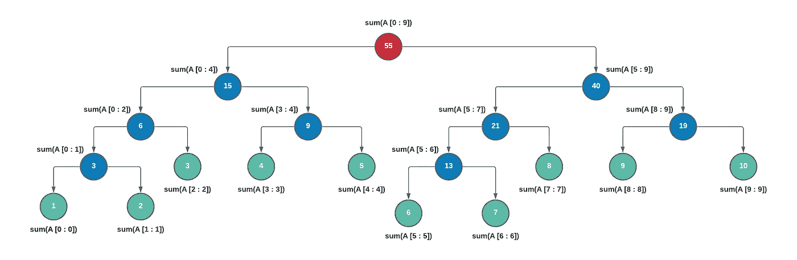

# 分段树

> 原文：<https://levelup.gitconnected.com/segment-tree-640d1e0fee6f>

对细分树的全面介绍

照片由 [Fotis Fotopoulos](https://unsplash.com/@ffstop?utm_source=medium&utm_medium=referral) 在 [Unsplash](https://unsplash.com?utm_source=medium&utm_medium=referral) 上拍摄

# 1.什么是细分树？

假设我们有一个大小为 **N** 的数组 **A** 。数组的一个**段**是形式为 **A[i : j]** 的数组的连续部分，使得 **0 ≤ i ≤ j ≤ N-1** 。

一个**段树**本质上是一个二叉树，在它的节点中我们存储了关于线性数据结构(如数组)的段的信息。现在不要担心什么样的信息。我们将在本文后面的部分中对此进行研究。

*   片段树的根节点将包含关于片段**A【0:N-1】**的信息
*   根节点的左子节点将包含关于片段 **A[0 : (N-1)/2]** 的信息，
*   根节点的右子节点将包含关于片段 **A[ 1+((N-1)/2) : (N-1) ]** 的信息，等等。

简单地说，根节点包含关于整个数组的信息，它的左子节点包含关于数组左半部分的类似信息，根节点的右子节点包含关于数组右半部分的信息，依此类推。因此，在每一步(树的级别)，我们将段分成两半，并且进一步的子节点包含关于这两半的信息。

这一直持续到我们到达包含数组 **A** 本身的元素的叶节点。**第 I 个**叶节点包含**A【I】**。因此，我们可以说将有 N 个叶节点，树的高度是以 2 为底的对数。

**注:**数组的段树一旦建立，其结构就不能改变。我们可以更新节点的值，但不能改变细分树的结构。也就是说，我们不能向数组中添加更多的元素，并期望段树进行更新。在这种情况下，我们将不得不创建一个新的细分树。但是，我们可以更新数组的值，细分树也应该相应地更新。

分段树允许以下两种操作:

*   **更新:**该操作允许我们更新数组 **A** 的值，并在段树中反映相应的变化。
*   **查询:**该操作允许我们对数组进行范围查询。例如，假设我们有一个大小为 15 的数组，我们希望找到数组段中的最大元素，该数组的起始索引为 **3** ，结束索引为 **9** 。这是一个范围查询的例子。

因此，我们可以说，当我们要在一个数组上执行大量基于范围的查询以及在同一个数组上进行值更新时，段树就派上了用场。创建细分树的过程需要一些时间，但一旦完成，范围查询的操作就会变得非常快。

# 2.细分树包含什么样的信息？

现在我们对细分树的结构有了基本的了解，让我们看看细分树包含什么样的信息。

考虑一个数组 **A = [1，4，5，8，0，13]**

现在，细分树总是与一条特定信息相关联，这条信息与我们希望执行的范围查询类型直接关联。其中几个例子如下:

*   求 A[i : j]范围内数组元素的和/积
*   找出范围 A[i : j]中的最大/最小元素
*   找出范围 A[i : j]中偶数/奇数/质数等的计数

根据用途的不同，还可以有很多其他的。让我们来看看如何利用段树来寻找给定范围中元素的**和。**

# 3.创建细分树

假设我们有一个数组 **A = [1，2，3，4，5，6，7，8，9，10]** ，我们希望找到给定范围内元素的总和。那么每个节点将存储其子节点的总和，除了存储数组元素的叶节点。

那么相同的细分树将看起来像这样

红色节点是根节点，蓝色节点是内部节点，绿色节点是叶节点。每个节点都包含有关数组特定段的信息。在这个例子中，

*   根节点包含数组中所有元素的总和
*   根节点的左子节点包含关于数组左半部分的和的信息，即**【1，2，3，4，5】**。它的左孩子依次包含段**【1，2，3】**的和，右孩子包含段**【4，5】**的和，依此类推。
*   根节点的右子节点包含关于数组左半部分的和的信息，即**【6，7，8，9，10】**。它的左子又包含段**【6，7，8】**的和，右子包含段**【9，10】**的和，依此类推。

比方说，如果我们想要计算最大元素，那么我们将把最大元素存储在相应节点的每个段中。因此，在构建细分树之前，必须弄清楚构建树背后的意图以及要存储在树节点中的值的类型。

因此，我们还可以注意到，段树始终是一个完整的二叉树，即每个节点有 2 个或 0 个子节点。

# 参考

*   [分段树](https://www.hackerearth.com/practice/data-structures/advanced-data-structures/segment-trees/tutorial/)
*   [分段树(递归实现)](https://www.geeksforgeeks.org/segment-tree-set-1-sum-of-given-range/)
*   [分段树(迭代实现)](https://www.geeksforgeeks.org/iterative-segment-tree-range-minimum-query/)