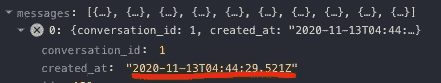
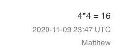
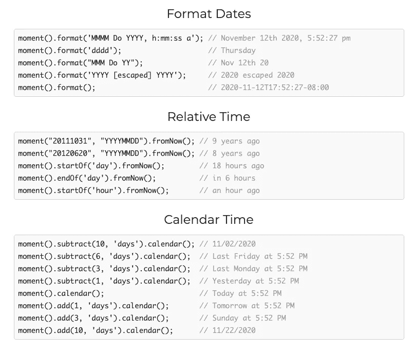
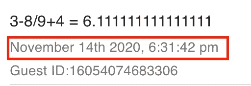

# 抓住时机

> 原文：<https://levelup.gitconnected.com/seize-the-moment-js-43b3210a27a5>

## 在 React 中将 Ruby 字符串转换为本地时间


在 [Unsplash](https://unsplash.com?utm_source=medium&utm_medium=referral) 上由 [Fabrizio Verrecchia](https://unsplash.com/@fabrizioverrecchia?utm_source=medium&utm_medium=referral) 拍摄的照片

在最近的一次编码挑战中，我的任务是构建一个聊天应用程序。其中一个要求是显示消息发布的时间。我首先想到的是使用我的 fetch 提供的 Ruby created_at 字符串。但是，该字符串看起来像这样:



来自 Ruby on Rails 后端的 Created_at 字符串

我的下一个想法是转换我的后端 rails 模型中的日期，但这也被证明是有问题的，因为通过的时间是 UTC。

```
# app/models/application_record.rb**class** ApplicationRecord < ActiveRecord::Base
   self.abstract_class = true **def** created_at
      attributes['created_at'].strftime("%Y-%m-%d %H:%M %Z")
   **end****end** 
```



聊天应用程序中的渲染

此外，我当时居住的时区与我申请的公司所在的时区不同。

我对这个问题的解决方案是以 Moment.js 的形式出现的。Moment 是一个 JavaScript 日期和时间库，专门用来处理这类问题。你可以在这里看到他们有用的文档[或者下面的一些例子。](https://momentjs.com/)



Moment.js 示例来自[https://momentjs.com/](https://momentjs.com/)

在我的聊天应用程序中，另一个要求是只显示最近的十条消息，最近的在顶部，最近的在底部。我的应用程序需要允许许多用户同时发帖，因此，我需要非常精确地对我的帖子进行排序。因此，我对我之前提到的 Ruby 字符串进行了排序，并且直到最低可能的组件才使用 Moment.js。我使用的组件是一个函数组件。源代码见下文。

```
// src/components/chatbox/MessageCard.js**import** React from "react";
**import** Grid from "@material-ui/core/Grid";
**import** ListItem from "@material-ui/core/ListItem";
**import** ListItemText from "@material-ui/core/ListItemText";**const** moment = require("moment");**const** MessageCard = (props) => { **let** dateString = props.timestamp; **let** dateObj = new Date(dateString); **let** momentObj = moment(dateObj); **let** momentString = momentObj.format("MMMM Do YYYY, h:mm:ss a"); **return** ( <ListItem> <Grid item xs={12}> <ListItemText align="left" secondary={momentString}>
           </ListItemText> </Grid> </ListItem> );};**export** default MessageCard;
```



聊天应用程序中的最终渲染

我希望这个博客能帮助你在将来的应用中格式化日期和时间。在即将到来的博客中，我将讨论 WebSockets，它使我能够在消息发生时记录消息，并与连接到该应用程序的每个人分享这些消息。