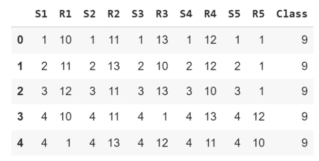
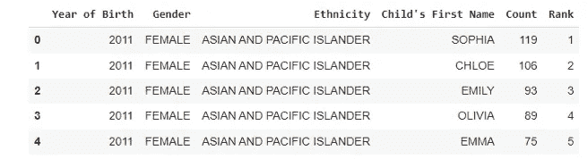
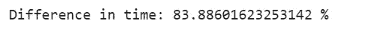
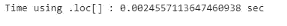
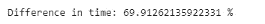
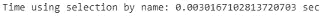
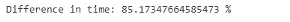

# 有效地选择和替换 Pandas 数据框架中的值

> 原文：<https://levelup.gitconnected.com/selecting-replacing-values-in-pandas-dataframe-effectively-69c5cee9f526>

作为一名数据科学家，使用正确的工具和技术来充分利用数据是非常重要的。Pandas 库是一个非常棒的数据操作、分析和可视化工具，也是任何数据科学家工具箱中必不可少的一部分。然而，有效地使用熊猫是一个挑战，这会导致时间和精力的浪费。

幸运的是，有一些最佳实践可以帮助数据科学家充分利用他们的熊猫体验。从使用矢量化操作到利用内置函数，这些最佳实践将帮助数据科学家使用 Pandas 快速准确地分析和可视化数据。了解并应用这些最佳实践将有助于数据科学家提高工作效率和准确性，从而更快地做出更好的决策。

在本文中，我们将重点关注您通常会在数据框架上执行的两个最常见的任务，尤其是在数据科学项目的数据操作阶段。这两个任务是有效地选择特定和随机的行和列，以及使用 **replace()** 函数使用列表和字典替换一个或多个值。


照片由[丹尼·米勒](https://unsplash.com/@redaquamedia?utm_source=medium&utm_medium=referral)在 [Unsplash](https://unsplash.com?utm_source=medium&utm_medium=referral) 拍摄

## 目录:

1.  为什么我们需要高效的编码？
2.  使用有效地选择行和列。iloc[] &。位置[]
3.  有效替换数据帧中的值
4.  选择和替换值的最佳实践摘要

您可以在 GitHub 资源库中找到本文中使用的数据和代码:

[](https://github.com/youssefHosni/Efficient-Python-for-Data-Scientists) [## GitHub-youssefHosni/面向数据科学家的高效 Python

### 作为数据科学家学习如何编写高效的 python 代码如何编写 Python 干净的代码[文章]编写高效…

github.com](https://github.com/youssefHosni/Efficient-Python-for-Data-Scientists) 

在本文中，我们将使用三个数据集:

*   [**扑克牌游戏数据集**](https://github.com/youssefHosni/Advanced-Python-for-Data-Scientists/blob/main/Datasets/poker_hand.csv)
*   [**流行的宝宝名字**](https://github.com/youssefHosni/Advanced-Python-for-Data-Scientists/blob/main/Datasets/Popular_Baby_Names.csv)

第一个数据集是 [**扑克牌游戏数据集**](https://github.com/youssefHosni/Advanced-Python-for-Data-Scientists/blob/main/Datasets/poker_hand.csv) ，如下所示。

```
poker_data = pd.read_csv('poker_hand.csv')
poker_data.head()
```



在每一轮扑克游戏中，每个玩家手里都有五张牌，每张牌都有其符号和等级，符号可以是红心、方块、梅花或黑桃，等级从 1 到 13 不等。该数据集由一个人可能拥有的五张卡的所有可能组合组成。

*   Sn:第 n 张牌的符号，其中:1(红心)，2(方块)，3(梅花)，4(黑桃)
*   Rn:第 n 张牌的等级，其中:1(王牌)，2–10，11(杰克)，12(王后)，13(国王)

我们将使用的第二个数据集是 [**流行的婴儿名字**](https://github.com/youssefHosni/Advanced-Python-for-Data-Scientists/blob/main/Datasets/Popular_Baby_Names.csv) 数据集，它包括 2011 年至 2016 年间给新生儿起的最流行的名字。数据集已加载，如下所示:

```
names = pd.read_csv('Popular_Baby_Names.csv')
names.head()
```



该数据集包括按年份、性别和种族划分的美国最受欢迎的名字等信息。例如，2011 年，克洛伊这个名字在所有亚裔和太平洋岛民的新生儿中排名第二。

**如果你想免费学习数据科学和机器学习，看看这些资源:**

*   免费互动路线图，自学数据科学和机器学习。从这里开始:[https://aigents.co/learn/roadmaps/intro](https://aigents.co/learn/roadmaps/intro)
*   数据科学学习资源搜索引擎(免费)。将你最喜欢的资源加入书签，将文章标记为完整，并添加学习笔记。[https://aigents.co/learn](https://aigents.co/learn)
*   想要在导师和学习社区的支持下从头开始学习数据科学吗？免费加入这个学习圈:[https://community.aigents.co/spaces/9010170/](https://community.aigents.co/spaces/9010170/)

如果你想在数据科学&人工智能领域开始职业生涯，但不知道如何开始。我提供数据科学指导课程和长期职业指导:

*   长期指导:[https://lnkd.in/dtdUYBrM](https://lnkd.in/dtdUYBrM)
*   辅导课程:[https://lnkd.in/dXeg3KPW](https://lnkd.in/dXeg3KPW)

***加入*** [***中等会员***](https://youssefraafat57.medium.com/membership) ***计划继续无限制学习。如果你使用下面的链接，我会收到一小部分会员费，不需要你额外付费。***

[](https://youssefraafat57.medium.com/membership) [## 加入我的介绍链接媒体-优素福胡斯尼

### 阅读 Youssef Hosni(以及媒体上成千上万的其他作家)的每一个故事。您的会员费直接支持…

youssefraafat57.medium.com](https://youssefraafat57.medium.com/membership) 

# 1.为什么我们需要高效的编码？

高效代码是指执行速度更快、计算内存更少的代码。在本文中，我们将使用 **time()** 函数来测量计算时间。这个函数测量当前时间，所以我们将在代码执行前和执行后把它赋给一个变量，然后计算差值，就知道代码的计算时间。下面的代码显示了一个简单的例子:

```
import time
# record time before execution
start_time = time.time()
# execute operation
result = 5 + 2
# record time after execution
end_time = time.time()
print("Result calculated in {} sec".format(end_time - start_time))
```

让我们看一些应用高效代码方法将如何提高代码运行时间和降低计算时间复杂性的例子:我们将计算从零到一百万的每个数字的平方。首先，我们将使用 list comprehension 来执行这个操作，然后使用 for 循环重复相同的过程。

第一次使用列表理解:

```
#using List comprehension 

list_comp_start_time = time.time()
result = [i*i for i in range(0,1000000)]
list_comp_end_time = time.time()
print("Time using the list_comprehension: {} sec".format(list_comp_end_time -
list_comp_start_time))
```


现在我们将使用 for 循环来执行相同的操作:

```
# Using For loop

for_loop_start_time= time.time()
result=[]
for i in range(0,1000000):
  result.append(i*i)
for_loop_end_time= time.time()
print("Time using the for loop: {} sec".format(for_loop_end_time - for_loop_start_time))
```


我们可以看到它们之间有很大的差异，我们可以用百分比来计算它们之间的差异:

```
list_comp_time = list_comp_end_time - list_comp_start_time
for_loop_time = for_loop_end_time - for_loop_start_time
print("Difference in time: {} %".format((for_loop_time - list_comp_time)/
list_comp_time*100))
```



这里有另一个例子来展示编写高效代码的效果。我们想计算从 1 到 100 万的所有连续数字的总和。有两种方法第一种是使用蛮力，我们将一个接一个地增加到一百万。

```
def sum_brute_force(N):
  res = 0
  for i in range(1,N+1):
    res+=i
  return res

# Using brute force
bf_start_time = time.time()
bf_result = sum_brute_force(1000000)
bf_end_time = time.time()

print("Time using brute force: {} sec".format(bf_end_time - bf_start_time))
```

另一个更有效的方法是用公式来计算。当我们想计算从 1 到一个数的所有整数的和时，比如说 N，我们可以把 N 乘以 N+1，然后除以 2，这样就会得到我们想要的结果。这个问题实际上在 19 世纪就交给了德国的一些学生，一个名叫卡尔-弗里德里希·高斯的聪明学生设计了这个公式来在几秒钟内解决这个问题。

```
def sum_formula(N):
  return N*(N+1)/2

# Using the formula
formula_start_time = time.time()
formula_result = sum_formula(1000000)
formula_end_time = time.time()

print("Time using the formula: {} sec".format(formula_end_time - formula_start_time))
```


运行这两种方法后，我们实现了超过 160，000%的巨大改进，这清楚地表明了为什么我们需要高效和优化的代码，即使对于简单的任务也是如此。

# 2.使用有效地选择行和列。iloc[] &。位置[]

在这一节中，我们将介绍如何使用**从数据帧中有效地定位和选择行。iloc**&**。loc[]** 熊猫功能。我们将使用 **iloc[]** 作为索引号定位器，使用 **loc[]** 作为索引名定位器。

在下面的例子中，我们将选择扑克数据集的前 500 行。首先使用**。loc[]** 功能，然后通过使用**。iloc[]** 功能。

```
# Specify the range of rows to select

rows = range(0, 500)
# Time selecting rows using .loc[]
loc_start_time = time.time()
poker_data.loc[rows]
loc_end_time = time.time()
print("Time using .loc[] : {} sec".format(loc_end_time - loc_start_time))
```



```
# Specify the range of rows to select
rows = range(0, 500)
# Time selecting rows using .iloc[]
iloc_start_time = time.time()
poker_data.iloc[rows]
iloc_end_time = time.time()
print("Time using .iloc[]: {} sec".format(iloc_end_time - iloc_start_time))
```


```
loc_comp_time = loc_end_time - loc_start_time
iloc_comp_time = iloc_end_time - iloc_start_time
print("Difference in time: {} %".format((loc_comp_time - iloc_comp_time)/
iloc_comp_time*100))
```



虽然这两种方法具有相同的语法，但是 **iloc[]** 的执行速度比 **loc[]** 快近 70%。**。iloc[]函数**利用了已经排序的索引的顺序，因此速度更快。

我们还可以用它们来选择列，而不仅仅是行。在下一个示例中，我们将使用两种方法选择前三列。

```
iloc_start_time = time.time()
poker_data.iloc[:,:3]
iloc_end_time = time.time()
print("Time using .iloc[]: {} sec".format(iloc_end_time - iloc_start_time))
```


```
names_start_time = time.time()
poker_data[['S1', 'R1', 'S2']]
names_end_time = time.time()
print("Time using selection by name: {} sec".format(names_end_time - names_start_time))
```



```
loc_comp_time = names_end_time - names_start_time
iloc_comp_time = iloc_end_time - iloc_start_time
print("Difference in time: {} %".format((loc_comp_time - iloc_comp_time)/
loc_comp_time*100))
```



我们还可以看到，使用列索引。 **iloc[]** 还是快了 80%。所以用起来比较好。 **iloc[]** 因为这样更快，除非更容易使用 **loc[]** 按名称选择某些列。

# 3.有效替换数据帧中的值

替换数据帧中的值是一项非常重要的任务，尤其是在数据清理阶段。因为您必须保持代表相同对象的所有值不变。

让我们来看看我们之前加载的流行婴儿名字数据集:


让我们仔细看看**性别**特征，看看它们有什么独特的价值:

```
names['Gender'].unique()
```


我们可以看到，女性用大写和小写两个值来表示。这在真实数据中很常见，一种简单的方法是用一个值替换另一个值，以使其在整个数据集中保持一致。有两种方法可以做到这一点第一种是简单地定义我们想要替换的值，然后我们想要用什么来替换它们。这显示在下面的代码中:

```
start_time = time.time()
names['Gender'].loc[names.Gender=='female'] = 'FEMALE'
end_time = time.time()

pandas_time = end_time - start_time
print("Replace values using .loc[]: {} sec".format(pandas_time))
```


第二种方法是使用熊猫的内置功能**。replace()** 如下面的代码所示:

```
start_time = time.time()
names['Gender'].replace('female', 'FEMALE', inplace=True)
end_time = time.time()
replace_time = end_time - start_time

print("Time using replace(): {} sec".format(replace_time))
```


我们可以看到，内置函数**的时间复杂度比使用**快 157%** 。loc()** 方法找到行和列的索引值并替换它。

```
print('The differnce: {} %'.format((pandas_time- replace_time )/replace_time*100))
```


我们也可以使用列表替换多个值。我们的目标是将所有被归类为非西班牙裔白人(T14)或非 HISP 裔白人(T16)的种族(T17)转变为 WNH 人(T19)。使用**。loc[]** 函数，我们将使用‘or’语句(在 Python 中用管道符号表示)定位我们正在寻找的种族的婴儿。然后我们将分配新的值。和往常一样，我们也测量这个操作所需的 CPU 时间。

```
start_time = time.time()

names['Ethnicity'].loc[(names["Ethnicity"] == 'WHITE NON HISPANIC') |
(names["Ethnicity"] == 'WHITE NON HISP')] = 'WNH'

end_time = time.time()
pandas_time= end_time - start_time
print("Results from the above operation calculated in %s seconds" %(pandas_time))
```


我们也可以使用**进行同样的操作。替换()**熊猫内置函数如下:

```
start_time = time.time()
names['Ethnicity'].replace(['WHITE NON HISPANIC','WHITE NON HISP'],
'WNH', inplace=True)

end_time = time.time()
replace_time = end_time - start_time

print("Time using .replace(): {} sec".format(replace_time))
```


使用**我们可以再次看到这一点。replace()** 方法比使用**要快得多。loc[]** 法。为了更直观地了解速度有多快，让我们运行下面的代码:

```
print('The differnce: {} %'.format((pandas_time- replace_time )/replace_time*100))
```


**。replace()** 方法比使用**快 **87%** 。loc[]** 方法。如果你的数据很大，需要大量清理，这个技巧将减少数据清理的计算时间，使你的熊猫代码更快，因此更有效。

最后，我们还可以使用**字典**来替换数据帧中的单个和多个值。如果您想在一个命令中使用多个替换功能，这将非常有用。

我们将使用字典将每个男性的性别替换为男孩，将每个女性的性别替换为女孩。

```
names = pd.read_csv('Popular_Baby_Names.csv')

start_time = time.time()
names['Gender'].replace({'MALE':'BOY', 'FEMALE':'GIRL', 'female': 'girl'}, inplace=True)
end_time = time.time()
dict_time = end_time - start_time
print("Time using .replace() with dictionary: {} sec".format(dict_time))
```


```
names = pd.read_csv('Popular_Baby_Names.csv')

start_time = time.time()

names['Gender'].replace('MALE', 'BOY', inplace=True)
names['Gender'].replace('FEMALE', 'GIRL', inplace=True)
names['Gender'].replace('female', 'girl', inplace=True)

end_time = time.time()

list_time = end_time - start_time
print("Time using multiple .replace(): {} sec".format(list_time))
```


```
print('The differnce: {} %'.format((list_time- dict_time )/dict_time*100))
```


我们可以对列表做同样的事情，但是会更加冗长。如果我们比较这两种方法，我们可以看到字典运行大约快了 **22%** 。一般来说，与列表相比，在 Python 中使用字典是非常高效的:浏览列表需要传递列表中的每个元素，而查看字典则直接指向与条目匹配的键。这种比较有点不公平，因为两种结构服务于不同的目的。

使用**字典**允许你替换几个不同列上的相同值。在前面的所有示例中，我们指定了要替换的值所来自的列。我们现在要用一个公共值替换同一列中的几个值。我们想把所有种族分为三大类:黑人、亚洲人和白人。语法也非常简单。我们在这里使用嵌套字典:外键是我们想要替换值的列。这个外键的值是另一个字典，其中的键是要替换的种族，以及新的种族(黑人、亚洲人或白人)的值。

```
start_time = time.time()
names.replace({'Ethnicity': {'ASIAN AND PACI': 'ASIAN', 'ASIAN AND PACIFIC ISLANDER': 'ASIAN',
'BLACK NON HISPANIC': 'BLACK', 'BLACK NON HISP': 'BLACK',
'WHITE NON HISPANIC': 'WHITE', 'WHITE NON HISP': 'WHITE'}})
print("Time using .replace() with dictionary: {} sec".format (time.time() - start_time))
```

# 4.选择和替换值的最佳实践摘要

*   使用可以更快地选择行和列。 **iloc[]** 功能。所以除非使用**更容易或者更方便，否则还是用起来比较好。而且速度不是重点或者你只是做一次。**
*   使用内置的 **replace()** 函数比仅仅使用传统方法要快得多。
*   使用 python 字典替换多个值比使用列表更快。

***感谢阅读！如果你喜欢这篇文章并愿意支持我，请务必:***

*   **👏为这个故事鼓掌(50 次)并跟我来👉**
*   **📰查看我的媒体档案中的更多内容**
*   **🔔关注我:**[**LinkedIn**](https://www.linkedin.com/in/youssef-hosni-b2960b135/)**|**[**Medium**](https://medium.com/@youssefraafat57)**|**[**GitHub**](https://github.com/youssefHosni)**|**[**Twitter**](https://twitter.com/Youssef70125494)
*   *🚀👉* ***加入*** [***中等会员***](https://youssefraafat57.medium.com/membership) ***计划继续无限制学习。如果你使用下面的链接，我会收到一小部分会员费，不需要你额外付费。***

[](https://youssefraafat57.medium.com/membership) [## 加入我的介绍链接媒体-优素福胡斯尼

### 阅读 Youssef Hosni(以及媒体上成千上万的其他作家)的每一个故事。您的会员费直接支持…

youssefraafat57.medium.com](https://youssefraafat57.medium.com/membership)