# 选择排序算法直观讲解

> 原文：<https://levelup.gitconnected.com/selection-sort-algorithm-visually-explained-5bdba8c2acb1>

选择排序算法通过查找最小的项并将其移动到列表的前面来对数组进行排序。你只需要知道这些。让我们来看一个例子。

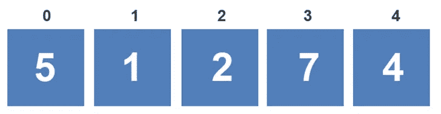

选择排序从将第一个值设置为最小值开始。

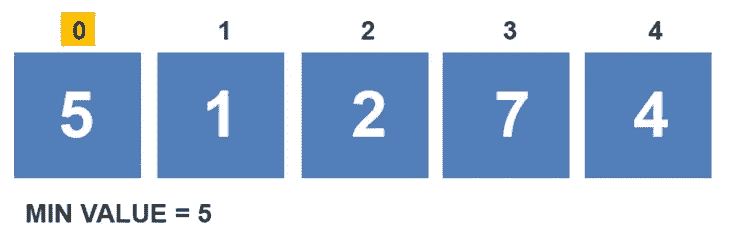

然后开始与数组中的每个值进行比较。如果找到了更小的值，则更新最小值，并继续遍历，直到到达数组的末尾。在第一次比较期间，将索引 1 处的值与最小值进行比较。

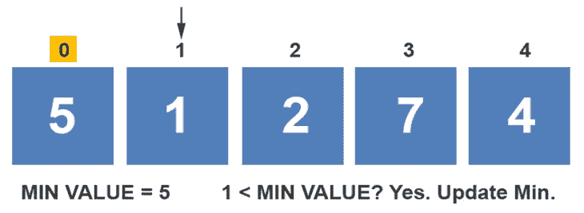

因为该值小于最小值，所以最小值被更新，并且索引递增。接下来，将 2 与最小值进行比较。因为 2 不小于最小值，所以最小值保持不变，并且索引递增。

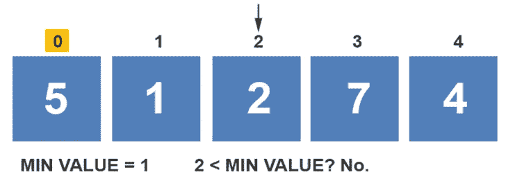

接下来，将 7 与 1 进行比较。1 号更小。

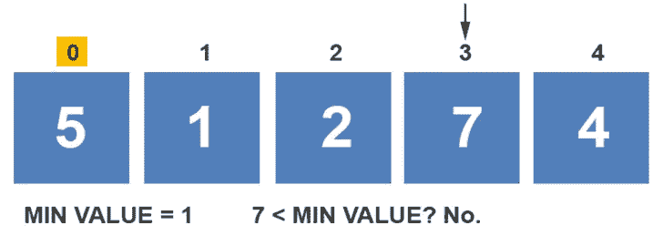

选择排序比较 1 和 4。因为 1 较小，所以最小值保持不变。

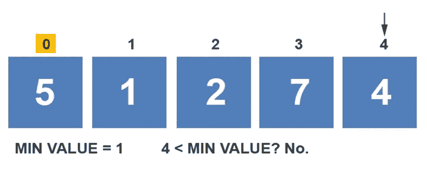

该算法在第一次遍历时已到达数组的末尾。第一个元素与包含最小值的元素交换。在这种情况下，5 与 1 交换。第一个元素被标记为已排序。

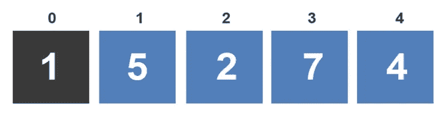

该算法从索引 1 处的元素开始第二次遍历。元素 1 处的值被设置为最小值。

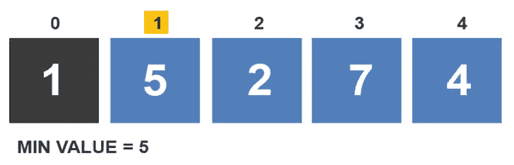

第二次迭代的第一次比较在 5 和 2 之间。因为 2 小于最小值，所以最小值被更新为 2。

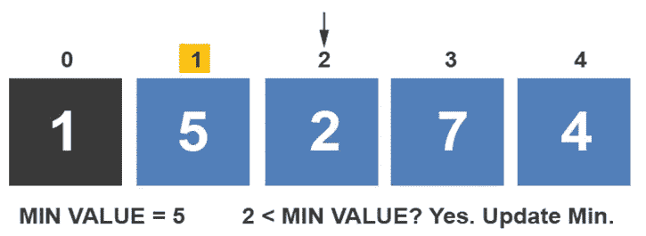

接下来，将 2 与 7 进行比较。因为 7 大于 2，所以最小值保持不变。

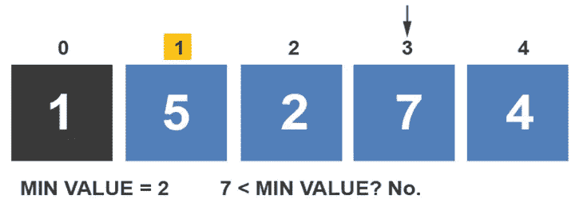

索引递增，并将 4 与 2 进行比较。由于 2 较小，最小值保持不变。

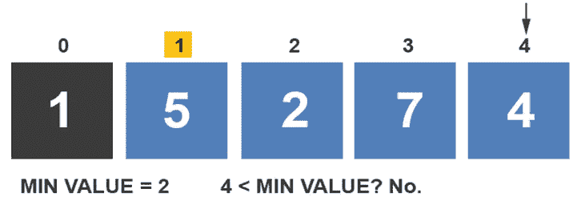

该算法在第二次遍历时已到达数组的末尾。第二个元素与包含最小值的元素交换。在这种情况下，5 与 2 交换。第二个元素被标记为已排序。

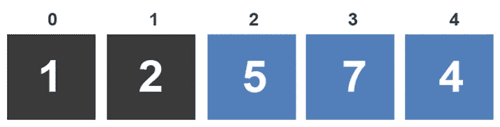

该算法从第三次迭代开始。它将最小值设置为数组中第一个未排序的元素。元素 2 处的值被设置为最小值。

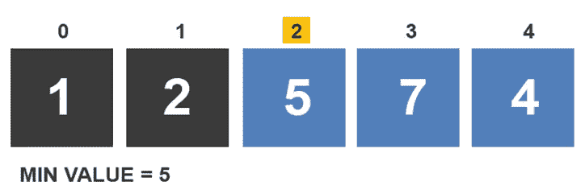

选择排序算法开始进行第三次遍历。第一个比较在 5 和 7 之间。由于 5 小于 7，该算法将 5 作为最小值。

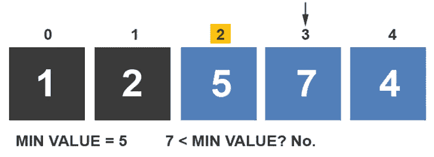

索引递增，并将 4 与最小值进行比较。因为 4 小于最小值，所以最小值被更新为 4。

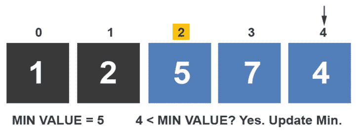

算法已经完成了第三次遍历。索引 2 处的值与最小值交换。前三个元素已被标记为已排序。

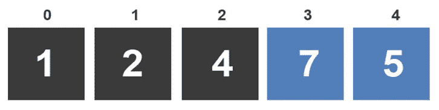

第四次迭代从将索引 3 处的元素设置为最小值开始。

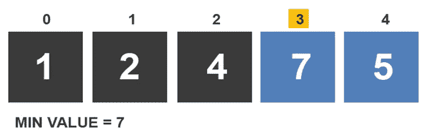

在 7 和 5 之间进行比较。由于 5 小于 7，因此最小值更新为 5。

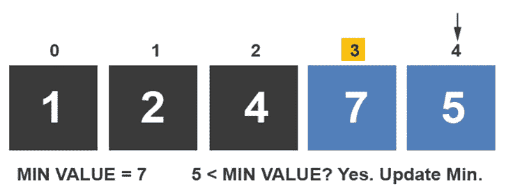

选择排序算法已到达数组末尾。它用最小值交换索引 3 处的元素。前四个元素已排序。

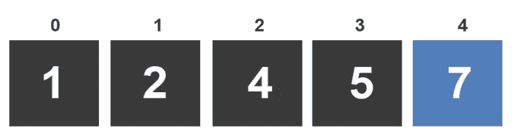

在下一次遍历中，只剩下一个元素。因为只剩下一个元素，所以没有必要与其他任何元素进行比较。选择排序算法将最后一个元素标记为已排序，并完成排序过程。

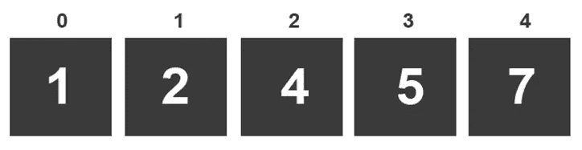

如果你喜欢你所读的，我的书，**【算法的说明性介绍】，涵盖了这个算法和更多。**

**

*Dino Cajic 目前是 [LSBio(寿命生物科学公司)](https://www.lsbio.com/)、[绝对抗体](https://absoluteantibody.com/)、 [Kerafast](https://www.kerafast.com/) 、 [Everest BioTech](https://everestbiotech.com/) 、 [Nordic MUbio](https://www.nordicmubio.com/) 和 [Exalpha](https://www.exalpha.com/) 的 IT 负责人。他还是我的自动系统公司的首席执行官。他有十多年的软件工程经验。他拥有计算机科学学士学位，辅修生物学。他的背景包括创建企业级电子商务应用程序、执行基于研究的软件开发，以及通过写作促进知识的传播。*

*你可以在 [LinkedIn](https://www.linkedin.com/in/dinocajic/) 上联系他，在 [Instagram](https://instagram.com/think.dino) 上关注他，或者[订阅他的媒体出版物](https://dinocajic.medium.com/subscribe)。*

*阅读 Dino Cajic(以及 Medium 上成千上万的其他作家)的每一个故事。你的会员费直接支持迪诺·卡吉克和你阅读的其他作家。你也可以在媒体上看到所有的故事。*