# Selenium xUnit 教程:用 C#为 xUnit 框架设置 Selenium WebDriver

> 原文：<https://levelup.gitconnected.com/selenium-xunit-tutorial-setup-selenium-webdriver-for-xunit-framework-in-c-a06f0f57b191>

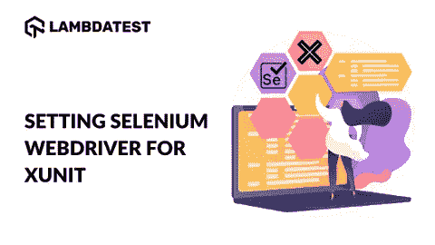

在正在进行的“Selenium xUnit 测试教程”系列中，我们之前已经了解了如何在 Visual Studio 中设置 xUnit 框架。这是一本入门指南，主要关注项目的 xUnit 框架的安装。在为 xUnit 设置 Selenium WebDriver 之前，我们建议您查看 xUnit 测试教程上的安装指南:Selenium 测试的环境设置，以防您使用 Selenium xUnit 框架启动。

在这篇 Selenium xUnit 教程中，我们快速地看一下如何在 Visual Studio 中安装 Selenium WebDriver，以便用 C#执行自动化测试。

# 在 Visual Studio 中创建新的 C#项目

在安装 Selenium WebDriver 之前，我们按照下面提到的步骤用 C#创建一个新项目:

1.  打开 Visual Studio 并创建一个“**类型的新项目 xUnit 测试项目(。【净芯】)**’。

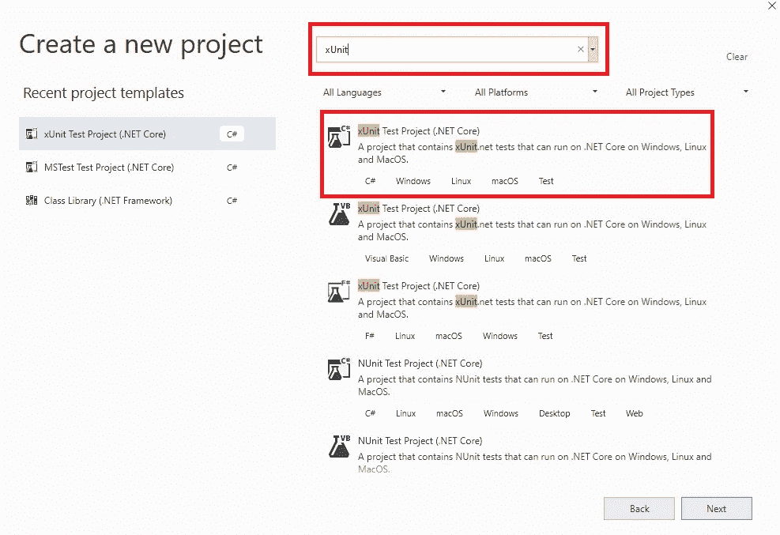

2.由于项目使用 xUnit.net(或 xUnit)框架，C#文件包含[Fact]属性。

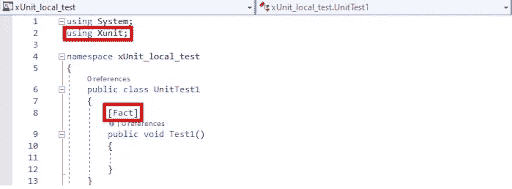

# 下载 Selenium WebDriver 的步骤

在[在 xUnit](https://www.lambdatest.com/blog/running-first-xunit-script/?utm_source=Medium&utm_medium=Blog&utm_campaign=HImanshu-27052021&utm_term=Himanshu) 中运行你的第一个脚本之前，你需要下载并设置 Selenium WebDriver。

xUnit 项目的 Selenium WebDriver 可以使用 NuGet 包管理器(PM)来安装。NuGet 是一个为微软平台设计的免费开源软件包管理器(PM)。

Selenium WebDriver 的安装可以使用 **Visual Studio IDE** 和 **NuGet Package Manager (PM)命令**来完成。

注- [Lorem lpsum 生成器](https://www.lambdatest.com/free-online-tools/lorem-lpsum-generator?utm_source=medium&utm_medium=organic&utm_campaign=apr22_rn&utm_term=rn&utm_content=free_tools)是一个工具，可以让你方便地生成随机的 IP 地址。Lorem Ipsum 是一个占位符文本，常用于图形和网页设计。使用它的目的是让设计者在一件作品完成或制作之前看到它的布局。

# 使用 Visual Studio IDE

要使用 Visual Studio IDE 安装 Selenium WebDriver，请执行以下步骤:

1.  进入**工具- > NuGet 包管理器**->-**管理解决方案的 NuGet 包**并搜索“Selenium”

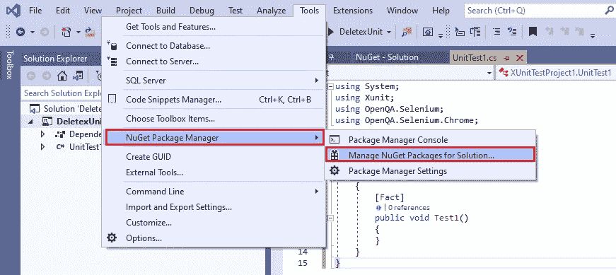

2.选择**硒。点击**安装**按钮来安装这个包。**

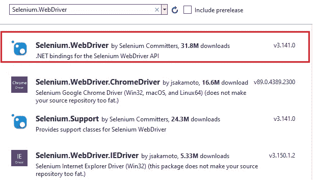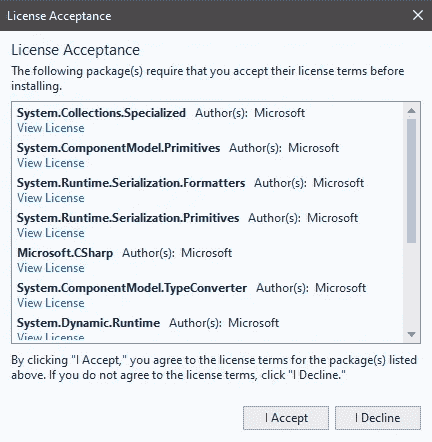

3.对于使用 Selenium xUnit 的自动化浏览器测试，我们使用 Google Chrome 作为测试浏览器。我们安装 Chrome WebDriver，这样就可以使用 Selenium APIs 实例化 Chrome。选择**硒。WebDriver.ChromeDriver** 并点击**安装**按钮。

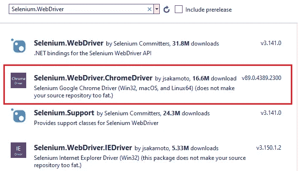

4.如下面的实现所示，我们添加了 Selenium (OpenQA。Selenium)和 Chrome WebDriver (OpenQA。Selenium.Chrome)代码中的引用。

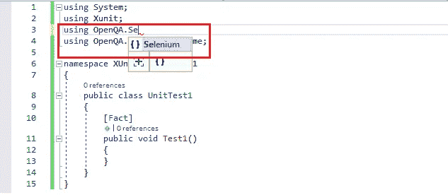

```
using System;
using Xunit;
using OpenQA.Selenium;
using OpenQA.Selenium.Chrome;

namespace XUnitTestProject1
{
    public class UnitTest1
    {
        [Fact]
        public void Test1()
        {
        }
    }
}
```

注意-这个 [CRC32B 哈希计算器](https://www.lambdatest.com/free-online-tools/crc32b-hash-calculator?utm_source=medium&utm_medium=organic&utm_campaign=apr22_rn&utm_term=rn&utm_content=free_tools)让您可以从给定的字符串快速生成 CRC32B 校验和哈希。此外，您可以通过 web 浏览器生成 CRC32B 哈希。

# 使用软件包管理器(PM)命令

如果您更喜欢终端，可以通过在终端上调用包管理器(PM)命令来安装 Selenium WebDriver。

要从 PM 控制台执行命令，请转到**工具- >获取包管理器- >包管理器控制台**。

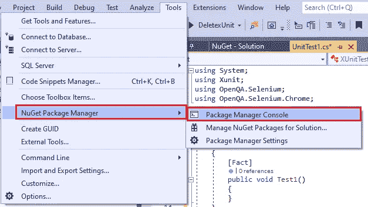

软件包管理器(PM)命令 Install-Package 用于执行安装。包名作为参数传递给命令。我们还安装了硒。终端的 Chrome.WebDriver。

```
Install-Package Selenium.WebDriver
Install-Package Selenium.Chrome.WebDriver
```

下面显示的是软件包管理器控制台的快照:

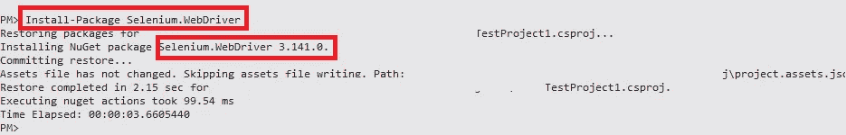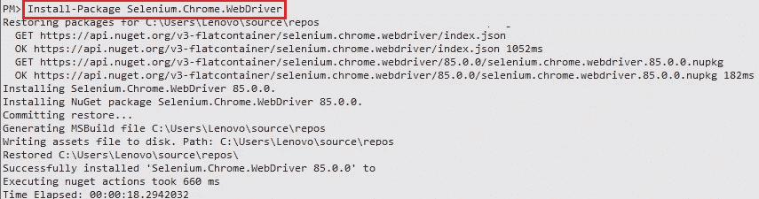

Get-Package 命令用于验证命令安装是否成功。

```
PM> Get-Package

Id                                  Versions
--                                  --------                                          
Selenium.WebDriver                  {3.141.0}
Selenium.Chrome.WebDriver           {89.0.4389.2300}
...... ......
...... ......
```

注-[JSON Validator](https://www.lambdatest.com/free-online-tools/json-validator?utm_source=medium&utm_medium=organic&utm_campaign=apr22_rn&utm_term=rn&utm_content=free_tools)&Formater 在优雅的多边形界面中美化调试 JSON 数据。这个由 LambdaTest 开发的 JSON 验证器是免费的，易于使用，没有任何广告或弹出窗口。立即尝试！

# 结论


随着 Selenium WebDriver 和 xUnit 框架的安装，您已经准备好使用 C#、Selenium 和 xUnit 执行第一次自动化测试了。这篇 Selenium C#教程中提到的在 xUnit 中安装 Selenium WebDriver 的步骤很容易理解。像 [Selenium WebDriver](https://www.lambdatest.com/blog/selenium-webdriver-tutorial-with-examples/?utm_source=Medium&utm_medium=Blog&utm_campaign=HImanshu-27052021&utm_term=Himanshu) 、Package Manager 等术语。，在所有 C#测试框架中是统一的。

对这些基本东西的透彻理解形成了一个基础，在这个基础上你可以用 C#和 xUnit 增强自动化测试技能。