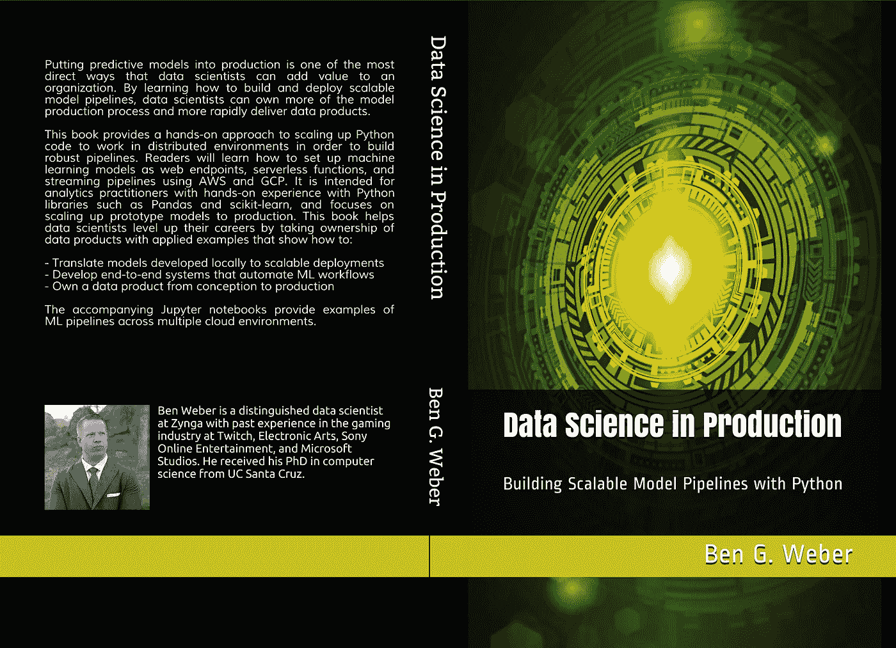
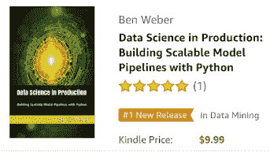
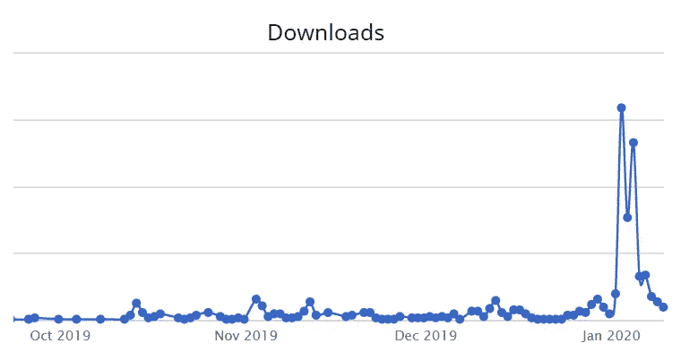

# Self 将在 2020 年出版一本技术书籍

> 原文：<https://levelup.gitconnected.com/self-publishing-a-technical-book-in-2020-8c385993f4e4>

来源:[https://www . pexels . com/photo/book-book-pages-bookcase-browse-415071/](https://www.pexels.com/photo/book-book-pages-bookcase-browse-415071/)

在过去的十年中，由于创作和销售书籍的工具和平台的改进，自助出版书籍变得越来越普遍。2010 年的一些畅销小说最初是自己出版的，包括《T2》、《火星人》、《T4》和《五十度灰》。

2019 年，我决定要写一本关于 Python 的数据科学技术书籍。虽然我最初探索了与传统出版商合作出版这本书的选择，但我最终决定走自助出版的路线。我看到了成功，比如 100 页的 ML 书，并意识到与传统出版商合作不再是技术书籍成功的必要条件。这篇文章讲述了在现有工具下自助出版一本书的过程。它是基于我出版《生产中的数据科学》的经验，本周末在 [Kindle store](https://www.amazon.com/gp/product/B083H2YWP4) 免费提供。

[https://www.amazon.com/gp/product/B083H2YWP4](https://www.amazon.com/gp/product/B083H2YWP4)

# 球场

创作一本技术书籍时，首先要做的一件事是列出一个目录，详细介绍书中涉及的主题。即使是自助出版，在书上提出一个类似于技术出版商通常对作者要求的模板的建议也是有用的。通过这个过程，你会更好地理解你的书是否能够在市场上有竞争力。此外，如果你确实想与传统出版商合作，你已经完成了进入合同阶段所需的大量尽职调查。以下是建议书通常包含的一些部分。

*   **营销描述:**这本书的卖点是什么？
*   **目标受众:**你的书的目标受众是谁，潜在受众的规模有多大？这是一个不断增长的观众群吗？
*   **要点:**读者会从阅读这份材料中学到什么？
*   **参赛书目:**哪些书涵盖了与你的提案类似的书籍，你的书有什么不同？
*   **资历:**为什么你是撰写这本书的合适人选？
*   **大纲:**书的预期内容是什么？什么是章、节和小节？

为了评估你的受众，你可以使用谷歌趋势搜索与你的主题相关的术语，你可以看到受众的规模是否随着时间的推移而增长。你也可以通过查看相似书籍在亚马逊上的排名和评论数量来了解它们之间的比较。传统出版商通常会对竞争对手的表现有更多的了解，但对于自助出版来说，这些代理指标已经足够好了。

# 权衡取舍

一旦你觉得你有一个强有力的推销，你就需要打电话决定你是想自己出版还是和传统出版商合作。要记住的一点是，出版商不会指望你有一个完美的提案，你通常会与收购编辑合作，在正式向出版商推销合同之前，他们会帮助你完成提案。虽然可以等到你写完几章后再推销这本书，但出版商可能希望对你已经写好的内容进行修改，因此在深入写书之前找到出版商通常是个好办法。

与大出版商合作的最大好处之一是，它有助于充实你的简历，这就是为什么与你认为在你的行业中享有很高声誉的出版商合作很重要。除了这些好处，与大型出版商合作还有以下好处:

*   **技术审查:**出版商将与该领域的专家合作，就你报道的主题提供技术反馈。
*   文字编辑:出版商负责确保文字没有拼写和语法错误。
*   **封面设计:**出版商与插图画家合作，为文字提供高质量的封面设计。
*   **排版:**出版社负责书的排版，避免寡妇孤儿等文字问题。
*   **会议:**出版商可能会赞助会议，或为作者提供演讲机会，在这些会议上，你的技术书籍有高度目标受众。
*   **网络:**也许是最大的福利。出版商与该领域过去的作者和专家有很好的联系，可以为你的书提供前言或背书。
*   如果你正在寻找合著者，或者在你缺乏专业知识的章节中需要帮助，这个作者网络也很有用。
*   **受众:**一家老牌出版商已经拥有大量过去书籍的可寻址受众，可能会提供在线工具来营销你的书。

与技术出版商合作是一个漫长的过程，从推介到出版可能需要一到两年的时间。它可能需要几个章节的迭代才能完成，但最终结果通常是一本高度抛光的书。这是我将来可能会尝试的方法，因为它打开的网络是一个很好的好处。

大型出版商提供了一些好处，但是在处理这种类型的合同时，通常缺少一些方面:

*   **效果营销:**虽然合同通常会说明将为你的书进行营销，但你失去了使用亚马逊赞助和脸书广告等工具管理广告活动的能力。我在手机游戏行业工作，基于效果的营销是许多公司的生命线，我希望在这个过程中有更多的控制权。
*   **透明度:**出版商可能会提供基于净利润率支付版税的合同，直到现在人们还不清楚净收入和总收入之间的差异。
*   **内容所有权:**大型出版商通常会拥有你创作的内容，这在一切按计划进行时是没问题的。但是，如果你的标题在创作过程中被取消，你可能会失去几个月的工作，这取决于合同的细节。

自助出版为作者提供了更多的自由来撰写他们想要涵盖的主题，以及创作和出版书籍的时间框架。然而，自行出版的作者比与大型出版商合作的作者负责更多的生产工作。我对在传统出版和自助出版之间做出选择的作者的建议是，与之前与大型出版商合作过的技术作者交谈，尽可能多地了解背景，以告知你的选择。

# 版税

自助出书的最大好处之一是，你可以从每本卖出的书中获得更大份额的版税。这一点尤其重要，因为人们越来越关注书籍的数字版本，在这种情况下，版税可能比与大型出版商合作要高得多。以下是首次创作可能获得的版税范围:

*   **实物销售:**净收入的 10%
*   **数字销售:**净收入的 10%至 25%

由于版税通常是按净收入而非总收入支付的，所以每本售价 60 美元的纸质书，你可以得到 4 美元或 5 美元。人们越来越关注数字销售，因为出版商和作者通常每卖出一本比实体销售赚得更多。然而，在 2020 年，给作者的纸质和数字拷贝提供类似的利润是没有意义的，因为生产一本技术书籍的额外数字拷贝的增量成本几乎为零。数字销售是自助出版图书利润最高的领域。以下平台提供了大幅提高的利润，而不是获得 10%到 25%的数字销售额:

*   Kindle: 任何价位的图书 35%，价格低于 10 美元的图书 70%
*   [**Leanpub**](https://leanpub.com/) **:** 作者设定一个优先和最低价格，并获得 80%

Leanpub 和 Kindle 都为作者提供了很高的费率，这些平台都支持自出版作者。

对于实体销售，自我出版时版税可能不会更好，尤其是如果你计划生产彩色平装书。使用彩色印刷，印刷每本书的成本明显高于坚持黑白印刷。当使用 Kindle Direct 进行出版时，我以 34.99 美元购买的每本纸质书可以获得 3.72 美元的版税。这比大型出版商提供的价格好一点，但这不是走自助出版路线的令人信服的理由。我走自助出版路线的一个主要动机是，电子版本的销售提供了一个健康的利润空间，你可以在基于绩效的营销上花钱，以扩大你的书的销售。

# 工具

创作一本书时，从一开始就确定一组工具是很有用的，这些工具将帮助您将内容转换为可打印的格式。这个排版过程可能相当复杂，所以应用工具将文本和代码转换成 PDF、html 和 epub 格式是很有用的。这里有两个极端:使用*所见即所得*(所见即所得)工具，如微软工作和谷歌文档，另一端是使用 Latex 来指定文本的每个具体细节。

当与大型出版商合作时，您可能会提供 Word 文档形式的草稿，出版商负责将这些文档排版成精美的输出文本。有了自助出版，你就不会想在手工过程上花费太多时间。为了自动化这个过程，我使用了 [Bookdown](https://github.com/rstudio/bookdown) 包将 markdown 中编写的章节翻译成输出 PDF。这个库扩展了 RMarkdown，将 Markdown 翻译成 Latex 格式，然后传递给 Pandoc，生成文本的 PDF、epub 和 html 版本。“编译”您的图书可能需要几分钟时间，但这一工作流程节省了大量时间，尤其是在最终确定文档和修正文本中的参考文献时。为了获得您想要的精确输出，您可能需要偶尔恢复到原始的 Latex 代码，但是如果您找到合适的样式模板，也可以避免这种情况。

[AsciiDoc](http://asciidoc.org/) 是另一种对书籍排版有用的格式，也是许多大型出版商允许作者使用的格式之一。将 AsciiDoc 文本翻译成输出格式有几种不同的方法，一些平台如 Leanpub 为作者提供了这种工作流程。AsciiDoc 提供了对文本输出样式的更多控制，但是工作流程可能会更复杂。

为了检查拼写和语法，我将 html 输出的内容复制并粘贴到 Google Docs 中。像[这样的工具在语法上](https://www.grammarly.com/)对这个过程也是有用的。为了获得更多的反馈，我在 Leanpub 上发表了每一章，并向购买了该书早期版本的读者征求反馈。随着读者报告错误，这本书将继续更新，这是通过这些平台自助出版的额外好处，对一本书进行小的更新很简单。

为了制作封面，我使用了 Kindle Direct 提供的封面制作工具。这个工具是相当有限的，但它确实提供了足够的定制来制作一个好看的文本，如果你已经有了一个封面图片。为了创建 Kindle 版本，我使用 Kindle Create 工具生成了一个“打印副本”输出。

# 创作过程

我以线性的方式写这本书，在进入下一章之前开始并完成每一章。当你在开始之前对你的大纲有信心时，这种方法是可能的。在球场上工作时，我决定将前两章合二为一。当我快要完成这篇文章时，我决定将后面的两章合并成一章，并去掉最后两章。因此，虽然我从头到尾都在写这本书，但我也做了一些大的改动。

以下是我用来撰写每一章的典型工作流程:

*   **Extend Outline:** 我从小节细节层次的大纲开始，并在开始章节时添加了一个新的细节层次和子小节。
*   **代码示例:**我用 Jupyter 笔记本和 Python 脚本编写了本章将要涉及的所有代码示例。
*   **文本:**然后我编写了这一章的文本，它通常在前面的章节中加载了概念，然后是特定的代码。
*   检查排版:我进行了拼写和语法检查，确保输出可以打印。这通常包括更改文本和代码以避免出现寡妇文本。
*   **发布:**然后我会将更新后的书发布到 Leanpub，并将该章节的摘录发布到[媒体](/book-launch-data-science-in-production-54b325c03818)。

虽然编写章节的最佳方法取决于作者，但我发现这个工作流程帮助我专注于完成每一章，而不会被其他内容分心。

创作这本书花了大约 160 个小时，历时 20 周左右。一旦你有了一个坚实的音高和轮廓，你就可以真正地进入状态。自助出版的好处之一是，你可以根据需要延长或缩短时间表，甚至在写作时需要时暂停一下。

# **营销**

一旦你出版了你的书，你需要把这个消息传出去！事实上，你需要提前开始这样做。以下是一些向读者宣布图书发布的方法:

*   **有机渠道:**在线社区非常适合锁定受众，但关注最相关的社区也很有用。我能够在 [/r/datascience](https://www.reddit.com/r/datascience/comments/ej5yux/i_self_published_a_book_on_data_science_in/) 和[黑客新闻](https://news.ycombinator.com/item?id=21955527)上得到很好的接收。这提供了最初的峰值，但不是持续的流量。
*   付费频道:我正在探索谷歌广告、脸书广告和亚马逊赞助，以此来增加我的观众。要记住的是，我不想花费超过 7 美元来获得一笔销售，因为我只能得到 10 美元购买数字拷贝价格的 70%。我专注于 Kindle 版本，因为这是我利润率最高的地方。
*   在你的书发布之前，亚马逊的评论排起了长队，这很有用，因为这有助于显示这本书的高质量。有一些游戏的方式，但它通常仍然是一个有用的信号。
*   **背书:**为了抵消评论带来的问题，获得与该领域相关的知名人士的背书也很有用，可以为你的书提供推荐。
*   **促销:**亚马逊为加入 Kindle Select 计划的图书提供促销机会，该计划有一个排他性条款。这使得作者能够以临时折扣或短期免费出售数字拷贝。就是现在，这本书免费到 1 月 12 日！

一般来说，在发布你的书之前，最好有一些评论和认可，这样当书在平台上可用时，你就可以获得跟踪。我没有把握好时机，在我的书已经发行后，我现在正在获得评论和支持，这意味着我的有机营销努力没有达到应有的效果。

Leanpub 上的图书销售。猜猜这本书是什么时候发行的？

# 外卖

如果你觉得不需要太多额外的帮助就可以从头到尾阅读文本，那么自助出版是撰写技术书籍的一个可靠选择。你错过了大型出版商提供的一些技术和编辑支持，但是现在有很好的工具来填补这些空白。像任何技术书籍一样，你不太可能从你的书上赚很多钱，但通过自助出版，你可以更好地控制你的书的营销，如果你能够接触到大量的读者，这是很好的。这可能是大量的工作，但在 2020 年自己出版一本技术书籍也是非常值得的。

[本·韦伯](https://www.linkedin.com/in/ben-weber-3b87482/)是 Zynga 杰出的数据科学家。我们正在[招聘](https://www.zynga.com/job-listing-category/data-analytics-user-research/)！