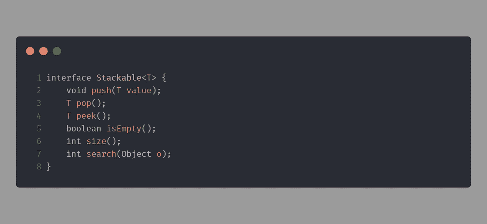
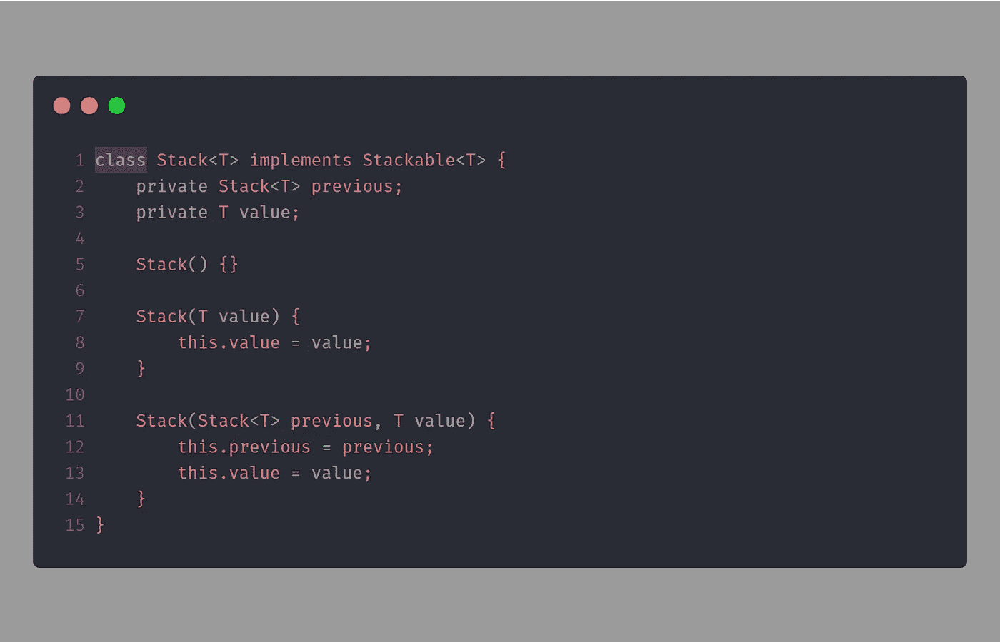
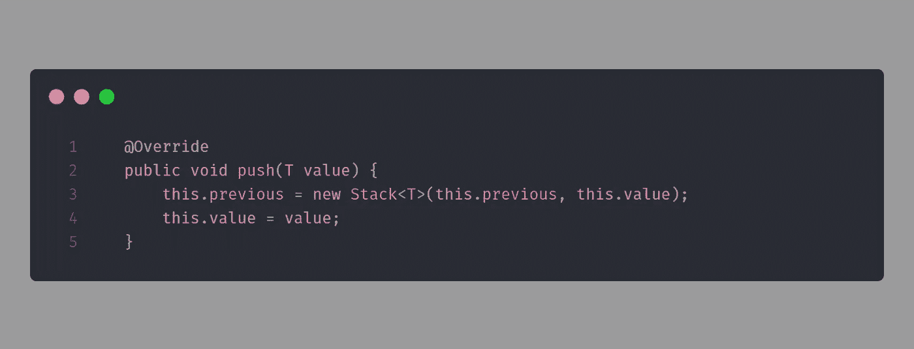
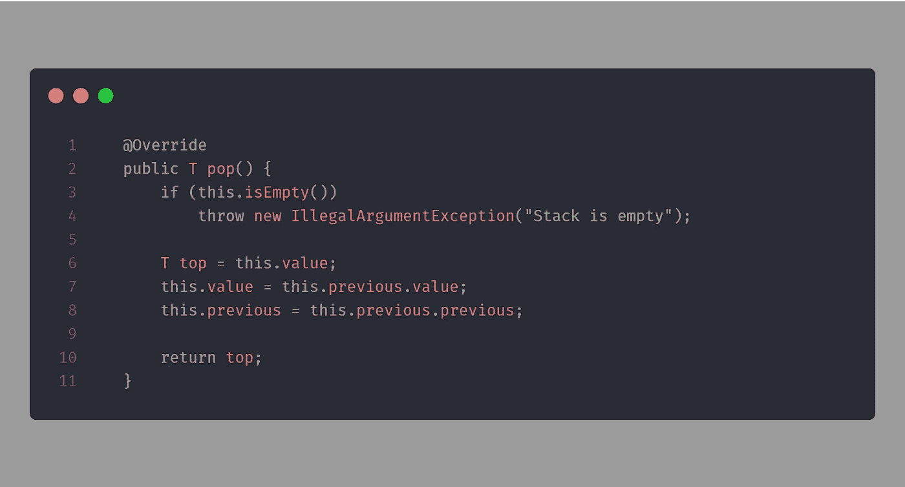
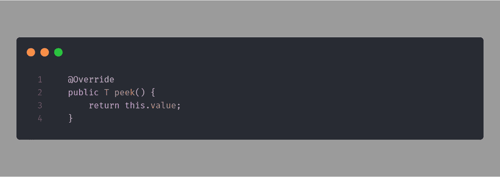
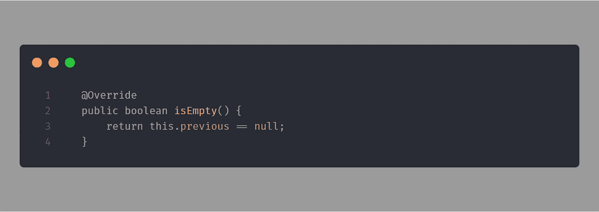
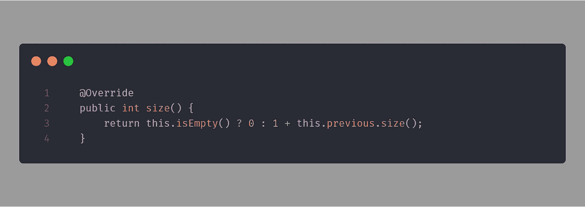
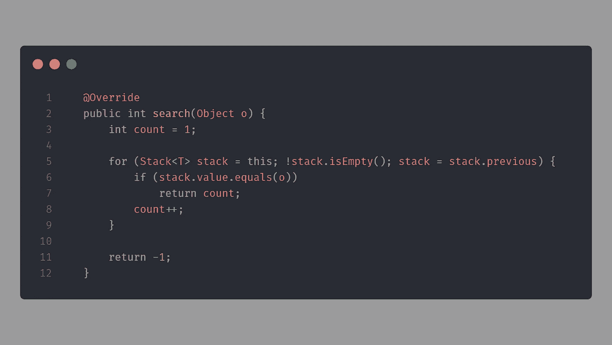
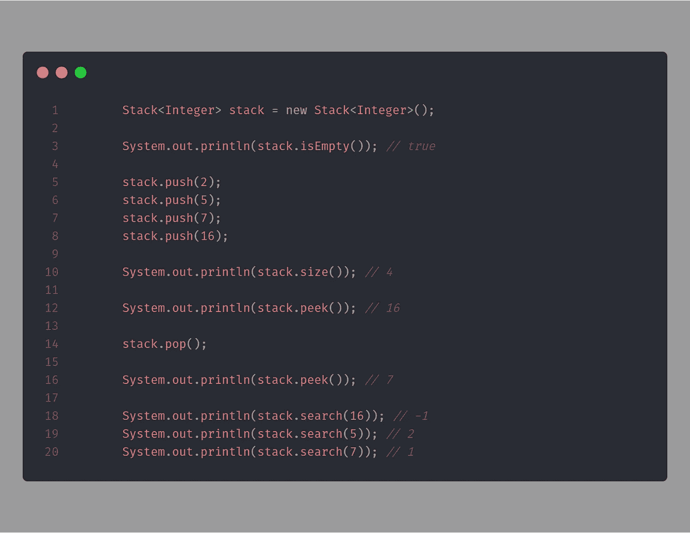

# 用 Java 构建堆栈类

> 原文：<https://levelup.gitconnected.com/selfmade-stack-class-in-java-d401dc7d68f0>

[https://www . pexels . com/de-de/foto/backen-backerei-behandeln-bunt-1407346/](https://www.pexels.com/de-de/foto/backen-backerei-behandeln-bunt-1407346/)

堆栈是编程中的基本数据结构。它的行为就像一个数据容器，新的条目被添加到栈顶，而你只能访问最后添加的条目(最顶端的条目)。

甲骨文的定义([来源](https://docs.oracle.com/javase/7/docs/api/java/util/Stack.html))

> Stack 类表示对象的后进先出(LIFO)堆栈。提供了常见的 push 和 pop 操作，以及一个查看堆栈顶部项目的方法、一个测试堆栈是否为空的方法和一个在堆栈中搜索项目并发现它离顶部有多远的方法。

今天，我们试图用自己的通用类和接口在 Java 中重新创建这种数据结构。为了存储不同的数据类型，该类是泛型的。它应该提供以下六种方法:

*   **按**(在顶部添加新项目)
*   **弹出**(移除最上面的项目)
*   **窥视**(获得最顶端的物品)
*   **isEmpty** (检查堆栈是否为空)
*   **大小**(获取堆栈的大小)
*   **搜索**(搜索对象)

## 接口:Stackable.java

让我们从堆栈的接口开始。该接口指定哪些方法必须在 stack 类中实现。我们声明我刚才提到的六个方法。

`<T>`构造将接口标记为泛型。在这种情况下,`T`可以是任何数据类型。比如`Integer`或者`String`。

## 班级:Stack.java

接下来，我们创建 stack 类。这里我们需要两个私有属性:`previous`和`value`。

`previous`是对在堆栈顺序中位于当前实例之下的项目(底层项目)的引用。这导致了递归实现。

`value`属性包含当前堆栈实例存储的值。它可以是任何数据类型。

此外，我们稍后还需要多个构造函数。因为这个类是通用的，所以我们在这里也需要`<T>`构造。

**方法:推**

此方法将一个项推到堆栈的顶部。因此，我们将 stack 的当前实例设置为前一个实例，并存储新值。

现在引用我们的旧堆栈实例。

**方法:弹出**

此方法移除堆栈顶部的项并返回其值。

首先，我们将当前值存储在一个临时变量中，因为它会被覆盖，以后我们需要返回它。

之后，我们将当前的`value`设置为来自我们的`previous`堆栈项目的值。此外，我们将当前的`previous`属性引用到底层项目的`previous`项目。

最后，我们返回移除的值。

**方法:窥视**

此方法查看堆栈顶部项目的值并返回它。这里我们只需要返回`this.value`。

**方法:isEmpty**

此方法测试堆栈是否为空。由于最后一个堆栈项目没有引用另一个(底层)项目，我们只需要检查`previous`项目是否是`null`。

**方法:尺寸**

这个方法返回堆栈中的项目数。这里，我们递归地计数，直到到达最后一项。

**方法:搜索**

此方法返回项在堆栈上从 1 开始的位置。因此，我们循环遍历所有的堆栈项，并增加一个计数器，直到达到等于目标项的值。最后但同样重要的是，我们返回计数器。

如果不匹配，则返回`-1`。

## 试试吧！

让我们创建一个新的 stack 类实例，并进行测试。

就是这样！[在这里](https://gist.github.com/larswaechter/5ee39c4b4d874f0280951b6ac5a40ace)你可以找到包含完整代码的 GitHub Gist。