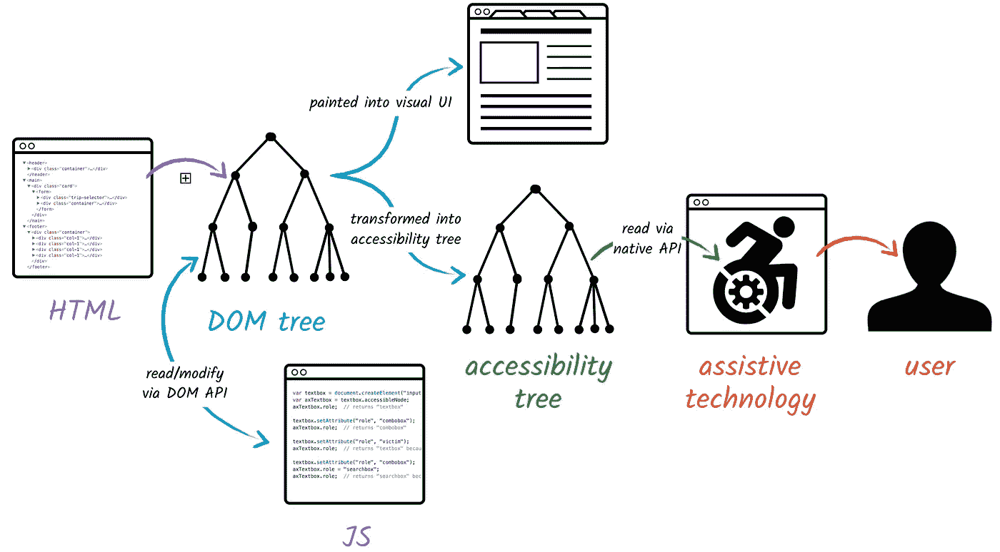

# 语义 HTML 和 Web 可访问性

> 原文：<https://levelup.gitconnected.com/semantic-html-web-accessibility-8c17e4e12502>

> “你不知道你不知道什么”

这个星期，我发现了一些我不知道的东西，我对自己基础知识的差距感到非常震惊。我开始疯狂地研究，并将分享我的主要收获。(我假设你对 HTML 有基本的了解。)

# 什么是语义 HTML？

“语义”一词的意思是:

> 与语言或逻辑中的意义相关

因此，语义 HTML 是编写有实际意义的标记的概念，而不是仅仅用于创建特定的外观或设计。这里有一个例子来说明我的意思:

一切都是一个 div！！！

在上面的例子中，我可能会使用 id 或类来标记部分和布局我的内容。但是这样不是更好吗？

HTML 标签*本身*可以说明 HTML 的那个部分正在做什么。从顶部，我们可以看到我们有一个标题，其中是一个导航元素，它有一些带有链接的列表项。然后是主内容标签，它包含两个独立的部分。最后，有一个带有导航组件的语义标签页脚。清晰多了！

# 为什么要用？

1.  您已经在上面看到了对开发人员来说导航是多么容易。对于那些在你离开项目后会查看你的代码的程序员同事来说，甚至对于你自己来说，它也更容易维护，这样你就不会在 divs 中迷路。
2.  **无障碍！它为屏幕阅读器提供信息(稍后将详细介绍)**
3.  对搜索引擎优化比较好。网络爬虫可以更容易地解析语义标签，找出页面上的重要内容。

# 还有哪些语义元素？

以下是一些例子:

*   `[<article>](https://developer.mozilla.org/en-US/docs/Web/HTML/Element/article)`
*   `[<aside>](https://developer.mozilla.org/en-US/docs/Web/HTML/Element/aside)`
*   `[<details>](https://developer.mozilla.org/en-US/docs/Web/HTML/Element/details)`
*   `[<figure>](https://developer.mozilla.org/en-US/docs/Web/HTML/Element/figure)`
*   `[<footer>](https://developer.mozilla.org/en-US/docs/Web/HTML/Element/footer)`
*   `[<header>](https://developer.mozilla.org/en-US/docs/Web/HTML/Element/header)`
*   `[<main>](https://developer.mozilla.org/en-US/docs/Web/HTML/Element/main)`
*   `[<nav>](https://developer.mozilla.org/en-US/docs/Web/HTML/Element/nav)`
*   `[<section>](https://developer.mozilla.org/en-US/docs/Web/HTML/Element/section)`
*   `[<summary>](https://developer.mozilla.org/en-US/docs/Web/HTML/Element/summary)`
*   `[<time>](https://developer.mozilla.org/en-US/docs/Web/HTML/Element/time)`

# HTML 中的可访问性

网页上的可访问性为残障用户提供了访问内容的替代方式。

您可能已经知道浏览器解析 HTML 文档并创建节点的 DOM 树。我不知道的是，它*也会*将它解析成一个可访问性树，树中充满了与视觉呈现没有太大关系的节点，大部分只是文本和可操作的项目(按钮、表单等)。).

该可访问性树是用户能够使用辅助技术来导航网页的方式。



很酷的东西

这就是为什么使用语义标签会有如此大的不同。屏幕阅读器将能够告诉非视觉用户有一个导航部分和一个主要部分。或者用户可能想跳到页脚。当网页的各个部分都有实际的描述性名称时，导航就简单多了。

## 咏叹调

那些没有语义标签的元素呢，比如旋转木马？在这种情况下，您可以使用 ARIA，它代表可访问的富互联网应用程序。

它让开发人员能够修改和/或增强 DOM 中元素的语义。* *注意:这些 ARIA 属性不会改变元素的行为。*

想象一个汉堡菜单按钮看起来像 3 条水平线。大多数有视力的人都熟悉这种按钮，并且知道点击它可能会打开某种菜单。

但是，屏幕阅读器将无法判断这是哪种按钮。

```
<button class=”menu-burger”></button>
```

所以艾瑞亚给救援贴上标签:

```
<button class=”menu-burger” aria-label=”menu”></button>
```

有 22 种不同的 ARIA 属性可以使用，你可以在这里找到它们。

## 标签

表单上的每个可操作项都应该有一个描述性标签，因为它们有助于识别控件的用途。

有两种方法可以做到这一点。要么用 label 标签包装元素:

```
<label>
    First Name:
    <input type="text" name="name">
</label>
```

或者使用输入的 id 和标签的`for=`属性:

```
<label for="name"> First Name: </label>
<input id="name" type="text" name="name">
```

# 结论

我希望这有所帮助！我远不是专家，所以我欢迎任何额外的资源和意见。
最后，这里有一个如何在 Mac 上使用屏幕阅读器的链接。

 [## 使用 VoiceOver 在 Mac 上浏览网页

### 有几种方法可以浏览和导航网页。为了简化某些网页上的导航，VoiceOver 可能会…

support.apple.com](https://support.apple.com/guide/voiceover/browse-webpages-vo27974/10/mac/11.0) 

我很乐意连接！在 [LinkedIn](https://www.linkedin.com/in/jzolotarev/) 、 [Twitter](https://twitter.com/JZolo) 和 [GitHub](https://github.com/jzolo22) 上找到我。

## 有用的资源:

[](https://developer.mozilla.org/en-US/docs/Glossary/Semantics) [## 语义学

### 在编程中，语义指的是一段代码的含义——例如“运行那行代码会产生什么影响……

developer.mozilla.org](https://developer.mozilla.org/en-US/docs/Glossary/Semantics) [](https://developers.google.com/web/fundamentals/accessibility/semantics-builtin/the-accessibility-tree) [## 可访问性树| Web 基础| Google 开发者

### 假设您正在为屏幕阅读器用户构建一个用户界面。在这里，你不需要创造任何视觉…

developers.google.com](https://developers.google.com/web/fundamentals/accessibility/semantics-builtin/the-accessibility-tree) [](https://webaim.org/) [## WebAIM:牢记网页可访问性

### 无论是在犹他州还是在您组织的现场，WebAIM 都可以提供满足您需求的 web 和文档培训…

webaim.org](https://webaim.org/) [](https://a11y-101.com/development/aria-label) [## aria-标签-可访问性介绍

### 这里我们有一个很长的短语要讨论。但是我们可以缩短它。我们用咏叹调代替吧。实际上-更准确地说…

a11y-101.com](https://a11y-101.com/development/aria-label) [](https://w3c.github.io/using-aria/#rule1) [## 使用 ARIA

### 如果您可以使用原生 HTML 元素[[HTML]]或属性，并且已经构建了您需要的语义和行为…

w3c.github.io](https://w3c.github.io/using-aria/#rule1)