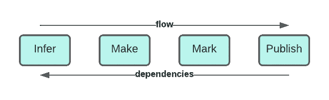

# 使用倪克斯的 Gradle 语义发布自动化

> 原文：<https://levelup.gitconnected.com/semantic-release-automation-with-gradle-using-nyx-ba345235a365>

如果你像我一样，你可能不想重复你自己，你喜欢自动化事情，这样你就可以专注于重要的事情。虽然有大量的工具和方法可以帮助你完成软件生命周期管理中如此多的常见任务，但是发布自动化是它们不足的一个领域。

假设您正在维护一个 Git 存储库(可选地托管在 [GitHub](https://github.com/) 、 [GitLab](https://gitlab.com/) 或其他服务上)，并且已经有了 CI/CD(使用 [GitHub 动作](https://docs.github.com/en/free-pro-team@latest/actions/guides/about-continuous-integration)、 [GitLab CI](https://docs.gitlab.com/ee/ci/) 、 [Jenkins](https://www.jenkins.io/) 、 [TeamCity](https://www.jetbrains.com/teamcity/) 、 [Bamboo](https://www.atlassian.com/software/bamboo) 、 [CircleCI](https://circleci.com/) 等)。如果你是一个最佳实践忍者，你可能也已经定义了一个适合你的工作流的分支模型，建立了 [SemVer](https://semver.org/) 作为你的版本化方案，也采用了一个提交消息约定，比如[常规提交](https://www.conventionalcommits.org/)或者甚至定义了你自己的。

您离发布管理天堂只有一步之遥了！总体策略已经很好地定义了，但是当涉及到管理分支、标签、拉/合并请求、变更日志和发布时，你要么手动地做，绞尽脑汁试图不留下任何东西，要么自动地用你缝合在一起的几个工具，用一些定制代码来填补空白。

倪克斯是一个非常灵活的工具，可以让你把所有的东西放在一起，这样你就可以在自动驾驶上设置发布管理。你可以在 GitHub 上的这里找到[。在这篇文章中，我将向你展示如何在几分钟内开始，不管你的项目堆栈，规模和复杂性。](https://github.com/mooltiverse/nyx)


多梅尼科·洛亚在 [Unsplash](https://unsplash.com?utm_source=medium&utm_medium=referral) 上拍摄的照片

# 背景和免责声明

几年前，我在 GitLab 上给[写过一篇关于*语义版本化和发布自动化的类似文章。这个解决方案是基于*](/semantic-versioning-and-release-automation-on-gitlab-9ba16af0c21) *[*语义发布*](https://github.com/semantic-release/semantic-release) 的，因为当时它是我发现的最有效的工具。如果您正在进行节点项目，这可能仍然是您的最佳选择。然而，在寻找一个更加便携和简化的解决方案时，它有一些我无法用其他任何方法克服的缺点。*

然后，我决定发布一个全新的工具，它可以大规模用于任何堆栈，易于上手，功能强大，足以应对最微妙的边缘情况。这就是了！所以，如果我是第一个倪克斯迷，不要感到惊讶！

我还写了另一篇帖子，就像这篇关于倪克斯的帖子一样，但是使用了 CLI 和/或 Docker 镜像，所以如果你打算使用命令行或 Docker 化环境，你可能应该直接跳到那篇帖子。

本指南假设:

*   [语义版本化(SemVer)](https://semver.org/) 用于版本化。在撰写本文时，这是倪克斯唯一支持的方案，但是将来的版本可能也会支持 Maven 和定制方案
*   你已经对**提交消息约定**有了基本的了解，这是用于将结构化信息嵌入提交消息并自动读取它们的模式。如果您不这样做，那么[常规提交](https://www.conventionalcommits.org/)(也称为*角度约定*)是一个很好的起点，它是开箱即用的，尽管您甚至可以自由配置自定义约定
*   你知道什么是分支模型。如果你没有，你可以从[这里](https://mooltiverse.github.io/nyx/guide/user/best-practice/branching-models/)开始，这里也涵盖了标准模型，如 [GitFlow](https://nvie.com/posts/a-successful-git-branching-model/) 、 [OneFlow](https://www.endoflineblog.com/oneflow-a-git-branching-model-and-workflow) 或 [GitHubFlow](https://help.github.com/en/github/collaborating-with-issues-and-pull-requests/github-flow) 和 [GitLabFlow](https://docs.gitlab.com/ee/topics/gitlab_flow.html)
*   你对 [Git](https://git-scm.com/) 、[branch](https://git-scm.com/book/en/v2/Git-Branching-Branches-in-a-Nutshell)和[tag](https://git-scm.com/book/en/v2/Git-Basics-Tagging)很有信心。您可以选择适当的 CI/CD 环境，虽然倪克斯并不受限于任何环境，但是提供了关于 [GitHub 动作](https://docs.github.com/en/free-pro-team@latest/actions/guides/about-continuous-integration)和 [GitLab CI](https://docs.gitlab.com/ee/ci/) 的示例
*   Gradle 是这篇文章中唯一使用的构建工具，而倪克斯可以在任何平台和任何其他工具上使用

# 倪克斯是如何运作的

倪克斯[将整个发布过程分成步骤](https://mooltiverse.github.io/nyx/guide/user/introduction/how-nyx-works/)，你可以一起运行，也可以通过插件提供的不同任务一个接一个地运行。其步骤是: [*推断*](https://mooltiverse.github.io/nyx/guide/user/introduction/how-nyx-works/#infer) ， [*制作*](https://mooltiverse.github.io/nyx/guide/user/introduction/how-nyx-works/#make) ， [*标记*](https://mooltiverse.github.io/nyx/guide/user/introduction/how-nyx-works/#mark) ， [*发布*](https://mooltiverse.github.io/nyx/guide/user/introduction/how-nyx-works/#publish) ，它们各自的任务名称分别是[](https://mooltiverse.github.io/nyx/guide/user/introduction/usage/#nyxinfer)*， [*nyxMake*](https://mooltiverse.github.io/nyx/guide/user/introduction/usage/#nyxmake) ， [*nyxMark*](https://mooltiverse.github.io/nyx/guide/user/introduction/usage/#nyxmark) 和 [*所有步骤都是可选的，但是它们有连锁依赖关系:*发布>标记>制作>推断*，所以你可以单独运行*推断*但是*制作*依赖于*推断，标记*依赖于*制作*等等。*](https://mooltiverse.github.io/nyx/guide/user/introduction/usage/#nyxpublish)*

**

*倪克斯台阶*

**推断*是第一步，也是最重要的一步，它读取 Git 提交历史来设置项目**版本**，该版本可能是新版本(如果有**重大**变更要发布)或之前的版本(如果没有遇到重大变更)。换句话说:你总是有正确的**版本**设置，不管是以前的还是新的。先前的**版本**从 Git 标签中读取，如果必须生成新的版本，则通过**在先前版本上碰撞**正确的标识符来计算。结果是将[项目**版本**属性](https://docs.gradle.org/current/userguide/writing_build_scripts.html#sec:standard_project_properties)设置为正确的值。*推断*到此为止，不采取进一步的行动，但是你的 Gradle 脚本现在可以使用项目**版本**用于任何目的。*

*值得注意的是，许多其他工具只在整个过程结束时才给你**版本**，从构建脚本的角度来看，它基本上是无用的(甚至在工件已经被推送到存储库之后)，所以你不能截取**版本**供你的定制任务使用(例如，将它嵌入到文档或其他文件中)。使用这些工具，你甚至不能在中间添加任何验证，因此一旦你运行发布任务，你就没有其他机会来控制将要发布的内容。有些工具甚至更糟，因为你甚至不知道他们是否会给你一个**版本**供你使用(比如当没有新的变化时)，所以你最终运行它们两次:第一次作为*抽测运行*，只是为了看看是否有新版本可用，第二次(你需要有条件地运行)是为了实际使用它。*

*相反，有了倪克斯，你可以自由地运行*推断*，在任何你需要的地方使用**版本**号，甚至使用它的内部发现来定制整个过程。**版本**属性是 Gradle 脚本在全球范围内使用的[标准](https://docs.gradle.org/current/userguide/writing_build_scripts.html#sec:standard_project_properties)属性，因此，一旦它被设置，你可以确保整个项目始终使用相同的**版本**。你**总是有一个版本**，它可能是以前的版本，也可能是新的版本(你可以通过`[nyxState.newVersion](https://mooltiverse.github.io/nyx/guide/user/state-reference/global-attributes/#new-version)`属性来判断，下面会详细介绍)。即使你不需要发布一个[新版本](https://mooltiverse.github.io/nyx/guide/user/state-reference/global-attributes/#new-release)，你也有一个可以在内部使用的版本(例如用于测试)。*

**Make* 是使用来自 release 范围的信息，通过渲染一个可定制的 [**手柄**](https://handlebarsjs.com/) 模板，生成一个 **changelog** 的步骤。*

**标记*可以有选择地**提交**未决的变更(即，如果你想在密封它之前将 changelog 文件添加到你的发布版本中)，**用新的发布版本名称标记**最新的提交，**将**变更推送到远程存储库。*

**发布*可以最终发布新版本给远程服务(即 [GitHub 发布](https://docs.github.com/en/github/administering-a-repository/about-releases)， [GitLab 发布](https://docs.gitlab.com/ee/user/project/releases/))使其对观众可用。 *Make* 生成的 changelog 也可以作为发布**描述**。*

*有了这些精细的任务，您可以构建任何**增量**发布过程，而不会失去一致性，即使暂停过程并在以后的任何时间恢复它。在构建脚本的最开始运行*推断*之后，您可以将**版本**和其他发现用于任何其他任务，然后，如果您愿意，您可以使用*标记*和*发布*来完成发布。*

*这要归功于倪克斯揭露的另一个非常强大的特性:状态对象。**状态**(在 Gradle scripts 中也作为[额外的项目属性可用)是倪克斯存储其所有内部信息的地方，也可供您阅读其关于发布范围和解析配置值的详细信息。由上述所有任务创建和更新**状态**。](https://mooltiverse.github.io/nyx/guide/user/introduction/usage/#accessing-the-nyx-state-extra-project-property-from-build-scripts)*

# *开始使用 Gradle 插件*

*虽然倪克斯是可移植的，可以在任何平台上使用，但 Gradle 从一开始就被认为是一等公民，它的[插件](https://plugins.gradle.org/plugin/com.mooltiverse.oss.nyx)已经首次发布。*

*您可以将该插件作为 [*常规项目*之一或作为*设置*插件](https://docs.gradle.org/current/userguide/plugins.html#sec:types_of_plugins)来应用。在这个例子中，我们将它用作*设置*插件，这是[强烈建议](https://mooltiverse.github.io/nyx/guide/user/introduction/usage/#apply-the-plugin)使用它的方式。*

*在你的项目的根文件夹中创建一个新的`settings.gradle`文件或者编辑现有的文件，然后用这个 [DSL](https://docs.gradle.org/current/userguide/plugins.html#sec:plugins_block) 应用插件(用最新的[版本](https://github.com/mooltiverse/nyx/releases)替换`"1.0.0"`*

```
*plugins {
  id "com.mooltiverse.oss.nyx" version "1.0.0"
}*
```

*现在运行`gradle tasks`(或者`./gradlew tasks`，如果你正在使用[包装器](https://docs.gradle.org/current/userguide/gradle_wrapper.html))来查看可用的新任务:*

```
*$ gradle tasks
> Task :tasks

[...]

Release tasks
-------------
**nyxClean** - Deletes local release artifacts and reverts the release process to its initial state
**nyxInfer** - Collects informations from the local Git repository to generate the new version and plan the release actions
**nyxMake** - Builds the configured local release artifacts
**nyxMark** - Marks the release by tagging and committing the repository
**nyxPublish** - Publishes the new release to remote services and emits notifications
release - Runs all the release tasks

[...]

BUILD SUCCESSFUL in 280ms
1 actionable task: 1 executed*
```

# *使用预设进行配置*

*先说一个巨大的省时器:[配置**预置**](https://mooltiverse.github.io/nyx/guide/user/configuration-presets/) 。不要将预设与默认混淆，因为它们是相当精简的工作配置，您可以开箱即用或作为基线使用，您可以覆盖任何选项以更好地满足您的需求。*

*让我们看看它们有多强大和简单，然后回到我们的`settings.gradle`文件添加`nyx`扩展名:*

```
*plugins {
  id "com.mooltiverse.oss.nyx" version "1.0.0"
}nyx {
  preset = 'extended'
}*
```

*就这么简单！ [*扩展*](https://mooltiverse.github.io/nyx/guide/user/configuration-presets/extended/) 预置不是唯一可用的预置，但它可以让您体验到只需一行配置就能得到的东西:*

*   *配置了两个**提交消息约定**:[*常规提交*](https://www.conventionalcommits.org/) 和 [*gitmoji*](https://gitmoji.dev/) 。*常规提交*具有优先级，因此只有当*常规提交*无法匹配提交时，倪克斯才会尝试将提交与 *gitmoji* 进行匹配。当提交与约定相匹配时，它们的**类型**被推断出来以将它们分类到变更日志的不同部分，并且如果需要的话，还确定哪个版本标识符应该被**碰撞**以生成新的**版本**。只有那些被认为是**碰撞**版本标识符的提交被认为是**重要的***
*   *八个 [**发布类型**](https://mooltiverse.github.io/nyx/guide/user/configuration-reference/release-types/) ，涵盖了广泛的[分支模型](https://mooltiverse.github.io/nyx/guide/user/best-practice/branching-models/)，包括: [***主线***](https://mooltiverse.github.io/nyx/guide/user/best-practice/branching-models/#mainline)*正式*或*常规*发布从*主*或*主*分支仅使用*核心*版本标识符如*x . y . z*； [***集成***](https://mooltiverse.github.io/nyx/guide/user/best-practice/branching-models/#integration-branches) 和[](https://mooltiverse.github.io/nyx/guide/user/best-practice/branching-models/#maturity-branches)*(又名*预览版*发布，从*开发*，*开发*，*集成*，*最新，alpha* ， *beta* 等分支使用**预发布** *特性/XXX* 、*修复/XXX* 、*热修复/XXX* 分支)、 [***维护***](https://mooltiverse.github.io/nyx/guide/user/best-practice/branching-models/#maintenance-branches) (又名*后期发布*)和 [***发布***](https://mooltiverse.github.io/nyx/guide/user/best-practice/branching-models/#release-branches) (来自 *x.y.z***
*   **两个 [**服务**](https://mooltiverse.github.io/nyx/guide/user/configuration-reference/services/) (GitHub 和 GitLab)，它们可以分别从`GITHUB_TOKEN`和`GITLAB_TOKEN`环境变量中读取认证令牌(如个人访问令牌),以备不时之需**
*   **`CHANGELOG.md`文件在项目根目录下生成，每个版本有四个部分:*添加*，*修复*，*删除*，*安全*，每个部分收集特定**类型的提交****

**对于像这样的帖子来说，详细描述这一切太多了，但是你仍然可以跳到[配置参考](https://mooltiverse.github.io/nyx/guide/user/configuration-reference/)或者看下面的更多内容。尽管如此，我们还是可以概述一些事情:**

*   **如果产生了一个新的版本，与该版本匹配的**发布类型**是您可以配置是否必须执行 Git 操作的地方，比如提交新的变更、标记和推送到远程**
*   **如果想知道是否支持版本**前缀**(即***v****1 . 2 . 3*或***rel****1 . 2 . 3*而不是简单的 *1.2.3* )答案是**是**，请参见[参考文献](https://mooltiverse.github.io/nyx/guide/user/configuration-reference/global-options/)**
*   **一些发布类型被配置为版本号的线性增加(如 [***【主线】***](https://mooltiverse.github.io/nyx/guide/user/best-practice/branching-models/#mainline) ，仅使用*核心*版本标识符，如 *x.y.z* )而其他的(如 [***集成***](https://mooltiverse.github.io/nyx/guide/user/best-practice/branching-models/#integration-branches) 和 [***成熟度***](https://mooltiverse.github.io/nyx/guide/user/best-practice/branching-models/#maturity-branches) ，使用额外的标识符，如 *x.y.z-prerelease.n***
*   ****内部**发布类型并不意味着应用任何标签或被发布，但仍然会为您生成一个**版本**号(带有额外的标识符以使其明确，如*x . y . z-internal . n-timestamp . 20220101*)来完成构建。对于内部发布，您应该总是有一个后备发布类型(它实际上并不发布或推送任何东西，但是即使在这种情况下也能保持您的构建过程的一致性)**
*   **倪克斯没有预定义的发布类型集(像*标准*、*预发布*、*维护*)，每一个都可以从头开始完全配置，给你完全的选择自由。这同样适用于您可以完全配置的分支名称**
*   **当使用**额外标识符**(即预发行版)时，您可以定义任意多个，可选地为它们分配动态值(或使用自动增量)，并且不限于一个**

## **覆盖预设值**

**如果一个预置**几乎**是你需要的，但不是完美的契合，那该怎么办？别担心，你不需要放弃预置，写一个全新的配置。您可以从预设开始，**覆盖**您需要的值。让我向您展示这个经过修改的版本的`settings.gradle`文件，其中有一些改动:**

```
**plugins {
  id "com.mooltiverse.oss.nyx" version "1.0.0"
}nyx {
  preset = 'extended'
  changelog {
    path = 'build/CHANGELOG.md'
  }
  releaseTypes {
    publicationServices = [ 'github' ]
    items {
      mainline {
        ...
        description = '{{#fileContent}}build/CHANGELOG.md{{/fileContent}}'
        gitCommit = 'true'
      }
    }
  }
  services {
    github {
      type = 'GITHUB'
      options {
        AUTHENTICATION_TOKEN = '{{#environmentVariable}}GH_TOKEN{{/environmentVariable}}'
        REPOSITORY_NAME = 'myrepo'
        REPOSITORY_OWNER = 'jdoe'
      }
    }
  }
}**
```

**如你所见，我们仍在使用*扩展*预设，但这里的其他选项具有优先权，因此它们可以**添加新选项**或**覆盖现有选项**。**

**这里有一个备注:当使用多种配置方法或定制预置时，复杂的配置选项(例如`commitMessageConventions`、`releaseTypes`、`services`)必须整体继承或覆盖。这种类型的配置选项不支持覆盖单个值和继承其他值，因此当它们在一个配置级别重新声明时，所有从优先级较低的配置方法继承的值(包括预设)都将被抑制。**

**这里我们改变了变更日志的目标文件，现在是`build/CHANGELOG.md`而不是`CHANGELOG.md`。**

**然后我们覆盖*主线*发布类型，在新版本的情况下启用挂起变更的 git 提交(`gitCommit = 'true'`)，并使用将发布到 [GitHub 发布](https://docs.github.com/en/github/administering-a-repository/about-releases)的发布**描述**的变更日志文件的内容。如果我们想发布到 [GitLab Releases](https://docs.gitlab.com/ee/user/project/releases/) 我们可以这样:**

```
**plugins {
  id "com.mooltiverse.oss.nyx" version "1.0.0"
}nyx {
  preset = 'extended'
  changelog {
    path = 'build/CHANGELOG.md'
  }
  releaseTypes {
    publicationServices = [ 'gitlab' ]
    items {
      mainline {
        ...
        description = '{{#fileContent}}build/CHANGELOG.md{{/fileContent}}'
        gitCommit = 'true'
      }
    }
  }
  services {
    gitlab {
      type = 'GITLAB'
      options {
        AUTHENTICATION_TOKEN = '{{#environmentVariable}}GL_TOKEN{{/environmentVariable}}'
        REPOSITORY_NAME = 'myrepo'
        REPOSITORY_OWNER = 'jdoe'
      }
    }
  }
}**
```

**还记得上面预置配置的两个服务(GitHub 和 GitLab)吗？在那个阶段，他们是助手，但是他们还不活跃(这是服务特有的)，所以为了实际发布版本，我们使用`publicationServices = [ 'github' ]`或`publicationServices = [ 'gitlab' ]`来启用服务。**

**然后，在`services.github`或`services.gitlab`部分中，我们设置存储库名称(`myrepo`和所有者(`jdoe`)并更改环境变量的名称以从(`GH_TOKEN`或`GL_TOKEN`)读取安全令牌。不管您为变量使用什么名称，需要注意的重要一点是，您可以**避免将您的凭证**硬编码到配置文件中，相反，您可以从环境中动态地读取它们，在那里您可以将它们存储为**机密**，您可以将它们配置为本地环境变量或 CI/CD 平台。**

**在 GitHub 上，你可以使用[这些指令](https://docs.github.com/en/authentication/keeping-your-account-and-data-secure/creating-a-personal-access-token)创建一个新的个人访问令牌，然后将它作为一个环境变量作为一个[加密的秘密](https://docs.github.com/en/actions/security-guides/encrypted-secrets)提供给你的 CI/CD 管道。更简单的是(但是只在 CI/CD 环境下工作)，您可以只使用自动生成的`[secrets](https://docs.github.com/en/actions/learn-github-actions/contexts#secrets-context).GITHUB_TOKEN`，仍然来自`[secrets](https://docs.github.com/en/actions/learn-github-actions/contexts#secrets-context)` [上下文](https://docs.github.com/en/actions/learn-github-actions/contexts#secrets-context)。**

**在 GitLab 上，您可以使用这些指令创建一个新的个人访问令牌，然后将它作为一个[环境变量](https://docs.gitlab.com/ee/ci/variables/index.html)提供给 CI/CD 管道。**

**不管平台如何，确保您使用的令牌有足够的权限来执行您需要的操作(比如发布版本)。**

## **模板**

**想知道发布版`description`和`AUTHENTICATION_TOKEN`的语法是什么吗？那些是[胡子模板](https://mooltiverse.github.io/nyx/guide/user/configuration-reference/templates/)。您可以将其用于许多配置选项，以使您的配置**动态**和**自适应**。**

**倪克斯提供了一个[函数库](https://mooltiverse.github.io/nyx/guide/user/configuration-reference/templates/#the-functions-library) (Mustache lambdas)供你在渲染内容(如变更日志)或读取值(如配置)时使用，这让你释放出很多额外的能力。**

**只要允许使用模板，您仍然可以硬编码简单的值，但是使用这些函数通常会在安全性和灵活性方面给您带来额外的价值。**

## **Git 远程凭据**

**如果您的任何发布类型被配置为[将](https://mooltiverse.github.io/nyx/guide/user/configuration-reference/release-types/#git-push)本地更改推送到远程存储库(有些在*扩展的*预置 do 中),并且您的远程存储库是写保护的，那么您需要将您的凭证传递给倪克斯，如下所示:**

```
**nyx {
  git {
    remotes {
      origin {
        user = 'jdoe'
        password = '{{#environmentVariable}}PAT{{/environmentVariable}}'
      }
    }
  }
}**
```

**在本例中，我们为`origin`远程存储库配置凭证，将`jdoe`硬编码为用户名，并从`PAT`环境变量中读取密码。**

**由于 Git API 的工作方式，即使使用 OAuth 或个人访问令牌，也总是需要同时传递`user`和`password`。但是，根据目标服务的不同，您可能需要以不同的方式传递它们:**

*   **当配置 GitHub 远程存储库时，将令牌作为名称`user`传递，将空字符串作为名称`password`**
*   **当配置 GitLab 远程存储库时，传递固定字符串`PRIVATE-TOKEN`作为`user`名称，传递令牌作为`password`**

# **该跑了**

**准备好了吗？让我们运行这个！你还不自信吗？您仍然可以使用`[dryRun](https://mooltiverse.github.io/nyx/guide/user/configuration-reference/global-options/#dry-run)`标志，这样倪克斯就不会改变您环境中的任何东西。**

**除非你改变`[verbosity](https://mooltiverse.github.io/nyx/guide/user/configuration-reference/global-options/#verbosity)`(在这种情况下，继承自 Gradle)或者遇到一些错误，否则倪克斯是非常安静的，只向你显示当前运行使用的**版本**号(新版本或者以前的版本)。例如:**

```
**$ gradle build
Project version: 1.2.3
...**
```

**这里`build`假设是你的任何任务。但是为什么倪克斯没有援引它就介入了呢？这是因为我们将其配置为一个*设置*插件，所以*推断*任务在 Gradle 构建过程的早期评估阶段运行。这样，您的脚本总是在常规构建期间设置了**版本**属性，即使是在运行第一批任务时。**

**如果你将倪克斯作为一个常规插件来应用，你需要手动或者通过任务依赖来运行`nyxInfer`任务。**

**这里有大量的[例子](https://mooltiverse.github.io/nyx/example/user/git-history-examples/)来展示倪克斯是如何基于分支和发布类型来工作的，但是让我们在这里做一个简单的介绍。**

**假设您正在`main`或`master`分支中运行构建脚本，其中您有一个标记为`2.3.4`的先前提交和此后的其他提交，表明`minor`和`patch`标识符都必须被碰撞(根据[常规提交](https://www.conventionalcommits.org/)):**

```
**$ gradle build
Project version: 2.4.0
...**
```

**生成版本`2.4.0`是因为`minor`标识符比`patch`更重要。如果没有发现重要的提交，仍然使用先前标签的版本`2.3.4`。**

**如果我们在刚刚从`main`分支创建的`alpha`分支中运行，其中`2.3.4`是上一次提交的标签，然后我们添加了其他提交来碰撞`minor`和`patch`标识符，会怎么样？这是:**

```
**$ gradle build
Project version: 2.4.0-alpha.1
...**
```

**然后在另一个`minor`提交之后？**

```
**$ gradle build
Project version: 2.4.0-alpha.2
...**
```

**而当我们合并回`main`？**

```
**$ gradle build
Project version: 2.4.0
...**
```

**这就是 [**折叠版本**](https://mooltiverse.github.io/nyx/guide/user/configuration-reference/release-types/#collapse-versions) 的妙处，用于*预发布*，因为`alpha`分支配置了这个方案。**

**如果您还运行`nyxPublish`任务(直接或者通过依赖项)，您将最终发布到已配置的服务，其描述取自 changelog。**

# **在后台**

**我们说*推断*是最重要的任务，但是它是如何确定**版本**号的呢？这很复杂，但我们会尽量保持简单。它考虑到了:**

*   **Git 提交历史**
*   **已配置的发布类型**
*   **已配置的提交消息约定**

****发布类型**在每次运行时根据**当前分支**的名称与一个正则表达式和其他可选约束匹配，如工作区状态(*干净*或*脏*)或一些环境变量的值。一旦从已配置的版本中选择了正确的版本类型，它将指示倪克斯:**

*   **采取哪些 Git 操作(即**提交**、**标记**、**推送**)**
*   **使用哪个版本化方案(即**线性** x.y.x 用于*正式*发布，**折叠** x.y.x-alpha.n 用于预发布)以及可选的额外标识符添加到版本号(即*x . y . z-user . jdoe-timestamp . 2022 01 01*)**
*   **发布是否必须使用一些已知的服务**发布**(即 [GitHub 发布](https://docs.github.com/en/github/administering-a-repository/about-releases)， [GitLab 发布](https://docs.gitlab.com/ee/user/project/releases/))或者只是留在本地**
*   **[当读取提交历史时，哪些标签被认为是以前的版本，这样可以避免错误匹配](https://mooltiverse.github.io/nyx/guide/user/configuration-reference/release-types/#filter-tags)**
*   **[版本**范围检查**](https://mooltiverse.github.io/nyx/guide/user/configuration-reference/release-types/#version-range) (确保分支机构只发布特定范围内的版本)。你甚至可以让倪克斯[从分支名称](https://mooltiverse.github.io/nyx/guide/user/configuration-reference/release-types/#version-range-from-branch-name)推断版本范围，以防你遵循某种模式**

**一旦知道了上述信息，*推断*检查提交历史并确定**发布范围**(将被包括在发布中的提交)，其可能包含也可能不包含关于新发布的**重大变更**。每个提交是否重要取决于所配置的用于检查每个提交消息的**提交消息约定**。**

**如果必须创建一个新版本，它用标识符确定在以前的版本上**碰撞**，并创建新的版本号，否则保持以前的版本不变。被碰撞的标识符也由使用中的**约定**决定。提交约定用于收集其消息符合已知模式的提交的意图，以便倪克斯知道变更是否应该发布新的*主要*或*次要*版本、一个*补丁*、一个*热修复*、一个*预发布*、一个*维护*或*内部*版本等等。**

**最后，可选的**额外标识符**被应用于版本号，并且**范围检查**被执行以确保新版本在可选的范围约束内。**

**关于这个话题的更多信息可以在这里找到[。](https://mooltiverse.github.io/nyx/guide/user/introduction/how-nyx-works/#infer)**

# **关于配置的更多信息**

**正如我们在上面看到的，预置功能强大且易于使用。上面的*扩展*预置带来了很多配置选项，这里[列出了](https://mooltiverse.github.io/nyx/guide/user/configuration-presets/extended/)，但是倪克斯配置可以更进一步。**

**到目前为止，我们介绍的是通过`[nyx](https://mooltiverse.github.io/nyx/guide/user/introduction/configuration-methods/#gradle)` [Gradle 扩展](https://mooltiverse.github.io/nyx/guide/user/introduction/configuration-methods/#gradle)的配置，因为使用 Gradle 插件可能更容易，但是倪克斯配置有[几个配置方法](https://mooltiverse.github.io/nyx/guide/user/introduction/configuration-methods/)。**

**您可以使用 YAML 和 JSON 文件，甚至是它们的组合。如果在默认位置(`.nyx.json`或`.nyx.yaml`)找不到它们，你可以传递它们的路径(或者一个远程 URL)。**

**例如，通过混合几种配置方式，你可以继承一些集中管理的组织范围的设置，然后在项目的基础上定制它们，或者让不同的团队共享部分配置等等。**

**所有配置选项也可以作为**命令行**参数或者甚至是**环境变量**来传递，以便满足甚至是最偏远的边缘情况(即，安全机密管理、在强化环境中的合规性、在 CI/CD 环境中的灵活性等等)。**

**这里的[描述了全部配置方式及其评估顺序，而](https://mooltiverse.github.io/nyx/guide/user/introduction/configuration-methods/)[配置参考](https://mooltiverse.github.io/nyx/guide/user/configuration-reference/)描述了每个选项的所有方式。**

## **关于提交消息约定和版本覆盖的更多信息**

**在本指南中，我们使用[约定提交](https://www.conventionalcommits.org/)约定，因为它被广泛使用，但是没有什么可以阻止您使用任何其他约定，包括您自己定义的一些自定义约定。**

**在倪克斯，提交消息约定可以像其他一样配置并且[可以使用多个](https://mooltiverse.github.io/nyx/guide/user/configuration-reference/commit-message-conventions/#enabled)，所以你甚至可以组合它们。**

**约定是倪克斯能够从提交历史中推断信息以实现完全自动化的方式。同样，它们允许每个提交定义哪些版本标识符被**碰撞**(如果有的话)，以便从以前的版本号开始计算新的**版本号**。**

**尽管如此，当您需要完全接管推理逻辑时，您总是可以覆盖 [**版本**](https://mooltiverse.github.io/nyx/guide/user/configuration-reference/global-options/#version) 来使用，或者您可以通过将标识符传递给 [**bump**](https://mooltiverse.github.io/nyx/guide/user/configuration-reference/global-options/#bump) 来完成，这样倪克斯仍然可以从提交历史中读取以前的版本并直接进行 bumping，而无需检查提交。**

## **有条件释放类型**

**让我们假设您希望您的正式发布只由`main`或`master`分支发布，但是，为了保证构建环境的一致性，要执行的整个范围的测试，等等，您需要它们只从集中的 CI/CD 环境发布，避免开发人员利用漏洞。**

**换句话说，您需要官方发布类型**有条件地**只在 CI/CD 环境中匹配。**

**请记住，发布类型是按照它们在[列表](https://mooltiverse.github.io/nyx/guide/user/configuration-reference/release-types/#enabled)中的顺序进行评估的，因此只有在之前的项目没有成功匹配的情况下，才会对每个项目进行评估。同样，用于匹配一个发布类型的规则是基于 [**当前分支**名称](https://mooltiverse.github.io/nyx/guide/user/configuration-reference/release-types/#match-branches)(匹配一个正则表达式) [**工作区状态**](https://mooltiverse.github.io/nyx/guide/user/configuration-reference/release-types/#match-workspace-status) ( *干净*或*脏*)或一些 [**环境变量**](https://mooltiverse.github.io/nyx/guide/user/configuration-reference/release-types/#match-environment-variables) 。**

**在这种情况下，我们可以使用一个环境变量(即`CI`)来匹配官方发布类型。**

**为了完成这个例子，让我们添加一个模拟官方版本的后备版本类型，但是，它不发布官方版本，而只发布内部版本，正确地标识为内部版本。**

**截取的配置示例可能是:**

```
**nyx {
  ...
  releaseTypes {
    enabled = [ 'mainline', 'internal' ]
    items {
      mainline {
        filterTags = '^([0-9]\\d*)\\.([0-9]\\d*)\\.([0-9]\\d*)$'
        gitCommit = 'false'
        gitPush = 'true'
        gitTag = 'true'
        matchBranches = '^(master|main)$'
        matchEnvironmentVariables {
          CI = '^true$'
        }
        publish = 'true'
      }
      internal {
        filterTags = '^([0-9]\\d*)\\.([0-9]\\d*)\\.([0-9]\\d*)$'
        gitCommit = 'false'
        gitPush = 'false'
        gitTag = 'false'
        identifiers {
          '0' {
                position = 'BUILD'
                qualifier = 'internal'
                value = '{{#sanitize}}{{branch}}{{/sanitize}}'
              }
        }
        matchBranches = '^(master|main)$'
        publish = 'false'
      }
    }
  }
}**
```

**在这里，只有当`mainline`首先不匹配时(即因为没有找到值为`true`的`CI`环境变量)，并且当`mainline`发布*正式*版本(如 *x.y.x* )时，`internal`在版本号的构建部分添加`internal`限定符，如: *x.y.z+branch.main* 。`internal`发布类型不提交、标记或推送任何变更到存储库，也不发布任何内容，而`mainline`会。**

## **关于使用模板进行动态配置的更多信息**

**实现上一个示例相同结果的另一种方法是利用模板。这样，您甚至不需要添加额外的发布类型(但是请记住，在所有配置中建议使用最后一个后备发布类型)。看起来是这样的:**

```
**nyx {
  ...
  releaseTypes {
    enabled = [ 'mainline' ]
    items {
      mainline {
        filterTags = '^([0-9]\\d*)\\.([0-9]\\d*)\\.([0-9]\\d*)$'
        gitCommit = 'false'
        gitPush = '{{#environmentVariable}}CI{{/environmentVariable}}'
        gitTag = '{{#environmentVariable}}CI{{/environmentVariable}}'
        matchBranches = '^(master|main)$'
        publish = '{{#environmentVariable}}CI{{/environmentVariable}}'
      }
    }
  }
}**
```

**在这种情况下，配置更加简洁，无论环境如何，都匹配相同的发布类型`mainline`。然而，它的一些控制是否必须执行 Git [push](https://mooltiverse.github.io/nyx/guide/user/configuration-reference/release-types/#git-push) 和 [tag](https://mooltiverse.github.io/nyx/guide/user/configuration-reference/release-types/#git-tag) 操作的标志(以及最终的[发布](https://mooltiverse.github.io/nyx/guide/user/configuration-reference/release-types/#publish))通过[读取](https://mooltiverse.github.io/nyx/guide/user/configuration-reference/templates/#environmentvariable) `[CI](https://mooltiverse.github.io/nyx/guide/user/configuration-reference/templates/#environmentvariable)` [环境变量的值来动态获取它们的值。](https://mooltiverse.github.io/nyx/guide/user/configuration-reference/templates/#environmentvariable)**

**这是可能的，因为`CI`环境变量在定义时具有值`true`，并且提到的标志被评估为布尔值。**

# **关于 Gradle builds 的更多信息**

## **多项目配置**

**如果你的 Gradle 项目被分割成子项目([多项目构建](https://docs.gradle.org/current/userguide/multi_project_builds.html))，你[应该](https://mooltiverse.github.io/nyx/guide/user/introduction/usage/#multi-project-builds)只对根项目应用插件，除非你知道你在做什么。如果你把它作为一个*设置*插件来应用，这甚至是一个梯度要求，否则倪克斯不会给你任何限制，但是你需要考虑每个子项目有不同版本的可能性。**

**当应用到根项目时，您可能需要子项目使用与根项目相同的**版本**。一种方法是让子项目从根项目中读取，而不是从本地项目中读取，比如:**

```
**tasks.register('myTask')  {
    dependsOn ':nyxInfer' // not needed as settings.gradle plugin
    doLast {
        println **rootProject**.version
    }
}**
```

**如你所见，只是用`**rootProject**.version`代替`**project**.version`(或者只是`version`)的问题。**

**另一个选择是让根项目将版本传播到子项目，比如(在根`build.gradle`文件中):**

```
**subprojects {
    version = rootProject.version
}**
```

## **条件任务**

**其他发布管理工具的缺点之一是，它们不公开任何属性供您在构建脚本中使用。通过倪克斯，你可以使用 [**状态**](https://mooltiverse.github.io/nyx/guide/user/state-reference/) 对象获得完整的洞察力，这里我将向你展示一个例子。**

**当使用 Gradle 插件时，你有更多的选择，因为你不需要将状态对象的内容序列化到本地文件中。相反，你可以把它作为一个名为`nyxState`的全局构建脚本额外属性。**

**让我们从一个读取一些属性的例子开始:**

```
**task dumpSomeDiagnostics() {
    dependsOn nyxInfer // not needed as settings.gradle plugin
    doLast {
        println rootProject.**nyxState.**[**bump**](https://mooltiverse.github.io/nyx/guide/user/state-reference/global-attributes/#bump)
        println rootProject.**nyxState.**[**directory**](https://mooltiverse.github.io/nyx/guide/user/state-reference/global-attributes/#directory).getAbsolutePath()
        println rootProject.**nyxState.**[**scheme**](https://mooltiverse.github.io/nyx/guide/user/state-reference/global-attributes/#scheme).toString()
    }
}**
```

**但是你可以把它推得更远一点。假设您想仅在倪克斯决定发布新版本时运行某个任务。您可以使它依赖于`nyxState.newRelease`属性，如下所示:**

```
**tasks.myReleaseTask.onlyIf { rootProject.**nyxState.**[**newRelease**](https://mooltiverse.github.io/nyx/guide/user/state-reference/global-attributes/#new-release) }**
```

**这样，当**版本**没有改变或者改变了但不应该发布时，你可以跳过不必要的任务。**

# **拉/合并提交**

**当创建[拉](https://docs.github.com/en/pull-requests/collaborating-with-pull-requests/proposing-changes-to-your-work-with-pull-requests/about-pull-requests)或[合并请求](https://docs.gitlab.com/ee/user/project/merge_requests/)时，您通常会挤压属于合并的提交。这是避免混淆提交历史的好方法，但是从倪克斯的角度来看，这使得属于合并操作的单个提交的消息不可见，它们的消息也是不可见的。换句话说，如果您的意思是提交通过它们的提交消息来触发释放，您将看到倪克斯没有对来自合并请求的提交进行版本控制，因为它不再看到那些消息，并且提交消息约定无法检测它们的意图。这是真的，除非你将合并请求的标题设置为一个**重要的**消息，在这种情况下，倪克斯能够检测到该消息并触发版本。**