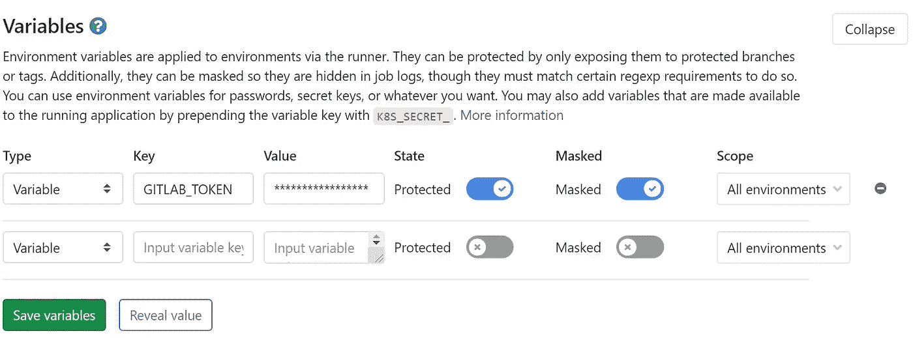

# GitLab 上的语义版本和发布自动化

> 原文：<https://levelup.gitconnected.com/semantic-versioning-and-release-automation-on-gitlab-9ba16af0c21>


潘卡杰·帕特尔在 [Unsplash](https://unsplash.com?utm_source=medium&utm_medium=referral) 上的照片

您将项目托管在 [GitLab](https://gitlab.com/) 上，并使用 CI/CD，但是您仍然手动管理分支和发布。一旦你的活动增加，你就会忘记跟踪版本、发布、标签、分支等等。是时候改进你的工作流程，让一些事情自动化了。你的项目或团队有多大并不重要。就像 Git 一样，你不需要一个复杂的组织来使事情变得整洁，即使你独自工作。在这篇文章中，我将向你展示我建议的配置，以坚持[语义版本](https://semver.org/)规范，以及如何让它快速工作。

## 截至 2022 年 2 月的更新

写完这篇文章后，我开始开发一个名为 [**倪克斯**](https://github.com/mooltiverse/nyx) 的新工具，来克服这里描述的解决方案的缺点，得到一个更干净、更精简的解决方案。

我也写过一篇类似的介绍性文章:[Gradle 使用倪克斯实现语义发布自动化](/semantic-release-automation-with-gradle-using-nyx-ba345235a365)。

## 截至 2022 年 12 月的更新

[**倪克斯**](https://github.com/mooltiverse/nyx) 现在也可以作为命令行工具和 Docker 图像使用。另一篇介绍文章是:[倪克斯，语义发布自动化工具](/nyx-the-semantic-release-automation-tool-4e2dfa949f38)。

# 分支模型和工作流

本文不是关于为你的项目选择正确的分支模型，因为它很容易配置，所以可以用于任何分支模型。

如果你在 GitLab 上托管你的项目，给 GitLabFlow 一个机会。它是根据 GitLab 特有的特性绘制的，所以很容易利用(长时间运行)[合并请求](https://docs.gitlab.com/ee/user/project/merge_requests/)和[环境](https://docs.gitlab.com/ee/ci/environments.html)，举几个例子，它对分支不是强制性的，因为它更关注自动化。

然而，没有什么可以阻止你使用其他模型，比如最受欢迎的 [GitFlow](https://nvie.com/posts/a-successful-git-branching-model/) 、 [OneFlow](https://www.endoflineblog.com/oneflow-a-git-branching-model-and-workflow) 或 [GitHubFlow](https://help.github.com/en/github/collaborating-with-issues-and-pull-requests/github-flow) 。为了快速比较，你可以开始看看这篇文章。我在这里的一点建议是，你需要开始弄清楚什么是你的项目和你的团队的最佳工作流，然后开始查看那些分支模型，如果需要的话，创建你自己的变体。只要你遵循一个[特性驱动的开发](https://en.wikipedia.org/wiki/Feature-driven_development)过程，你就可以很容易地找到一个简单有效的模型。此外，这不是一个永久的决定，您可以随时更改模型，所以不要陷入过度设计工作流中。简单起步，按需扩展。

在这篇文章的其余部分，我只是假设你使用:

*   无处不在的永久分支，发布发生的地方
*   维护分支(即`1.0.x`维护发布`1.0`
*   预览类似`alpha`的分支
*   特性分支(像`feature/NAME,` `fix/NAME`)或者任何其他种类的分支来提交不产生发布的小工作单元(直到合并到上面的分支之一)。这些分支从现在开始被忽略，因为它们不需要触发释放

如何以及何时创建这些分支并合并它们取决于您的工作流。

# 引入语义发布

我使用[](https://github.com/semantic-release/semantic-release)**([v 16 . 0 . 3](https://github.com/semantic-release/semantic-release/releases/tag/v16.0.3))是因为它易于插入、非侵入性，并且除了版本号的自动管理之外，还具有您可能需要的所有额外功能，如发布、[变更日志生成](https://github.com/conventional-changelog/conventional-changelog)等等。这些人的工作值得称赞！顺便说一下，如果你要使用它，请考虑在你的项目上展示他们的[徽章](https://github.com/semantic-release/semantic-release#badge)。完整文档可在[这里](https://semantic-release.gitbook.io/semantic-release/)获得。**

**还有其他几个工具可以自动生成版本号，但并不是所有工具都能生成变更日志和发布版本，或者只是做出不同的假设。我找到的几个是 [go-semrel-gitlab](https://juhani.gitlab.io/go-semrel-gitlab/) ， [python-semver](https://github.com/python-semver/python-semver) ， [semver-tool](https://github.com/fsaintjacques/semver-tool) 和 [semver](https://godoc.org/golang.org/x/tools/internal/semver) 。**

**虽然**语义发布**是一个 [Node.js](https://nodejs.org/en/) 包[，但它并不是专门针对节点项目](https://semantic-release.gitbook.io/semantic-release/support/faq#can-i-use-semantic-release-to-publish-non-javascript-packages)的，也不需要安装节点。您可以将它用于任何类型的项目，不管是哪种语言。我们将在一个[节点 Docker 容器](https://hub.docker.com/_/node)中使用它。**

**话说够了。让我们开始吧。**

## **语义发布的利与弊**

**我想节省你的时间，以防我发现的一个不利因素使语义释放在你的情况下不可行。**

**一个缺点是，除非你使用本文末尾显示的调整之一(见*在发布步骤*之前知道版本号)，否则你不会提前知道版本号，所以如果你需要使用版本号来构建你的工件，即使实际上没有发布，事情也会变得有点混乱。即使做了这样的调整，在构建被**语义发布**跳过的分支或提交时，您也必须处理生成版本号的问题。**

**另一方面， **semantic-release** 让您可以将您的发布管理置于自动驾驶状态，所以当上述限制都不适用于您的项目时，请考虑使用它。**

# **准备环境**

**您需要生成一个新的[个人访问令牌](https://docs.gitlab.com/ce/user/profile/personal_access_tokens.html)来推送访问您的存储库。更具体地说，您需要将`api`和`write_repository` [范围](https://docs.gitlab.com/ce/user/profile/personal_access_tokens.html#limiting-scopes-of-a-personal-access-token)授予令牌。**

**现在复制生成的令牌，并将其用于名为`GITLAB_TOKEN`(或`GL_TOKEN`)的新 [CI/CD 环境变量](https://docs.gitlab.com/ee/ci/variables/)。该变量可以是特定于项目的变量，也可以是[组变量](/`)，但重要的是要使其受到[保护](https://docs.gitlab.com/ee/ci/variables/#protected-environment-variables)，比如:**

****

**为 GITLAB 项目或组配置的 GITLAB_TOKEN 变量示例**

**从现在开始，项目管道中运行的所有作业都将能够使用`GITLAB_TOKEN`变量。如果该变量受保护，则只有运行受保护分支的管道的作业才能访问该变量。**

****语义发布**将使用令牌来标记发布并提交到存储库。**

**请考虑由**语义发布**采取的所有动作(如标记和发布发布)将显示为由发布令牌的用户执行。如果你有大型团队，你可能会选择一个*服务用户*账户(或者 Bot 账户)。**

# **配置语义发布**

**现在，为了配置**语义发布**，在您的 Git repo 的根目录下创建一个`.releaserc.yml`文件(`.gitlab-ci.yml`所在的位置)。编辑该文件，使其类似于:**

```
plugins:
  - "[@semantic](http://twitter.com/semantic)-release/commit-analyzer"
  - "[@semantic](http://twitter.com/semantic)-release/release-notes-generator"
  - "[@semantic](http://twitter.com/semantic)-release/gitlab"
branches:
  - "master"
  - "+([0-9])?(.{+([0-9]),x}).x"
  - name: "alpha"
    prerelease: "alpha"
```

**上面指示**语义发布**将`master`分支视为发布分支，而我们可能有任意数量的`N.M.x`维护分支加上一个我们想要触发发布的预发布分支(`alpha`)，与常规分支分开。**

**如果您想深入了解配置，还有其他选项[和](https://semantic-release.gitbook.io/semantic-release/usage/configuration)。您甚至可以跳过配置文件，并通过命令行传递所有选项。**

**在本文中，我使用 YAML 文件进行配置，但是您也可以轻松地使用 JSON。**

## **插件部分**

**插件做的正是你所期望的:它们扩展或定制了**语义发布**的行为。**

****语义发布**有一个[步骤](https://semantic-release.gitbook.io/semantic-release/usage/plugins)的内部序列，代表一个内部工作流程。在每一步，所有的插件都被调用。当插件列表结束时，下一步开始。插件在每一步都按照它们被定义的顺序被调用，直到最后一步所有的插件都被触发。**

**`plugins`部分是我们加载插件的地方。它与[默认插件](https://semantic-release.gitbook.io/semantic-release/usage/plugins#default-plugins)的不同之处在于:**

*   **`@semantic-release/npm`插件被移除，因为我们不需要它(除非在一个节点项目上工作)**
*   **`@semantic-release/github`插件被替换为`@semantic-release/gitlab`**

**只是为了记录起见，`plugins`部分可能已经被`[gitlab-config](https://github.com/semantic-release/gitlab-config)` [可共享配置](https://semantic-release.gitbook.io/semantic-release/usage/shareable-configurations)所取代，但那无论如何都会带来`npm`插件。**

**请注意，插件将按照它们在文件中声明的顺序运行。**

**还有很多其他插件可以玩。完整列表可在[这里](https://semantic-release.gitbook.io/semantic-release/extending/plugins-list)获得。如果你想添加其他插件，只需在这一部分添加它们，并确保将它们作为管道的一部分下载进来(见下文)。只是要注意插件的顺序，因为它反映了插件执行的顺序。**

## **分支部门**

**这个部分是从**语义发布**的角度配置工作流的地方。在我们深入了解配置细节之前，了解几个要点是很有用的:**

*   **从**语义发布**的角度来看，每个配置的分支定义了一种发布类型**
*   **从概念上讲，**语义发布**处理的发布有三种类型:**常规发布**，**预发布**(比如，`alpha`，`beta`，`release candidate`或者`rc`，`preview`等等，你有想法)和**后发布**(又名**维护发布**)。每个分支都属于这些家族中的一个。**语义发布**使用的大部分逻辑是为了保证这些发布类型之间的一致性，因此维护发布只能发布它们所绑定的常规发布范围内的版本号，预发布由代表早期阶段的版本号来标识(如`alpha`、`rc`等)**
*   **不是你在项目中使用的所有分支都需要被定义为语义发布:只需要那些定义发布的分支。例如，不配置特性分支仅仅是因为在这些分支中提交不会触发发布。只有当这些分支被合并到一些发布分支时，语义发布才会采取行动(提交历史在这里被清理，以收集数据并提供给变更日志)**
*   **相反，并不是所有配置到**语义发布**中的分支都必须是 Git 存储库中的实际分支。那些不存在的将被忽略，因为没有要分析的提交。这允许您拥有一个通用的配置(例如，您可以在多个项目中反映),并且您不需要担心匹配分支**

**回到配置。**

**`branches:`部分是由**语义发布**采取行动的分支列表，这取决于你的分支模型。记住，这些分支应该被配置为[受保护分支](https://docs.gitlab.com/ee/user/project/protected_branches.html)。**

**每个项目都具有以下属性:**

*   **`name`:它可以是一个简单的分支名称，也可以是一个 [glob](https://github.com/micromatch/micromatch#matching-features) ，它将被评估为与当前分支相匹配。例如，`master, develop`、`pre`、`next`是简单的分支名称，而`+([0-9])?(.{+([0-9]),x}).x`是一个与`1.x`、`2.2.x`等分支相匹配的词。使用 globs 时，考虑使用该测试仪。如果您的存储库中没有实际的分支匹配分支配置中的某个项目，那么配置中的那个项目将被忽略(并且当某个实际的分支匹配时会被考虑)。**
*   **`channel`:忽略它，除非你知道你需要一个发布渠道，这取决于你发布的工件。知道使用时默认为`name`。更多信息见[此处](https://semantic-release.gitbook.io/semantic-release/usage/workflow-configuration#channel)**
*   **`range`:使一个分支成为 [**维护**](https://semantic-release.gitbook.io/semantic-release/usage/workflow-configuration#maintenance-branches) 分支。`range`的值必须是整个项目中唯一的**，并且必须是`N.M.x`或`N.x`的形式，其中`N`和`M`是数字(而`x`是固定的)。当分支`name`被定义为一个 glob 时，`range`由此被推断出来，因此所有匹配该 glob 的实际分支将有一个关联的`range`，这使得它们成为**维护**分支。换句话说，你不需要自己设置`range`属性****
*   ****`prerelease`:这是一个字符串，被**语义发布**用来在发布名称的末尾附加一个限定符。该属性使分支成为 [**预发布**](https://semantic-release.gitbook.io/semantic-release/usage/workflow-configuration#pre-release-branches) 分支。例如，如果`prerelease`是`alpha`，**语义释放**将产生类似`1.0.0-alpha.1`(更一般的是`x.y.z-alpha.j`)的释放。该属性也可以设置为`true`，在这种情况下，用于标识符的字符串是`name`****

****`name`是分支或 glob 中唯一必须定义的属性，如果没有使用其他属性，分支可以只由`name`定义，就像上面配置示例中的`master`分支一样。当仅定义了`name`时，其他属性被默认。****

****虽然没有明确设置，但每一项都有一个[](https://semantic-release.gitbook.io/semantic-release/usage/workflow-configuration#branch-types)**(记住*常规*、*前置*、*后置*科)在其中:******

*   ********(常规)** [**发布**](https://semantic-release.gitbook.io/semantic-release/usage/workflow-configuration#release-branches) :这些是发布版本实际被评估和发布的分支。默认情况下，对于不属于其他类型的所有分支，都会推断出这种类型的分支。**语义发布**需要至少一个发布分支，最多允许四个。除非你有不同的风格，平台等，你只需要一个发布分支。更多信息参见下面的*版本范围*部分******
*   ****[**维护**](https://semantic-release.gitbook.io/semantic-release/usage/workflow-configuration#maintenance-branches) **(后发布)**:这些分支是用来发布旧版本之上的版本(比如补丁和补丁)。例如，维护分支`1.0.x`是发布`v1.0.0`到`v1.0.N`的维护分支。维护发布的存在是为了避免在*版本范围*约束中发生，它们只是通过`range`属性的存在来推断，所以当一个分支定义了`range`时，它会自动被认为是一个维护分支****
*   ****[**预发布**](https://semantic-release.gitbook.io/semantic-release/usage/workflow-configuration#pre-release-branches) :这些分支机构是为了在发布分支机构发布的常规发布之前发布发布。这些发布由一个结尾限定符(分支中定义的`prerelease`)限定，应该用于测试和预览目的****

****记住:**你不能在配置中定义分支的类型，因为它总是由其他属性**推断出来的。****

****当你有多个发布分支时(比如说`master`和`preview`，其中`preview`是在`master`之前发布的版本)**它们被定义的顺序关系到**和*，因为在给定分支上发布的版本必须总是高于在前一个分支*上发布的版本。因此，在本例中，`master`必须在`preview`之前定义，因为它将在为`preview`标记后标记某个版本。更多信息请参见[官方文件](https://semantic-release.gitbook.io/semantic-release/usage/workflow-configuration#pushing-to-a-release-branch)。****

# ****配置 GitLab CI 管道****

****现在剩下要做的就是在[管道配置](https://docs.gitlab.com/ee/ci/)中添加一个作业来运行**语义释放**。****

****在 repo 的根目录中打开`[.gitlab-ci.yml](https://docs.gitlab.com/ee/ci/yaml/)`文件(或者其他文件，如果您没有使用默认名称),然后添加一个作业，如下所示:****

```
**stages:
  # your existing stages here
  [...]
  - release# your existing jobs here
[...]release:
  image: node:13
  stage: release
  only:
    refs:
    - master
    - alpha
    # This matches maintenance branches
    - /^(([0-9]+)\.)?([0-9]+)\.x/
    # This matches pre-releases
    - /^([0-9]+)\.([0-9]+)\.([0-9]+)(?:-([0-9A-Za-z-]+(?:\.[0-9A-Za-z-]+)*))?(?:\+[0-9A-Za-z-]+)?$/ 
  script:
    - npm install [@semantic](http://twitter.com/semantic)-release/gitlab
    - npx semantic-release**
```

****我们在这里做的是:****

*   ****在管道末端增加`release` [阶段](https://docs.gitlab.com/ee/ci/yaml/#stages)(在`stages:`部分)(必须在末端，在建造、测试等之后)****
*   ****添加`release`作业(在`release:`部分)来运行**语义发布**。作业在[节点](https://hub.docker.com/_/node)容器(`image: node:13`)中运行。考虑到**语义发布** [需要 node . js 10.13 或更高版本](https://semantic-release.gitbook.io/semantic-release/#requirements)。当流水线运行到我们希望触发**语义释放**的特定分支时，作业在`release`阶段(`stage: release`和`only`执行。然后，实际的`script:`运行所需的任务来安装所需的插件，并安装/运行**语义发布******

****这里需要强调几点:****

*   ****`[only:](https://docs.gitlab.com/ee/ci/yaml/#onlyrefsexceptrefs)`部分是可选的，但是对于所有那些不需要运行**语义释放**的分支来说，它使管道更快。如果你省略这个部分，那么`release:`任务总是被执行，即使当**语义释放**仅仅因为无事可做而决定跳过动作。然而，这仍然意味着下载 Docker 映像并执行命令，增加了无用的工作和时间。如果您使用`only:`部分，请确保您在这里指定的分支和标签与上面的**语义发布**配置文件`.releaserc.yml`的`branches:`部分中配置的相匹配(这次使用 [regexp](https://regex101.com/)****
*   ****如果你有更多的[插件](https://semantic-release.gitbook.io/semantic-release/extending/plugins-list)(配置在**语义发布**配置文件的`plugins:`部分)或者[可共享配置](https://semantic-release.gitbook.io/semantic-release/extending/shareable-configurations-list)，你需要通过修改`npm install`命令来安装它们。您可以在同一个命令行上添加任意多的插件，例如:`@npm install @semantic-release/gitlab @semantic-release/exec`添加了`@semantic-release/exec`插件****
*   ****`npx semantic-release`命令既下载又运行**语义发布**，所以它是动作发生的地方****

# ****准备好了吗****

****你现在可以走了。只需提交并合并请求，您就会看到您的发布流。****

****请记住，**语义发布**默认使用[角度提交消息约定](https://github.com/semantic-release/semantic-release#commit-message-format)来解析提交消息，并以[传统格式](https://github.com/conventional-changelog/conventional-changelog)生成变更日志，因此当您提交时，只需使用该格式的消息。****

****总之，要让**语义发布**自动管理我们的发布，我们要做的就是:****

1.  ****生成一个个人访问令牌并设置`GITLAB_TOKEN`变量来保存它的值****
2.  ****在项目根中创建**语义发布**配置文件(`.releaserc.yml`)来设置插件和工作流(分支)****
3.  ****在管道配置(`.gitlab-ci.yml`)中添加一个作业来运行**语义发布******

****下面你可以找到关于定制案例和内部的进一步讨论。****

# ****在幕后****

****根据上面的设置，如果您想知道当管道被触发时会发生什么，下面是详细信息:****

1.  ****当一个新的提交发生时(通过`git push`或合并), GitLab 启动一个新的管道****
2.  ****当管道运行启动**语义释放**的作业时，流程按照配置的顺序，为每个插件执行每个[释放步骤](https://semantic-release.gitbook.io/semantic-release/#release-steps)****
3.  ****最新版本是通过检查[标签](https://git-scm.com/book/en/v2/Git-Basics-Tagging)和提交消息来确定的****
4.  ****`analyzeCommits`(唯一需要的步骤)决定了是否需要创建一个新的版本，如果需要，是什么类型****
5.  ****每个插件执行其核心任务，如生成发行说明、变更日志或创建标签。默认情况下，根据[角度提交消息约定](https://github.com/semantic-release/semantic-release#commit-message-format)解释变更日志****
6.  ****然后发布并由插件通知****

****注意**语义发布**不在 Git 存储库中存储状态文件来保存当前版本。相反，它只检查提交历史来确定当前版本和下一个版本。这使得它更干净，侵入性更小，避免你的回购混乱。****

## ****语义发布如何决定何时标记一个版本？****

******语义发布**做出这个决定的依据是:****

*   ****提交的分支(通过合并请求或者`push`)必须在工作流配置中进行配置(配置文件的`branches`部分)****
*   ****提交消息的格式或合并请求的标题必须匹配为`[@semantic-release/commit-analyzer](https://github.com/semantic-release/commit-analyzer)`插件配置的格式之一(通常配置为使用预置)****

****这些条件**必须都为真**，否则**语义释放**将跳过提交的版本控制。****

****当创建[合并请求](https://docs.gitlab.com/ee/user/project/merge_requests/)时，您经常[挤压](https://docs.gitlab.com/ee/user/project/merge_requests/squash_and_merge.html)属于合并的提交。这是避免混淆提交历史的好方法，但是从**语义发布**的角度来看，它使得单次提交的消息不可见。换句话说，如果你的意思是提交通过它们的提交消息触发一个释放，你会看到**语义释放**没有版本化来自合并请求的提交，因为它不再看到那些消息。这是真的，除非你将合并请求的标题设置为重要消息，在这种情况下**语义释放**能够检测到消息并触发版本。****

# ****版本范围****

****如果您配置了同一个[类型](https://semantic-release.gitbook.io/semantic-release/usage/workflow-configuration#branch-types)的多个分支，您可能会遇到`EINVALIDNEXTVERSION`错误，看起来是这样的:****

```
 **[3:54:19 PM] [semantic-release] › ✖  EINVALIDNEXTVERSION The release `x.y.z` on branch `name` cannot be published as it is out of range.
 Based on the releases published on other branches, only versions within the range >=x.y.z <x.y.z can be published from branch name.**
```

****此错误意味着一个分支上的一个提交应该使用与同一类型的另一个分支的现有版本冲突的版本号进行版本控制，这破坏了跨分支的版本号的唯一性。****

****来自[官方文件](https://semantic-release.gitbook.io/semantic-release/usage/workflow-configuration#release-branches):****

> ****一个项目必须定义最少 1 个发布分支，最多 3 个。发布分支定义的顺序是很重要的，因为在给定分支上发布的版本必须总是高于在前一个分支上发布的版本。这可以避免出现试图发布相同版本号但不同代码库的版本的情况。当配置了多个发布分支，并且推送了一个会产生版本冲突的提交时，**语义发布**将不会执行发布，并且会抛出一个`EINVALIDNEXTVERSION`错误，列出有问题的提交以及将它们移动到的有效分支。****

****要解决这个问题，您可以避免拥有多个相同类型的分支(即`release`，或者通过工作流配置中的`range`属性为分支分配特定的范围(**语义发布**配置文件的`branches`部分)。更多信息请点击查看[。](https://semantic-release.gitbook.io/semantic-release/usage/workflow-configuration)****

# ****其他使用案例****

## ****发布变更日志文件****

****如果您还想生成`CHANGELOG`文件，而不仅仅是在 GitLab 的 UI 版本中显示它，可以通过以下方式将`changelog`插件添加到`.releaserc.yml`文件中:****

```
**plugins:
- "[@semantic](http://twitter.com/semantic)-release/commit-analyzer"
- "[@semantic](http://twitter.com/semantic)-release/release-notes-generator"
**- - "**[**@semantic**](http://twitter.com/semantic)**-release/changelog"
  - changelogFile: CHANGELOG.md**
- "[@semantic](http://twitter.com/semantic)-release/gitlab"
branches:
- "master"
- "+([0-9])?(.{+([0-9]),x}).x"
- name: "alpha"
  prerelease: "alpha"**
```

****这样,`CHANGELOG.md`文件就在项目的根文件夹中生成了。您可以更改文件名或其相对于根目录的路径。****

****我们还需要将插件添加到`.gitlab-ci.yml`文件中，顺便说一下，为了不在作业结束时丢失生成的文件，我们还(可选地)将它发布到[管道工件](https://docs.gitlab.com/ee/ci/yaml/#artifacts)中:****

```
**release:
  image: node:13
  stage: release
  only:
    refs:
    - master
    - alpha
    # This matches maintenance branches
    - /^(([0-9]+)\.)?([0-9]+)\.x/
    # This matches pre-releases
    - /^([0-9]+)\.([0-9]+)\.([0-9]+)(?:-([0-9A-Za-z-]+(?:\.[0-9A-Za-z-]+)*))?(?:\+[0-9A-Za-z-]+)?$/ 
  script:
    - touch CHANGELOG.md
    - npm install [@semantic](http://twitter.com/semantic)-release/gitlab [**@semantic**](http://twitter.com/semantic)**-release/changelog**
    - npx semantic-release
  **artifacts:
    paths:
    - CHANGELOG.md****
```

****当**语义发布**确定没有要发布的文件时，为了避免由于没有要发布的文件而导致的作业失败，`touch CHANGELOG.md`是有用的。****

## ****在发布步骤之前知道版本号****

****记住**语义发布**必须在管道的末端运行，因为发布是构建、测试等之后的最后一步。但是，有时您不能等到管道结束时才知道版本号，例如:****

*   ****您需要在某个地方以某种方式构建包含版本号的工件****
*   ****测试需要测试和发布的工件之间的一致性****
*   ****依赖性管理和工件目录需求****
*   ****还有更多…****

****无论是哪种情况，当最终仍然运行发布工作时，您需要在构建管道的早期阶段获取版本号。在这里，我们要处理这个问题。请记住:****

*   ****这种用法被 **semantic-release** 所反对，它遵循一种纯粹主义的方法，认为版本号应该在实际的发布步骤中生成****
*   ******语义发布**将只在它知道的分支(发布分支、预发布和维护)中运行管道时给我们版本号，而在其他分支(即特性分支)中，如果被调用，它将跳过，因此**在这种情况下，您需要生成自己的版本号(与版本号模式无关，以避免冲突)**。我们也会处理这个问题****

****因此，为了完成这项工作，我们将扩展**语义发布**配置，以便使用一个额外的插件`[@semantic-release/exec](https://github.com/semantic-release/exec)`，它允许我们运行在**语义发布**工作流步骤中编排的任意命令。更详细地说，我们将在`verifyRelease`步骤中使用该插件(这发生在前面步骤中的其他插件评估提交历史之后)，但在使用`[--dry-run](https://semantic-release.gitbook.io/semantic-release/usage/configuration#dryrun)`选项时被忽略的其他插件之前。在这个阶段，我们使用预演，因为我们还没有发布任何版本，只是[偷偷进入 API](https://github.com/semantic-release/semantic-release/blob/master/docs/developer-guide/js-api.md) 。****

****下面是`.releaserc.yml`的样子:****

```
**plugins:
- "[@semantic](http://twitter.com/semantic)-release/commit-analyzer"
- "[@semantic](http://twitter.com/semantic)-release/release-notes-generator"
**- - "**[**@semantic**](http://twitter.com/semantic)**-release/exec"
  - verifyReleaseCmd: "echo ${nextRelease.version} > VERSION.txt"**
- "[@semantic](http://twitter.com/semantic)-release/gitlab"
branches:
- "master"
- "+([0-9])?(.{+([0-9]),x}).x"
- name: "alpha"
  prerelease: "alpha"**
```

****正如你所看到的，新的`exec`插件只是将下一个版本号保存到一个平面文件`VERSION.txt`，我们稍后将在管道中看到。****

****`.gitlab-ci.yml`管道配置:****

```
**stages:
  **- fetch-version**
  - build
  - releasefetch-semantic-version:
  # Requires Node >= 10.13 version
  image: node:13
  **stage: fetch-version**
  **only:**
    refs:
    - master
    - alpha
    - /^(([0-9]+)\.)?([0-9]+)\.x/ # This matches maintenance branches
    - /^([0-9]+)\.([0-9]+)\.([0-9]+)(?:-([0-9A-Za-z-]+(?:\.[0-9A-Za-z-]+)*))?(?:\+[0-9A-Za-z-]+)?$/ # This matches pre-releases
  script:
    - npm install [@semantic](http://twitter.com/semantic)-release/gitlab [@semantic](http://twitter.com/semantic)-release/exec
    - npx semantic-release **--generate-notes false --dry-run**
  **artifacts:
    paths:
    - VERSION.txt**generate-non-semantic-version:
  **stage: fetch-version**
  **except:**
    refs:
    - master
    - alpha
    - /^(([0-9]+)\.)?([0-9]+)\.x/ # This matches maintenance branches
    - /^([0-9]+)\.([0-9]+)\.([0-9]+)(?:-([0-9A-Za-z-]+(?:\.[0-9A-Za-z-]+)*))?(?:\+[0-9A-Za-z-]+)?$/ # This matches pre-releases
  script:
    **- echo build-$CI_PIPELINE_ID > VERSION.txt
  artifacts:
    paths:
    - VERSION.txt**build:
  stage: build
  script:
    - echo "Version is **$(cat VERSION.txt)**"release:
  image: node:13
  stage: release
  only:
    refs:
    - master
    - alpha
    # This matches maintenance branches
    - /^(([0-9]+)\.)?([0-9]+)\.x/
    # This matches pre-releases
    - /^([0-9]+)\.([0-9]+)\.([0-9]+)(?:-([0-9A-Za-z-]+(?:\.[0-9A-Za-z-]+)*))?(?:\+[0-9A-Za-z-]+)?$/ 
  script:
    - npm install [@semantic](http://twitter.com/semantic)-release/gitlab
    - npx semantic-release**
```

****它看起来像很多东西，但你可以找到一些相关的部分用粗体显示。我们在这里做什么:****

1.  ****在管道中定义一个名为`fetch-version`的新阶段。这个阶段在管道的开始运行，以获取或生成版本号并使其可用****
2.  ****在**语义发布**管理的分支上，定义一个在`fetch-version`阶段`**only**` 运行的新作业`fetch-semantic-version`。这一次，我们使用选项`--generate-notes false --dry-run`来避免应用任何更改。然而，这仍然会生成`VERSION.txt`文件，因为我们已经有了**语义发布**配置****
3.  ****定义另一个作业`generate-non-semantic-version`，它也在`fetch-version`阶段运行，但是只在构建非发布分支(与`fetch-semantic-version`相反)时运行，并生成一个`VERSION.txt`文件，该文件具有非语义版本 id，与常规版本号不冲突，但是我们仍然可以使用它来构建和测试工件。这里生成的版本 id 的形式是`build-<PIPELINE_ID>`，但是您可以选择任何其他形式，比如时间戳、sha 或随机数。如果在预发布阶段不需要版本号，可以跳过定义这个作业，但是如果需要，嵌套阶段可以以幂等的方式运行，依赖于版本 id 的存在****
4.  ****在两个作业中生成`VERSION.txt`文件(当然您可以使用任何其他名称),并将其发布为一个[工件](https://docs.gitlab.com/ee/ci/yaml/#artifacts),因为它需要在不同的构建作业中可用****
5.  ****定义另一个示例作业`build`，该作业仅显示使用`VERSION.txt`中的值的一个示例，而不管该值是如何以及何时生成的****