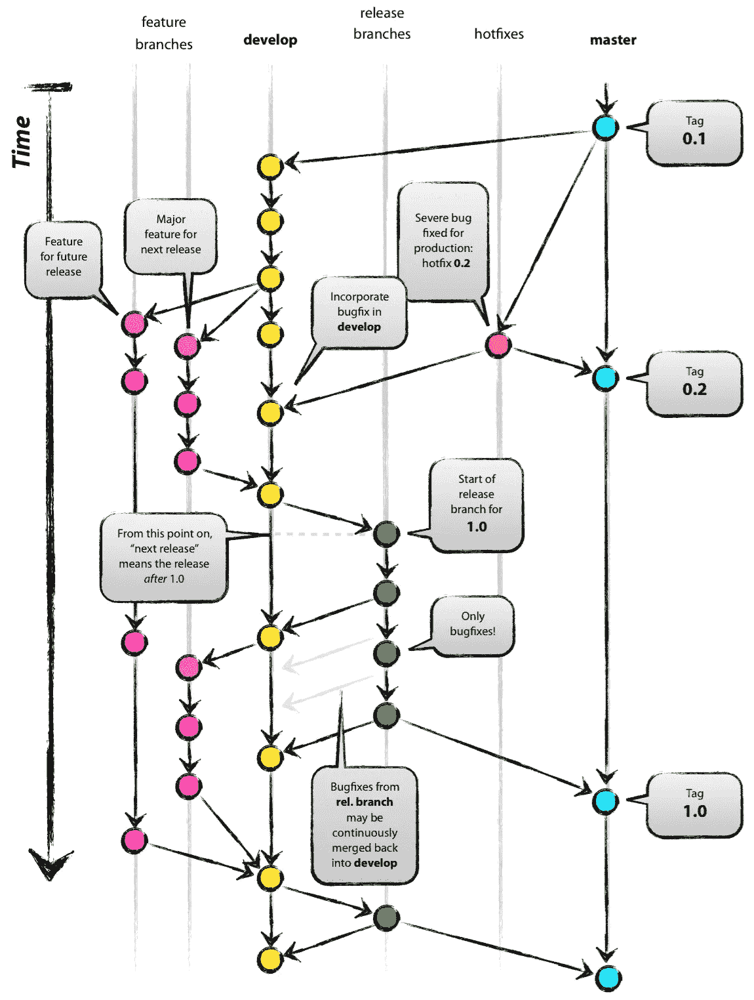

# git 流的语义版本控制以及实现这一点的绝妙方法

> 原文：<https://levelup.gitconnected.com/semantic-versioning-with-git-flow-and-the-marvelous-way-to-go-there-b9f97b90455c>


照片由[扬西·敏](https://unsplash.com/@yancymin?utm_source=medium&utm_medium=referral)在 [Unsplash](https://unsplash.com?utm_source=medium&utm_medium=referral) 上拍摄

# 语义版本化？我的天啊。

到底什么是[语义版本化](https://semver.org/)？语义版本化(也称为 **SemVer** )是开发/发布软件时使用的版本化系统。语义版本化提供了一种版本化软件开发项目的通用方式，这是跟踪软件进展的最佳方式，因为新的插件、附件、库和扩展几乎每天都在构建。

给定一个版本号`Major.Minor.Patch`，增加:

1.  `Major`版本当你做出不兼容的 API 修改时，
2.  `Minor`以向后兼容的方式添加功能时的版本，以及
3.  `Patch`版本当你做向后兼容的 bug 修复。

预发布和构建元数据的附加标签是对`Major.Minor.Patch`格式的扩展。


SemVer 2.0.0

当您使用语义版本化时，有多条规则需要遵循，您可以在此处阅读，但是我们将为您总结其中的一些规则:

*   永远不要对版本使用负数(咄！)
*   不要改变已发布版本的内容。不要懒惰，发布一个新的。
*   当主版本为零时，我们认为软件处于开发阶段，公共 API 不稳定。所以从零开始主要版本，但最终发布`1.0.0`版本。
*   补丁版本包括错误修复，不要将它们用于新功能。
*   如果发布了新的主要版本，次要版本和补丁版本必须重置为零。
*   如果发布了新的次要版本，修补程序版本必须重置为零
*   预发行版可以用一个连字符和一系列紧跟在补丁版本后面的点分隔标识符来表示。例如`1.0.0-alpha.1`或`1.5.3-rc.7`

# Git 流

由 [Vincent Driessen](https://nvie.com/about/) 发布的 [GitFlow Workflow](https://nvie.com/posts/a-successful-git-branching-model/) 是一个分支模型，允许多个流之间有严格的边界。核心原则相当简单和直观。

Git Flow 是永远友好的，这意味着它允许开发人员为每个特性、补丁、版本或修补程序创建分支。



来自[一个成功的 Git 分支模型](https://nvie.com/posts/a-successful-git-branching-model/)

所以我们来谈谈 Git 流中的分支。

*   `develop`是最新的不稳定版本
*   `master`是最新的稳定版本
*   `tag`是版本的快照
*   `hotfix`是临时分支，用来修复版本上的某些东西
*   `release`是临时分部准备的新版本
*   `feature`是开发新功能的临时分支

`master`和`develop`分支在 Git 流中是不朽的，应该永生。`master`分支包含最新的稳定版本和它的官方历史。`develop`分支包含最新的不稳定版本。除了`hotfix`以外的所有临时分支都必须合并到`develop`中。这意味着我们从`develop`创建`release`分支，并将它们合并回`develop`和`master`。版本标签必须合并到`master`分支中。

从现在开始我们假设你对`git`本身和[安装的](https://github.com/nvie/gitflow/wiki/Installation) `gitflow`扩展有一点了解。


来自 [git-flow cheatsheet](https://danielkummer.github.io/git-flow-cheatsheet/)

## 生存的特征，失去的分支

一个新特性是项目中的一个新故事:

> 作为某人[我想要某样东西]

特性为项目添加了新的功能。在 Git 流程中，我们为每个特性从`develop`分支创建一个新的`feature`分支，实现并测试它，将其合并到 develop 中，然后在最后移除`feature`分支。

```
git checkout develop
git pull origin develop
git flow feature start featureName
```

这将从`develop`创建一个名为`feature/featureName`的新分支。如果其他人也在使用，您可以将功能发布到遥控器或从遥控器中提取功能:

```
git flow feature publish featureName
git flow feature pull featureName
```

最后，特征分支消失了，特征存在于`develop`中。该命令将特征分支合并到`develop`中，并本地和远程删除。

```
git flow feature finish featureName
```

## 这不是虫，这是…等等，是一只虫子

Bug 分支也是活的临时的。Git Flow 以`bugfix/bugfixName`的名字从`develop`创建 bug 分支。

```
git checkout develop
git pull origin develop
git flow bugfix start bugName
```

其他 Git 流命令也适用于 bug 修复(发布、拉取、完成)。

## master 上的一个关键 bug？

稳定版本报告的错误创建了一个次要版本。要创建这种类型的错误修复，必须创建热修复。热修复程序使用`master`分支作为起点，并合并回其中

```
git checkout master
git pull origin master
git flow hotfix start hotfixName
```

其他 Git 流命令也适用于热修复(发布、拉取、完成)。

## 安全了吗？释放它…

发布基于`develop`的新版本，Git flow 允许你创建`release`分支。`release`brands 包含来自`develop`的最新代码，并在最后在 git 中创建新的标签(版本)。

```
git checkout develop
git pull origin develop
git flow release start 1.0.8
```

这将创建一个名为`release/1.0.8`的新分支，如果你完成它，一个新标签(1.0.8)将被合并到`master`中。

# 什么是被改变的人类？

更改日志是一个文件，它包含一个按时间顺序排列的列表，列出了项目每个版本的显著更改。更改日志是为人类准备的，人类不理解 git 日志，所以不要让任何人将他们的 git 日志转储到`CHANGELOG.md`。

以下是基于[创建`CHANGELOG.md`的一些注意事项](https://keepachangelog.com/en/1.0.0/)

*   每个版本都应该有一个条目。
*   相同类型的变更应分组:

1.  `Added`为新增功能。
2.  `Changed`针对现有功能的变更。
3.  `Deprecated`针对即将删除的功能。
4.  `Removed`为现已移除的特征。
5.  `Fixed`任何 bug 修复。
6.  `Security`以防漏洞。

*   版本和节应该是可链接的。
*   最新版本优先。
*   显示每个版本的发布日期。

# 结论

将语义版本控制与 Git flow 结合使用，使得维护软件项目变得容易。记住，你也可以在你的项目中添加一个可读的变更日志，来跟踪在这个不可思议的开发过程中已经完成了什么。