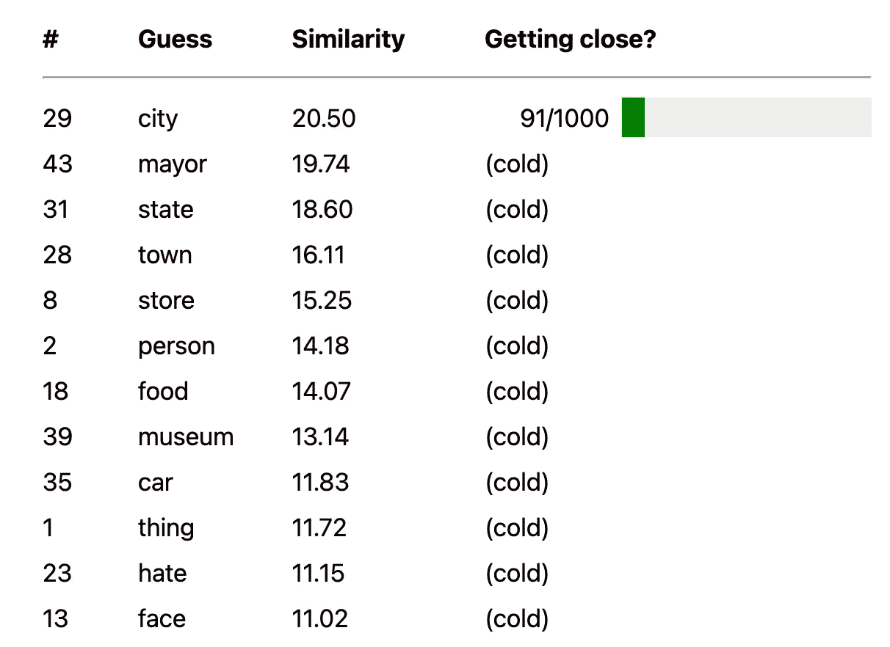

# 语义词

> 原文：<https://levelup.gitconnected.com/semantic-wordle-ca5c04ee2ca3>

有一个新版本的 [Wordle](http://wordle/) 叫做[Semantle](http://semantle.novalis.org/)——不是我“[预测的](https://www.hyperorg.com/blogger/2022/02/17/from-aordle-to-zorrodle-wordles-to-come/)”——它希望你通过寻找一系列的语义而不是一系列的拼写来找到目标单词。例如，如果您从单词“child”开始，您可能会得到如下答案“homer ”:

1.  儿童
2.  玩
3.  比赛
4.  象棋
5.  平方
6.  圆
7.  油炸圈饼
8.  荷马

简而言之，你在玩单词联想，除了联想可能非常松散。这不像二十个问题，一旦你找到了一条线索(比如“动物”)，你就缩小了范围，直到只剩下一件事。总之，在任何时候，这些联系都可能在一千个方向中的任何一个方向上发生突然的转变。

也就是说基本不可能赢。

然而，它很好地介绍了机器学习如何“思考”单词。或者至少是其中一种方式。Semantle 基于 [word2vec](https://en.wikipedia.org/wiki/Word2vec) ，它创建了*文本嵌入*，这些文本嵌入来自于对一些大型(有时非常非常大)文本集的分析。文本嵌入基于单词在那些文本中的相似性来映射单词之间的统计关系。

在一个典型的例子中，word2vec 可以很好地理解“queen”和“king”在语义上是相近的，这也可以很好地理解“king”对于“prince”就像“queen”对于“princess”一样。

但是，当然，单词之间有很多联系——不同的相似轴，不同的维度。这些被称为“向量”(如“word2 *vec* ”)。玩 Semantle 时，你在寻找单词可能嵌入的向量。有很多很多这样的人，有些比其他人更强。例如，“国王”和“王后”共用一个维度，但“国王”和“象棋”，“国王”和“床的大小”，“国王”和“猫王”也是如此。单词的分支方式比单词多得多。

例如，在我的第一个游戏 Semantle 中，在 45 次尝试寻找一个甚至有点接近答案的单词后，我发现“城市”与它有模糊的联系，无论它是什么。但现在我必须猜测向量“城市”和目标份额。目标可以是“村庄”、“繁忙”、“出租车”、“多样化”、“嘈杂”、“围攻”，或者一大堆似乎与“城市”相对接近但以不同方式相关联的词。

事实上，我并没有偶然发现相关的向量。答案是“报纸”

我认为 Semantle 会更有趣，如果他们从一个离答案有合理距离的词开始，而不是让你猜测一个合理的开始词可能是什么。否则，您可能会花费很长时间——45 次尝试来获得“城市”——只需生成随机单词。但是如果我们知道一个起始单词是，比方说，“脚”，我们就可以开始思考这个单词所在的向量:尺寸、脚趾、身体、鞋子、足球等等。这可能很有趣，而且会扩展我们的思维。

事实上，Semantle 是一款不可玩的游戏，它给我们上了重要的一课。

现在，我将等待许多真正有能力解决 Semantles 问题的人的回应。在期待中，让我注意到，我恨你们所有人与一个白色热和完全不合理的激情。😜

*注意:我已经收到了正在解决这个问题的人的来信。我不再恨他们了。*