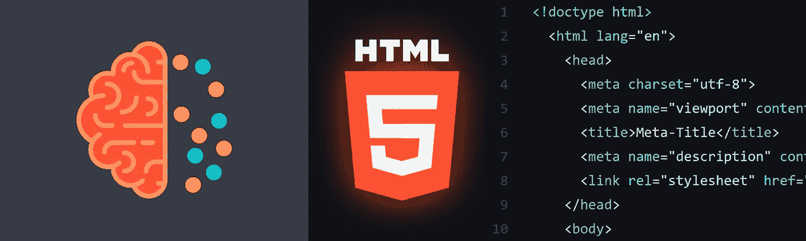
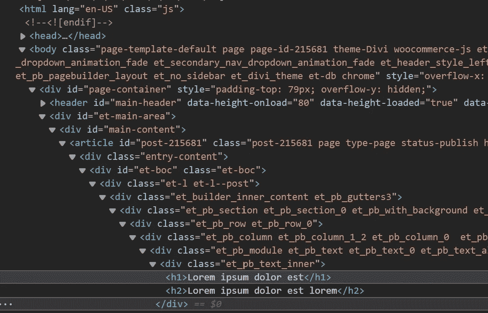

# 我如何构建 HTML 以获得更好的搜索引擎优化结果

> 原文：<https://levelup.gitconnected.com/semantics-how-i-structure-html-without-divitis-dd0d376f193>

## 这篇文章展示了我如何使用语义 HTML 标签来优化网站，以便为更好的机器可读性准备内容。

*更新 2022–09–27:我已经更正了标记的语义，并在 head 部分添加了 css 链接的 media 属性。*



今天，搜索引擎优化是在网络上获得可见性的一个重要手段。但是很多网站不使用语义 HTML 5 标签来优化机器对机器人的可读性。

HTML 语义经常如此糟糕的一个原因是:越来越多的非编程程序员使用复制粘贴和模板来创建网站。这些模板通常在语义方面构建得很差。

**语义代码的一大好处是*机器*和*人类*可以更好地阅读它。**

# 一个大问题:“红利”

如果一个网站的标记主要是由许多嵌套的`divs`构成，而`divs`由于布局的原因只有*，则称之为*分割*。往下看截图。取自 *Divi* 的一个[模板](https://www.elegantthemes.com/layouts/events/dentist-landing-page/live-demo)，一个 *Wordpress* 的模板系统。*

> *这真是一团糟。*

**

*经典截图:最佳分割*

# *主要思想*

> *每次为包含标记名的 div 编写类名时，都应该用相应的语义标记替换 div，并简化类名。*

*示例:*

*❌ `div.nav-main`*

*✔️ `nav.main`*

*下面是一些语义标签的列表。*

*   <details></details>

*   <main></main>

*   <summary></summary>

# *我的语义 HTML 样板*

*在我看来，大多数网站都可以用下面的样板文件来构建。*

***请忽略**的`head`部分，这篇文章讲的都是`body`部分。所示的`head`部分只是为了完整起见。*

*在我的代码示例中，`body`有一个可选的`div#page`标签，用于查看整个页面。在`div#page`部分中，我主要使用三个部分:*

*   *`header`*
*   *`main`*
*   *`footer`*

*请另外阅读我关于如何组织我的 CSS 的文章。结合这篇文章，你可以更好地了解我如何编写语义代码来同时提高机器和人类的可读性。*

*[](https://medium.com/@stephan.romhart/how-i-organize-my-css-for-websites-without-a-framework-4d93fbbc74fe) [## 我如何在没有框架的情况下为网站组织 CSS

### 在我 20 年的 web 开发经验中，我为自己开发了一个标准的 CSS 方法，我想分享一下…

medium.com](https://medium.com/@stephan.romhart/how-i-organize-my-css-for-websites-without-a-framework-4d93fbbc74fe) 

# 页眉

`header`部分主要用于显示品牌/标志/公司名称和所有主要导航。

在`header`中，我经常使用两个`nav`元素作为直接子元素:

*   `nav.meta`
*   `nav.main`

使用`nav`元素进行*导航*而不是使用`div.nav-meta`和`div.nav-main`会产生语义上的差异。不要这样做。

在`nav`元素中，我总是放`ul` s。在`nav.main`元素中，我经常插入公司标志作为`h1`元素。

好处:为了解决 CSS 中的主要导航问题，我编写了以下代码。你可以很容易地阅读等级。

```
header nav.main { ... }
header nav.main ul{ ... }
header nav.main ul li a{ ... }
``` 

# *实际页面内容*

*在内容区域，我使用`section`标签将所有内容组织成逻辑组。每个内容`section`都有一个刚刚可读的*类名*。*

```
*section.intro { ... }
section.intro h2 { ... }section.keyvisual { ... }
section.keyvisual div.container h2 { ... }*
```

*我在内容区域专门使用`divs`作为具有*布局功能*的容器。*

*在我的例子中，`section` keyvisual 有一个标题容器，它位于 keyvisual 内部的绝对位置*。**

# *页脚*

*在`footer`区域，我还使用了`section`标签来逻辑分隔内容。*

*在我的示例中，有两个部分:*

*   *`section.brand`*
*   *`section.legal`*

*在品牌部分，我经常添加标志、`address`和联系方式。*

*法律部分属于导航类型，所以我使用了一个`nav`标签。*

# *结论*

*我知道今天的现代设备和浏览器可以处理糟糕的代码。但是，如果你想更可持续地工作，如果你想提高你的 HTML 代码对机器和人类的可读性，修改它，优化你的语义。*

**

***感谢阅读。** 期待您的反馈。😍*

*请评论、书签或关注我，支持我的频道。*

*如果你心中有一个特定的主题，你会希望我写下来，让我在推特上知道:[https://www.twitter.com/@stephan_romhart](https://www.twitter.com/@stephan_romhart)*