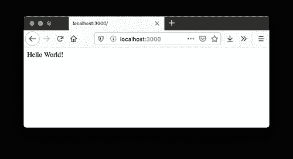
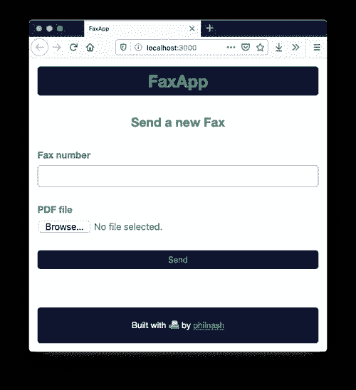
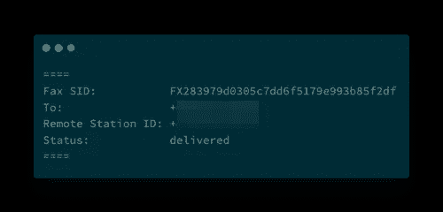

# 使用 Sinatra 和 Ruby 通过 Twilio 传真 API 发送和跟踪传真

> 原文：<https://levelup.gitconnected.com/send-and-track-faxes-with-the-twilio-fax-api-using-sinatra-and-ruby-f0e87a05039f>


发生了！自从 2017 年 Twilio 推出可编程传真 API 以来，我一直在等待我需要发送传真的时刻，这一天终于到来了！我不会详细说明我需要发送什么，但可以肯定地说，医疗行业可以考虑他们未来的通信选择。

我本可以通过使用 API explorer 将 PDF 上传到 [Twilio Assets](https://www.twilio.com/docs/runtime/assets) 和[来发送传真，但这不会像过度设计整个应用程序来发送和跟踪传真以确保传真到达并为任何未来的传真情况做好准备那样有趣。](https://www.twilio.com/console/api-explorer/fax)

在这篇文章中，我将分享如何构建一个发送和跟踪传真的应用程序，但如果你有传真要发送，并想直接使用它，你可以在 GitHub 上找到[所有的源代码。](https://github.com/philnash/twilio-fax-ruby-sinatra)

# 首选武器

当发送传真时，它更像是打电话而不是发送信息。因此，它可能会像打电话一样失败，例如，如果它收到忙音。因此，在开发这个应用程序的时候，我希望它足够简单，能够快速组装，但又足够强大，能够支持发送和接收传真的状态更新。

我决定选择鲁比，和辛纳特拉。要开始这项工作，您需要:

*   [Ruby 安装了](https://www.ruby-lang.org/en/downloads/)，我推荐最新版本，2.6.5
*   [捆绑器](https://bundler.io/)用于安装依赖项
*   [ngrok](https://ngrok.com/) 这样我们就可以[以样式](https://www.twilio.com/blog/2015/09/6-awesome-reasons-to-use-ngrok-when-testing-webhooks.html)公开 webhook 端点
*   一个有传真号码的 Twilio 账户

这应该足以让这个应用程序建立起来，所以让我们开始吧。

# 应用程序外壳

在实际发送传真之前，让我们设置应用程序并确保它正常工作。创建一个新的工作目录，并在命令行上切换到该目录。

```
mkdir fax_app
cd fax_app
```

通过调用以下命令初始化新应用程序:

```
bundle init
```

添加我们将用于构建该应用程序的 gem:

*   一个简单的网络框架
*   [twilio-ruby gem](https://github.com/twilio/twilio-ruby) 与 [Twilio Fax API](https://www.twilio.com/docs/fax) 交互
*   霰弹枪以便服务器在我们做出更改时重新加载
*   [envable](https://github.com/philnash/envyable)至[管理应用程序中的环境变量](https://www.twilio.com/blog/2015/02/managing-development-environment-variables-across-multiple-ruby-applications.html)

```
bundle add sinatra twilio-ruby shotgun envyable
```

创建应用程序结构:

```
mkdir views public config files
touch app.rb config.ru views/layout.erb views/index.erb public/style.css config/env.yml
```

将保存我们的应用程序配置。打开它并添加以下内容:

```
TWILIO_ACCOUNT_SID: 
TWILIO_AUTH_TOKEN: 
FROM_NUMBER: 
URL_BASE:
```

从您的 [Twilio 控制台](https://www.twilio.com/console)填写帐户 SID 和身份验证令牌。对于发件人号码，从您的 Twilio 账户添加一个[传真号码。稍后我们将填写`URL_BASE`。](https://www.twilio.com/console/phone-numbers/incoming)

`config.ru`是启动我们的应用程序的文件。我们将需要应用程序依赖性，从`config/env.yml`加载环境变量，加载应用程序，然后运行它。添加以下代码来完成所有这些工作:

```
require 'bundler'
Bundler.require

Envyable.load('./config/env.yml')

require './app.rb'
run FaxApp
```

为了确保到目前为止一切正常，我们将构建一个“Hello World！”端点作为我们应用的起点。打开 app.rb 并添加以下内容:

```
require 'sinatra/base'

class FaxApp < Sinatra::Base
  get '/' do
    "Hello World!"
  end
end
```

这创建了一个返回文本“Hello World！”作为对加载根路径的响应。使用以下内容运行应用程序:

```
bundle exec shotgun config.ru -p 3000
```

打开 [localhost:3000](http://localhost:3000) ，应该说“Hello World！”如果是这样，那么我们就在正确的轨道上。



接下来，让我们构建应用程序的界面。

# 构建界面

在 Sinatra 中，默认情况下使用嵌入了 Ruby 的 ERB 来呈现视图。默认情况下，Sinatra 会在`views/layout.erb`寻找版面。我们已经创建了该文件，让我们添加以下 HTML 结构:

```
<!DOCTYPE html>
<html lang="en">
<head>
  <meta charset="UTF-8">
  <meta name="viewport" content="width=device-width, initial-scale=1.0">
  <meta http-equiv="X-UA-Compatible" content="ie=edge">
  <link rel="stylesheet" href="/style.css">
  <title>FaxApp</title>
</head>
<body>
  <header>
    <h1>FaxApp</h1>
  </header>
  <main>
    <%= yield %>
  </main>
  <footer>
    <p>Built with 📠 by <a href="https://twitter.com/philnash">philnash</a></p>
  </footer>
</body>
</html>
```

这里最重要的部分是中间的`<%= yield %>`。这是插入单个视图模板的位置。

让我们添加一些风格，使应用程序看起来也很好。在 GitHub 上打开`public/style.css`并复制到[中的 CSS 文件中。](https://raw.githubusercontent.com/philnash/twilio-fax-ruby-sinatra/master/public/style.css)

打开`views/index.erb`。现在我们需要构建一个表单来收集我们要发送传真的号码和一个 PDF 文件，Twilio API 会将这个 PDF 文件转换成传真。在`views/index.erb`中增加以下内容:

```
<h2>Send a new Fax</h2>

<form method="POST" action="/faxes" enctype="multipart/form-data">
  <div>
    <label for="number">Fax number</label>
    <input type="tel" id="number" name="number" required />
  </div>
  <div>
    <label for="file">PDF file</label>
    <input type="file" id="file" name="file" required accept="application/pdf" />
  </div>
  <div>
    <button type="submit">Send</button>
  </div>
</form>
```

在这个表单中，我们将方法设置为`POST`，将`enctype`设置为`multipart/form-data`，这样我们就可以用它将文件上传到服务器。我们已经将`action`设置为`/faxes`，这是我们即将构建的一个端点。我们还使用了一些 HTML 表单验证来确保我们输入的值是正确的，两个输入字段都是必需的，传真号码字段是类型`tel`并且文件输入只接受 PDF 文件。

再次打开`app.rb`。我们现在想改变我们的“Hello World！”改为端点渲染`views/index.erb`。我们用`erb`助手方法来做这件事。

```
class FaxApp < Sinatra::Base
  get '/' do
    erb :index
  end
end
```

如果应用程序仍在运行，请在 [localhost:3000](http://localhost:3000) 处再次检查。它应该是这样的:



接口完成了，现在让我们构建后端并实际发送一些传真！

# 发送传真

正如我们提到的，我们需要创建`/faxes`端点。它需要做几件事:

*   回复帖子请求
*   存储我们正在上传的 PDF 文件
*   向 Twilio Fax API 发出创建传真的请求
*   最后重定向回主页

为了响应 POST 请求，我们使用 Sinatra `post`方法。在`app.rb`中，将其添加到应用程序类:

```
 post '/faxes' do

  end
```

我们可以使用`params`散列获得提交给端点的文件和其他参数。

```
 post '/faxes' do
    filename = params[:file][:filename]
    file = params[:file][:tempfile]
    to = params[:number]
  end
```

如果我们有一个已上传的文件，我们会将其写入应用程序中的`files`目录:

```
 post '/faxes' do
    filename = params[:file][:filename]
    file = params[:file][:tempfile]
    to = params[:number]

    if file
      File.open("./files/#{filename}", 'wb') do |f|
        f.write(file.read)
      end
    end
  end
```

接下来，我们将创建一个 Twilio API 客户机，用我们的凭证授权它，并调用 API 来发送传真。我们将使用在`config/env.yml`中设置的`FROM_NUMBER`作为传真的发件人号码，收件人号码来自表单参数，我们需要发送一个指向传真的`media_url`。

当 Twilio 连接到我们要发送的传真机时，它会发出一个 webhook 请求来检索我们要作为传真发送的 PDF 文件。因此，我们需要提供该 PDF 文件的 URL。我们还没有定义上传文件的服务方式，但这是我们下一步要做的事情。现在，使用下面的内容作为`media_url` : `media_url: "#{ENV["URL_BASE"]}/faxes/files/#{ERB::Util.url_encode(filename)}"`。结束端点，重定向回根路径。

```
 post '/faxes' do
    filename = params[:file][:filename]
    file = params[:file][:tempfile]
    to = params[:number]

    if file
      File.open("./files/#{filename}", 'wb') do |f|
        f.write(file.read)
      end

      client = Twilio::REST::Client.new(ENV['TWILIO_ACCOUNT_SID'], ENV['TWILIO_AUTH_TOKEN'])
      client.fax.faxes.create(
        from: ENV['FROM_NUMBER'],
        to: to,
        media_url: "#{ENV["URL_BASE"]}/faxes/files/#{ERB::Util.url_encode(filename)}"
      )
    end
    redirect '/'
  end
```

现在，我们需要构建`/faxes/files/:filename`端点来返回上传的文件。好的做法是[保护这个 webhook 端点，确保它只响应来自 Twilio](https://www.twilio.com/docs/usage/webhooks/webhooks-security#validating-signatures-from-twilio) 的请求。我们可以使用 twilio-ruby gem 提供的框架中间件[来完成这项工作，该中间件检查来自 Twilio](https://www.twilio.com/blog/2014/09/securing-your-ruby-webhooks-with-rack-middleware.html) 的头中的签名。

Sinatra 给了我们一个非常简单的发送文件的方法，即`send_file`方法。因此，让我们创建一个 get 端点来返回文件。我们将把文件名作为路径的最后一部分(路径看起来像`/faxes/files/nameOfFile.pdf`)来传递，这样我们就可以通过在路径中用冒号定义它来把它作为一个参数来读取。然后我们将使用文件名在服务器上查找文件，并用`send_file`返回。

```
 get '/faxes/files/:filename' do
    send_file "./files/#{params[:filename]}"
  end
```

为了保护这个端点，添加了`Rack::TwilioWebhookAuthentication`中间件。我们向中间件传递两个参数，您的 Twilio auth 令牌，以便它可以对请求进行签名和比较，以及一个正则表达式，用于它将工作的路径。将这一行添加到类的顶部。

```
use Rack::TwilioWebhookAuthentication, ENV['TWILIO_AUTH_TOKEN'], /\/faxes\/files\/.*\z/
```

# 接收状态回调

我们准备好发传真了。但是因为这份传真很重要，所以我想知道它是否也发送了。就像用[呼叫](https://www.twilio.com/docs/voice/make-calls#monitor-outbound-call-events)和[消息](https://www.twilio.com/docs/sms/send-messages#monitor-the-status-of-your-message)一样，我们可以注册接收一个`[statusCallback](https://www.twilio.com/docs/fax/api/fax-resource#fax-status-callback)` [webhook](https://www.twilio.com/docs/fax/api/fax-resource#fax-status-callback) 来跟踪我们的传真。

这个应用程序不使用数据库或任何其他存储，所以现在记录状态就可以了。再创建一个 post 端点来接收 statusCallback webhook 并记录重要的参数，确保返回 200 状态和空响应体:

```
 post '/faxes/status' do
    puts "===="
    puts "Fax SID:           #{params["FaxSid"]}"
    puts "To:                #{params["To"]}"
    puts "Remote Station ID: #{params["RemoteStationId"]}" if params["RemoteStationId"]
    puts "Status:            #{params["FaxStatus"]}"
    if params["ErrorCode"]
      puts "Error:             #{params["ErrorCode"]}"
      puts params["ErrorMessage"]
    end
    puts "===="
    200
  end
```

我们需要在发送传真的请求中添加这个端点作为`status_callback` URL。

```
 client.fax.faxes.create(
        from: ENV['FROM_NUMBER'],
        to: to,
        media_url: "#{ENV["URL_BASE"]}/faxes/files/#{filename}",
        status_callback: "#{ENV["URL_BASE"]}/faxes/status"
      )
```

现在我们已经准备好发送和跟踪我们的传真了！

# 使用 ngrok 挖掘隧道

为了向互联网开放我们的 webhook 端点，以便 Twilio 可以访问它们，我们将使用 [ngrok](https://ngrok.com/) 。我们已经在本地端口 3000 上运行了该应用程序，所以使用以下命令启动 ngrok 将 HTTP 流量通过隧道传输到端口 3000:

```
ngrok http 3000
```

一旦 ngrok 向您显示了您的隧道 URL，就获取它并将其作为`URL_BASE`添加到您的`config/env.yml`文件中。它应该是这样的:

```
URL_BASE: 'https://YOUR_NGROK_SUBDOMAIN.ngrok.io'
```

重新启动应用程序，或使用以下命令再次启动:

```
bundle exec shotgun config.ru -p 3000
```

# 发送传真

如果你没有传真测试的人，你总是可以使用另一个 Twilio 号码，但是如果你像我一样，你有你的传真号码和 PDF 准备好了。打开 [localhost:3000](http://localhost:3000) ，输入传真号码，选择您的 PDF 文件。点击发送，在 Twilio 请求文件时查看日志，几分钟后([我们估计每页发送一份传真需要 30-60 秒](https://support.twilio.com/hc/en-us/articles/360007629653-How-Does-Twilio-Programmable-Fax-Pricing-Work-))查看状态日志。



# 派对就像 1979 年一样

在这篇博文中，你了解到某些行业仍然需要传真。而且，如果您需要发送传真，您可以使用 Twilio API 和这个 Ruby 项目来完成。

我们已经看到了如何使用 Sinatra 上传文件和 twilio-ruby 库发送传真。整个应用程序可以从 GitHub 这里克隆[。](https://github.com/philnash/twilio-fax-ruby-sinatra)

如果您想扩展它，您可以添加一个数据库并存储传真及其状态更新。类似的想法，你可以看看如何用 SendGrid 在 Rails 中[跟踪电子邮件。你也可以考虑将传真媒体存储在静态文件存储中，比如 AWS 的 S3 或谷歌云的文件存储，然后将其传输到 Twilio。](https://www.twilio.com/blog/track-email-status-ruby-on-rails-sendgrid)

有人要求你发传真吗？你做了什么？请在下面的评论中或在 Twitter 上与我分享您的传真故事，地址: [@philnash](https://twitter.com/philnash) 。

*最初发表于*[T5【https://www.twilio.com】](https://www.twilio.com/blog/send-faxes-twilio-fax-api-sinatra-ruby)*。*