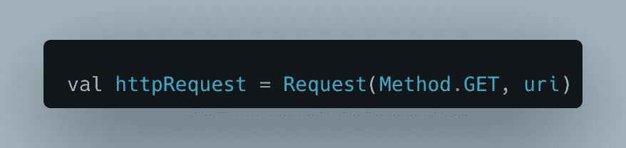
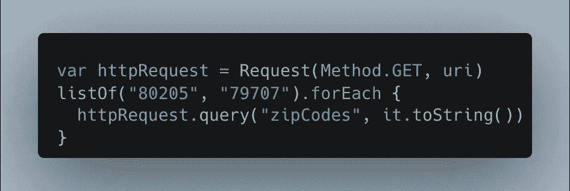
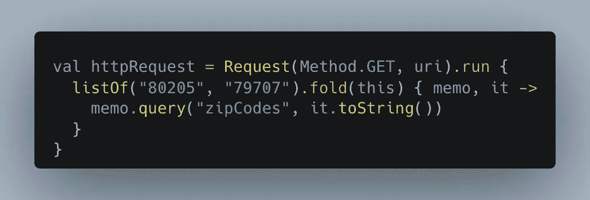

# 使用 http4k 和 Kotlin 发送查询参数数组

> 原文：<https://levelup.gitconnected.com/send-array-of-query-parameters-using-http4k-and-kotlin-970032a134ee>

我使用 http4k 和 Kotlin 处理了一些请求调用，但是没有从文档或更广泛的互联网上找到发送一组查询参数的好例子。这里有一个例子可以帮助其他可能需要它的人，也展示了我从一个同事那里学到的一个很酷的 Kotlin 重构(谢谢 David！).


您可以看到构建`Request`的初始状态，我们正在执行一个`GET`请求并传入一个`uri`，但是我们需要修改这个调用，以便也传递一个邮政编码数组。



我的第一个实现简单地使用了所需的邮政编码列表，并使用带有块语法的`forEach`遍历它们，并将每个邮政编码添加为查询参数。以下是 url 的最终外观:

```
http://example.com?zipCodes=80205&zipCodes79707
```

万岁！这是可行的，但是它引入了可变性，我们希望避免让`httpRequest`发生变异，即使只是在这一点上。



为了实现这一点，我们可以利用`run`，它是一个[作用域函数](https://kotlinlang.org/docs/scope-functions.html)，来传递我们的 httpRequest，然后使用`fold`来遍历邮政编码列表，并将它们添加到查询参数中。最后`fold`将返回我们的最终结果，这样它就可以被赋给原始的 httpRequest 变量。



# 结论

我希望这对其他人有所帮助，并展示一些使用 Kotlin 可以完成的很酷的函数式编程。

如果你喜欢这篇文章，考虑一下[订阅 Medium](https://medium.com/@ascourter/membership) ！

如果你或你的公司有兴趣找人进行技术面试，那么请在 Twitter ( [@Exosyphon](http://twitter.com/Exosyphon) )上给我发 DM，或者访问我的[网站](https://andrewcourter.com/)。如果你喜欢这样的话题，那么你可能也会喜欢我的 Youtube 频道。如果你想支持更多这样的内容 [buymeacoffee](https://www.buymeacoffee.com/andrewcourter) 。祝您愉快！

# 分级编码

感谢您成为我们社区的一员！在你离开之前:

*   👏为故事鼓掌，跟着作者走👉
*   📰查看[升级编码出版物](https://levelup.gitconnected.com/?utm_source=pub&utm_medium=post)中的更多内容
*   🔔关注我们:[Twitter](https://twitter.com/gitconnected)|[LinkedIn](https://www.linkedin.com/company/gitconnected)|[时事通讯](https://newsletter.levelup.dev)

🚀👉 [**加入升级达人集体，找到一份惊艳的工作**](https://jobs.levelup.dev/talent/welcome?referral=true)