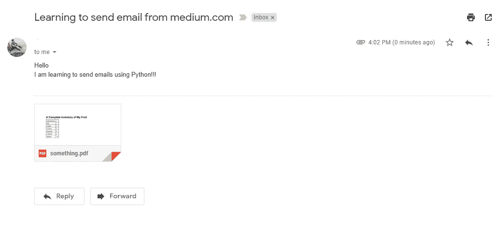

# 使用 python 在 Gmail 中发送带有附件的电子邮件

> 原文：<https://levelup.gitconnected.com/send-email-using-python-30fc1f203505>

## 逐步理解这个概念，你很快就会掌握它。


斯蒂芬·菲利普斯-Hostreviews.co.uk 在 [Unsplash](https://unsplash.com?utm_source=medium&utm_medium=referral) 上的照片

在这篇文章中，我们将看到如何用 python 以最简单的方式发送带有附件的电子邮件。我们将使用 Gmail SMTP 服务器发送邮件。我们不会使用任何外部 python 模块来发送电子邮件，因为 python 内置了一些模块，我们可以用最简单的方式发送电子邮件。

主要有两种不同的标准定义，我们可以用它们来构造我们的电子邮件消息。

*   [SMTP(简单邮件传输协议)](https://tools.ietf.org/html/rfc2821.html)
*   [MIME(多用途互联网邮件扩展)](https://tools.ietf.org/html/rfc2045)

因此，如果我们想要构造一个邮件，我们访问 SMTP 和 MIME 的文档来构造一个电子邮件消息。

但是等等！我们不需要这样做，我们已经有了一个名为 **email** 的内置 python 包，它由一个 **message** 模块组成，在其中，我们有一个 **EmailMessage** 类。通过创建这个类的对象，我们可以很容易地构造我们的电子邮件消息。现在让我们创建 **EmailMessage** 对象。

```
from email.message import EmailMessage
message = EmailMessage()
```

我们创建的对象中还没有任何数据。因此，让我们添加一个发送者和一个接收者的电子邮件地址。

```
sender = "[your-name@gmail.com](mailto:daanyaalkapadia13@gmail.com)"
recipient = "example[@e](mailto:daanyaalkapadia@eng.rizvi.edu.in)xample.com"message['From'] = sender
message['To'] = recipient
```

EmailMessage 对象提供了一个类似字典的接口来设置电子邮件字段的内容，如上面的代码所示。

> 在上述代码中，不应更改从到**到**的键名**。**

现在让我们将主题添加到电子邮件中:

```
message['Subject'] = 'Learning to send email from [medium.com](http://www.medium.com)'
```

**至**、中的**和**主题**为邮件头，采用键值格式。这些字段用于发送和显示电子邮件。**

现在让我们给邮件添加正文。set_content()方法用于设置电子邮件的正文。

```
body = """Hello
I am learning to send emails using Python!!!"""
message.set_content(body)
```

既然我们已经将**添加到**、来自的**、**主题**和**正文**，那么让我们打印我们的对象，看看它显示了什么。**

```
print(message)Output:
From: your [name@gmail.com](mailto:name@gmail.com)
To: [example@example.com](mailto:example@example.com)
Subject: Learning to send email from medium.com
Content-Type: text/plain; charset="utf-8"
Content-Transfer-Encoding: 7bit
MIME-Version: 1.0Hello
I am learning to send emails using Python!!!
```

我们可以看到，打印对象给出了一个可读的字符串。电子邮件包将复杂的对象转换成人类可读的字符串。

在字符串中，我们有**到**和**发自**的电子邮件地址，电子邮件**的主题，**和电子邮件**的正文**。但是等等！还有更重要的事情。

*   我们的电子邮件编码的字符集。
*   Content-Type 和 Content-Transfer-Encoding 说明了如何将电子邮件中的字节转换为字符串。
*   显示 MIME 版本

# 向我们的电子邮件添加附件

因为所有的电子邮件内容都是字符串格式。我们必须找到一种方法，使我们的附加文件也能以字符串格式存储。借助 MIME( ***多用途互联网邮件扩展*** )我们可以做到这一点，MIME 是一个定义好的标准，用它我们可以将所有不同类型的文件编码成字符串格式，这样就可以很容易地通过电子邮件发送。

为了发送一个文件，我们必须知道 MIME 类型和 MIME 子类型，以识别我们发送的是什么类型的文件。

如果您知道 MIME 类型和 MIME 子类型，那很好，您可以直接使用这些值，如果您不知道，那绝对没问题。Python 有一个内置模块 **mimetypes** ，它会为你猜测 MIME 类型。

```
import mimetypes
mime_type, _ = mimetypes.guess_type('something.pdf')
print(mime_type)Output:
application/pdf
```

这里的**应用程序**是 MIME 类型，而 **pdf** 是 MIME 子类型。现在为了在我们的代码中使用它，我们必须把它分开。

> 注意:something.pdf 位于我们的 python 脚本所在的当前工作目录中。

```
mime_type, mime_subtype = mime_type.split('/')
```

获得 MIME 类型后，我们准备将附件文件存储在我们的**邮件**邮件**类的**对象中。

为此，我们必须以只读模式打开附件。其中有一个 add_attachment()方法，这个方法有四个参数

1.  读取文件**的所有内容 *file.read()。***
2.  MIME 类型
3.  MIME 子类型
4.  文件的名称

```
with open('something.pdf', 'rb') as file:
 message.add_attachment(file.read(),
 maintype=mime_type,
 subtype=mime_subtype,
 filename='something.pdf')
```

现在，我们的消息对象中附加了 something.pdf。试着自己打印出**信息**。它会以文本格式显示完整的电子邮件。

> 额外的东西:整个电子邮件也由 MIME 类型组成，它是**多部分/混合的**，同样的还有正文，它的 MIME 类型是**文本/普通的**。

现在我们已经准备好发送电子邮件了。

# 通过 SMTP 服务器发送邮件对象

对于发送电子邮件，我们的系统使用 SMTP( [***简单邮件传输协议***](https://tools.ietf.org/html/rfc2821.html) )。SMTP 指定了如何在系统之间来回发送电子邮件。为了实现这一点，python 内置了构建模块 **smtplib** 。这个模块为我们做所有的内部工作。

有两种方法可以连接到远程服务器

*   一种是使用 SMTP()类，它将创建到远程服务器的直接连接。
*   另一种是使用 SMTP_SSL()类，它用于安全地连接到远程服务器。

```
import smtplib
mail_server = smtplib.SMTP_SSL('smtp.gmail.com')
```

现在我们已经与 Gmail 服务器建立了连接，我们需要输入登录凭证并发送电子邮件。

```
mail_server.login("your-[name@gmail.com](mailto:name@gmail.com)", 'Your password')
```

如果你不想在代码中写你的密码，你可以导入[](https://docs.python.org/3/library/getpass.html)**并使用它。在这种方法中，您必须在控制台中输入您的密码。**

**如果您想在出错时打开调试，您可以使用下面的代码行**

```
mail_server.set_debuglevel(1)
```

**现在，借助 send_message()方法，我们可以将消息发送到 SMTP 服务器。该参数是 **EmailMessage** 类的**消息**对象。做完这一切，我们可以退出()连接。**

```
mail_server.send_message(message)
mail_server.quit()
```

> **注意:在运行代码之前，您应该使用此链接[https://myaccount.google.com/lesssecureapps](https://myaccount.google.com/lesssecureapps)从 gmail 启用不太安全的应用程序**

****

**以下是完整的代码:**

```
import smtplib
import mimetypes
from email.message import EmailMessagemessage = EmailMessage()sender = "[your-name@gmail.com](mailto:your-name@gmail.com)"
recipient = "[example@example.com](mailto:example@example.com)"
message['From'] = sender
message['To'] = recipientmessage['Subject'] = 'Learning to send email from medium.com'body = """Hello
I am learning to send emails using Python!!!"""
message.set_content(body)mime_type, _ = mimetypes.guess_type('something.pdf')
mime_type, mime_subtype = mime_type.split('/')with open('something.pdf', 'rb') as file:
 message.add_attachment(file.read(),
 maintype=mime_type,
 subtype=mime_subtype,
 filename='something.pdf')
print(message)mail_server = smtplib.SMTP_SSL('smtp.gmail.com')
mail_server.set_debuglevel(1)
mail_server.login("[your-name@gmail.com](mailto:your-name@gmail.com)", 'Your password')
mail_server.send_message(message)
mail_server.quit()
```

## **结论:**

**在本文中，我们看到了如何使用 Python 在 Gmail 中发送带有附件的电子邮件。我们使用内置的 python 模块来发送电子邮件，比如 **email** 、 **smptlib** 和 **mimetypes** 。**

**首先，我们创建了一个 **EmailMessage** 对象，并在其中添加了所有与电子邮件相关的字段。**

**然后我们创建了 **SMTP_SSL** 对象，它连接到远程服务器，然后这个对象有一个 send_message()，它以 **EmailMessage** 对象作为参数，发送一封电子邮件。**

**感谢阅读我的故事！希望下次能再见到你。**

## **参考:**

**[](https://www.coursera.org/learn/automating-real-world-tasks-python) [## 用 Python 自动化现实世界的任务

### 由谷歌提供。在最后一门课程中，我们将把你到目前为止所学的概念联系起来。你会处理…

www.coursera.org](https://www.coursera.org/learn/automating-real-world-tasks-python)**